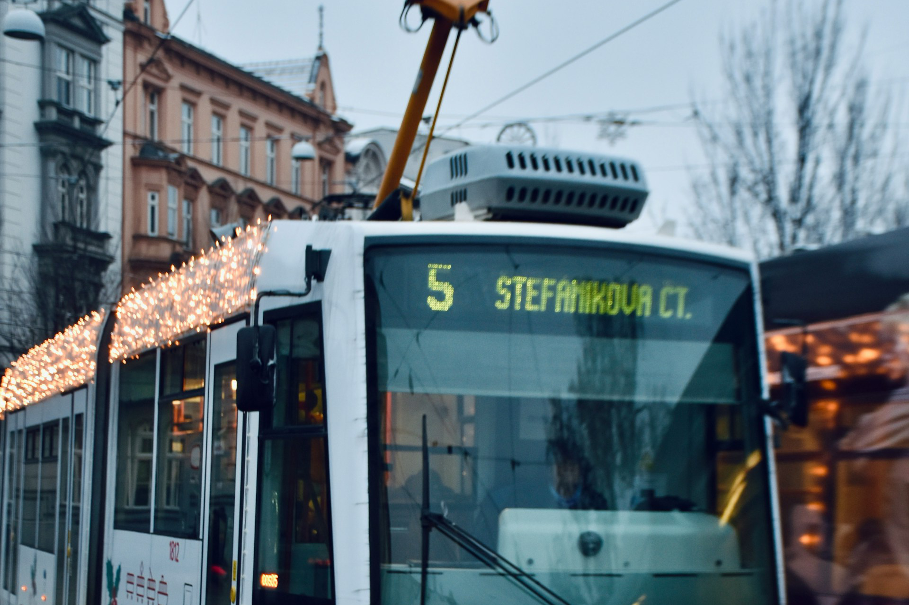


🔥 實用工具：[出國自由行行李清單，行前不再手忙腳亂（免費下載）](https://exittaiwan.gumroad.com/l/packing-list)


不管你是因為在[布拉格和維也納](/posts/vienna-prague-transport/)的旅程中路過來到布爾諾、還是從維也納、又或是其他城市來到布爾諾一日遊，布爾諾畢竟是捷克的第二大城，所以大眾交通也算是發展的相當發達。這篇文章將會介紹布爾諾市區有什麼交通方式、交通的分區怎麼分、幫你比較各種票價、以及告訴你各種買車票的方式。

---

## 布爾諾市區交通方式

布爾諾市區主要有三種交通方式：街道電車、巴士、和無軌電巴士。另外在布爾諾的西北邊，還有船班可以搭乘，但因為離市區很遠，大部分遊客不會去到那邊，再加上船票和市區的交通票是分開的東西，所以本文就不特別詳細介紹。

---

## 布爾諾市區交通分區

布爾諾（捷克文：Brno）位在捷克的東南方，行政區屬於捷克國家十三個行政區中的南摩拉維亞區（英文：South Moravian）。在這個行政區內，就由統一的一間大眾運輸整合系統「[IDS JMK](https://www.idsjmk.cz/en/a/turisti-zakladni-informace.html)（捷克文：Integrovaný dopravní systém Jihomoravského kraje；英文：Integrated Transport System of South Moravia）」負責。而在布爾諾市區內，則是由 IDS JMK 旗下的業者之一，「[DPMB](https://www.dpmb.cz/en)（捷克文：Dopravní podnik města Brna）」負責營運各種大眾交通工具。

整個南摩拉維亞區（英文：South Moravian）非常大，面積超過 7000 平方公里（約 26 個台北市；或 3 個台北市＋新北市的大小），南邊緊鄰奧地利國土邊界，交通上的劃分相當複雜，有數十個分區。不過，對於大多數的台灣旅客來說，布爾諾最市中心的 100 和 101 區就涵蓋了大部分的景點，大部分人也不會到 101 區之外了，所以最便宜、涵蓋範圍最小的 100 + 101 Zones 的票就夠大部分旅途使用囉。詳細的白天 / 半夜交通營運路線，可以[到 IDS JMK 的這個頁面查看](https://www.idsjmk.cz/en/documents/plany-site-brno)。

IDS JMK 官網：[布爾諾市區 100+101 區 PDF 地圖](https://content.idsjmk.cz/mapa/Plan-site-Brno-den.pdf)

---

## 布爾諾市區自由行交通票卷價格比較

以下表格整理布爾諾市區自由行的交通票價。這邊都是以大部分旅客會用到的 100＋101 區的票，如果有打算離開布爾諾市中心的旅客，要再到[官網查看更多資訊](https://content.idsjmk.cz/cenik/240701/Cenik-EN.pdf)喔。

| 票種  | 時效                                | 價格                                      |
| --- | --------------------------------- | --------------------------------------- |
| 單趟  | 15 分鐘以內（下車需要刷卡 check-out）         |  |
| 單趟  | 15 - 60 分鐘（或至抵達位於 100＋101 區內的終點站） |  |
| 一日票 | 24 小時                             |  |

布爾諾交通票很特別的是，在週末和[捷克國定假日](https://www.cnb.cz/en/public/media-service/schedules-and-other-info/bank-holidays-in-the-czech-republic/)時，[一張票可以最多五個人一起用](https://www.idsjmk.cz/en/a/turisti-zakladni-informace.html)！這五個人裡面，最多有兩個人是可以超過 15 歲的。也就是說，週末時，一張票最多可以兩個成人一起共用，兩個成人只要買一張票就可以囉！馬上就[省下一些歐洲自由行的旅費](/posts/europe-travel-on-budget-tutorial/)。

---
## 布爾諾市區交通購票方式

布爾諾和許多歐洲城市一樣，搭乘交通工具有沒有買票是採用自由心證的方式。查票員會隨機上車抽查，如果在布爾諾被查到逃票，需要支付 1500 捷克克朗（約 50 歐元），當下付罰款或五個工作天內繳納的話，金額會減少為 800 捷克克朗。這畢竟是一筆不小的金額，大家還是要記得買票！以下就介紹各種購買布爾諾市區交通票的方式：
### 實體

布爾諾市區交通的實體票可以在各火車站、巴士站、報紙攤、布爾諾市區內的售票機等地點購買。**上車後需要在車票機器下方，將車票插入進行打票的動作**，否則該票視為無效。

### 電子票

想要買電子票的話就是用 [IDS JMK Poseidon（波賽頓）交通票卷 App](https://www.idsjmk.cz/en/a/poseidon.html)。使用電子票也許直覺上比較方便，但其實程序比較麻煩，不太推薦給短期來到布爾諾旅遊的旅客使用。

要買電子票，要先下載 App、翻譯介面語言、使用電郵和密碼註冊帳號、綁定付款方式、選取正確的票卷等等，甚至比實體票還便宜。最推薦的方式是下一個方法：直接刷卡 Beep & Go。

### 上（下）車刷 Beep & Go

搭乘布爾諾的交通工具其實有一張信用卡就很方便了，布爾諾大眾交通工具的機台都支援 [Beep & Go](https://www.pipniajed.cz/en.html)。只要上車在機台「逼」一下，看到螢幕的綠勾勾就代表成功 check-in，大部分情況，下車不用再另外「逼」。

但如果旅途行程短於 15 分鐘，你想要省下 5 捷克克朗的話，就要記得在下車時也「逼」一聲 check-out 喔！當然，上下車使用的卡（或是具有付款功能的行動裝置）必須是同一個，系統才有辦法正確記錄喔。

---

> **推薦文章：**
>
> ✔️ [出國自由行行李清單，行前不再手忙腳亂（免費下載）](/posts/travel-abroad-packing-list/)
>
> ✔️ [在歐洲搭火車必看！打票、劃位眉角、省錢訂票方式、各國火車公司官網清單](/posts/歐洲搭火車注意事項)
>
> ✔️ [保證省下 300 歐｜歐洲食衣住行樂全方位教學，馬上壓低歐洲自由行花費！](/posts/europe-travel-on-budget-tutorial/)