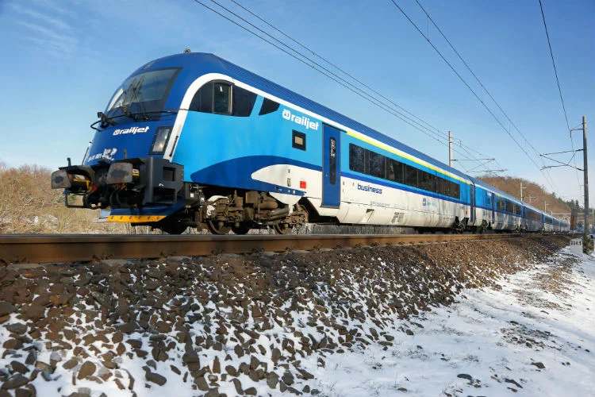
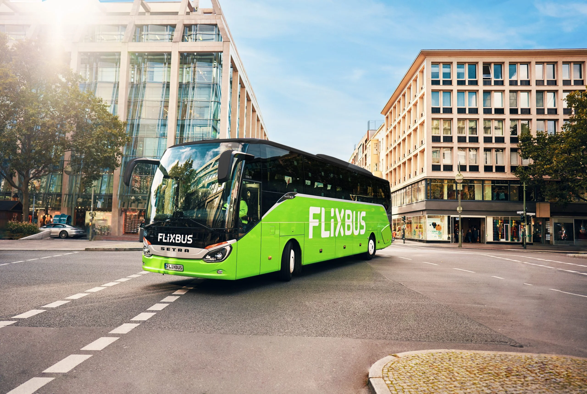
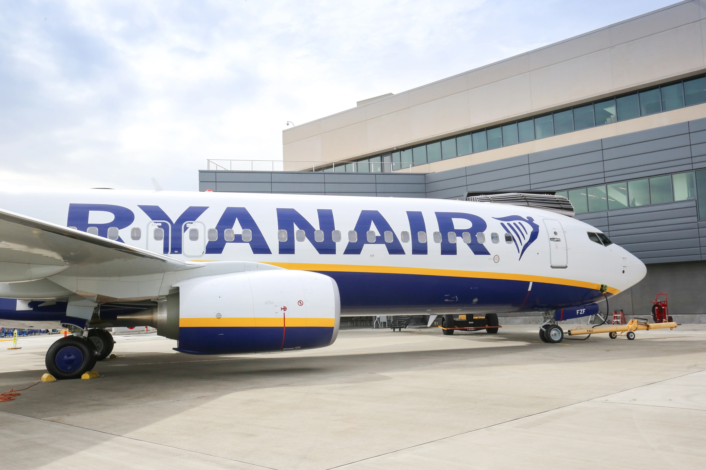

來到中歐旅遊，最多人玩的就是奧地利、匈牙利、捷克（奧匈捷）三個國家的首都[維也納]((/posts/維也納自由行/))、布達佩斯、和布拉格。你是不是在煩惱布拉格和布達佩斯之間距離這麼遠，要怎麼安排？你可能沒想過，在歐洲申根區內，搭飛機也是一種常見的交通方式吧？

沒錯，除了自駕以外，往返布拉格和布達佩斯有三種方法：**搭火車、搭巴士、和搭飛機**。

## 搭火車往返布拉格和布達佩斯

搭火車由布拉格前往布達佩斯、或是由布達佩斯前往布拉格大概需要快要七個小時，有些需要轉車的班次會花更久的時間，建議要搭不需要轉車的。

提醒一點，雖然這段旅程會行經奧地利，所以奧地利國鐵 ÖBB 也有賣票，但是這段路程**千萬不要在奧地利國鐵 ÖBB 的網站上訂票**，ÖBB 賣的超級貴。

這段路程的票可以在以下三間鐵路公司的售票系統進行比較：MAV 匈牙利國鐵、České dráhy 捷克國鐵、和 RegioJet。

一般來說，主打學生市場（非學生也可以搭乘）的 RegioJet 會有最優惠的票價。

### MAV 匈牙利國鐵

- 官網連結：[https://jegy.mav.hu/](https://jegy.mav.hu/)
- 價格：單程約 €26 ~ 75
- 搭乘地點：
  - 布拉格：布拉格火車總站（[Praha hl.n.](https://maps.app.goo.gl/jEZ1VqJxamDfucQm9)）
  - 布達佩斯：布達佩斯西火車站（[Budapest-Nyugati pu](https://maps.app.goo.gl/ErB3KSHRion5h9eAA)）
- 行程時間：約 6 小時 45 分鐘

### České dráhy 捷克國鐵

- 官網連結：[https://www.cd.cz/en/default.htm](https://www.cd.cz/en/default.htm)
- 價格：單程約 €30 ~ 40
- 搭乘地點：
  - 布拉格：布拉格火車總站（[Praha hl.n.](https://maps.app.goo.gl/jEZ1VqJxamDfucQm9)）
  - 布達佩斯：布達佩斯西火車站（[Budapest-Nyugati pu](https://maps.app.goo.gl/ErB3KSHRion5h9eAA)）
- 行程時間：約 6 小時 45 分鐘

### RegioJet

- 官網連結：[https://regiojet.com/](https://regiojet.com/)
- 價格：單程約 €19~ 35
- 搭乘地點：
  - 布拉格：布拉格火車總站（[Praha hl.n.](https://maps.app.goo.gl/jEZ1VqJxamDfucQm9), Prague MS）
  - 布達佩斯：Budapest Kelenföld
- 行程時間：約 6 小時 45 分鐘

## 搭巴士往返布拉格和布達佩斯

第二種布拉格和布達佩斯的交通方式是搭巴士。搭巴士比起搭火車時間又更長一點，而且票價也沒有比較便宜、起迄站有時候又不在最方便的地點，會建議除非別無選擇了才來搭巴士。

這段路程由兩間巴士公司營運：FlixBus 和 RegioJet。

### FlixBus

- 官網連結：[https://www.flixbus.com/](https://www.flixbus.com/)
- 價格：單程約 €25 ~ 80
- 搭乘地點：
  - 布拉格：布拉格巴士站（[Prag ZOB Florenc](https://maps.app.goo.gl/kVR73oEkdmTeR9b18)）或布拉格火車總站（[Praha hl.n.](https://maps.app.goo.gl/jEZ1VqJxamDfucQm9)）
  - 布達佩斯：布達佩斯內普利蓋特長途汽車站（[Budapest, Népliget aut.áll.](https://maps.app.goo.gl/1CFHcZtNBCdk5qe97)）或 Budapest Kelenföld
- 行程時間：約 7 小時

### RegioJet

- 官網連結：[https://regiojet.com/](https://regiojet.com/)
- 價格：單程約 €19~ 35
- 搭乘地點：
  - 布拉格：布拉格火車總站（[Praha hl.n.](https://maps.app.goo.gl/jEZ1VqJxamDfucQm9), Prague MS）
  - 布達佩斯：布達佩斯內普利蓋特長途汽車站（[Budapest, Népliget aut.áll.](https://maps.app.goo.gl/1CFHcZtNBCdk5qe97)）
- 行程時間：約 7 小時

## 搭飛機往返布拉格和布達佩斯

第三種往返布拉格和布達佩斯的交通方式是搭飛機，而這是我們最推薦也是最方便的交通方式！因爲不管你是從布拉格飛往布達佩斯或是布達佩斯飛往布拉格，你理應來說都已經入境歐盟申根區了，所以這趟航程 check-in 時是不需要出入境過海關的，只需要過行李安全檢查。

選擇歐洲廉航瑞安航空 RyanAir，不包含托運行李的單程票價最便宜只要 700 台幣！加個行李可能也就一千五兩千。兩地的機場分別是布拉格瓦茨拉夫哈維爾機場（機場代號：PRG）和布達佩斯李斯特費倫茨國際機場（機場代號：BUD）。

從布拉格瓦茨拉夫哈維爾機場（機場代號：PRG）搭乘 AE 機場巴士半小時可以抵達布拉格火車總站（捷克文：Praha hl.n.，英文：Prague MS），從布達佩斯李斯特費倫茨國際機場（機場代號：BUD），搭乘 100E 巴士也是半小時可以抵達市中心。

這段航程時間只要 1 個小時 15 分鐘，再預留登機前兩小時和降落後從機場到市區的時間，四個小時能解決，是最快速、最划算、也最方便的交通方式！

- 官網連結：[https://www.ryanair.com/](https://www.ryanair.com/)
- 價格：單程約 €20 ~ 50
- 搭乘地點：
  - 布拉格：布拉格國際機場（PRG）
  - 布達佩斯：布達佩斯國際機場（BUD）
- 行程時間：約  1 個小時 15 分鐘

## 往返布拉格和布達佩斯交通比較表

| 交通方式 | 價格                 | 行程時間          | 起迄站（布拉格）                                             | 起迄站（布達佩斯）                                           |
| -------- | -------------------- | ----------------- | ------------------------------------------------------------ | ------------------------------------------------------------ |
| 火車     | €19 ~ 75（單程） | 約 4 個小時       | 布拉格火車總站（[Praha hl.n.](https://maps.app.goo.gl/jEZ1VqJxamDfucQm9), Prague MS） | 布達佩斯西火車站（[Budapest-Nyugati pu](https://maps.app.goo.gl/ErB3KSHRion5h9eAA) 或 Budapest Kelenföld |
| 巴士     | €19 ~ 80（單程）     | 約 6 小時 45 分鐘 | 布拉格火車總站（[Praha hl.n.](https://maps.app.goo.gl/jEZ1VqJxamDfucQm9), Prague MS） | 布達佩斯內普利蓋特長途汽車站（[Budapest, Népliget aut.áll.](https://maps.app.goo.gl/1CFHcZtNBCdk5qe97)） |
| 飛機     | €20 ~ 50 （單程）         | 約 1 個小時 15 分 | 布拉格國際機場（PRG）                                        | 布達佩斯國際機場（BUD）                                      |

> **推薦文章：**
>
> ✔️ [維也納和布拉提斯拉瓦交通方式](/posts/vienna-bratislava-transport-guide/)
>
> ✔️ [維也納和布達佩斯交通方式](/posts/vienna-budapest-transport/)
>
> ✔️ [維也納和布拉格交通方式](/posts/vienna-prague-transport/)