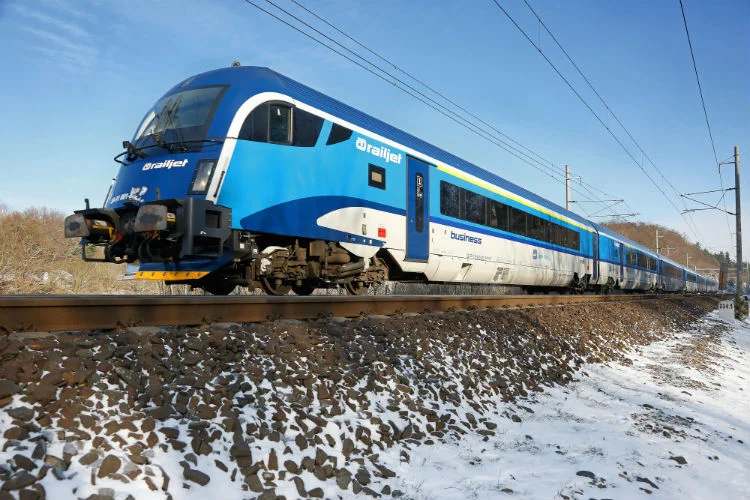
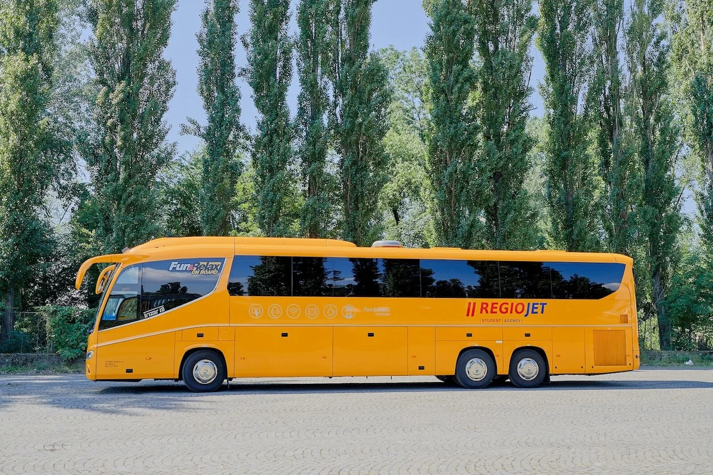

布拉格（英文：Prague，捷克文：Praha）是捷克共合國（英文：Czech Republic）的首都，位在[奧地利維也納](/posts/維也納自由行/)的東邊車程大概三小時的位置、距離匈牙利布達佩斯車程約八小時。

如果你在安排中歐奧匈捷自由行，你一定已經在計畫維也納和布拉格、或是布達佩斯和布拉格之間的交通方式，這篇文章就要來告訴你怎麼在維也納和布拉格兩地之間通行。

除了自駕以外，維也納和布拉格之間有兩種交通方式：**搭火車和巴士**。

## 搭火車往返維也納和布拉格

不論你是要從維也納前往布拉格，或是從布拉格前往維也納，搭火車是往返兩地最多人使用的交通方式。這段路線由 ÖBB（奧地利國鐵）、RegioJet、和 České dráhy（捷克國鐵）三間鐵路公司運營，訂票時可以多多比較價格，選擇最划算的票價購買。

一般來說，主打學生市場（非學生也可以搭乘）的 RegioJet 會有最優惠的票價。

### ÖBB

- 官網連結：[https://shop.oebbtickets.at/en/ticket](https://shop.oebbtickets.at/en/ticket)
- 價格：單程約 €14 ~ 90
- 搭乘地點：
  - 維也納：維也納主火車站（Wien Hbf）
  - 布達佩斯：布拉格火車總站（[Praha hl.n.](https://maps.app.goo.gl/jEZ1VqJxamDfucQm9)）
- 行程時間：約 4 個小時

### RegioJet

- 官網連結：[https://regiojet.com/](https://regiojet.com/)
- 價格：單程約 €11 ~ 30
- 搭乘地點：
  - 維也納：維也納主火車站（Wien Hbf）
  - 布拉格：布拉格火車總站（[Praha hl.n.](https://maps.app.goo.gl/jEZ1VqJxamDfucQm9), Prague MS）
- 行程時間：約 4 個小時

### České dráhy 捷克國鐵

- 官網連結：[https://www.cd.cz/en/default.htm](https://www.cd.cz/en/default.htm)
- 價格：單程約 €20 ~ 50
- 搭乘地點：
  - 維也納：維也納主火車站（Wien Hbf）或維也納法蘭斯約瑟夫火車站（Wien Franz-Josefs-Bahnhof）
  - 布拉格：布拉格火車總站（[Praha hl.n.](https://maps.app.goo.gl/jEZ1VqJxamDfucQm9)）
- 行程時間：約 4 個小時

> 推薦閱讀：[維也納主火車站（德文：Wien Hbf）在哪裡？](/posts/維也納市區交通攻略/)

## 搭巴士往返維也納和布拉格

另一種維也納和布達佩斯之間的來回方式是巴士，路線由 FlixBus 和 RegioJet 營運。

### FlixBus

FlixBus 在布拉格的站點比較多比較複雜，包含了布拉格巴士站（[Prag ZOB Florenc](https://maps.app.goo.gl/kVR73oEkdmTeR9b18)）或布拉格火車總站（[Praha hl.n.](https://maps.app.goo.gl/jEZ1VqJxamDfucQm9)）或布拉格火車站 Kačerov（[Prague - Kačerov](https://maps.app.goo.gl/GArebo7RpfSaeheM9)），建議在巴士站或火車總站下車最方便到市區。

FlixBus 在維也納的車站則是維也納國際巴士站（VIB, Vienna International Bus Terminal, Erdberg）或維也納主火車站（Wien Hbf）。

- 官網連結：[https://www.flixbus.com/](https://www.flixbus.com/)
- 價格：單程約 €10 ~ 70
- 搭乘地點：
  - 維也納：維也納國際巴士站（VIB, Vienna International Bus Terminal, Erdberg）或維也納主火車站（Wien Hbf）
  - 布拉格：布拉格巴士站（[Prag ZOB Florenc](https://maps.app.goo.gl/kVR73oEkdmTeR9b18)）或布拉格火車總站（[Praha hl.n.](https://maps.app.goo.gl/jEZ1VqJxamDfucQm9)）或布拉格火車站 Kačerov（[Prague - Kačerov](https://maps.app.goo.gl/GArebo7RpfSaeheM9)）
- 行程時間：約 4 個小時

### RegioJet

RegioJet 除了有火車以外，也有巴士喔！

相比 FlixBus，RegioJet 的上下車地點相對簡單，維也納在維也納主火車站巴士月台（Wien Hbf），布拉格的站點就在布拉格巴士站（[Prag ZOB Florenc](https://maps.app.goo.gl/kVR73oEkdmTeR9b18)），不過總行程時間稍微長一點。

- 官網連結：[https://regiojet.com/](https://regiojet.com/)
- 價格：單程約 €11 ~ 30
- 搭乘地點：
  - 維也納：維也納主火車站巴士月台（Wien Hbf）
  - 布拉格：布拉格巴士站（[Prag ZOB Florenc](https://maps.app.goo.gl/kVR73oEkdmTeR9b18)）
- 行程時間：約 5 個小時

## 往返維也納和布拉格交通比較表

| 交通方式 | 價格                 | 行程時間     | 起迄站（維也納）                                             | 起迄站（布拉格）                                             |
| -------- | -------------------- | ------------ | ------------------------------------------------------------ | ------------------------------------------------------------ |
| 火車     | €11 ~ 90（單程） | 約  4 個小時 | 維也納主火車站（Wien Hbf）或維也納法蘭斯約瑟夫火車站（Wien Franz-Josefs-Bahnhof） | 布拉格火車總站（[Praha hl.n.](https://maps.app.goo.gl/jEZ1VqJxamDfucQm9), Prague MS） |
| 巴士     | €10 ~ 70（單程）     | 約 4 個小時  | 維也納國際巴士站（VIB）或維也納主火車站（Wien Hbf）          | 布拉格巴士站（[Prag ZOB Florenc](https://maps.app.goo.gl/kVR73oEkdmTeR9b18)）或布拉格火車總站（[Praha hl.n.](https://maps.app.goo.gl/jEZ1VqJxamDfucQm9)）或布拉格火車站 Kačerov（[Prague - Kačerov](https://maps.app.goo.gl/GArebo7RpfSaeheM9)） |

> **推薦文章：**
>
> ✔️ [維也納和布拉提斯拉瓦交通方式](/posts/vienna-bratislava-transport-guide/)
>
> ✔️ [維也納和布達佩斯交通方式](/posts/vienna-budapest-transport/)
>
> ✔️ [布拉格和布達佩斯交通方式](/posts/prague-budapest-transportation/)