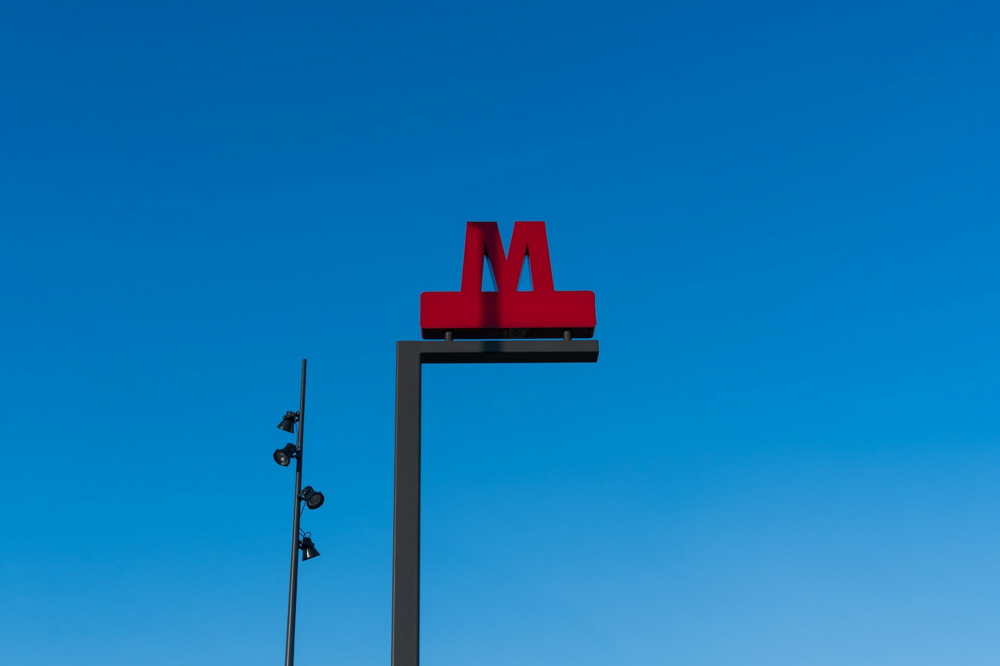
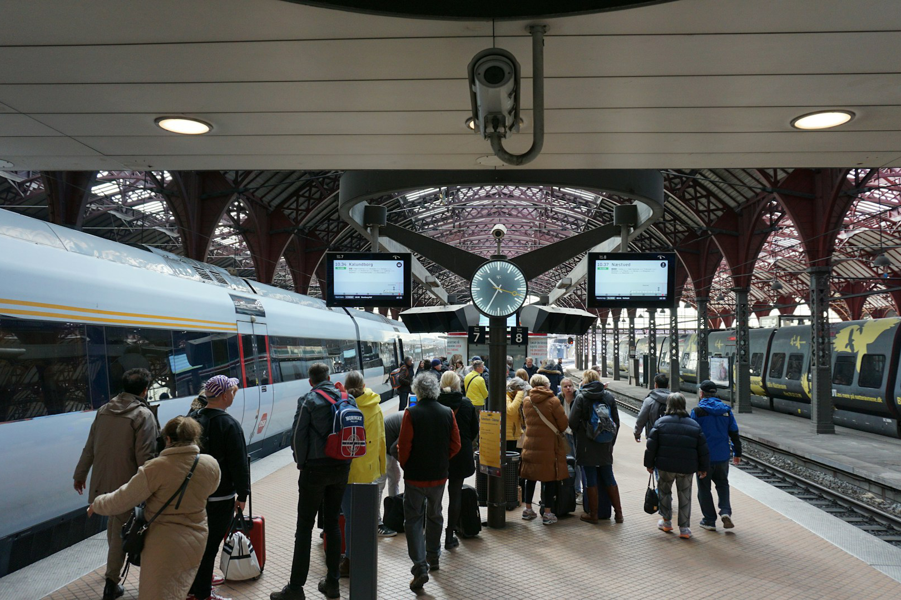
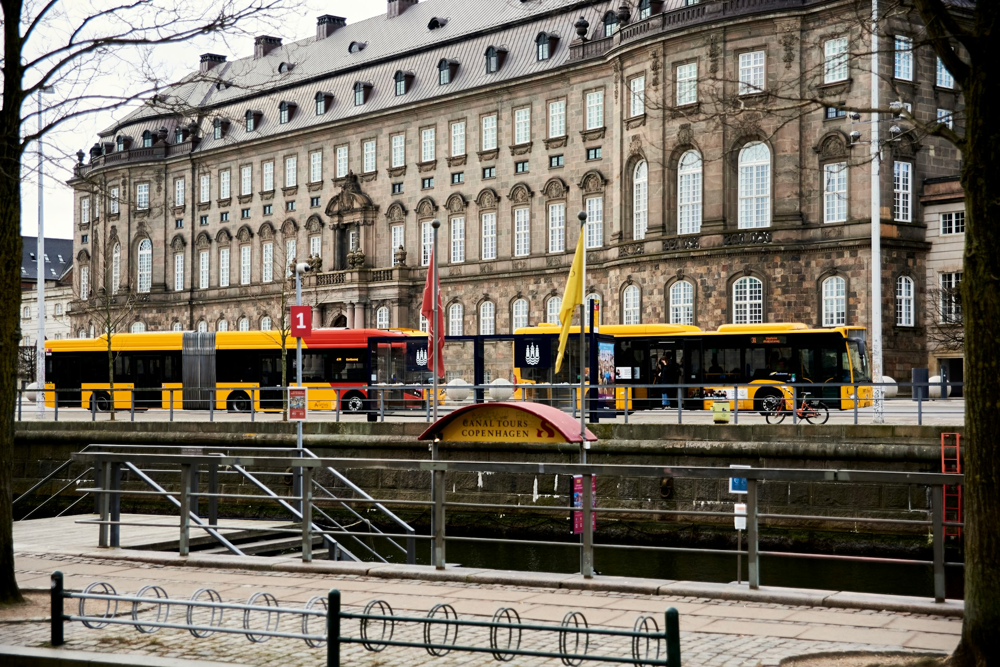
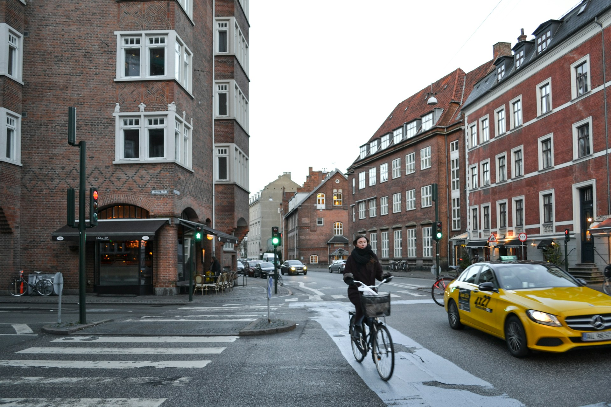
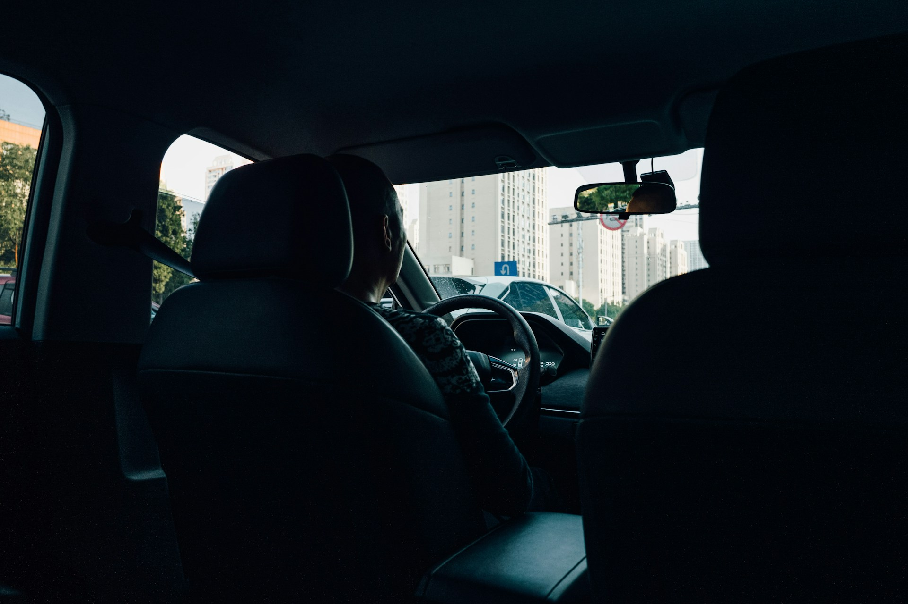
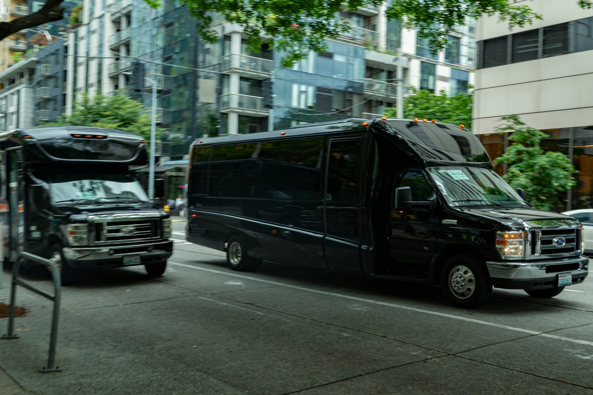



🔥 實用工具：[出國自由行行李清單，行前不再手忙腳亂（免費下載）](https://exittaiwan.gumroad.com/l/packing-list)



[哥本哈根機場](https://www.cph.dk/en)（CPH，也有人叫它 Kastrup）是北歐最大的機場。機場離丹麥首都哥本哈根市中心非常近，而且地鐵和火車站都直接在機場入境大廳的樓下，行李領完跟著指標下樓，幾乎可以無縫接上市區交通。這篇攻略把哥本哈根機場到市中心的所有交通方式整理成比較表格，再列出價格、車程、優缺點，讓你出發到丹麥旅行前就能決定要搭哪一種。

**小提醒**：如果你查到的資料有提到「DOT App」，注意這個 App 已經在 2025 年底停止服務了。目前哥本哈根及全丹麥統一改用新的「**Rejsebillet**」App 購票，操作邏輯跟以前差不多，介面提供丹麥文和英文，換個 App 名字繼續用就對了。

---

## 哥本哈根機場（CPH）到市區交通方式比較表格

| 交通方式    | 價格                  | 車程                      | 班次                              | 優點                         | 缺點                     | 購票管道                                                                          |
| ------- | ------------------- | ----------------------- | ------------------------------- | -------------------------- | ---------------------- | ----------------------------------------------------------------------------- |
| M2 地鐵   | 40 DKK              | 13 分鐘（到 Kongens Nytorv） | 尖峰 4~6 分鐘一班／離峰 6~9 分鐘一班，24 小時營運 | 最快、最便宜、24 小時都有車、大型行李箱也好放   | 尖峰時段車廂較擁擠，須自行搬行李       | [Rejsebillet App](https://www.rejsebillet.dk/en-us)                           |
| DSB 火車  | 40 DKK              | 14 分鐘（直達中央車站）           | 尖峰每 10 分鐘一班／離峰每 20–30 分鐘一班      | 直達中央車站，轉乘國內火車或瑞典跨海列車很方便    | 離峰時段班次較稀疏，須自行搬行李       | [Rejsebillet App](https://www.rejsebillet.dk/en-us)                           |
| 公車 5C   | 40 DKK              | 35~45 分鐘                | 每 7~10 分鐘一班                     | 票價與地鐵、火車同價，行經路線涵蓋部分地鐵沒到的區域 | 車程明顯較久，容易受路況影響         | [Rejsebillet App](https://www.rejsebillet.dk/en-us)                           |
| 排班計程車   | 約 300 DKK（固定車資，非跳錶） | 25~35 分鐘                | 航廈出口隨招隨上，24 小時候客                | 不用預約、直接送到飯店門口，4 人同行分攤下來很划算 | 車資是地鐵的 7 倍以上           | 現場招車，免下載 App                                                                  |
| 叫車 App  | 約 200–300 DKK       | 25–35 分鐘                | 通常 5 分鐘內可派到車                    | 上車前就知道車資、不用搬行李             | 需要先下載 App 並綁定付款方式、價格較高 | [TAXA 4×35](https://taxa.dk/en/)、[Dantaxi](https://www.dantaxi.dk/)、Uber、Bolt |
| 飯店接駁車   | 免費～200 DKK          | 30~45 分鐘                | 依各飯店排班，多半需提前預約                  | 直接送到飯店大門口，不用自己找路、搬行李       | 只有少數四、五星飯店提供           | 需透過訂房平台或洽詢入住飯店                                                                |
| 私人接送／包車 | 650~1,200 DKK       | 25~35 分鐘                | 需提前預約，司機會在時間內準時候機               | 舉牌接機、可拆多個下車點，適合大件行李或多人團體   | 價格最高                   | 需透過訂房平台或旅行社預約                                                                 |

*以上票價為一般公訂參考價，實際金額會隨時間微幅調整，出發前建議用 Rejsebillet App 或叫車 App 再次確認。

> 匯率換算參考：1 DKK ≈ 5 NTD（匯率每日浮動，出發前請以當日匯率為準）

另外，你也可以購買時效性、包含景點入場和哥本哈根大都會交通的[哥本哈根卡](https://affiliate.klook.com/redirect?aid=41451&aff_adid=1039786&k_site=https%3A%2F%2Fwww.klook.com%2Fzh-TW%2Factivity%2F15577-city-card-copenhagen%2F%3Fspm%3DHome.SearchSuggest_LIST%26clickId%3D6c5cabc818)。所有機場和市區間往返的大眾交通工具有這張卡都可以搭。如果是打算採很多點的旅客，哥本哈根卡是評價非常高、方便又可以幫你在[歐洲旅遊省錢](https://exittaiwan.com/posts/europe-travel-on-budget-tutorial/)的好選擇。

---

## M2 地鐵

如果要說最熱門的交通方式，那答案就是 M2 黃線地鐵。哥本哈根的地鐵是驅動列車全自動、無人駕駛。從機場一路開到市中心，是目前哥本哈根機場到市區來回最快也最省錢的選項。下機後照著「Metro / Train」指標走到入境大廳樓下，就能直接搭車。

- 價格：40 DKK
- 車程：13 分鐘（到國王新廣場，丹麥文：Kongens Nytorv，在新港 Nyhavn 附近）
- 班次：尖峰 4 ~ 6 分鐘一班／離峰 6 ~ 9 分鐘一班，24 小時營運，即時時刻表請[參考地鐵官網](https://m.dk/en/plan-your-trip/koebenhavns-lufthavn/)。
- 優點：最快、最便宜，24 小時都有車，大型行李箱也不怕沒地方放
- 缺點：尖峰時段人潮較多，車廂會比較擁擠，須自行搬行李

---

## DSB 火車

DSB 國鐵和地鐵共用機場樓下的同一個車站，如果你的飯店在中央車站（丹麥文：Hovedbanegården）附近，或是打算搭火車繼續前往赫爾辛格、羅斯基勒，甚至跨海到瑞典馬爾摩，搭火車會比轉乘地鐵更省事。

- 價格：40 DKK
- 車程：14 分鐘直達中央車站
- 班次：尖峰每 10 分鐘一班／離峰每 20–30 分鐘一班
- 優點：直達中央車站，轉乘國內外列車最方便
- 缺點：離峰時段班次比地鐵稀疏，等車時間較長，須自行搬行李

---

## 公車 5C

公車 5C 走的路線比較迂迴，車程也明顯拉長，但票價和地鐵、火車完全一樣，而且沿途經過一些地鐵沒有直接覆蓋的社區，很適合住在地鐵站有點距離、又想省錢的旅客。

- 價格：40 DKK
- 車程：35~45 分鐘（視路況）
- 班次：每 7~10 分鐘一班
- 優點：票價最低，路線涵蓋部分地鐵沒到的區域
- 缺點：車程最久，容易受路況影響

---

## 排班計程車（Taxi）

哥本哈根的排班計程車全天候都在航廈出口候客，車資是固定制而非跳表，出發前就能大致抓到金額，適合行李多、深夜抵達，或是三、四人同行可以分攤車資的旅人。

- 價格：約 300 DKK（固定車資）
- 車程：25–35 分鐘
- 優點：免預約隨招隨上，直接送到飯店門口，多人同行很划算
- 缺點：車資是地鐵、火車的 7 倍以上

---

## 在地叫車 App

Uber 曾在 2017 年因為丹麥計程車法規改變而退出市場，過去很長一段時間確實沒辦法直接叫到 Uber。不過 2025 年之後已經不一樣了，Uber 與當地車行 Drivr 合作重返哥本哈根，後來又併購了老牌車行 Dantaxi；而 Bolt 則是收購了電動車隊 Viggo，同樣在丹麥到處可見。

換句話說，現在在哥本哈根，其實可以直接打開 Uber 或 Bolt 叫車，車輛會由在地合作車行派遣、費率也遵循丹麥計程車法規。如果比較想要體驗在地的計程車，下載 TAXA 4×35 或 Dantaxi 的 App 也很方便。

- 價格：約 200~300 DKK
- 車程：25~35 分鐘
- 優點：上車前就能看到車資，部分品牌可選電動車
- 缺點：需先下載 App、綁定信用卡才能使用

---

## 飯店接駁車

部分四、五星等級的飯店會提供免費或付費的接駁車服務，但班次通常不多，建議入住前先跟飯店確認時刻表，並提前預約座位。

- 價格：免費~200 DKK
- 車程：30~45 分鐘
- 優點：直接送到飯店大門口，完全不用自己認路
- 缺點：只有少數飯店提供，班次也有限

---

## 私人接送／包車服務

如果同行人數超過 6 人、行李特別多，或是想要司機舉牌在入境大廳等候、甚至一趟車拆成好幾個下車點，私人接送會是最方便的選擇，缺點就是價格明顯比其他方式高出許多。

- 價格：650~1,200 DKK
- 車程：25~35 分鐘
- 優點：舉牌接機、可安排多個下車點，適合大型團體或大量行李
- 缺點：價格最高

---

## 哥本哈根機場到市中心交通該怎麼選？

對大多數旅客來說，M2 地鐵幾乎是無腦最佳解：40 DKK、13 分鐘，24 小時都有車，行李好放又不塞車。DSB 火車則是飯店在中央車站附近的最佳替代方案。

只有在行李特別多、三五人同行、深夜抵達，或是飯店離地鐵站有段距離時，才需要考慮排班計程車、叫車 App 或私人接送。

> **推薦文章：**
>
> ✔️ [出國要帶什麼？出國自由行行李清單](/posts/travel-abroad-packing-list/)
>
> ✔️ [歐洲行前準備｜歐洲自由行前你必須知道的事](/posts/europe-trip-prep/)
>
> ✔️ [保證省下 300 歐｜歐洲食衣住行樂全方位教學，馬上壓低歐洲自由行花費！](/posts/europe-travel-on-budget-tutorial/)