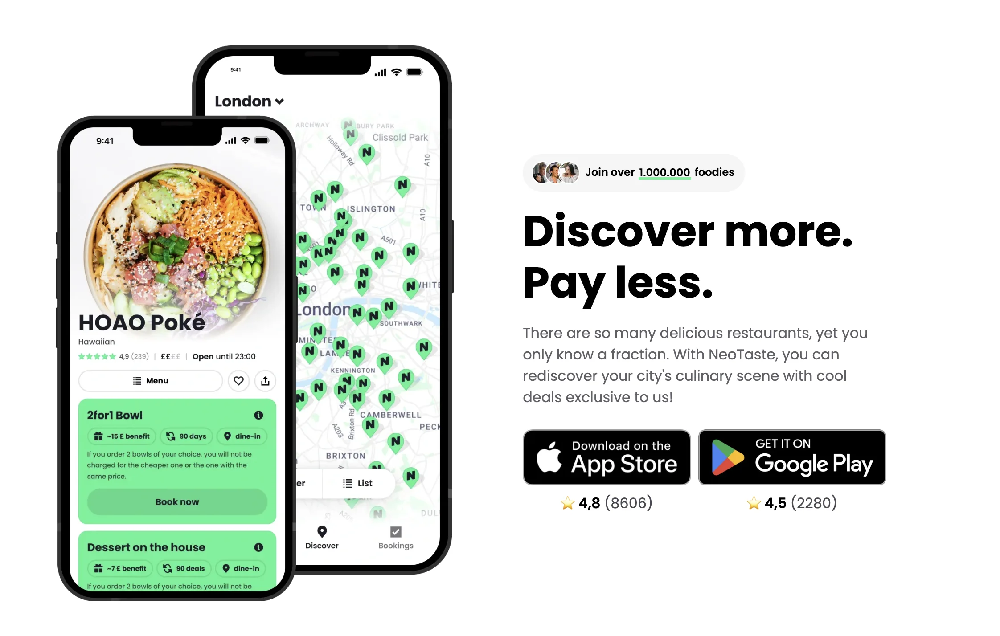
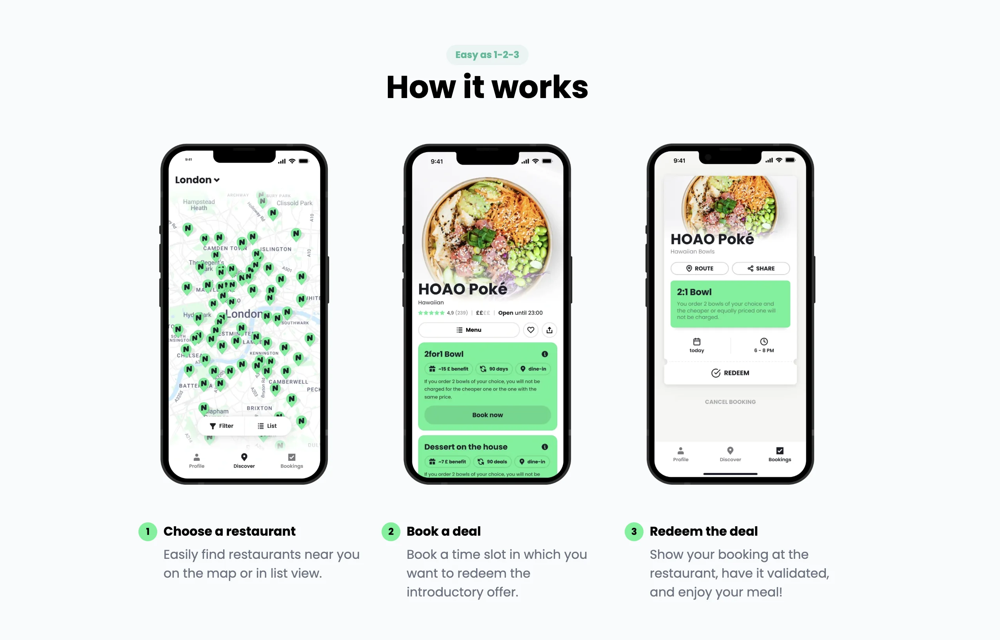

## 歐洲自由行也能吃得好又省錢？

歐洲物價偏高，旅人最常問的就是：**怎麼在旅途中吃得精緻又不爆預算？**
除了超市和速食，其實還有一個超實用的 App — [**NeoTaste**](https://neotaste.app/invite/David3157)，能讓你在歐洲城市裡，以優惠價格享受當地餐廳。

### NeoTaste 是什麼？

NeoTaste 是一款歐洲許多國家通用的**在地餐廳優惠 App**，讓你在不熟悉的城市也能輕鬆找到高評價餐廳，還能直接享有專屬折扣。

### 誰最適合用 NeoTaste？

- 歐洲自由行的背包客
- 想吃當地餐廳又不想破產的旅客
- 留學生、交換生、Working Holiday 的生活省錢神器

### 哪些國家可以用 NeoTaste？

目前 NeoTaste 合作的餐廳散佈在四個歐洲國家，超過 51 個城市、4,500 間餐廳。

四個歐洲國家為德國、奧地利、英國、和荷蘭，如果你剛好要到這些國家旅遊，一定要下載 NeoTaste 來省下旅費！

NeoTaste 同時也在其他歐洲地區持續擴張中，是歐洲長途旅行者的必備省錢工具！

## 用 NeoTaste 可以省多少錢？

### 首月免訂閱費

對於大多數來自台灣的旅客來說，到了歐洲自由行通常不會超過一個月，而現在[**透過這個 NeoTaste 註冊連結**](https://neotaste.app/invite/David3157)，新用戶註冊就送一個月免費試用，馬上省下 5 歐元。

### 雙人同行最划算

NeoTaste 合作的每間餐廳都會提供稍微不同的優惠。不過其中最常見的優惠大概不外乎是「買一送一」、「第二份半價」等等，很適合兩人同行一起前往這些合作餐廳用餐！

### 獨旅也適合

對於獨自旅行的旅客，你也可以詢問店家是否可以外帶餐點，甚至是一份在店內吃、另一份送的外帶等等，然後選擇住在有廚房可以加熱食物的住宿，同樣可以享受買一送一的優惠！

要是你在旅途中喜歡到當地的咖啡廳，那你肯定恨不得不馬上下載 NeoTaste 了！NeoTaste 上也有無數的咖啡廳，提供「點熱飲送可頌」、「熱飲買一送一」等等多樣的優惠，最適合喜歡在咖啡廳久坐的旅人。

## NeoTaste 怎麼用？

1. [點我*下載 **NeoTaste**](https://neotaste.app/invite/David3157)
2. 註冊帳號*後，選擇所在城市
3. 瀏覽地圖找餐廳，選擇優惠卷預訂使用時間，到現場出示 App 中的優惠券即可使用

雖然 NeoTaste **目前不支援中文介面**，但整體操作以**英文為主且非常直覺簡單**，只要會基本英文詞彙，像是「Book deal」、「Slide to redeem」，就能輕鬆上手，不需要擔心語言障礙。

*下載 NeoTaste 需要更換 [App Store](https://applealmond.com/posts/231122) 或 Google Play 所在國家（可更換為德國、奧地利、英國、荷蘭其一）。

**註冊 NeoTaste 需要有可以接收手機簡訊驗證碼的歐洲號碼。

## 玩歐洲不必窮遊，從聰明吃開始

省錢旅行不是只能靠泡麵。用 [**NeoTaste**](https://neotaste.app/invite/David3157)，讓你在歐洲也能省錢吃到當地好料，旅途更有味道！

> **推薦閱讀：**
>
> 🇦🇹 [奧地利自由行文章](/country/%E5%A5%A7%E5%9C%B0%E5%88%A9/)
>
> 🇩🇪 [德國自由行文章](/country/德國/)
>
> 🇳🇱 [荷蘭自由行文章](/country/荷蘭/)