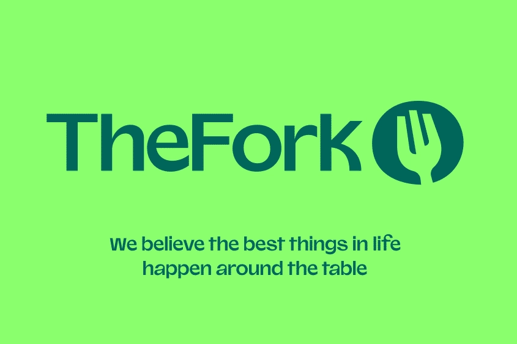
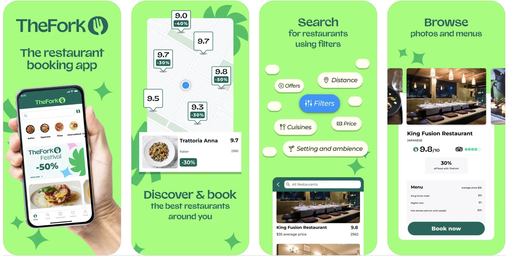

## 自由行不想踩雷？餐廳預訂神器來了

在歐洲自由行時，找餐廳常常踩雷或臨時沒位子？其實有一個超實用工具 — [**TheFork**]( https://tfk.io/1li3cl75)，讓你能提前預訂熱門餐廳，還有機會拿到專屬折扣，省錢又安心。

**別忘了讀到下面的使用教學，使用「ExitTaiwan 出台灣」獨家優惠碼，獲得 1000 Yums（等同 20 歐元）！**

### TheFork 是什麼？

TheFork 是歐洲知名的餐廳訂位平台，合作上萬家餐廳，讓你直接在 App 上找到在地人氣餐廳，輕鬆預約，還能享受高達 50% 折扣優惠。

### 誰最適合用 TheFork？

- 歐洲自由行想省餐費的背包客
- 喜歡提前規劃行程、不想臨時排隊的旅人
- 美食控想挖掘在地高評價餐廳的人
- [有用 NeoTaste](posts/neotaste/) 的人
- 留學生、交換生、Working Holiday 的生活省錢神器

### 哪些國家可以用 NeoTaste？

[比起 NeoTaste](posts/neotaste/) 目前只有在四個歐洲國家可以使用，TheFork 的合作餐廳幾乎涵蓋整個歐洲。所以來到歐洲自助旅遊，一定要下載 TheFork 來省下旅費，同時吃到高級餐廳料理！

## 用 TheFork 可以省多少錢？

TheFork 最棒的地方是平台使用完全免費，只需要用可以收簡訊的電話號碼和 Email 註冊帳號，就可以馬上開始使用。

- **即時折扣：**很多餐廳提供 TheFork 專屬折扣，如「全單 20%-50% 折扣」、「特價套餐」。
- **積分回饋：** 每次透過 App 預訂並用餐，都可以累積積分（叫做 Yums），累積後可以抵餐費。
- **不需要額外付費：** 預訂服務完全免費，直接省下預約費用。

## TheFork 怎麼用？TheFork 使用教學

1. [**點我下載 TheFork**]( https://tfk.io/1li3cl75)
2. 搜尋地點、日期與時間，找到想去的餐廳
3. 查看可用折扣，線上預約
4. **首次預約時在「Promo code」輸入獨家優惠碼：`85322C4C`，獲得 1000 Yums（等同 20 歐元，三天後入 TheFork 帳號）！**
5. 進餐廳時直接告知店員是用 TheFork 訂位，即可享有優惠！

 TheFork 介面為英文，但整體設計直覺清楚，即使英文程度普通也能快速完成預訂。

## 出發歐洲自由行，用 TheFork 省錢、省時、又享受美食

旅行不只是走馬看花，美食也是重要的一部分！用 [**TheFork**]( https://tfk.io/1li3cl75)，讓你的歐洲自由行餐桌豐富又划算，不用擔心語言、排隊或預算超支，輕鬆吃遍在地精選美食！

> **推薦閱讀：**
>
> 🇦🇹 [奧地利自由行文章](/country/奧地利/)
>
> 🇩🇪 [德國自由行文章](/country/德國/)
>
> 🇳🇱 [荷蘭自由行文章](/country/荷蘭/)