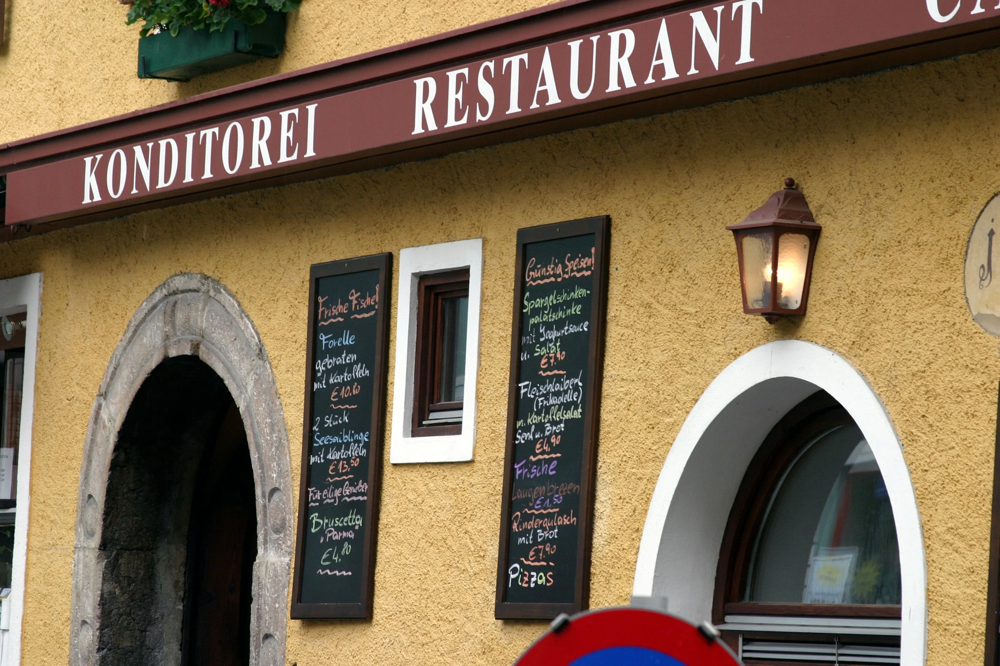

歐洲自由行花費真的一定很高嗎？其實只要掌握對的策略，就能用台灣價格玩出歐洲質感、用最少花費走高檔行程！本文從「食衣住行樂」五大面向，精選實用 App、省錢技巧與預算觀念，讓你輕鬆規劃不踩雷、高 CP 的歐洲自由行行程，保證你這趟旅裎省下超過 300 歐元！


- 食：NeoTaste（[**使用優惠碼**](/posts/neotaste/)）｜TheFork（[**使用優惠碼**](/posts/thefork/)）｜TooGoodToGo（[下載連結](https://tgtg.onelink.me/OGjG/iflv8wfh)）
- 衣：下載免費行李打包清單
- 住：[提早訂房 Booking.com](https://www.booking.com/?aid=7956794)
- 行：廉航｜[Eurail 歐鐵全境火車通行證](https://affiliate.klook.com/redirect?aid=41451&aff_adid=1043907&k_site=https%3A%2F%2Fwww.klook.com%2Fzh-TW%2Factivity%2F9868-eurail-global-rail-pass%2F%3Fspm%3DSearchResult.SearchResult_LIST%26clickId%3Dc840137fb8)｜[找免費廁所全攻略](/posts/歐洲找免費廁所攻略/)
- 樂：善用學生、敬老身份｜[Klook 找城市卡 City Pass](https://www.klook.com/?aid=41451&aff_adid=1007703&aff_pid=&aff_sid=&utm_medium=affiliate-alwayson&utm_source=non-network&utm_campaign=41451&utm_term=&utm_content=&aff_klick_id=93102626107-41451-1007703-c178e75)


---

## 食｜歐洲自由行省錢吃法：便宜又美味的飲食策略

對台灣人來說，旅行時吃的好真的非常重要！一頓價格合理、美味、用餐氣氛又好的美食體驗就可以為旅程加上很多分。偏偏在歐洲許多國家吃一次餐廳台幣一兩千跑不掉，直接讓這趟歐洲自由行花費爆預算。人生地不熟的旅客又常常挑到專門做遊客生意的餐廳，一趟旅程踩好幾次雷，根本雪上加霜。

在歐洲自由行花費中，食物常常是除了住宿之外最貴的部分，有時候甚至比住宿還貴，讀完這個部分之後，你馬上就可以知道怎麼輕鬆的把花費壓低，省下好幾千台幣。

### 吃餐廳？這些 App 別錯過！

<!-- insert image -->

要在吃的方便省錢，最簡單粗暴的方式就是使用下面這幾個 App：

- NeoTaste
- TheFork
- TooGoodToGo（前往店家時記得備用零錢購買袋子）

這些 App 都會讓你輕鬆找到預算內的當地餐廳，並且提供最高打兩折的優惠，而決大部分餐廳都有五折至七折的優惠！

詳細如何使用這些 App，請參考我們寫過的文章：

- [歐洲自由行怎麼省錢吃美食？用 NeoTaste 一鍵解鎖當地餐廳優惠！](/posts/neotaste/)
- [歐洲自由行必備！用 TheFork 預訂餐廳，省錢、省時、又享受美食！](/posts/thefork/)

### 中午餓肚子？找商業午餐！

<!-- insert image -->

好像很多人出國就忘記了商業午餐的存在？在歐洲一樣有商業午餐 / 午間套餐的概念，套餐常有兩道或三道菜的選擇，一套吃下來不用五百台幣，有時候比台灣吃飯還便宜！

<!-- CTA -->

### 有廚房可以使用？去超市吧！

<!-- insert image -->

你打算住在有廚房的青年旅館、或是有廚房的公寓式酒店嗎？到超市採購、自己下廚，你會發現常常採購一次，不但可以吃三餐，甚至買一次花的錢比平常在外面吃一餐還要便宜！

要是你在歐洲待的時間逼近一個月甚至超過一個月，那非常推薦你試著融入當地人的生活，觀察他們是否有使用超市會員等等的優惠服務，許多超市給會員的優惠都給的非常大方，英文、外文比較好的旅客一定要試試看註冊超市會員來玩一玩。

另外提醒，到超市購物記得要留著收據，在人生地不熟的地方如果遇到心懷不軌的商人，一張收據就可以很輕易的保障自己的權益。

---

## 衣｜歐洲自由行行李打包技巧：輕便才是旅行王道

「衣」的方面要省錢主要和**有沒有一個旅人的心態有關係**。

如果沒有必要，拜託不要帶貴重物品來歐洲！出來旅行最多也就幾個禮拜一個月，真的要帶手機以外的電器用品頂多帶著平板就好，非必要不要帶筆電、也盡量不要穿戴太招搖的奢侈品，這樣遭小偷的機率一下就下降很多。

飛長程航線來到，行李越輕便越好，減少心理和身體的負擔，更能夠輕鬆旅遊。我們在文章中「[出國要帶什麼？出國自由行行李清單，行前不再手忙腳亂](/posts/出國行李打包/)」，分享了三個行李打包的心法：

- 極簡為美，少即是多
- 不確定可不可以帶 = 不要帶
- 遵循你的習慣

文內[有免費的旅行清單可以下載](/posts/出國行李打包/)，幫助你在出國前順利快速的打包行李。

---

## 住｜歐洲自由行住宿推薦：省錢又舒適的住宿選擇

提前訂，提前訂，提前訂。

不管你準備來歐洲旅遊幾天，要壓低這趟旅程的花費最重要的其中一點就是提前決定好住宿。

最省最省的方式是歐洲有認識的親戚、朋友、同學，可以借住的話是最棒的方式。在歐洲沒有認識的人的話，有許多評價很高的青年旅館住起來也很舒適，大部分的青旅也都附有廚房可以使用。

<!-- link to 背包客打包清單 -->

另外幾個找便宜住宿的小技巧：

- 一般來說，長住（一個禮拜以上）比短住便宜。
- 在 Airbnb 的 App 上可以盡量放大，縮小尋找的區域，有些一開始被隱藏的住宿要一直放大才會顯示出來。
- 有時候 [Booking.com](https://www.booking.com/?aid=7956794) 訂多間房會比少間房便宜，像是三人一起旅遊，有時候住兩間雙人房比一間四人房還便宜，可以調整比較價格看看。

---

## 行｜歐洲自由行交通省錢大法：城市通票、廉航攻略

要靈活沒有壓力的在歐洲自由行，又不想有過高的花費，行動時找便宜又舒適的交通方式是非常重要的一環。

### 歐盟內長距離移動？搭飛機！

大部分台灣人都沒有常常搭飛機的習慣，不過在歐盟內要長距離移動的話（火車要搭 8 小時以上），很多人也會選擇直接搭飛機，常常飛機票比火車票還要便宜喔！

歐洲有很多家廉價航空，其實品質都還算不錯，包括以下：

- 瑞安航空（英文：RyanAir）
- 威茲航空（英文：WizzAir）
- Play 航空
- 易捷航空（英文：Easyjet）
- 伏林航空（英文：Vueling）
- Eurowings
- 挪威航空（英文：Norwegian Airline）
- 英國航空（英文：British Airways）

在歐洲的短程航線訂票時，最便宜的價格一般都是只包含一個手提行李，所以有托運行李的人別忘了選擇正確的票種喔。

<!-- TODO: link to 搭歐洲廉航注意事項 -->

### 歐盟內附近國家？搭火車或巴士！

如果是要前往附近的國家或城市，搭火車或巴士通常是最快速也最方便的選擇。除了各國的國有鐵路公司之外，私人的公司票價會更便宜，像是 FlixBus 和 RegioJet 都提供非常優惠的票價。

要是你喜歡彈性的安排旅程，那麼 [**Eurail 歐洲火車通票**](https://affiliate.klook.com/redirect?aid=41451&aff_adid=1043907&k_site=https%3A%2F%2Fwww.klook.com%2Fzh-TW%2Factivity%2F9868-eurail-global-rail-pass%2F%3Fspm%3DSearchResult.SearchResult_LIST%26clickId%3Dc840137fb8)是最適合你的選擇。買一張歐洲多國的 Eurail 火車票，你唯一需要考量的只有你有幾天會需要用到路程較長（或是原價很貴）的火車，非常方便！

另外，Blablacar 則是長距離的共享汽車服務，基本上就是付點錢搭順風車的概念，有興趣的人也可以搭搭看。

### 隔壁城市一日遊？找城市交通套票！

城市交通套票是比較少人知道的歐洲自由行省錢小技巧。很多城市會提供一日至多日的跨城市套票，這種套票除了包含了來回的火車，通常還不限制搭車的時間班次、也會涵蓋目的地城市的市區大眾交通工具一日票。[奧地利維也納到隔壁斯洛伐克布拉提斯拉瓦的一日城市套票](/posts/vienna-bratislava-transport-guide/)就是很經典的例子。

<!-- 德國天鵝堡也有？ -->

### 城市內觀光？時效性交通票

終於到達目的地城市了！大部分的歐洲大城市都有提供有時效的交通票，像是一日票、三日票、七日票，或是 24 小時、72 小時、等等。一般來說，一日票的時效是從票卷當天的午夜十二點開始，而 24 小時票則是依照啟用車票那刻起的 24 小時有效。

大部分的情況算下來，一天搭超過三趟車的話買這種時效性交通票就會比較划算。

### 多人行動？搭出租車！

要是你這趟旅程不是單獨行動，而是和朋友、家人三～四人（以上），那麼直接搭像是 Uber / Bolt / Lyft 的出租車有時候比買大眾交通的車票還要便宜，可以比較看看。

### 還能再省一點

來到歐洲，你會發現很多廁所都要付費。不過，只要知道哪些地方會有免費廁所，就可以省下廁所的花費了！不妨花 1 分鐘讀一讀[免費廁所攻略](/posts/歐洲找免費廁所攻略/)。

此外，在台灣喝一杯手搖飲料幾乎是日常。在歐洲喝飲料不但貴還沒有台灣好喝，而且歐洲多國的自來水都是可以直接飲用的，在餐廳也可以不用點飲料，點自來水最省錢又健康。

---

## 樂｜歐洲自由行玩樂也能省：免費景點、通票使用技巧

最後，要玩得開心當然不能忘記娛樂！

首先，來歐洲自由行旅遊，選對季節就是節省花費。春天和夏天來到歐洲，日照時間的長度可以說是一天抵掉秋天和冬天的兩天，這也是春夏季是歐洲旅遊旺季的原因。

有很多城市提供旅遊城市卡，要是剛好裡面包含的景點都和你想去的相同，那麼買一張這種 City Card 常常連大眾交通工具都包了，是個不錯的選擇。有幾個城市的城市卡評價特別高，像是丹麥的[哥本哈根卡（Copenhagen Card）](https://affiliate.klook.com/redirect?aid=41451&aff_adid=1039786&k_site=https%3A%2F%2Fwww.klook.com%2Fzh-TW%2Factivity%2F15577-city-card-copenhagen%2F%3Fspm%3DHome.SearchSuggest_LIST%26clickId%3D6c5cabc818)、荷蘭的[阿姆斯特丹卡](https://affiliate.klook.com/redirect?aid=41451&aff_adid=1043901&k_site=https%3A%2F%2Fwww.klook.com%2Fzh-TW%2Factivity%2F14651-i-amsterdam-city-card-amsterdam%2F%3Fspm%3DSearchResult.SearchResult_LIST%26clickId%3Dfc76b178ae)、奧地利的[薩爾茨堡城市卡（Salzburg City Card）](https://affiliate.klook.com/redirect?aid=41451&aff_adid=1043900&k_site=https%3A%2F%2Fwww.klook.com%2Fzh-TW%2Factivity%2F140095-salzburg-city-card%2F%3Fspm%3DSearchResult.SearchResult_LIST%26clickId%3D1e41b751c2)和[維也納通行證（Vienna Pass）](https://affiliate.klook.com/redirect?aid=41451&aff_adid=1004215&k_site=https%3A%2F%2Fwww.klook.com%2Factivity%2F105133-vienna-attractions-pass%2F%3Fspm%3DSearchResult.SearchResult_LIST%26clickId%3D3b93d25d1e)都是很划算的選擇。

再來，不論是購買車票或是門票，如果本身**有學生身份或是 60 歲以上的長輩同行，一定要善用這樣的身份來購買更便宜的票卷**，一來一往在歐洲自由行花費省下幾百歐元都有可能。

你喜歡購物嗎？那別忘了購物超過一定金額，可以在**歐盟內最後出境國家退稅**。在最划算的狀況下，和台灣相比，你在歐洲購買的商品可能可以折到 6 折！

最後來自經驗豐富旅人們的建議，出國了盡量少用電子產品、少滑手機！要拍照可以，要修圖、發文可以晚上回到住宿的地方、甚至旅程結束回台灣再做。在國外的時間很寶貴，人已經到歐洲了，就把握當下，用雙眼見識、雙腳體驗歐洲的美景吧！
