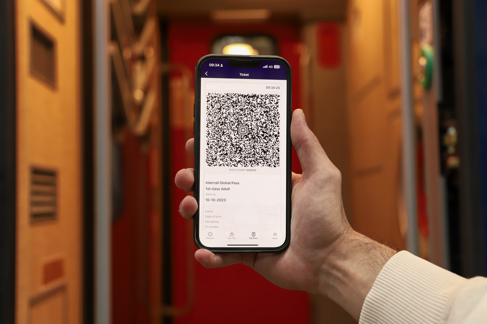
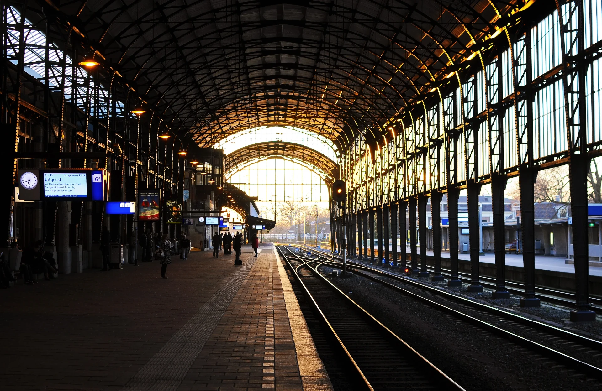

## 「車票」和「訂位」要分開買

在歐洲很多國家，搭乘[火車的「車票」和有沒有「訂位」是分開的概念](/posts/歐洲搭火車注意事項/)！

有些國家（以及大多數地區性的慢速火車）允許你只要有「車票」就能上車、隨便找位子坐。但如果那班車客滿而你沒有訂位，那你可能就得站著搭火車了。大多數的地區性慢速火車幾乎不額外販售「訂位」，因為客運需求沒有這麼高。當然，許多列車還是可以讓你加購「訂位」，確保你有個位子坐。

你手上的 **Eurail Global Pass 就是「車票」的概念**，本身並不包含訂位。所以如果遇到必須訂位的路線，就一定要額外加購訂位才能搭乘喔！訂位費用依行程長短、熱門程度、火車公司而異，從數歐元到數十歐元都有可能。

如果你看到某車次標示「**Seat Reservation Required（必須訂位）**」，就表示你的 Eurail Pass 本身是不夠的，一定要有訂位才能上車。

---

## 各國訂位規定總覽

以下整理各國訂位需求，提供參考，實際情況請以各鐵路官網提供的最新路線資訊為準：

### 幾乎不需要訂位的國家

如果你喜歡說走就走的旅遊方式，以下這些國家非常適合你！大多數國內列車完全不需要訂位，當然你若想要訂位也是可以的。

- 比利時（Belgium）
- 波士尼亞－赫塞哥維納（Bosnia-Herzegovina）
- 保加利亞（Bulgaria）
- 丹麥（Denmark）
- 拉脫維亞（Latvia）
- 荷蘭（Netherlands）
- 瑞士（Switzerland）

### 大多數列車需要強制訂位的國家

以下這些熱門國家的鐵路每天運載大量旅客，許多列車都是強制訂位制。雖然需要多一點事先規劃，但也代表你可以搭乘高速列車、更有效率地遊覽各地！

- 克羅埃西亞（Croatia）
- 法國（France）
- 希臘（Greece）
- 匈牙利（Hungary）
- 義大利（Italy）
- 挪威（Norway）
- 波蘭（Poland）
- 羅馬尼亞（Romania）
- 塞爾維亞（Serbia）
- 斯洛伐克（Slovakia）
- 西班牙（Spain）
- 瑞典（Sweden）
- 土耳其（Turkey）

### 部分列車需要訂位的國家

以下國家的規定則因列車而異，有些車次需要訂位、有些不需要。建議出發前先查詢時刻表確認特定路線的要求。

- 奧地利（Austria）
- 捷克共和國（Czech Republic）
- 愛沙尼亞（Estonia）
- 芬蘭（Finland）
- 德國（Germany）（注意：每年 6/1 至 9/1 夏季期間，許多 ICE 高速列車需要強制訂位）
- 英國（Great Britain）
- 愛爾蘭（Ireland）
- 立陶宛（Lithuania）
- 盧森堡（Luxembourg）
- 蒙特內哥羅（Montenegro）
- 北馬其頓（North Macedonia）
- 葡萄牙（Portugal）
- 斯洛維尼亞（Slovenia）

---

## 怎麼訂位最划算？

遇到需要訂位的車程，**請務必提早訂位**以確保可以搭上該車班，熱門路線（例如巴黎往巴塞隆納、羅馬往拿坡里）訂位名額非常搶手！

訂位方式主要有兩種：

- **Eurail App 訂位**：方便快速，但每次訂位需額外收取 2 歐元手續費。
- **各鐵路官網直接訂位**：通常最划算，省下手續費，部分鐵路也有更多時段可選擇。如果你持有 Eurail Pass，訂位時記得選擇「持有通行證」的選項，才會顯示持證者的訂位費用。

> 想了解更多歐洲旅遊省錢技巧？看看[當地人才知道的歐洲旅遊省錢方式](/posts/歐洲自由行花費省錢攻略/)

---

## 如果錯過火車或遇到誤點怎麼辦？

**自身原因錯過火車（例如來不及趕上）**：很抱歉，你需要重新訂位搭乘下一班車。如果那條路線並無強制訂位規定就沒這個問題。

**火車誤點或取消**：遇到誤點或停駛，建議直接向鐵路站務人員出示延誤證明，請他們幫你安排改搭下一班可用的列車。你也可以在車站自行更改訂位，但可能會收取手續費。如果有不需要訂位的替代路線，直接搭那班車前往目的地也是一個辦法。若原先持有的訂位因取消或嚴重誤點而無法使用，有少部分鐵路公司在你沒有搭到火車的情況下，可依其退款條款憑取消證明申請訂位費退費，但大部分鐵路公司沒有提供此項服務。

資料來源：[Eurail 歐洲鐵路通行證官網](https://www.eurail.com/zh/book-reservations/all-about-seat-reservations)

> **推薦文章：**
>
> ✔️ [出國要帶什麼？出國自由行行李清單](/posts/出國行李打包/)
>
> ✔️ [歐洲行前準備｜歐洲自由行前你必須知道的事](/posts/歐洲自由行前準備/)
>
> ✔️ [保證省下 300 歐｜歐洲食衣住行樂全方位教學，馬上壓低歐洲自由行花費！](/posts/歐洲自由行花費省錢攻略/)