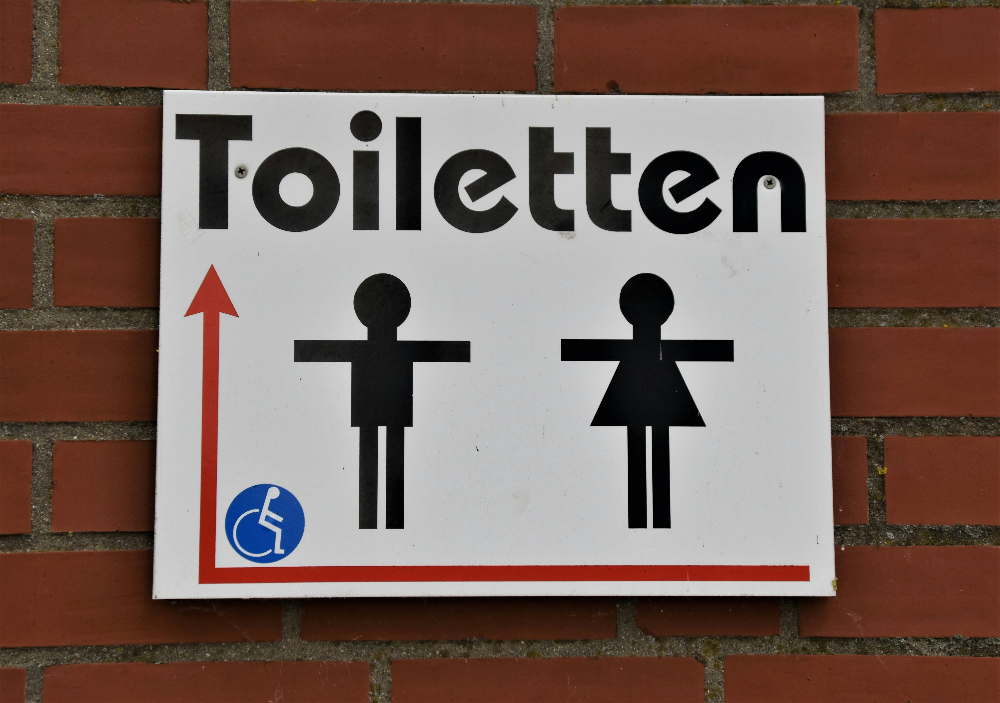
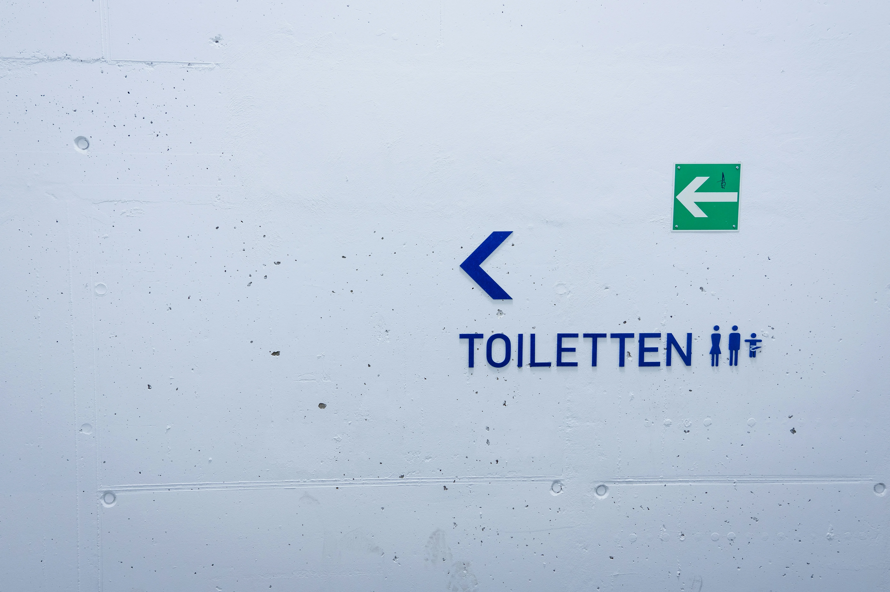

因為大眾交通發達、鐵路、航空路線也都涵蓋的相當完整，在歐洲自由行旅遊真的算蠻方便的。

不過對於台灣人來說，最大的麻煩大概就是找廁所了！尤其和長輩一起出門，可能更需要擔心哪裡有廁所可以使用。憑良心說，就算歐洲廁所的數量沒有日本這麽多，但其實也不少，問題在於很多歐洲的公共廁所要付費，歐洲自由行的花費竟然要因為上廁所而增加？所以台灣人不甘心上。

---

## 歐洲免費廁所經常出沒地點

### 百貨、商場與購物中心

大型購物商場（如 IKEA）、當地大型購物中心通常會有免費廁所。

除此之外，看到有**電影院**的話也八成會有免費廁所可以使用。

### 連鎖速食與咖啡店

全世界都有的連鎖速食和咖啡店，像是麥當勞（McDonald’s）、漢堡王（Burger King）、肯德基（KFC）、星巴克（Starbucks）通常都有**免費的顧客廁所**，但是有些店家會上鎖，要收據上密碼或問店員，也有少數國家在這些商家的廁所依舊會收錢。

### 車站、交通工具

一般來說，在**機場是一定有免費廁所的**。在入境之前或是出機場前，別忘了先解決生理需求。

來到歐洲自由行，你會發現火車在歐洲是極度普遍的交通工具。很多大城市的主要火車站都只有付費廁所，但是**有些列車上會有廁所**可以使用，不過乾淨程度就很看運氣了，另外在**比較小的、偏離主要火車站的小火車站**也偶爾能找到免費廁所。

###  圖書館、博物館、文化中心

在歐洲大部分國家，很多圖書館都是可以自由進入的，在圖書館你有很大的機率可以使用免費又乾淨的廁所。

有些國家（像是英國）的美術館和博物館是免費的，所以你當然可以光明正大的進去用完廁所再繼續行程。

也有一些國家有藝文（化）中心或是音樂表演聽，要是是在營業時間應該也有很大的機會可以遇到免費且乾淨的廁所。

### 內容加碼：你意想不到的地方

以上的免費廁所出沒地點也許你早就想過了，但是還有兩個只要在營業時間幾乎百分之百可以找到免費又乾淨的廁所的地方，那就是大學和銀行！

歐洲很多大學的建築都藏身在城市中，並且是可以自由進出的。只要在地圖上輸入像是「university」的關鍵字，就有機會可以找到在你附近的大學建築。

銀行也是聽起來有點荒謬但可以找到廁所使用的地方！如果覺得直接走進銀行找廁所很尷尬，你也可以假裝先到 ATM 提領現金（就算取消交易不提領也沒差，如果有插卡也忘記把卡拿走就好），然後再向職員詢問廁所在哪裡。

---

## 找不到免費廁所時的備案

如果真的找不到免費的廁所，那就只能將就一下，選擇付費的選項了。

在歐洲不少國家，**火車站、地鐵站、甚至高速公路的休息站**都設有付費廁所，一般收費在 €0.5～€1 之間，有些還會附上**折價券**，可以用在站內的商店或餐廳。

另外一個常見做法是，**走進當地的咖啡廳**，點一杯最便宜的飲料，就能自然地使用店家的廁所。有些店會在廁所門口設密碼鎖，這時候可以看一下收據上有沒有密碼，或直接禮貌詢問店員。

**這不只是解決生理需求，也是一種對店家的尊重**，讓你不會在異地尷尬，同時又不失禮貌。


[【歐洲自由行花費】保證省下 300 歐｜歐洲食衣住行樂全方位教學，馬上壓低歐洲自由行花費！](/posts/歐洲自由行花費省錢攻略)


---

## 歐洲上廁所小提醒

最後幾點提醒，在歐洲旅行時，**可以盡量在出門前就先上廁所**，不管是離開住宿、餐廳還是咖啡廳，都是減少中途找廁所壓力的好方法。尤其是在一些小鎮或景點區，廁所數量有限，有時真的會找不到地方方便。

建議[**隨身攜帶一些基本小物**](/posts/出國行李打包/)：像是 50 分到 1 歐、2 歐的零錢（**不少廁所只收現金**）、酒精噴瓶或濕紙巾可以簡單清潔環境，還有小包面紙也能派上用場，因為不是每個廁所都會提供衛生紙。這些東西不佔空間，但很救急。

另外，很多歐洲的廁所（就算是公共廁所）是有營業時間的。所以如果剛好很早或比較晚的時間還在外面，要找到廁所的難度可能會增加。還有，歐洲不少國家現在都採用全性別（all-gender）廁所，所以有時候看到廁所有彩虹圖案、或是各個性別的象徵性指標也不需要太見怪喔！