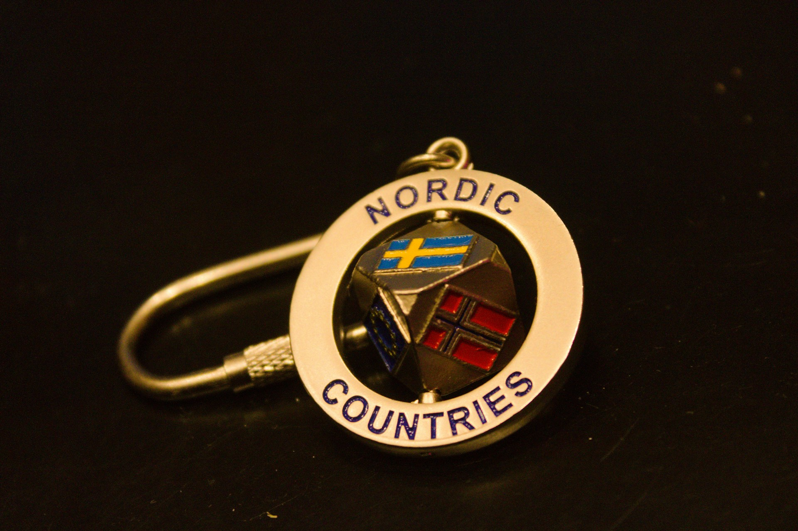
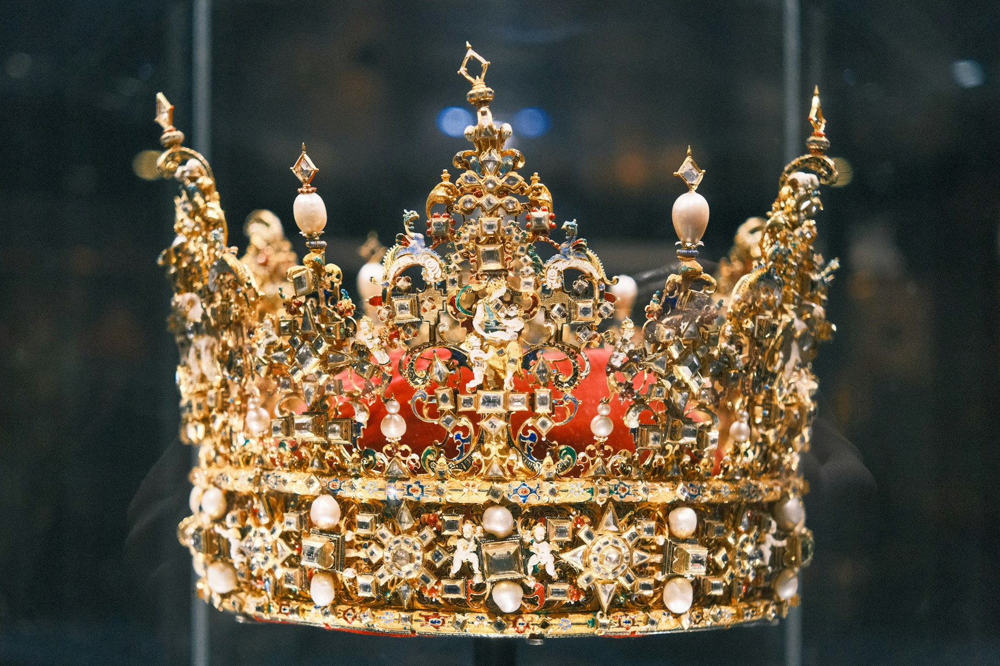

在規劃歐洲行程的時候可能會發現，明明歐盟很多國家早就統一使用歐元了，為什麼匈牙利用福林、瑞士用瑞士法郎、捷克用「克朗」，北歐有四個國家甚至根本不收歐元，通通都用「克朗」？

尤其這些「克朗」名字都一樣、貨幣符號也都是「kr」，讓人很容易搞混。這篇文章我們就把各種「克朗」一次講清楚，最後再告訴你身為自由行旅客，該怎麼在行前準備現金和卡片，才不會在這些國家付錢時手忙腳亂。

 🔥 實用工具：[出國自由行行李清單，免費下載](https://exittaiwan.gumroad.com/l/packing-list) 



- 「克朗」不是一種貨幣，而是五個國家各自獨立的貨幣，彼此不通用。
- 北歐四國（丹麥、挪威、瑞典、冰島）完全不收歐元，捷克有些店家雖然接受歐元，但主要使用自己的捷克克朗。
- 在當地刷卡時，選「當地貨幣結帳」，不要選「台幣 / 歐元結帳」，不然匯率會比較差。
- 捷克布拉格的路邊「0% 手續費」換匯亭是地雷，直接用銀行 ATM 提款比較安全。 

---

## 歐洲各國的「克朗」

要搞懂各種克朗，先幫大家分兩類。

第一類是**完全不用歐元**的北歐四國：丹麥、挪威、瑞典、冰島，這幾個地方你帶著歐元現金基本上沒什麼用。

第二類是**雖然使用歐元、但保留自己貨幣**的國家，捷克是其中之一，部分店家會接受歐元，但匯率通常不划算；同樣邏輯也適用於非歐盟的瑞士（瑞士法郎）和匈牙利（福林），只是這兩個貨幣不是「克朗」，所以不太會搞混。

以下是目前這五種「克朗」對台幣的參考匯率，數字每天變動，換匯前可以再查一次即時匯率：

| 幣值   | 英文原文            | 英文縮寫 | 台幣兌匯率（1 單位）                 |
| ---- | --------------- | ---- | --------------------------- |
| 丹麥克朗 | Danish Krone    | DKK  |  |
| 挪威克朗 | Norwegian Krone | NOK  |  |
| 瑞典克朗 | Swedish Krona   | SEK  |  |
| 冰島克朗 | Icelandic Króna | ISK  |  |
| 捷克克朗 | Czech Koruna    | CZK  |  |

---

## 「克朗」的身世

「克朗」其實源自於拉丁文 corona（王冠）。而用「王冠幫貨幣命名」本來就是全歐洲的老傳統，不是北歐、捷克獨有。

中世紀歐洲君主國普遍會在硬幣上鑄印王冠圖案，代表王室背書；krone / krona / koruna 這幾個字，也都同樣源自拉丁文 corona（王冠），只是各自經由不同語言路徑，進入北歐語言和捷克文。

真正讓北歐和捷克不同的地方，是在 19 世紀末時，兩邊都不約而同把「克朗」正式訂為現代貨幣單位、並沿用到現在：

- 1873 年，丹麥與瑞典組成貨幣同盟並共同採用 krone / krona，1875 年挪威加入，冰島當時是丹麥屬地也跟著沿用。這個同盟一直到第一次世界大戰（約 1914 年）前後瓦解，各國的克朗匯率就各自獨立浮動了。
- 1892 年，奧匈帝國推動改革，以新貨幣 Krone（德語區）/ korona（匈牙利語區）取代舊制 gulden；1918 年帝國解體後，捷克斯洛伐克延續了這個命名，變成今天的捷克克朗。

至於其他曾經也有「王冠硬幣」的國家，後來大部分都在政治上的轉折點刻意換了名字。像是法國大革命後，帶有王室象徵的硬幣通通被廢除，改用意指「自由」的「franc」，來跟舊王朝的貨幣符號劃清界線。

**延伸閱讀（英文原文）：**

- [Krone — etymology, Etymonline](https://www.etymonline.com/word/krone)
- [Krone, Krona, Koruna — Merriam-Webster](https://www.merriam-webster.com/wordplay/9-words-for-transnational-currencies-dollar-rupee/krone-krona-koruna)
- [Crown — Britannica Money](https://www.britannica.com/money/crown-monetary-unit)
- [A stable currency in search of a stable Empire? The Austro-Hungarian experience of monetary union — History & Policy](https://historyandpolicy.org/policy-papers/papers/a-stable-currency-in-search-of-a-stable-empire-the-austro-hungarian-experie/)

---

## 自由行旅客怎麼應對各種「克朗」？

### 現實狀況：刷卡已經夠用，但有兩個地方要注意

北歐各國和捷克的刷卡普及率都很高，尤其瑞典已經是「無現金社會」之一，不少商店甚至公共廁所、置物櫃等等都不收現金。短期旅遊的話，帶一、兩張卡基本上就能應付大部分消費，不太需要提前換一大筆現金。但有兩個事情要注意：

1. **海外刷卡手續費**：VISA / Mastercard / JCB 三大發卡組織一般會收約 1.5% 的海外刷卡手續費，美國運通則約 2%。如果你的卡有海外消費現金回饋，回饋率只要高於這個手續費，出國刷卡通常還是比帶現金划算。
2. **部分台灣的銀行已把「歐盟地區實體消費」排除在海外回饋之外**。這幾年不少銀行更新過規則，連帶影響到捷克。出發前可以登入網銀或打客服確認一次，你手上的卡在歐洲刷卡到底有沒有回饋。

 在 ATM 或收銀機刷卡時，螢幕常會問你「要用台幣/歐元結帳，還是當地貨幣結帳？」，請記得**永遠選當地貨幣**（DKK / NOK / SEK / ISK / CZK）。選台幣或歐元結帳，等於是讓對方的機器幫你「代為換匯」，這種動態貨幣轉換（DCC）匯率通常比你自己銀行的匯率差 3～7%。 

### 現金該不該換？在哪裡換比較安全？

短天數旅遊建議只帶少量現金應急（小攤販、部分市集、投幣式置物櫃、小費），不用整趟旅程都靠現金。

- **北歐四國**：如果真的需要換現金，優先選銀行附設的 ATM，或當地連鎖換匯所（例如瑞典、挪威常見的 Forex Bank）。機場的換匯櫃檯匯率通常最差，建議避開。
- **捷克（尤其布拉格）**：布拉格舊城廣場（Staroměstské náměstí）和瓦茨拉夫廣場（Wenceslas Square）周邊，有不少標榜「0% 手續費」的路邊換匯亭，是遊客常踩的地雷。這類招牌通常只是把爛匯率藏在小字裡，實際拿到的克朗會比市場匯率少一大截。比較安全的做法是直接用附屬於銀行（如 ČSOB、Česká spořitelna、Komerční banka）的 ATM 提款，並在提款前選擇「不要」動態貨幣轉換。

### 歐元也能用的國家，該用歐元付還是當地貨幣付？

在捷克、匈牙利、瑞士這類「歐元不是法定貨幣、但店家也收」的地方，用歐元現金付款雖然方便，但店家通常會用一個對自己有利、比市場匯率保守一些的匯率去折算，換算下來實際上會比用當地貨幣或刷卡多損失一些。

這個差距通常不算誇張，但如果你這趟花費金額不小、或是你待在這個國家的天數較多，還是建議優先用當地貨幣或直接刷卡（並選當地貨幣結帳），把歐元現金留著當作刷卡刷不過時的備案就好。

出發這些歐元和當地貨幣並行、或是不收歐元的國家前，可以做這些準備：

- 至少帶 1 張海外消費有回饋、且確認涵蓋歐洲實體消費的卡，加減也帶一張不同發卡組織（VISA / Mastercard）的備用卡，避免臨時遇到店家不收 VISA / Mastercard 之一的狀況。
- 把主要提款卡的海外提款手續費和單次提領上限先查清楚，比臨時在國外 ATM 前試錯划算。
- 身上留一點當地小額現金和硬幣，應付投幣機、小費、鄉間小店這類非刷卡不可的場合。

---


[【歐洲自由行花費】保證省下 300 歐｜歐洲食衣住行樂全方位教學，馬上壓低歐洲自由行花費！](/posts/europe-travel-on-budget-tutorial)
