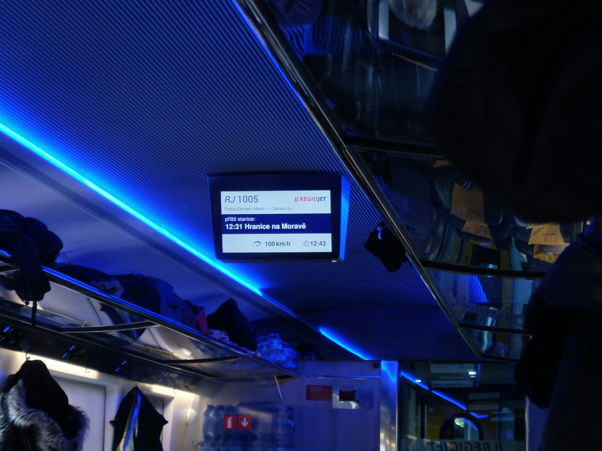


🔥 本文資訊僅供參考，實際最新資訊請參照 [RegioJet 官方文件](https://regiojet.com/about-us/documents)。


搭乘 RegioJet 的巴士和火車，在歐洲大陸各個國家城市間移動和旅行，是價格最親民、[最省旅費](/posts/europe-travel-on-budget-tutorial/)的交通選項之一。

這樣平價的交通公司，竟然在三個主要運營的城市（維也納、布拉格、布爾諾）還[設有乘客專屬的免費休息室](/posts/regiojet-lounge/)，讓很多人覺得物超所值。不過，凡事都有好的一面和不好的那一面，RegioJet 最為人詬病的地方，就是準點率比起其他鐵路略遜一籌。雖然再怎麼可怕，大概都不會比德國鐵路（德文：Deutsche Bahn，簡稱 DB）還可怕。

要是你搭乘 RegioJet 的巴士或火車，很不巧的遇到班次延誤、取消、訂了比較高等的座位被降艙等這些事情的話，這篇文章就是要教你在什麼狀況下你可以獲得 RegioJet 的賠償、什麼時候可以領取賠償、在哪裡領等等所有的相關資訊。

---

## 賠償資格：什麼狀況可以獲得賠償？

實際在旅程中，有些人可能完全沒遇到意外的狀況，而有些人各種狀況都要遇到一次。究竟搭乘 RegioJet 遇到什麼樣的狀況可以讓乘客獲得賠償、哪些特定狀況又可以獲得多少賠償呢？規定上根據不同路線都不太一樣，跟你買的票種艙等、路線起迄站是在單國內或是有跨國都有關係。

以最大宗的火車班次延誤為例，以表定抵達時間為主，如果實際抵達時間和表定抵達時間，延遲了超過 60 分鐘以上，才有資格領取賠償金。根據路線和延誤時間不同，又會有不同的金額。以下就分別用巴士延誤、取消、降等，和火車延誤、取消、降等各項狀況和路線來列表出賠償的狀況和金額囉。

### 巴士延誤




| 非可控因素導致延遲         | 可控因素導致延遲        |
| ----------------- | --------------- |
| 半小時至 90 分鐘：25％ 票價 | 半小時至一小時：50％票價   |
| 91 分鐘以上：100％票價    | 61 分鐘以上：100％ 票價 |

適用路線：
- 布爾諾（Brno）- 奧洛摩次（Olomouc）
- 奧洛摩次（Olomouc）- 茲林（Zlín）
- 布拉格（Praha）- 利貝雷茨（Liberec）
- 布拉提斯拉瓦（Bratislava）- 維也納（Vienna）

推薦閱讀：[維也納到斯洛伐克布拉提斯拉瓦來回交通指南](/posts/vienna-bratislava-transport-guide/)





| 非可控因素導致延遲       | 可控因素導致延遲           |
| --------------- | ------------------ |
| 一小時至兩小時：25％ 票價  | 46 分鐘至 90 分鐘：50％票價 |
| 121 分鐘以上：100％票價 | 91 分鐘以上：100％ 票價    |

適用路線：
- 布拉格（Praha）- 布爾諾（Brno）
- 布爾諾（Brno）- 維也納（Vienna）
- 布爾諾（Brno）- 茲林（Zlín）
- 布拉格（Praha）- 庫倫洛夫 CK 小鎮（Český Krumlov）
- 布拉格（Praha）- 卡羅維瓦利（Karlovy Vary）
- 布拉格（Praha）- 霍穆托夫（Chomutov）- 伊爾科夫（Jirkov）- 莫斯特（Most）
- 茲華倫（Zvolen）- 弗魯特基（Vrútky）
- 布爾諾（Brno）- 弗里代克-米斯泰克（Frýdek-Místek）





| 非可控因素導致延遲       | 可控因素導致延遲           |
| --------------- | ------------------ |
| 一小時至兩小時：25％ 票價  | 46 分鐘至 90 分鐘：50％票價 |
| 121 分鐘以上：100％票價 | 91 分鐘以上：100％ 票價    |

適用路線：
- 布拉格（Praha）- 柏林（Berlin）
- 布拉格（Praha）- 布拉提斯拉瓦（Bratislava）
- 布拉格（Praha）- 海布（Cheb）
- 布爾諾（Brno）- 奧斯特拉瓦（Ostrava）
- 布拉格（Praha）- 茲諾伊莫（Znojmo）
- 布拉格（Praha）- 慕尼黑（Munich）
- 奧斯特拉瓦（Ostrava）- 克拉科夫（Kraków）





| 非可控因素導致延遲       | 可控因素導致延遲         |
| --------------- | ---------------- |
| 兩小時至六小時：25％ 票價  | 兩小時至三小時：50％票價    |
| 241 分鐘以上：100％票價 | 181 分鐘以上：100％ 票價 |

適用路線：
- 布拉格（Praha）- 羅馬（Rome）
- 布拉格（Praha）- 阿姆斯特丹（Amsterdam）
- 布拉格（Praha）- 布達佩斯（Budapest）
- 布拉格（Praha）- 倫敦（London）
- 布拉格（Praha）- 里昂（Lyon）
- 布拉格（Praha）- 巴黎（Paris）
- 布拉格（Praha）- 史普利特（Split）
- 布拉格（Praha）- 蘇黎世（Zurich）
- 布拉格（Praha）- 米蘭（Milan）
- 布拉格（Praha）- 維也納（Vienna）
- 維也納（Vienna）- 克拉科夫（Kraków）
- 布拉格（Praha）- 茨里克韋尼察（Crikvenica）




### 巴士班次取消

如果遇到因為 RegioJet 自身原因而導致巴士班次取消，乘客可以請求全額退款。

### 巴士降等

有些 RegioJet 巴士的車型有分上下艙。下層是基本（Standard）票價，上層是 Relax 票價，如果買了 Relax 艙等而坐到 Standard 艙，乘客可以獲得補償。




適用路線：
- 布拉格（Praha）- 史普利特（Split）
- 布拉格（Praha）- 慕尼黑（Munich）
- 布拉格（Praha）- 柏林（Berlin）
- 布拉格（Praha）- 維也納（Vienna）
- 奧斯特拉瓦（Ostrava）- 克拉科夫（Kraków）
- 克拉科夫（Kraków）- 維也納（Vienna）
- 布拉格（Praha）- 布達佩斯（Budapest）
- 布拉格（Praha）- 布爾諾（Brno）- 維也納（Vienna）





適用路線：
- 20％以外的所有路線




巴士補償相關資訊資料來源：[RegioJet 官方文件（英文）](https://brn-web-strapi.sa.cz/uploads/AJ_SPP_3_5_2024_88bd09ee70.pdf)

---
### 火車延誤（RegioJet 自身造成）




| 延遲 46 至 90 分鐘 | 91 分鐘以上   |
| ------------- | --------- |
| 補償票價 50％      | 補償票價 100％ |

適用路線：
- 布爾諾（Brno）- 博胡明（Bohumin）
- 科林（Kolin）- 拉貝河畔烏斯季（Ústí Nad Labem）





| 延遲 30 至 59 分鐘 | 延遲 60 至 119 分鐘 | 延遲兩小時以上   |
| ------------- | -------------- | --------- |
| 補償票價 10％      | 補償票價 50％       | 補償票價 100％ |

適用路線：
- 布拉格（Praha）- 哈維夫（Havířov）/ （Návsí）
- 布拉格（Praha）- 奧帕瓦（Opaha）/ 博胡明（Bohumin）
- 布拉格（Praha）- Vídeň
- 布拉格（Praha）- 布拉提斯拉瓦（Bratislava）
- 布拉格（Praha）- Varsava
- 布拉格（Praha）- 布爾諾（Brno）





| 延遲 60 至 119 分鐘 | 延遲 120 至 240 分鐘 | 延遲六小時以上   |
| -------------- | --------------- | --------- |
| 補償票價 25％       | 補償票價 50％        | 補償票價 100％ |

適用路線：
- 布拉格（Praha）- 科希策（Košice）
- 布拉格（Praha）- 日利纳（Žilina）
- 布拉格（Praha）- 布達佩斯（Budapest）





| 延遲 60 至 119 分鐘 | 延遲兩小時以上  |
| -------------- | -------- |
| 補償票價 25％       | 補償票價 50％ |

適用路線：
- 布拉格（Praha）- 科希策（Košice）
- 布拉格（Praha）- 布拉提斯拉瓦（Bratislava）
- 布拉格（Praha）- Vídeň
- 布拉格（Praha）- 布達佩斯（Budapest）
- Vídeň - 布達佩斯（Budapest）
- 布拉格（Praha）- Varsava




### 火車延誤（非 RegioJet 自身造成）




| 延遲 60 至 119 分鐘 | 延遲兩小時以上   |
| -------------- | --------- |
| 補償票價 25％       | 補償票價 100％ |

適用路線：
- 布爾諾（Brno）- 博胡明（Bohumin）
- 科林（Kolin）- 拉貝河畔烏斯季（Ústí Nad Labem）





| 延遲 60 至 119 分鐘 | 延遲 120 至 180 分鐘 | 延遲三小時以上   |
| -------------- | --------------- | --------- |
| 補償票價 25％       | 補償票價 50％        | 補償票價 100％ |

適用路線：
- 布拉格（Praha）- 哈維夫（Havířov）/ （Návsí）
- 布拉格（Praha）- 奧帕瓦（Opaha）/ 博胡明（Bohumin）
- 布拉格（Praha）- Vídeň
- 布拉格（Praha）- 布拉提斯拉瓦（Bratislava）
- 布拉格（Praha）- Varsava
- 布拉格（Praha）- 布爾諾（Brno）





| 延遲 60 至 119 分鐘 | 延遲 120 至 240 分鐘 | 延遲六小時以上   |
| -------------- | --------------- | --------- |
| 補償票價 25％       | 補償票價 50％        | 補償票價 100％ |

適用路線：
- 布拉格（Praha）- 科希策（Košice）
- 布拉格（Praha）- 日利纳（Žilina）
- 布拉格（Praha）- 布達佩斯（Budapest）





| 延遲 60 至 119 分鐘 | 延遲兩小時以上  |
| -------------- | -------- |
| 補償票價 25％       | 補償票價 50％ |

適用路線：
- 布拉格（Praha）- 科希策（Košice）
- 布拉格（Praha）- 布拉提斯拉瓦（Bratislava）
- 布拉格（Praha）- Vídeň
- 布拉格（Praha）- 布達佩斯（Budapest）
- Vídeň - 布達佩斯（Budapest）
- 布拉格（Praha）- Varsava




### 火車班次取消

如是 RegioJet 自身原因造成班次取消，乘客可以得到 100％ 票價的賠償，並且免費搭乘下一班前往目的地的火車班次。

### 火車降等

| 車種   | 購買艙等                             | 實際搭乘艙等                     | 補償票價總額 |
| ---- | -------------------------------- | -------------------------- | ------ |
| RJ   | 商務艙                              | Relax 二等艙                  | 50％    |
|      |                                  | Standard 標準 / Low cost 經濟艙 | 100％   |
|      | Relax 二等艙                        | Standard 標準艙               | 50％    |
|      |                                  | Low cost 經濟艙               | 100％   |
|      | Standard 標準艙                     | Low cost 經濟艙               | 50％    |
| R    | 商務艙                              | Relax 二等艙 / Standard 標準艙   | 25％    |
|      |                                  | Low cost 經濟艙               | 50％    |
|      | Standard 標準艙                     | Low cost 經濟艙               | 25％    |
|      | Relax 二等艙                        | Low cost 經濟艙               | 25％    |
| 夜鋪火車 | 夜鋪                               | 座位                         | 100％   |
|      | 夜鋪（布拉格到 Przemysl 和布拉格到 Cop 路線適用） | 座位                         | 50％    |
|      | 夜鋪（私人）（布拉格到 Premysl 路線適用）        | 床位                         | 50％    |
|      | 夜鋪（私人）（布拉格到 Kosice / Cop 路線適用）   | 床位                         | 75％    |

火車補償相關資訊資料來源：[RegioJet 官方文件（英文）]([https://brn-web-strapi.sa.cz/uploads/AJ_SPP_3_5_2024_88bd09ee70.pdf](https://brn-web-strapi.sa.cz/uploads/SPP_vlaky_ENG_49d1619cb1.pdf))

### 不適用補償的情況




- 延誤是由乘客（你）造成的。
- 你搭的巴士已經在出發前宣布延誤。在這種情況下，你可以選擇免費取消車票（直到延誤的巴士到達可免費取消），或等待延誤的巴士，但**沒辦法獲得任何賠償**。





- 延誤是由乘客（你）本身原因造成的。
- 延誤是由第三方行為造成的，儘管 RegioJet 採取了所有合理的措施，但仍無法阻止此類行為，且其後果無法避免，例如有人闖入鐵軌、電纜被盜、列車上發生突發事件、執法行動、蓄意破壞或恐怖主義活動。
- 由於延誤，車票被取消，乘客**未能出行**。
- 延誤是由與鐵路運營無關的特殊情況造成的，例如惡劣天氣、重大自然災害或嚴重的公共衛生危機（例如疫情），鐵路公司儘管採取了所有合理的措施，但仍無法阻止或減輕此類情況的影響。
- 延誤發生在歐盟境外。
- 火車票是在列車延誤資訊公佈後購買的。
- 如果乘坐 RegioJet 火車旅行，且延誤資訊在出發前已公佈，你**依然有權獲得適用標準的賠償**。




---

## 什麼時候可以領？

在大部分情況，如果你可以獲得賠償金，該筆賠償金會在行程結束後的五天內，最久不超過三十天，進入到系統和車票號碼或乘客的帳號（如有）綁定。

要注意，賠償金有領取的時限。乘客需要在該車程**出發日期**之後的六個月內領取。

---

## 賠償金領取方式

要領取賠償金，有兩種方式。

### 用帳號購票

第一是當初購票時如果有申請 RegioJet 的帳號，那麼賠償金額會自動匯入至 RegioJet 帳號。你日後就可以用這個金額買 RegioJet 的車票。當然，你也可以選擇直接現金領出來，但是就必須要實際到 RegioJet 的服務櫃檯，在他們的服務時間由他們的服務人員協助領取。

### 沒用帳號購票（只輸入信箱）

由於 RegioJet 在乘客購票時並沒有強制規定乘客要建立使用者帳號，所以第二種領取賠償金就是當初購票時只有輸入電子信箱來領取車票的乘客。

對於這些人來說，只能實際到 RegioJet 的服務櫃檯，在他們的服務時間由他們的服務人員協助領取。在櫃檯時告訴服務人員車票號碼，服務人員就會透過螢幕查看，和你確認你有沒有賠償金可以領取。

RegioJet 服務據點請[參考官方頁面](https://regiojet.com/contacts-about)。
