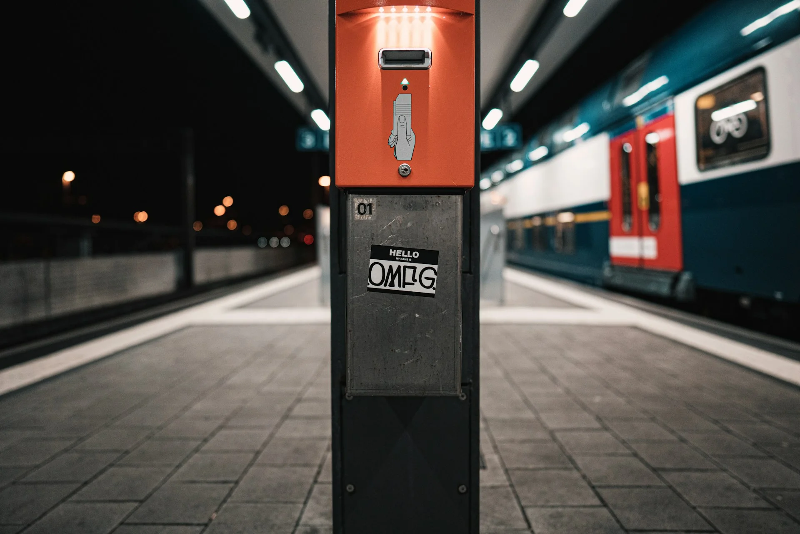
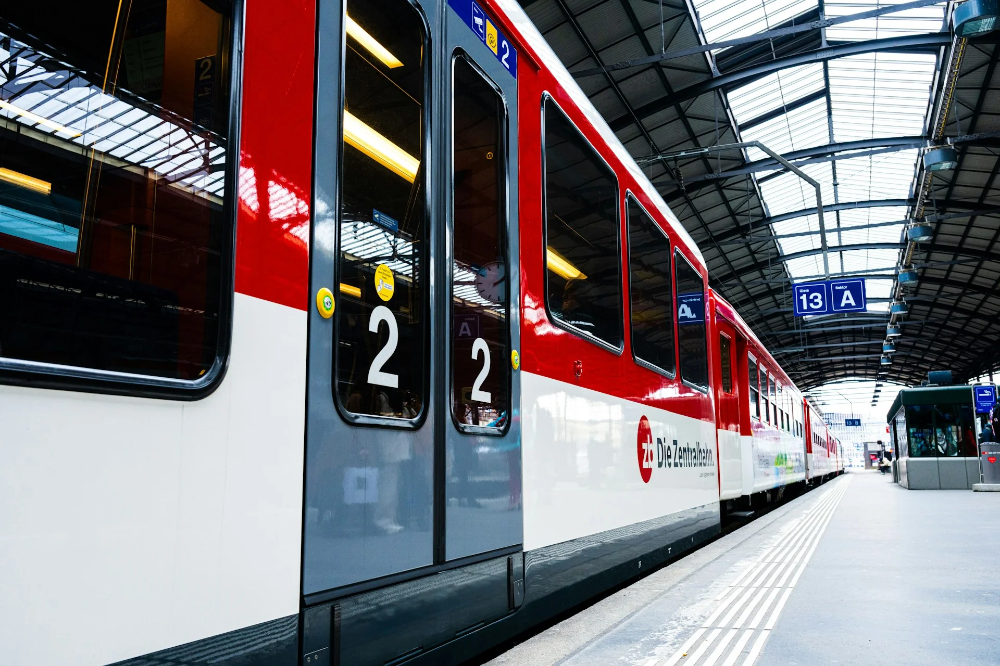
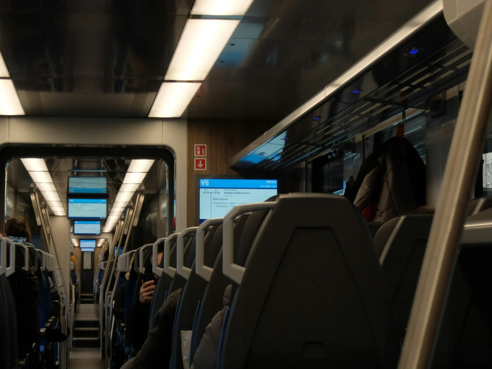
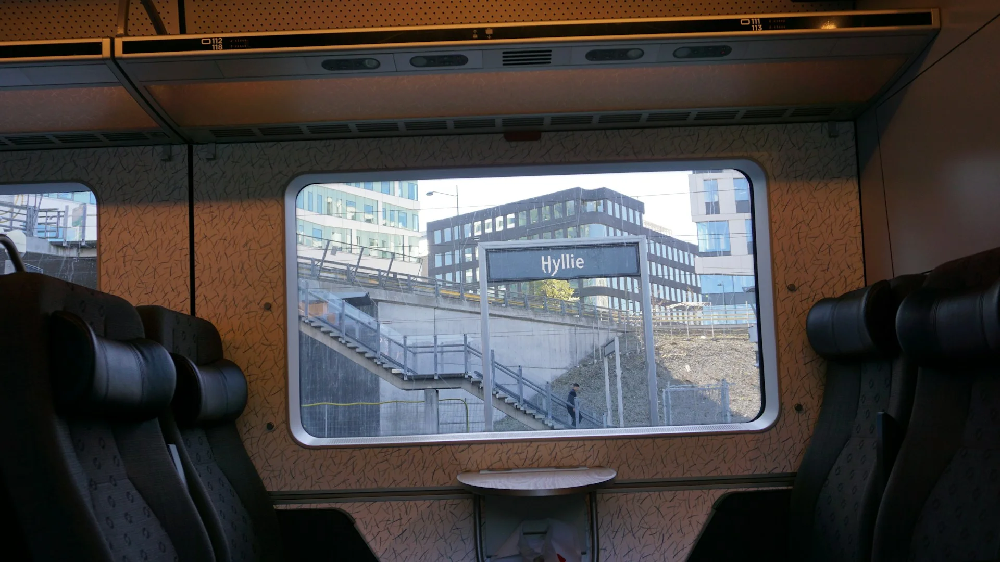
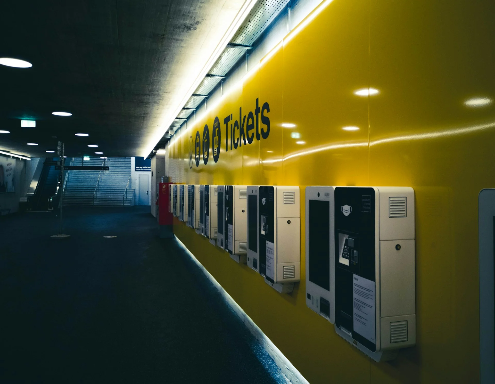
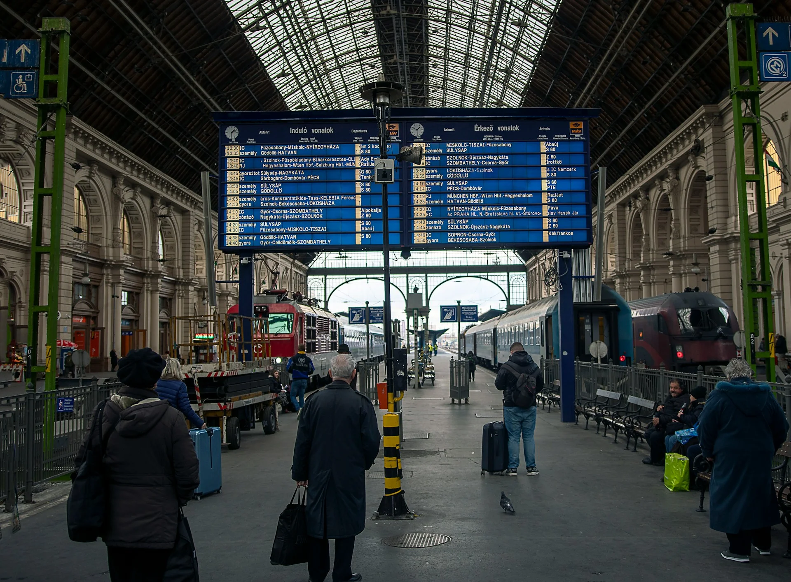

在歐洲，火車幾乎是最常見的旅行交通工具。歐洲的鐵路網絡發達，從城市到城市、跨越國境都能靠火車搞定。不過，在歐洲搭火車和在台灣搭火車還是有很多的不同之處。這篇文章整理了最重要的幾個注意事項，來幫助即將計畫到歐洲搭火車的你。

---

## 上車前：打票和閘門

歐洲各國的入站方式不太一樣，出發前最好先了解一下目的地的規則。

- **打票制（德國、奧地利等國家較常見）**：這些國家的火車站通常沒有閘門。在機台、櫃檯買了實體票之後，上車前必須在月台或是進入車票管制區之前的小機器上「打票」，機器會在票上蓋上日期和時間戳。沒打票就上車，被查到會當場罰款，而且「我不知道要打票」絕對不是合理的藉口。不過如果是在網路上買的票，通常就不會有打票的問題。只要確認車票上有 QR Code 可以在查票的時候給查票員掃碼就行了。
- **閘門感應制（英國、義大利等國家較常見）**：進站時感應票券或掃 QR Code 才能通過閘門，和台灣的高鐵和台鐵模式比較像，相對直覺。同一個國家內有時也會因路線不同而有差異，不確定的話，可以在出發前查一下當地鐵路公司的官網，或直接問站務人員。

另外，一個台灣人第一次會覺得文化衝擊的，就是**上下火車時是要按開門鍵的喔**！不然車門是不會開的。在比較舊的火車上，也有可能不是開門鍵，而是要拉開門把手，觀察看看別人是怎麼做的吧！

---

## 行李怎麼放？

搭歐洲火車時，所有行李都要自己搬上搬下、找地方放。以下幾點要特別注意：

- 大件行李放在視線範圍內。座位區上方的行李架雖然方便，但如果行李放在你看不到的地方（例如車廂連接處），請三不五時回頭確認一下，熱門觀光路線上的扒竊案很常見。
- 貴重物品一律隨身。護照、錢包、相機、筆電這類東西，不管多短暫都不要離身。
- 兩人以上同行更方便。需要去上廁所的時候，可以請同伴幫忙顧行李，不用把東西全部帶進小小的廁所間，或是擔心回來東西不見了。一個人旅行的話，可以請鄰座的乘客幫忙注意。最好是確認下一站還要很久以後才會抵達（如 15 分鐘以上），所以你知道這段期間不會有人上下車。

---

## 劃位在各國規則差很大

這是很多人第一次搭歐洲火車會搞混的地方。

歐洲的火車票大致分兩種邏輯：

票價不含劃位（Open Ticket）：你買的票只是「可以搭這班列車」的資格，但沒有指定座位。想要確保有位子坐，要另外付費劃位，費用從幾歐元到十幾歐元不等。尖峰時段或熱門路線如果沒劃位，可能要站著或是跟別人擠。

如果你上了車想確認這個位子有沒有人訂位了，就抬頭看看座位編號旁邊是不是有寫像是「Reserved」、或是看起來像是地名（該旅客的下車站）等等的字樣，不懂當地語言也可以用翻譯軟體來查查喔！

票價強制含訂位費：有些國家或路線（例如法國高鐵 TGV）是一定要有劃位才能上車，訂位費已經包含在票價裡，或是購票時系統會自動加上。

注意！如果你用的是 Interrail 或 [Eurail 通行證](https://affiliate.klook.com/redirect?aid=41451&aff_adid=1043907&k_site=https%3A%2F%2Fwww.klook.com%2Fzh-TW%2Factivity%2F9868-eurail-global-rail-pass%2F%3Fspm%3DSearchResult.SearchResult_LIST%26clickId%3Dc840137fb8)，**通行證本身不等於劃位**，在很多高鐵或熱門路線上還是需要另外付訂位費，不是買了通行證就能隨便上任何一班車。

<!-- link to article [[歐洲火車通行證｜Eurail Global Pass 哪些國家要另外訂位？]] -->

---

## 車票省錢攻略

火車票的價格在不同平台上可能差距不小，多比較一步就能省下不少錢。

### 直接上各個鐵路公司的官網買（或是現場機台購買）

各個鐵路公司的官方網站通常是最便宜的來源，因為少了中介平台的手續費。以下是幾個常用的官方網站（持續更新中）：

- 捷克：[České dráhy](https://www.cd.cz/en/) 或 [RegioJet](https://regiojet.com/)
- 德國：[DB（Deutsche Bahn）](https://www.bahn.de)
- 奧地利：[ÖBB](https://www.oebb.at) 或 [WESTbahn](https://westbahn.at/en/)
- 匈牙利：[MÁV](https://www.mavcsoport.hu/en)
- 法國：[SNCF Connect](https://www.sncf-connect.com)
- 義大利：[Trenitalia](https://www.trenitalia.com) 或 [Italo](https://www.italotreno.it)
- 西班牙：[Renfe](https://www.renfe.com)
- 持續更新中⋯⋯

### 避開第三方訂票平台

Omio、Trainline 這類整合平台雖然方便，但通常會加收手續費。而且訂票出問題時這些平台也基本上沒辦法處理，你最後還是要自己聯繫到各個鐵路公司的服務處，然後他們會跟你說：「這不是在我們官網訂的票，請去找訂票平台申訴。」。如果已經確定要搭哪條路線，直接去官網買最保險。

### 私鐵 vs. 國鐵

蠻多國家有私人鐵路公司和國有鐵路都走同一條路線，而私人鐵路公司的票價往往更便宜。義大利就是一個例子，義大利私鐵 [Italo](https://www.italotreno.com/en) 和國鐵 [Trenitalia](https://www.trenitalia.com/en.html) 都行駛米蘭到羅馬等主要城市，兩家比價之後再買，有時可以差到將近一半的價錢。

### 提早訂、彈性選時段

高鐵早鳥票往往便宜很多，如果行程確定了就盡早買。離峰時段（非週五晚上、週日下午的返程高峰）也通常比尖峰便宜。想要最高的彈性的話，建議可以[購買 Eurail 多國火車通行證](https://affiliate.klook.com/redirect?aid=41451&aff_adid=1043907&k_site=https%3A%2F%2Fwww.klook.com%2Fzh-TW%2Factivity%2F9868-eurail-global-rail-pass%2F%3Fspm%3DSearchResult.SearchResult_LIST%26clickId%3Dc840137fb8)，雖然跟早鳥票相比不一定便宜，但是提供旅程上很大的便利性。

---

## 其他歐洲搭火車時的實用提醒

- 歐洲火車站的月台不像台灣只有南下和北上，在大車站甚至常常有 20 幾個以上的月台。而月台號碼通常搭車前一到兩個小時，甚至最後一刻才公布。建議提前到站，眼睛盯著電子看板，或是使用官方網站 / App 的工具查詢即時更新。
- 長途或跨國轉車時，建議預留至少 30 ~ 60 分鐘的轉乘時間，歐洲火車誤點很常見，趕點的話壓力很大。其中最惡名昭彰的就是德國國鐵 DB 了。
- 夜舖火車（Nightjet 等）很適合省住宿費，但要提前訂艙位，熱門路線旺季一位難求。

> **推薦文章：**
>
> ✔️ [出國要帶什麼？出國自由行行李清單](/posts/出國行李打包/)
>
> ✔️ [歐洲行前準備｜歐洲自由行前你必須知道的事](/posts/歐洲自由行前準備/)
>
> ✔️ [保證省下 300 歐｜歐洲食衣住行樂全方位教學，馬上壓低歐洲自由行花費！](/posts/歐洲自由行花費省錢攻略/)