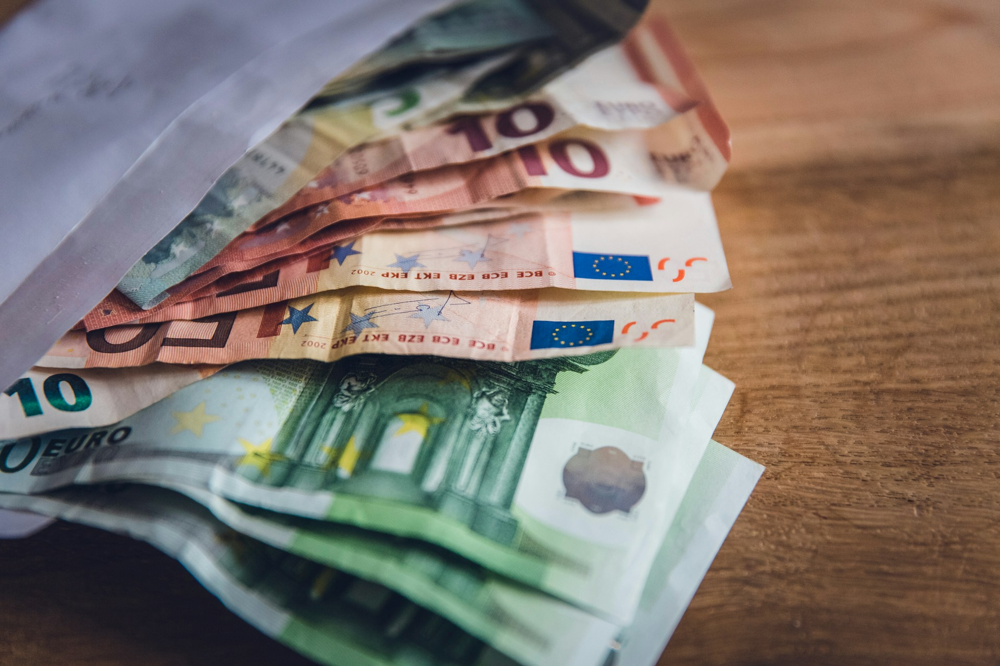
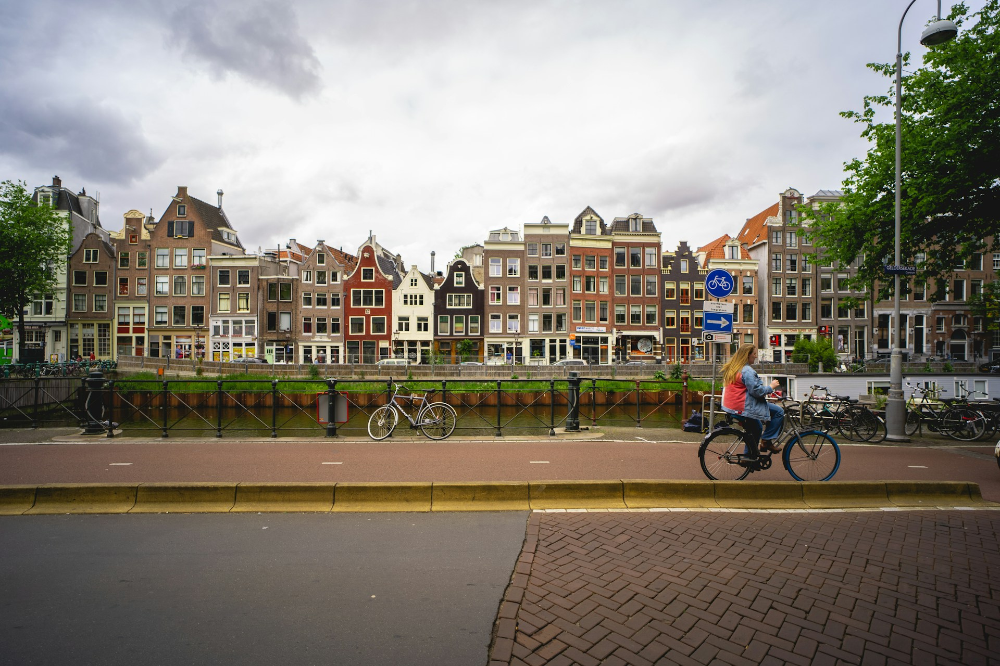

終於要出發去歐洲了！自由行最大的魅力就是自己掌握節奏，但也因為沒有導遊帶路，很多細節得自己搞定。以下是我們整理的實用小撇步，從行前準備到當地規範，幫助你的旅程順順利利、玩的盡興。

## 歐洲自由行前準備

### 行李怎麼帶？輕便就是王道

歐洲自由行通常需要自己拖行李搭地鐵、爬樓梯、換旅館，**行李越輕，越自由**。電器用品非必要就別帶了，歐洲的插座規格（Type C 圓腳）和台灣不同，電壓也是 220V，帶太多電器反而是負擔。

至於到底哪些東西要帶、哪些東西不帶？可以閱讀另外一篇文章「[出國自由行行李清單，行前不再手忙腳亂](/posts/%E5%87%BA%E5%9C%8B%E8%A1%8C%E6%9D%8E%E6%89%93%E5%8C%85/)」，裡面還有超實用的[免費行李清單](https://exittaiwan.gumroad.com/l/packing-list)供你下載列印，一邊打包的時候做使用喔！

### 關於錢的事，出發前先搞定

#### 帶零錢，上廁所用

在歐洲，很多公共廁所是要收費的（通常 €0.50～€1），而且往往只收硬幣，不找零、不刷卡。出門前記得口袋裡放幾枚硬幣，關鍵時刻救你一命。喔！或是你可以看看[怎麼在歐洲找到免費廁所](/posts/%E6%AD%90%E6%B4%B2%E6%89%BE%E5%85%8D%E8%B2%BB%E5%BB%81%E6%89%80%E6%94%BB%E7%95%A5/)。

#### 你大概只需要歐元

歐元區涵蓋大多數西歐國家，包括法國、德國、義大利、西班牙、荷蘭、奧地利等，**除非旅途有安排到英國要使用英鎊**，不然帶歐元基本夠用。在一些歐元不是主要貨幣的國家，像是瑞士、匈牙利、捷克、北歐各國等等，絕大多數的店家還是接受歐元。當然，如果直接刷卡，不是用現金，就沒有這個問題了。

#### 至少備兩張信用卡

歐洲刷卡非常普及，但不是每個地方都接受所有卡，建議至少帶一張 Mastercard、一張 VISA，互相支援備用。另外有幾件事要在出發前確認：

- 開通「四位數 PIN 碼」：歐洲很多地方刷卡需要輸入信用卡刷卡四碼 PIN，台灣信用卡常常預設沒開，要在出發前提早聯絡銀行或是到分行開啟。
- 綁定手機行動支付：在歐洲使用行動支付非常方便，很多場合直接感應就好，不用掏卡。
- 確認海外手續費：部分信用卡每筆海外刷卡會收 1.5%～3% 的手續費，建議出發前確認，可以考慮辦歐洲刷卡有回饋、或是免手續費的卡。

> 推薦閱讀：[歐洲食衣住行樂全方位教學，馬上壓低歐洲自由行花費！](/posts/%E6%AD%90%E6%B4%B2%E8%87%AA%E7%94%B1%E8%A1%8C%E8%8A%B1%E8%B2%BB%E7%9C%81%E9%8C%A2%E6%94%BB%E7%95%A5/)

### 網路

建議在出發前可以購買歐洲漫遊方案（如 DJB [實體 SIM 卡](https://djbcard.com/?aid=84830)或是不需更換卡片的 [eSIM](https://esim.djbcard.com/?aid=84830)），或是台灣各大電信的漫遊方案。出去旅遊雖然可以少滑一點手機，但是網路還是聯繫親人朋友、導航時必要的工具！

另外，選購 SIM 卡前請先確認適用國家！有些 SIM 卡在瑞士等非歐盟國家無法連上網，要特別注意唷。

## 當地規範與安全須知

### 護照隨身帶

很多台灣人以為到歐洲旅遊只有第一次入境和最後出境歐洲會用到護照。大錯特錯！

不管是搭飛機或是搭火車，很多歐盟國家在邊境或特定場所（甚至火車上）會查驗身份，護照一定要隨身攜帶。

### 小心腳踏車道，行人別亂走

在歐洲大部分國家，行人擁有絕對的優先權沒有錯。很多台灣人來到歐洲國家第一次過馬路，被駕駛禮讓時都會被驚艷到。但是，歐洲的腳踏車可是不讓行人的！

畢竟台灣的腳踏車道幾乎不存在，這一點很多台灣人剛到歐洲時都沒注意到。路上的紅色或特定顏色鋪面可能是腳踏車專用道，不是人行道！在德國、奧地利、荷蘭特別明顯，腳踏車速度快、車鈴聲又小，走進去很容易被嚇到（或撞到）、還會讓歐洲人大聲咆哮、討厭你。走在人行道上、過馬路前先看清楚標線。

### 住宿地點的治安

訂旅館或 Airbnb 前，建議查一下附近的評價和街區狀況。通常火車站周邊是相對複雜的地帶，不一定安全，如果一個人自己行動，晚上回飯店要多留意身邊狀況。

### 關於防偷

到歐洲旅遊，建議穿得跟平常一樣就好。

其實刻意穿得樸素不一定能防扒手，反而可能讓自己旅途不舒服。真正重要的是跟隨你平常的穿著習慣。

基本的細節，像是後背包拉好拉鍊、重要的物品放在小包包背在前面、錢包手機不要放褲子後口袋要做好。

熱門景點（羅馬競技場周邊、巴賽隆納蘭布拉大道等）扒手較多，在人擠人的地方多注意就好。

### 緊急狀況

歐洲統一緊急電話是 **112**，不管在哪個國家都適用，包含報警、叫救護車、消防。

## 歐洲自由行如何爽玩！

### 熱門景點務必提前訂票

這是很多人踩過的坑：排隊排了一小時，結果被告知票已售完，或是只能從別的第三方網站買票價貴好幾倍的導覽解說團。以下幾個景點幾乎必須提前預訂，建議出發前 2～4 週（甚至更早以前）訂好，旺季（夏天、聖誕節前後）還要再提早，例如：

- **米蘭**：達文西的《最後的晚餐》，每個時段限定人數，有時需要提前數週甚至數月訂票。
- **羅馬梵蒂岡**：梵蒂岡博物館（含西斯廷禮拜堂）人潮非常多，現場排隊可能要等好幾個小時，強烈建議網路預購。
- **巴賽隆納**：聖家堂和奎爾公園（高第公園）都需要指定時段的預約票，旺季更是早早就售罄。

### 越早安排，省越多

以火車為例，城市之間移動建議提早到各國鐵路官網訂票（義大利 Trenitalia、西班牙 Renfe、德國 DB 等），早鳥票有時比現場購買便宜一半以上，熱門路線也容易售罄。如果想要更隨興一點旅遊，可以考慮買[歐洲鐵路通票 EU Rail Pass](https://affiliate.klook.com/redirect?aid=41451&aff_adid=1043907&k_site=https%3A%2F%2Fwww.klook.com%2Fzh-TW%2Factivity%2F9868-eurail-global-rail-pass%2F%3Fspm%3DSearchResult.SearchResult_LIST%26clickId%3Dc840137fb8)。這樣就比較不用怕到時候買不到火車票（需要訂位的除外）。

其實不只是火車、巴士、或是飛機交通類的花費，飯店住宿也是提前訂比較划算，甚至很多[餐廳提前預約也可以享受最高 5 折的折扣](/posts/thefork/)！你也可以[加入 ExitTaiwan 會員](https://membership.exittaiwan.com/)，我們整理了歐洲多國當地人才知道的優惠，讓你旅行時花費和當地人沒兩樣！

### 調時差攻略

台灣與歐洲通常相差 6～7 小時（夏令時間）。去程建議第一天盡量撐到當地晚上再睡，白天曬太陽有助於調整，這樣大概三四天就可以完全變成正常作息；回程時差方向相反，反而比較容易適應，但頭幾天可能會很早就醒來，睡前避免大量飲食會有幫助。

