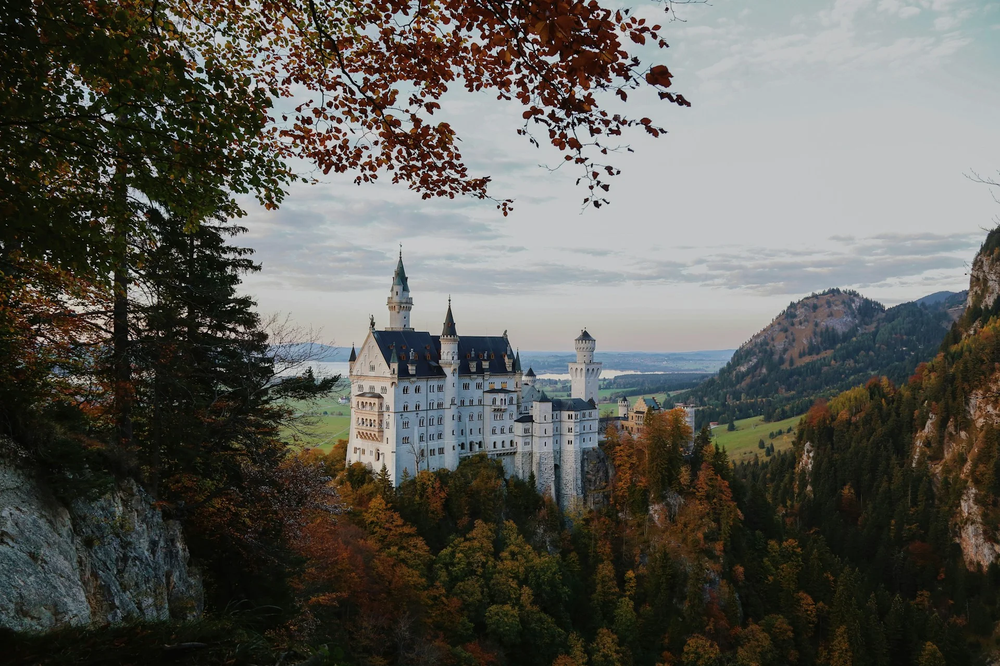
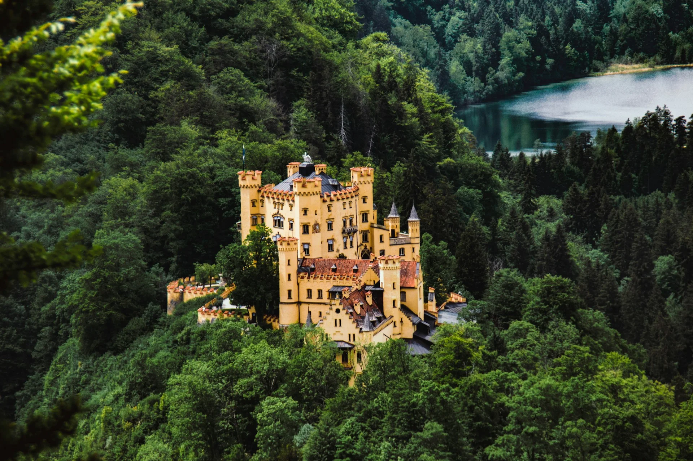
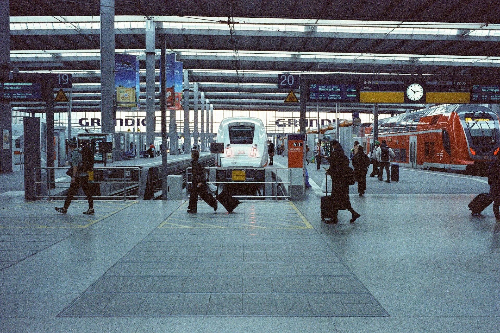
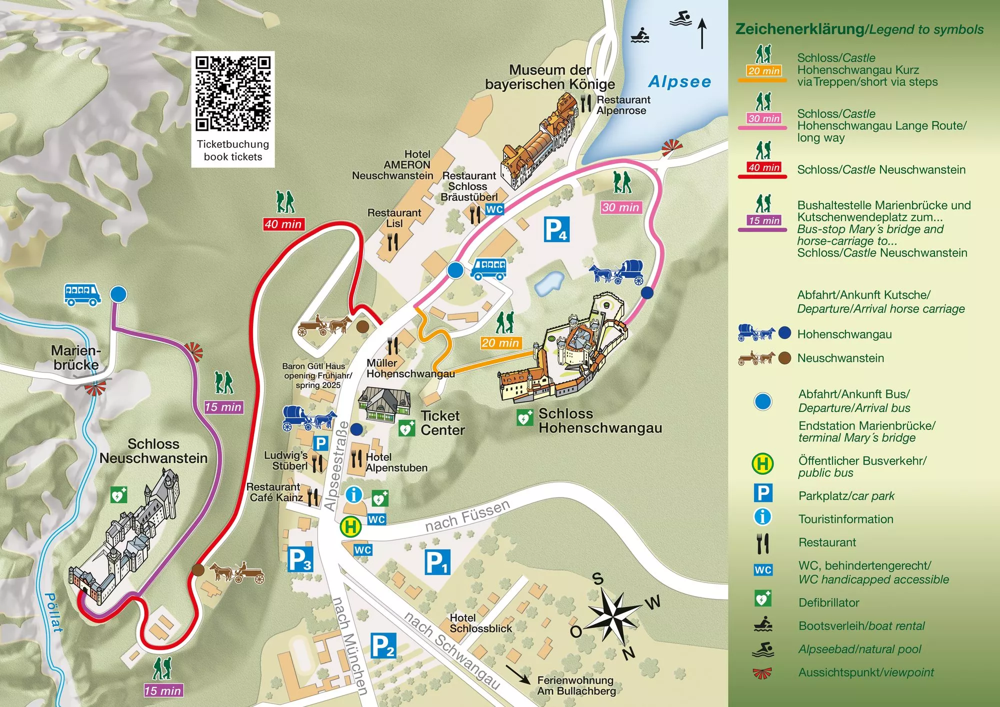
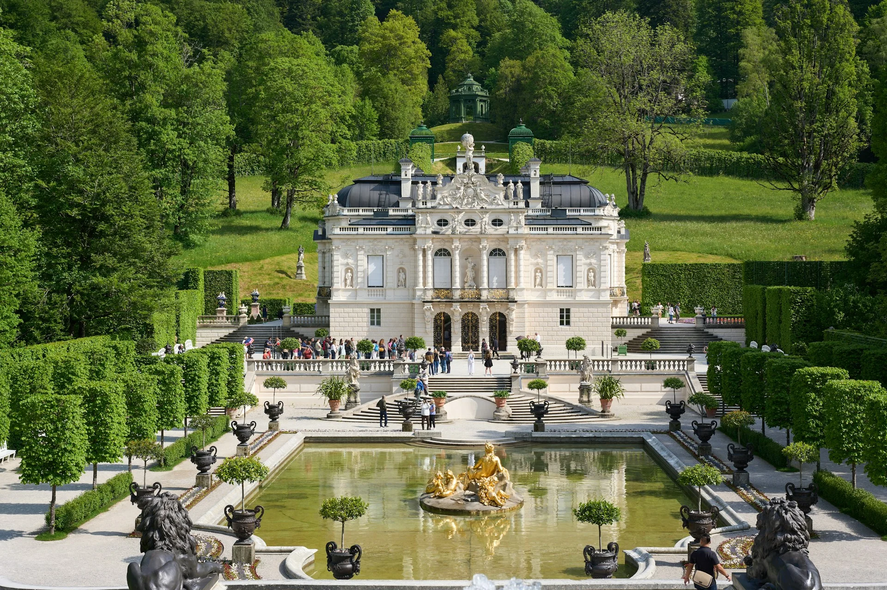

如果你在規劃德國巴伐利亞的行程，新天鵝堡（德文：Schloss Neuschwanstein）幾乎一定在旅客的必訪清單上。這座矗立在阿爾卑斯山腳、藍頂白牆的城堡，是迪士尼睡美人城堡的原型，也是全德國參觀人數最多的景點之一，每年吸引將近一百五十萬名遊客。2025 年，它更正式列入 UNESCO 世界文化遺產名單。

但很多人要訂票時才發現：這裡其實有兩座城堡：新天鵝堡和舊天鵝堡，網站上的名字也讓人搞不清楚。這篇攻略會把一切說清楚，從歷史背景、買票方式到交通安排，讓你出發前就胸有成竹。

---

## 關於新天鵝堡和舊天鵝堡

抵達施旺高（德文：Schwangau）地區之後，你會發現山腰有一座黃色城堡，山頂更高處有一座白色城堡。很多人搞不清楚新舊天鵝堡，其實他們是截然不同的兩座建築，分屬不同年代、也有不同的建造者、不同的故事。

### 新天鵝堡（德文：Schloss Neuschwanstein）

新天鵝堡（德文：Schloss Neuschwanstein）是德國最著名的觀光景點之一，也就是迪士尼城堡的原型。

「Neuschwanstein」由三個德文字組成：Neu（新）、Schwan（天鵝）、Stein（岩堡），合起來就是「新天鵝岩堡」。這是它的正式名稱，並非暱稱。

這座城堡是巴伐利亞國王路德維希二世在 1864 年繼位後，親自規劃的夢幻宮殿。他從小在山腰的王室行宮長大，繼位後決定在更高的山頂兩座城堡廢墟上興建一座前所未有的宮殿。他不是為了治國，而是為了逃離宮廷，創造一個屬於自己的理想世界。

新天鵝堡在 1869 年動工，建築融合新羅曼式風格，大量內部裝飾取材自作曲家理查・華格納的歌劇場景，因為路德維希是華格納的忠實崇拜者，甚至是他最重要的資助人。但是宮殿終其一生都沒有完工。1886 年，路德維希去世，前後只在這座城堡裡住了大約一百天。他死後，這座城堡才得到今天的正式名稱「Neuschwanstein」，並於同年向公眾開放。

現在會叫做「新天鵝堡」就是因為新天鵝堡此處遺址附近的兩座城堡，原本叫做「前霍恩施旺高堡（德文：Schloss Vorderhohenschwangau）」與「後霍恩施旺高堡（德文：Hinterhohenschwangau）」。而在這裡新蓋的天鵝堡，就叫做新天鵝堡囉。

新天鵝堡現在由巴伐利亞州政府管理，是德國最知名的旅遊景點，旺季每天湧入超過六千名遊客。

### 舊天鵝堡 / 高天鵝堡（德文：Schloss Hohenschwangau）

你知道嗎？「舊天鵝堡」完全是現代人為了方便對比新天鵝堡而約定俗成的暱稱。它的正式德文名稱是「Hohenschwangau」，意思是「天鵝高地」，名稱裡從來沒有「舊（德文：Alt）」這個字，更正確的名字其實應該是「高天鵝堡（德文意譯）」或是「霍恩施旺高堡（德文音譯）」。

這座城堡建於山腰，海拔約八百公尺，是路德維希的父親巴伐利亞國王馬克西米利安二世在 1832 以哥德復興式風格重建的王室夏季行宮，1837 年完工。路德維希從小在此長大，1845 年出生後，童年大部分時光都在這裡度過。

高天鵝堡今日由ㄧ個皇族後裔機構管理，同樣對外開放導覽。它比新天鵝堡低調許多，但保存了大量王室起居的原始樣貌，包括路德維希童年房間的原版壁畫和家具，對歷史有興趣的人反而會覺得有看頭。

簡單來說，一個爸爸在山腰蓋了高天鵝堡（德文：Schloss Hohenschwangau），兒子長大後想過自己的生活，所以在更高的山頂蓋了新天鵝堡（德文：Schloss Neuschwanstein），兩座城堡隔山相望。

---

## 新天鵝堡怎麼買票？

在[天鵝堡官網]([https://www.hohenschwangau.de/en](https://www.hohenschwangau.de/en))購票是最便宜的選擇。但如果想要參加一日團，建議直接[購買一日團還有門票的選項](https://affiliate.klook.com/redirect?aid=41451&aff_adid=1258416&k_site=https%3A%2F%2Fwww.klook.com%2Fzh-TW%2Factivity%2F3588-neuschwanstein-linderhof-royal-castle-oberammergau-tour-munich%2F)。

- 官方網站訂票連結：[https://shop.ticket-center-hohenschwangau.de/Shop/Index/en/39901](https://shop.ticket-center-hohenschwangau.de/Shop/Index/en/39901)
- Klook 一日團預訂連結：[https://www.klook.com/zh-TW/activity/3588-neuschwanstein-linderhof-royal-castle-oberammergau-tour-munich/](https://affiliate.klook.com/redirect?aid=41451&aff_adid=1258416&k_site=https%3A%2F%2Fwww.klook.com%2Fzh-TW%2Factivity%2F3588-neuschwanstein-linderhof-royal-castle-oberammergau-tour-munich%2F)

打開官網，首頁顯示的是高（舊）天鵝堡（德文：Schloss Hohenschwangau）的資訊，讓很多人以為找錯網站了。沒有，這就是你要找的網站，兩座城堡共用同一個票務系統。買票時記得在選項中確認選的是你想去的城堡即可。

### 票價

#### 新天鵝堡（德文：Neuschwanstein）

|票種|價格|
|---|---|
|成人|€ 21.00|
|18 歲以下兒童與學生|免費|
|優惠票（65 歲以上、學生、身障人士等）|€ 20.00|

#### 高天鵝堡（德文：Hohenschwangau）

|票種|價格|
|---|---|
|成人|€ 23.50|
|7 歲以下兒童|免費|
|7 至 17 歲兒童|€ 12.00|
|優惠票（65 歲以上、學生、身障人士等）|€ 19.50|

#### 巴伐利亞國王博物館（英文：Museum of the Bavarian Kings）

|票種|價格|
|---|---|
|成人|€ 14.50|
|18 歲以下（有成人陪同）|免費|
|學校團體（一般教育學校）|€ 3.50|
|優惠票|€ 13.50|

> 所有票種（包含免費票）在官網購買均須加收每人 € 2.50 服務費。票券購入後無法退換。

如果你只有一天，新天鵝堡優先。高天鵝堡和博物館可以視時間和興趣決定是否加購。

記得除非打算跟一日團，否則一定要提前在官網購票！旅遊旺季（尤其是六至八月）票券往往在數天甚至數週前就售完。現場購票名額極少，採先到先得制，且只能當天購買。

---

## 新天鵝堡交通怎麼去？

新天鵝堡位在施旺高（德文：Schwangau）地區，距離最近的大城市就是慕尼黑，所以大部分自由行的旅客都把這裡當作據點，從這裡出發。

### 自駕旅客

城堡區域禁止私人車直接進入，請停在山腳施旺高村的收費停車場 P1 至 P4，再步行或搭乘接駁巴士上山。

---

### 大眾運輸工具

從慕尼黑出發到新舊天鵝堡所在地需要轉車，行程分兩段。推薦一併使用[巴伐利亞邦的一日交通票](/posts/巴伐利亞邦一日交通票/)，這樣玩最划算。

#### 從慕尼黑到富森：火車

第一段是從慕尼黑搭火車前往富森主火車站（Füssen Hbf），車程約兩小時。

#### 從富森到天鵝堡山腳（施旺高地區）：公車

抵達後走出車站，就會看到一大群人往同一個方向走，那個方向就是公車站牌。轉乘 73、78、931 或 326 號公車，約十分鐘即可抵達施旺高。

---

### 從山腳到城堡

抵達施旺高（德文：Schwangau）之後，還有一段上山的路。不論是自駕還是搭大眾運輸工具前來的旅客，最後一段到城堡的方式都是以下一樣的選擇。

#### 步行（從購票服務處出發）

- 前往高天鵝堡：約 20 至 30 分鐘
- 前往新天鵝堡：約 40 分鐘

路線上都有指標，步道清楚好走，但坡度較陡。

#### 接駁巴士



成人票價如下（無論是否持有 [Bayern-Ticket](/posts/巴伐利亞邦一日交通票/) 或 DB 月票，皆不適用，須另外付費）：

| 路線   | 成人     | 7–12 歲 | 6 歲以下 |
| ---- | ------ | ------ | ----- |
| 單程上山 | € 3.50 | € 2.00 | 免費    |
| 單程下山 | € 3.50 | € 2.00 | 免費    |
| 來回票  | € 5.00 | € 3.00 | 免費    |

**只收現金，不接受信用卡**。可在乘車站收費亭或直接向司機購票。



巴士沒有固定班次，約每二十分鐘一班，旺季等候時間可能更長。

夏季（至十月中）：
- 第一班上山：早上 8:00
- 最後一班上山：下午 5:30
- 最後一班下山：下午 6:45

冬季（天氣許可、無冰雪時）：

- 第一班上山：早上 9:00
- 最後一班上山：下午 3:30
- 最後一班下山：下午 5:00

以下日期停駛：12 月 24 日、25 日、31 日及 1 月 1 日。



巴士終點是 Marienbrücke（瑪麗橋）附近的觀景台，並非新天鵝堡入口。下車後還需要徒步走一段約十五分鐘的陡下坡路才能到達城堡入口，請預留時間。

行動不便的旅客請注意，這段路程坡度較大，接駁巴士並不適合，建議改搭馬車（另行付費）。

建議策略：上山搭巴士節省體力，下山散步，沿途欣賞風景。



## 一日團（推薦給時間有限的旅客）

如果不想自己轉車、或想一天內同時看幾個景點，推薦從[慕尼黑出發的英文導覽一日團](https://affiliate.klook.com/redirect?aid=41451&aff_adid=1258416&k_site=https%3A%2F%2Fwww.klook.com%2Fzh-TW%2Factivity%2F3588-neuschwanstein-linderhof-royal-castle-oberammergau-tour-munich%2F)，行程通常包含：

- 新天鵝堡（德文：Neuschwanstein）
- 林德霍夫宮（德文：Schloss Linderhof）
- 巴士行經上阿馬高壁畫村（德文：Oberammergau）

雖然含門票的團費比自行購票略貴，但這兩個景點的入場都有指定時間，給導遊統一處理時間安排，出錯的風險小很多，推薦給行程緊湊的旅客：[點我預訂一日團](https://affiliate.klook.com/redirect?aid=41451&aff_adid=1258416&k_site=https%3A%2F%2Fwww.klook.com%2Fzh-TW%2Factivity%2F3588-neuschwanstein-linderhof-royal-castle-oberammergau-tour-munich%2F)。

---

## 新天鵝堡經典拍照點

瑪麗橋（德文：Marienbrücke）是拍新天鵝堡的經典位置，也是各大旅遊照片的取景地。這座橋橫跨一道峽谷，站在橋上可以正面望到整座城堡，視野開闊，拍照效果非常好。

接駁巴士的終點站就在瑪麗橋附近，所以多數遊客會在下車後先去橋上拍照，再往下走去城堡入口。

冬季或惡劣天氣時，瑪麗橋可能因結冰而關閉，但城堡本身的參觀入場不受影響。出發前建議到[官網確認最新資訊](https://www.hohenschwangau.de/en)。在「瑪麗橋（Mary’s Bridge）」的旁邊如果是綠勾勾就有開放，紅叉叉就沒有。

---

## 新天鵝堡注意事項

**一定要提前買票，一定要準時抵達。** 這兩件事再怎麼強調都不為過。新天鵝堡採導覽制，每次入場人數有嚴格限制，只能在票上指定的時間入場，遲到可能無法入場。建議在入場時間的十至十五分鐘前就站在城堡入口等候。

**城堡內禁止拍照攝影。** 這是城堡內部正式規定，請務必遵守。

**建議自帶午餐或輕食。** 城堡周邊並沒有什麼用餐選擇，可以把這趟行程想成去山上健行，把食物帶上山，在景色中野餐是個不錯的選擇。

**帶好歐元零錢。** 接駁巴士只收現金，建議提前準備好 € 5 的硬幣或小鈔，不要只帶大鈔。

> **推薦文章：**
>
> ✔️ [在歐洲搭火車必看！打票、劃位眉角、省錢訂票方式、各國火車公司官網清單](/posts/歐洲搭火車注意事項)
>
> ✔️ [保證省下 300 歐｜歐洲食衣住行樂全方位教學，馬上壓低歐洲自由行花費！](/posts/歐洲自由行花費省錢攻略/)