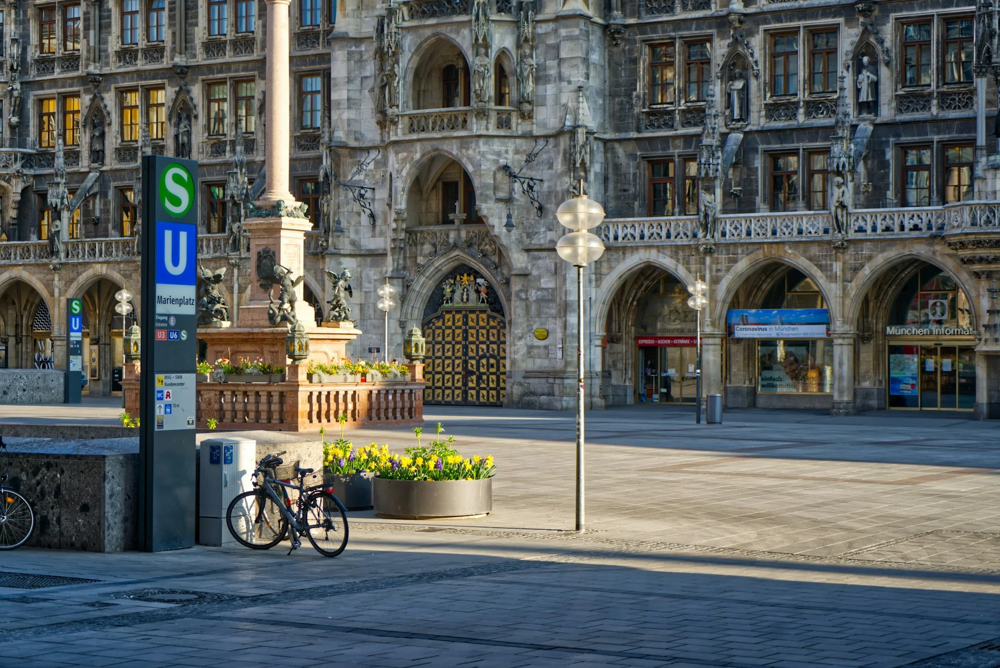
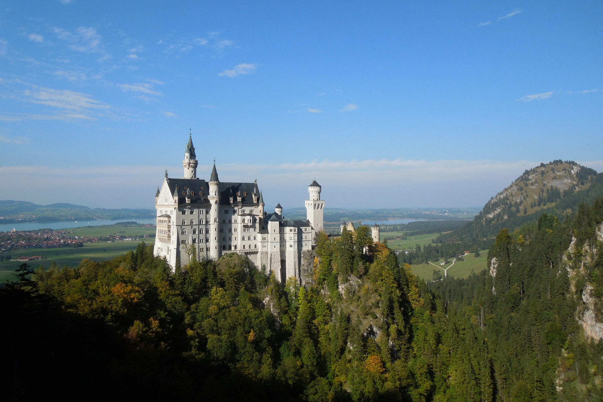
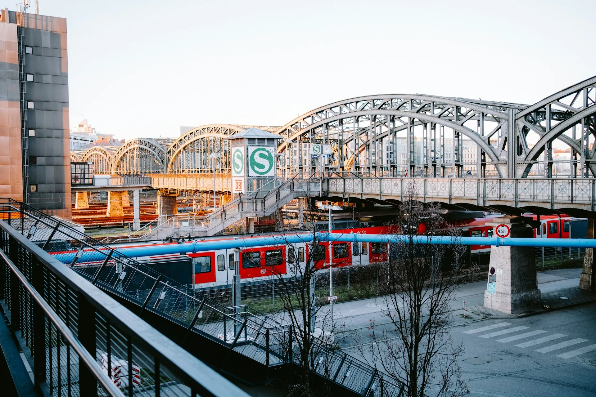
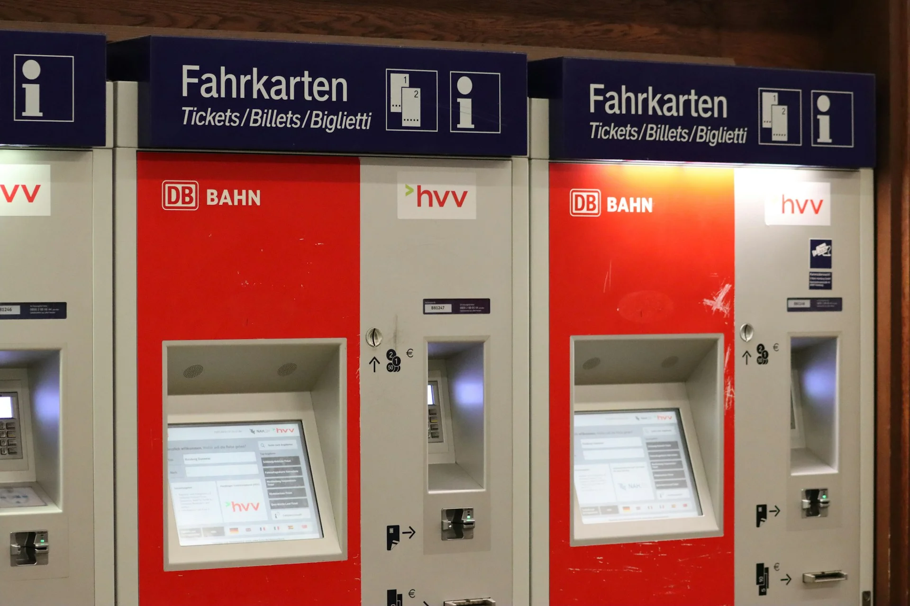

## 巴伐利亞邦一日交通票是什麼？

德國鐵路巴伐利亞邦一日交通票（德文：Bayern-Ticket）是德國國鐵（DB）推出的區域性一日無限次搭乘票券，效期內可以在巴伐利亞邦境內不限次數搭乘符合資格的大眾交通工具，對於想在一天內跨城市移動的歐洲自由行旅客來說[非常划算](/posts/歐洲自由行花費省錢攻略/)。

一張票最多五個人同行，因此不管是家庭出遊、朋友結伴，都可以共用一張票，分攤下來的費用相當實惠

---

## 巴伐利亞邦一日交通票搭車範圍到哪裡？

要知道巴伐利亞邦的範圍到哪裡，在你習慣使用的地圖應用程式裡面輸入「巴伐利亞（英文：Bavaria；德文：Bayern）」，你就可以看到它的範圍囉。

巴伐利亞邦位在德國的東南部，比較大的兩個城市是慕尼黑和紐倫堡。其他比較知名的旅遊城市和景點包含羅騰堡（德文：Rottenburg）、雷根斯堡（德文：Regeensburg）、奧古斯堡（德文：Augsburg）、[新天鵝堡](/posts/德國新天鵝堡攻略/)所在的福森（德文：Füssen，又稱富森、菲森）、國王湖所在的貝希特斯加登國家公園（德文：Berchtesgaden）。

巴伐利亞一日交通票的範圍就包含了整個巴伐利亞邦，甚至包含了到奧地利的薩爾斯堡喔。

<!-- [[link to 薩爾斯堡通票]] so that Hallstatt connected -->

此外，票券也適用於在巴伐利亞邦以外、以及奧地利的部分地區，以下為各終點站：Kufstein、Salzburg Hbf、Ulm Hbf、Sonneberg，還有 Hergatz–Kißlegg–Memmingen、Ansbach–Crailsheim、Hasloch (Main)–Lauda–Würzburg 等路線。

> 資料來源：[德鐵網站（德文）](https://www.bahn.de/faq/wohin-kann-ich-mit-den-bayern-tickets-fahren)

---

## 巴伐利亞邦一日交通票可以搭哪些車？

### 火車

可以搭乘一般的區域火車，但**不適用於長程列車**。判斷方式可以從車次編號的英文字母來辨別：

- **RB**（Regionalbahn）：區間慢車：可以搭乘
- **RE**（RegionalExpress）：區間快車 ：可以搭乘
- **S**（S-Bahn）：市區通勤鐵路：可以搭乘
- **EC**（EuroCity）：歐城列車：**不可搭乘**
- **IC**（InterCity）：城際列車：**不可搭乘**
- **ICE**（InterCity Express）：高速列車：**不可搭乘**

不過其實最簡單的方式，是直接上德鐵的購票網站輸入啟程站和目的地站，如果 Bayern-Ticket 選項有跳出來，那就代表沒問題，可以使用巴伐利亞邦通票搭乘。當然，如果還有比 Bayern-Ticket 更便宜的選項，而且當天大概也沒有安排要搭其他車或回到出發地，那就別猶豫，選更便宜的選項吧！

### 大眾交通工具

除了火車之外，票券也涵蓋了市區內各種大眾交通工具，包含：

- 市區通勤鐵路（S-Bahn）
- 地鐵（U-Bahn）
- 路面電車
- 公車

也就是說，在慕尼黑市區內你也可以直接用這張票搭地鐵和公車，不需要額外買市區票，非常方便。

---

## 巴伐利亞邦一日交通票多少錢？

雖然巴伐利亞一日交通票有分一等艙和二等艙的價格，但其實德國鐵路的一般火車（非長程火車）、區間慢車大部分的車型在一等艙和二等艙的座位根本沒有差別，所以這裡就只提供二等艙的價格囉。

| 人數  | 二等艙票價 |
| --- | ----- |
| 1 人 | €34   |
| 2 人 | €44   |
| 3 人 | €54   |
| 4 人 | €64   |
| 5 人 | €74   |

> 如果是在有真人服務的德鐵服務台購票的話，票價會再加收 €2 的手續費喔。

價格僅供參考，實際最新價格請以[官網](https://int.bahn.de/en/offers/regional/regional-day-ticket-bavaria)或各德鐵售票處為準。

---

## 巴伐利亞邦一日交通票的時效怎麼算？

- 平日（一到五）為當天早上九點到隔天半夜三點。
- 假日（六日及國定假日）的時效性更長，從當天半夜十二點一到，就可以一直用到隔天半夜三點。

假日的票時效更長，幾乎等於一整天都可以使用，對週末出遊的旅人特別划算。

大部分人應該只會用到這種白天的票，如果對夜票（當天晚上六點到隔天早上六點有效）有興趣的可以到[德鐵巴伐利亞邦一日票的官網](https://int.bahn.de/en/offers/regional/regional-day-ticket-bavaria)查看使用說明。

---

## 巴伐利亞邦一日交通票怎麼購買？

購票方式有以下幾種：

- **德鐵官網**：[線上購買](https://int.bahn.de/en/offers/regional/regional-day-ticket-bavaria)，可選擇電子票或列印票。
- **車站自動售票機**：在德國各大車站的售票機上可以購買，依畫面指示操作即可。
- **德鐵售票處（有真人服務的櫃台）**：可以請服務人員協助購買，但需額外支付 €2 手續費。

### 購票時需要填寫乘客姓名

不論是實體票還是電子票，**購票時都需要填入同行乘客的姓名**，這是因為巴伐利亞一日票為記名票，驗票時查票員可能會要求核對身分證件，確認票券上的名字與乘客相符。

- **實體票**：購票後需要在票券上手寫乘客名字，建議**隨身帶支筆**，或是在售票機購票時記得當場填寫完畢。
- **電子票**：購票過程中會要求輸入乘客名字，系統會直接印在票券上。

> **推薦文章：**
>
> ✔️ [在歐洲搭火車必看！打票、劃位眉角、省錢訂票方式、各國火車公司官網清單](/posts/歐洲搭火車注意事項)
>
> ✔️ [保證省下 300 歐｜歐洲食衣住行樂全方位教學，馬上壓低歐洲自由行花費！](/posts/歐洲自由行花費省錢攻略/)