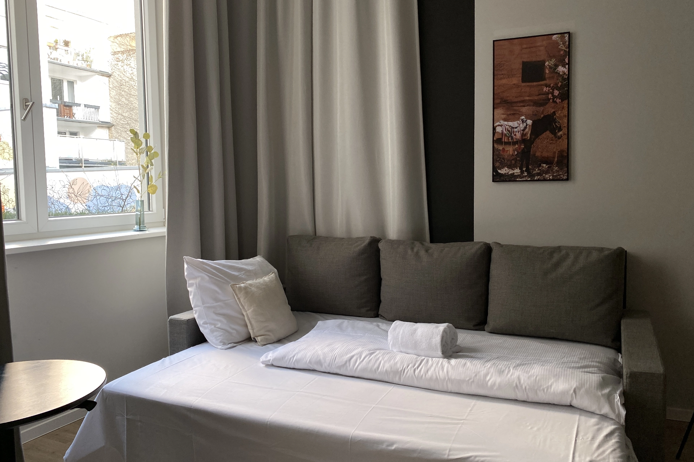
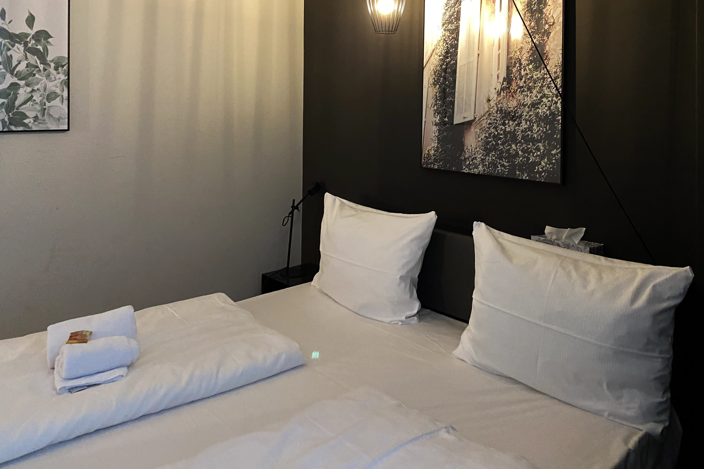
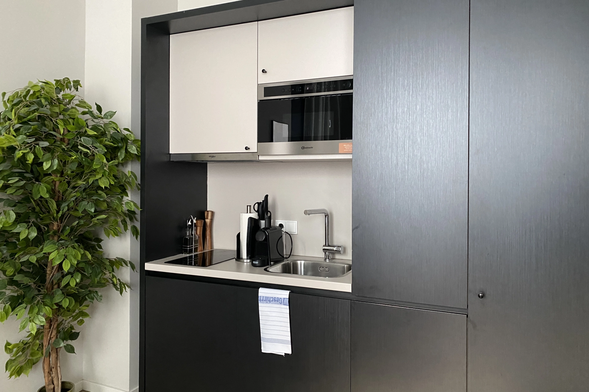
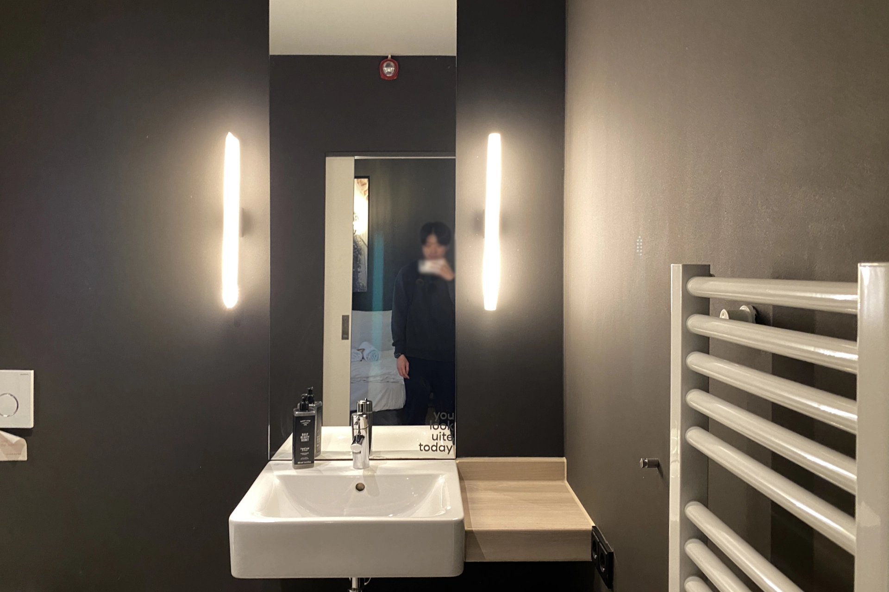
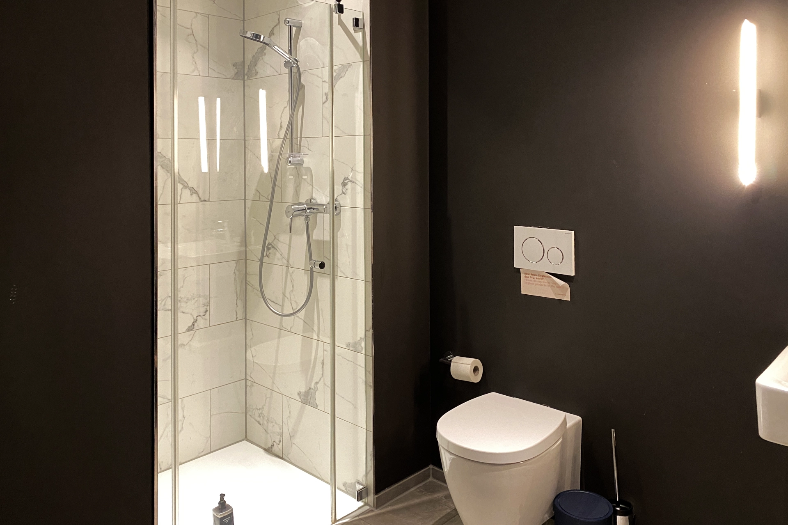
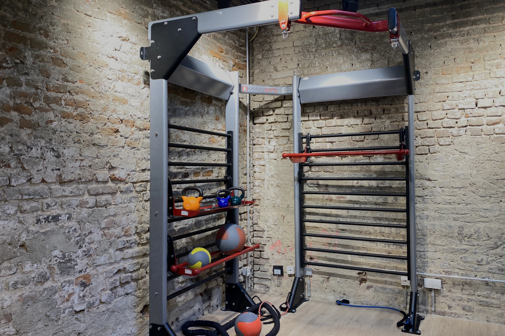
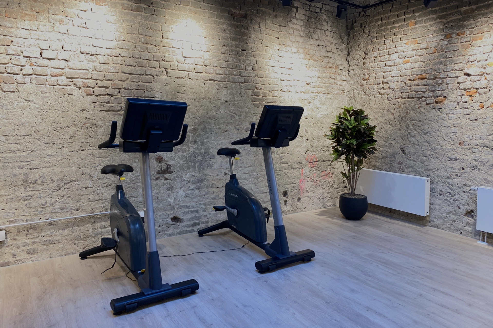
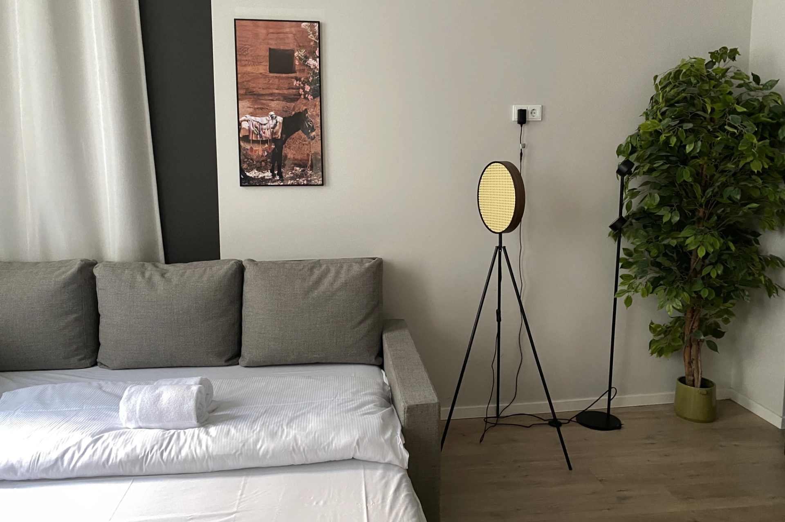
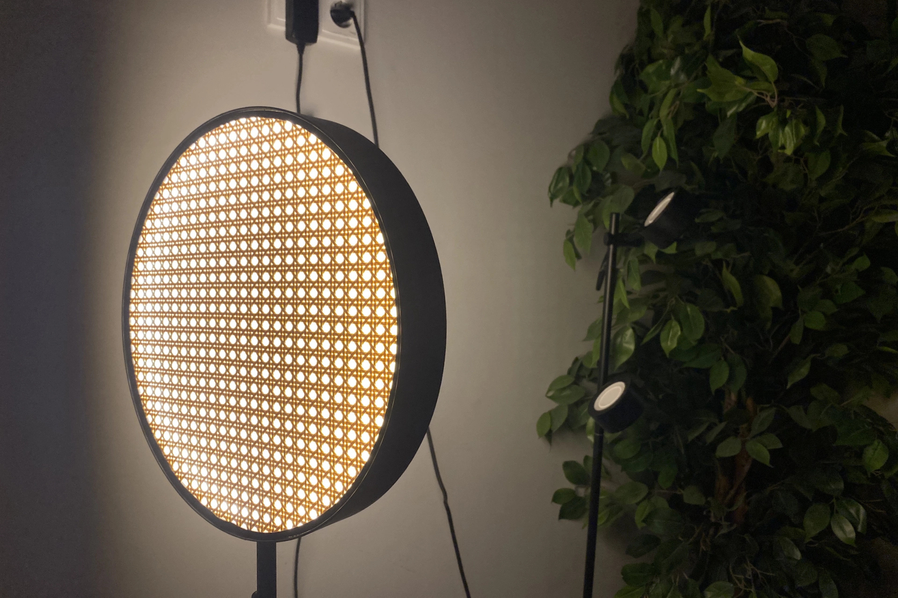

來到德國西部自由行，波恩（德文：Bonn）、杜塞道夫（德文：Düsseldorf）、科隆（德文：Köln）、埃森（德文：Essen）、多特蒙德（德文：Dortmund）都是幾個彼此鄰近、蠻熱門的旅行城市。

今天這篇文章就要完整評價位在杜塞道夫（德文：Düsseldorf）的住宿 [**limehome Düsseldorf**](https://www.booking.com/hotel/de/joyn-dusseldorf.xt.html?aid=7956794)，快看看這間住宿符不符合你的需求吧！

## 杜塞道夫自由行住宿 limehome Düsseldorf Stresemannstraße 基本資訊

- 地址：Stresemannstraße 15, 40210 Düsseldorf（[Google Maps](https://maps.app.goo.gl/Kjx9VZepwX9ujWnb9)）
- 交通：從杜塞道夫主火車站（Düsseldorf Hbf）走路 10 分鐘可以抵達
- 是否含早餐：無（可加購，但不建議）
- 平均每晚價格：約台幣 3,000 - 7,000 元（根據人數及季節變動）
- 查看即時房價：[點我查價](https://www.booking.com/hotel/de/joyn-dusseldorf.xt.html?aid=7956794)

## 杜塞道夫自由行住宿 limehome Düsseldorf Stresemannstraße 實際入住體驗

### 辦理入住

limehome Düsseldorf 採取全電子化自助 check-in，就連大廳都沒有服務人員的蹤影，不過照著住宿方提供的 check-in 教學，很容易就能夠 check-in 成功。

### 房間

這次一行共三人入住杜塞道夫的 limehome Comfort Suite with Sofa Bed 房型，房間非常寬敞舒適，就連沙發床也很大。還有餐桌和小廚房，配備齊全的餐具、鍋具、烤箱兼電烤箱，以及膠囊咖啡機，可以到超市採買食材後自行下廚，住起來非常愜意。

特別注意，並不是所有房型都有廚房，如果想要有廚房，預訂的時候要特別注意房型。

### 廁浴

limehome Düsseldorf 的衛浴空間也蠻大的，清潔上也沒什麼大問題。

### 健身房

入住 limehome Düsseldorf 還可以使用健身房，雖然設備不是很多，但是要基本動一動是沒問題的。

## 杜塞道夫自由行住宿 limehome Düsseldorf Stresemannstraße 整體評價

這次入住 limehome Düsseldorf，根據自身經驗分享它的優點、缺點、和整體評分。

### 杜塞道夫自由行住宿 limehome Düsseldorf 優點

住下來覺得 limehome Düsseldorf 地點相當方便，很容易就可以探索杜塞道夫的市中心。寬敞的房間和衛浴空間也讓人住的很舒服。

### 杜塞道夫自由行住宿 limehome Düsseldorf 缺點

少部分旅客評論指出入住的房間清潔上有待加強，還有時候在半夜時外面街道有狂歡群中的聲音，運氣比較差的時候可能會遇到這些情況。

### 杜塞道夫自由行住宿 limehome Düsseldorf 評價

考量價格和地點以及整個住宿體驗，可以給 [**limehome Düsseldorf**](https://www.booking.com/hotel/de/joyn-dusseldorf.xt.html?aid=7956794) 8 / 10 分，推薦給即將來到杜塞道夫自由行的情侶、或是小家庭的台灣旅客。