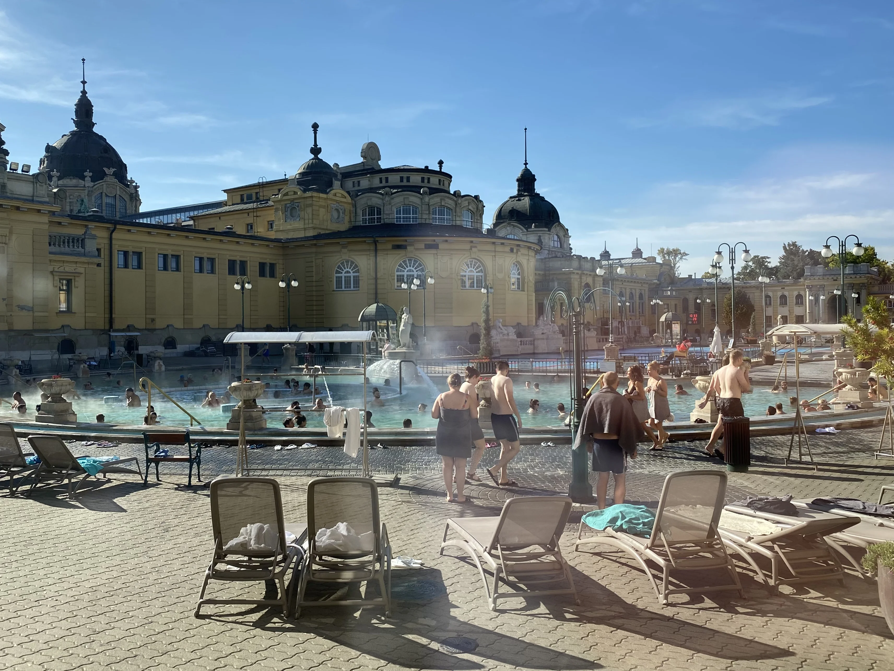
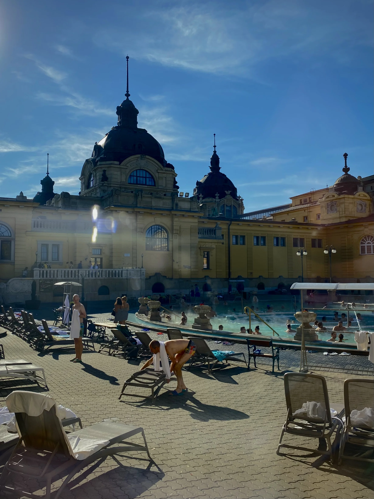
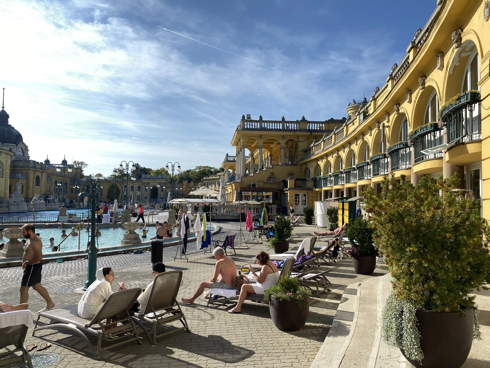
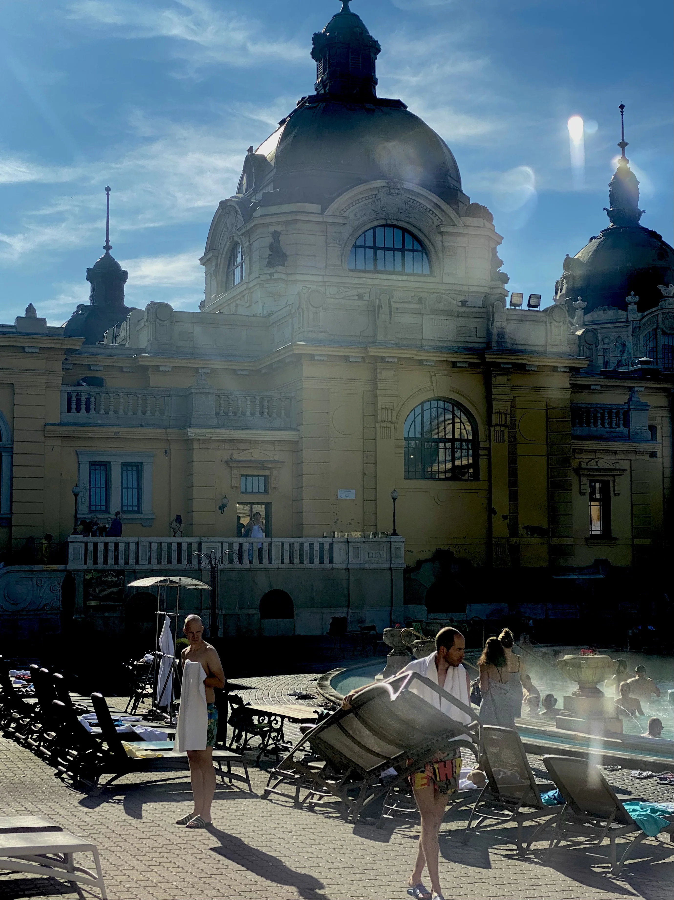
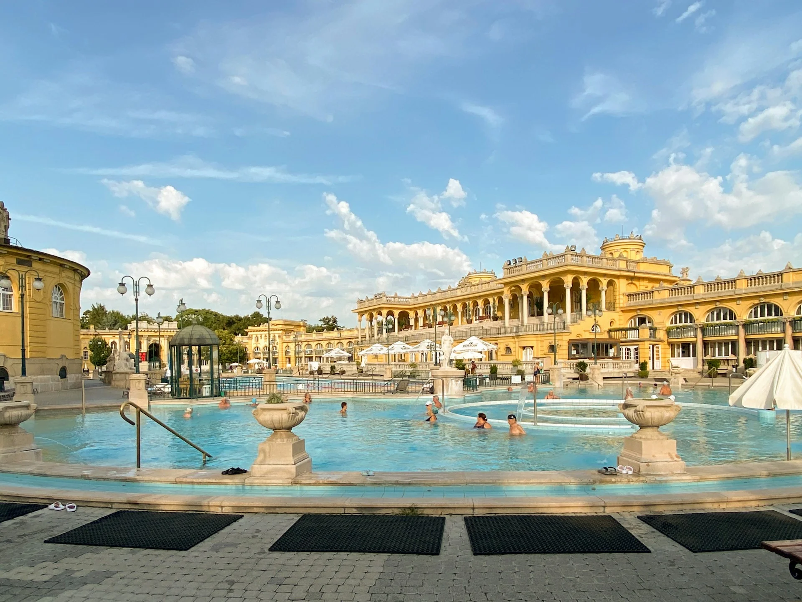


🔥 實用工具：[出國自由行行李清單，行前不再手忙腳亂（免費下載）](https://exittaiwan.gumroad.com/l/packing-list)


來到[布達佩斯](/tags/布達佩斯/)，泡溫泉幾乎是必做清單的第一項。而說到布達佩斯的溫泉，最多人知道、也最多人去的，就是位在城市公園裡的塞切尼溫泉浴場（匈牙利文：Széchenyi Gyógyfürdő）。

這座新巴洛克風格的黃色宮殿是歐洲最大的溫泉浴場。走進戶外庭院，眼前是大片湧著熱氣的藍綠色溫泉水，在冬天更是有種超現實的美感。當地人在水裡下棋，遊客在旁邊泡著發呆，大家都相當悠閒。

## 塞切尼溫泉浴場基本資訊

- 地址：Állatkerti krt. 9-11, 1146 Budapest（英雄廣場附近、城市公園 Városliget 內，[Google Maps](https://maps.app.goo.gl/PGZWsGkySXgd1fEfA)）
- 交通：72 號巴士在塞切尼浴場站（匈牙利文：Széchenyi fürdő M）下車直接到一般票的門口；或是地鐵 M1 黃線在塞切尼浴場站（匈牙利文：Széchenyi fürdő）下車，步行兩分鐘抵達快速通關 / 私人更衣室票的入口。
- 營業時間：平日 7 點到 20 點（週五到 22 點）；（國定）假日 8 點到 20 點。售票窗口於閉館前一小時停止售票，池區須於閉館前 20 分鐘離場。
- 票價：HUF 11,900~15,800（基本入場含置物櫃；私人更衣室需外加 1000 HUF）
	- 官網購票（英文）：[點我前往](https://tickets.szechenyibath.hu/)
	- Klook 購票（中文，約有台幣 300 手續費）：[點我前往](https://affiliate.klook.com/redirect?aid=41451&aff_adid=1251981&k_site=https%3A%2F%2Fwww.klook.com%2Fzh-TW%2Factivity%2F110663-szechenyi-full-day-spa-with-optional-palinka-tour-in-budapest)
- 注意：14 歲以下兒童不得入場。


1 HUF/FT（福林）約等於新台幣 $0.095 元。


---

## 造訪塞切尼溫泉浴場前

### 記得帶這幾樣東西

第一次去溫泉浴場，搞清楚要自己帶什麼可以省掉不少麻煩（錢）。

- 泳衣／泳褲：所有泳池都必須穿著泳裝入場，館內沒有提供，現場購買價格偏高，建議自備。
- 拖鞋：進入浴場需穿著拖鞋。
- 毛巾：基本門票不含毛巾，請自行攜帶，或在館內購買。如果天氣較涼，帶浴袍或大毛巾會更舒適。
- 泳帽（非必）：泳池規定必須佩戴泳帽，但溫泉池區域則不要求。長頭髮的話，進溫泉池前需將頭髮綁起來；如果不帶泳帽，頭部就不能下水。

以上這些東西雖然在入場前的販賣部都有賣，但當然價格就不斐。如果旅程中要買，可以到市區的迪卡儂（Decathlon）先行採購。

### 最佳造訪時間

造訪塞切尼溫泉浴場的最佳時間是早上 7–9 點，既能避開人群，也能在清晨的霧氣中享受戶外溫泉池的悠閒氛圍，甚至在平日時票價還比較便宜（文章稍後介紹）。尖峰時段為早上 10 點至下午 2 點，這段時間售票窗口最擁擠、人潮最多，行程安排上可以的話盡量避開。

小提醒：進入溫泉浴場前可以事先吃飯、補充水分。泡溫泉很消耗體力，在大量排汗後容易感到疲憊或頭暈。出發前先吃點東西、喝足水，進場後也記得定時補水。館內有餐廳和飲料販售，但在外面先吃好比較划算。

---

## 購票時：這兩件事不用花冤枉錢

來到歐洲自由行，所費不貲，當然要在[能省的地方盡量省](/posts/europe-travel-on-budget-tutorial/)囉！

### 不需要特別加購「快速通關」

如果你在早上 9 點前抵達，排隊買票的時間本來就不長，一般的門票完全夠用，不需要額外花錢買快速通道票。快速通關比較適合預計在上午 10 點到下午 2 點尖峰時段抵達的旅客。

### 不一定需要加購更衣室（Cabin）

塞切尼溫泉浴場的一般門票已包含置物櫃使用。置物櫃位於男女分開的更衣區，雖然沒有獨立換衣空間，但放背包、衣物、鞋子都沒問題，而且有電子手環上鎖，安全性足夠。

如果你重視換衣隱私、或帶著大件行李來到塞切尼溫泉浴場的自由行旅客，因為置物櫃空間不大，放不下行李箱，所以建議要加購私人更衣室來放東西。



如果很多人一起來浴場，想要買私人更衣室，可以一個人加購私人更衣室就好。大家一起把不重要的東西（厚重後背包、行李箱）放在裡面。



### 塞切尼溫泉浴場票價

塞切尼溫泉浴場的票價依據平日和週末、是否為快速通關、以及入場時間等等都有所不同。票的等級又有分一般（Basic）、高級（Premium）、和奢華（Luxury）三種，這邊就只列出最多人會買的一般票。

另外，一般票有含置物箱，但不含私人更衣室。私人更衣室的價格就是再加 1000 福林（HUF，約 3 歐元）。

| **票種**    | 適用平日（週一到週四）                 | 適用假日（週五到週日）                          | 適用國定假日與連假期間                 | 官方購票連結（英文）                                | Klook 購票連結（中文）                                                                                                                                                                                                    |
| --------- | --------------------------- | ------------------------------------ | --------------------------- | ----------------------------------------- | ----------------------------------------------------------------------------------------------------------------------------------------------------------------------------------------------------------------- |
| 早鳥票*      | 10,500 Ft（約 28 歐元、1000 新台幣） | 11,800 Ft（**僅限週五**，約  31 歐元、1200 台幣） |                             | 僅可現場購買                                    | -                                                                                                                                                                                                                 |
| 一般票（附置物櫃） | 13,200 Ft（約 35 歐元、1300 新台幣） | 14,800 Ft（約 39 歐元、1500 新台幣）          | 15,800 Ft（約 42 歐元、1600 新台幣） | [點我前往](https://tickets.szechenyibath.hu/) | [點我前往](https://affiliate.klook.com/redirect?aid=41451&aff_adid=1251981&k_site=https%3A%2F%2Fwww.klook.com%2Fzh-TW%2Factivity%2F110663-szechenyi-full-day-spa-with-optional-palinka-tour-in-budapest)，約有台幣 300 手續費 |

*早鳥票只能現場購買，購票處在一般票的入口（Állatkerti 這條路上的入口，72 號公車站牌）。

---

## 進場後：幾個進場後需要知道的事

其實幾乎所有在布達佩斯的浴場都一樣，領票時拿到的手環，不但是你的入場卷，也是你的置物櫃鑰匙。所以請戴好，不要弄丟。

另外，如果天氣不是太冷，建議入水前先淋浴。這其實是浴場的基本禮儀，浴場各處都有蓮蓬頭，在進池前沖洗身體，對大家的衛生都有利。

在離場時，你準備去淋浴，你可能會嚇到：淋浴間沒有門。沒錯，歡迎來到歐洲。在這裡，坦誠相見是大家見怪不怪的日常。當然啦，男女是分開的，這點不用擔心。

---

## 塞切尼溫泉浴場的特色：為什麼值得你專程來

戶外溫泉池是塞切尼溫泉浴場最有名的看點，也是多數人來這裡的主要目的。這裡共有三個戶外泳池（中間是長方形的游泳池，左右兩側是溫泉池），水溫約 36～38°C，四周被黃色新巴洛克建築包圍，無論白天或晚上都有絕佳的氣氛。在溫泉池有很多人在繞圈圈的水流和按摩水柱，很好玩！

不只室外，室內也有無數個溫泉池，水溫介於 26°C 到 40°C，在這裡泡湯就不怕被風吹。除了泳池和溫泉池，塞切尼溫泉浴場也有多種桑拿和蒸氣室體驗，包括岩鹽吸入蒸氣室和火山桑拿等。桑拿內需坐在毛巾上，請記得帶著毛巾入內（雖然幾乎沒人在遵守，哈哈！）。

<!-- Link to 布達佩斯遊河（國會大廈）-->

> **推薦文章：**
>
> ✔️ [布拉格和布達佩斯交通方式](/posts/prague-budapest-transportation/)
>
> ✔️ [保證省下 300 歐｜歐洲食衣住行樂全方位教學，馬上壓低歐洲自由行花費！](/posts/europe-travel-on-budget-tutorial/)