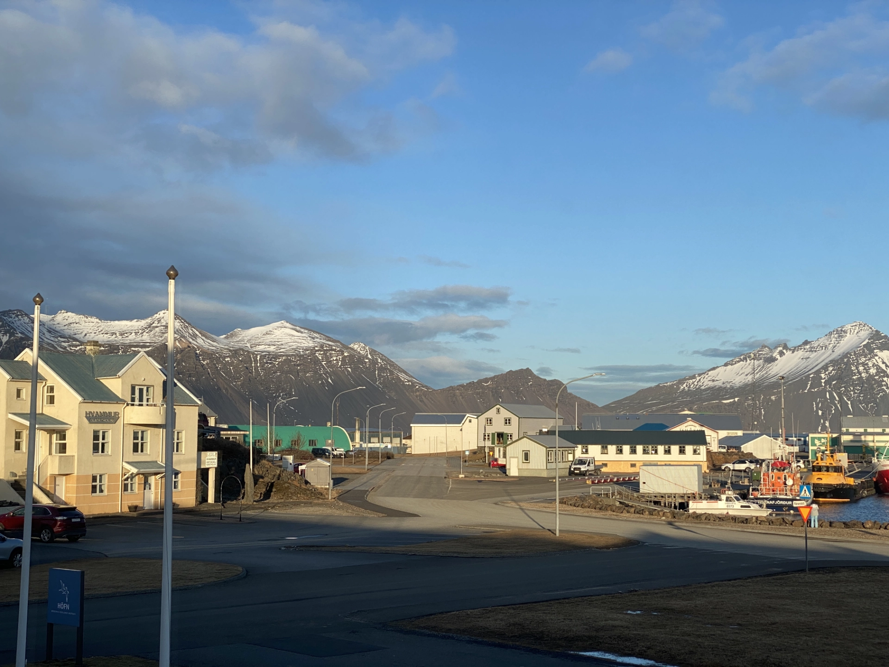
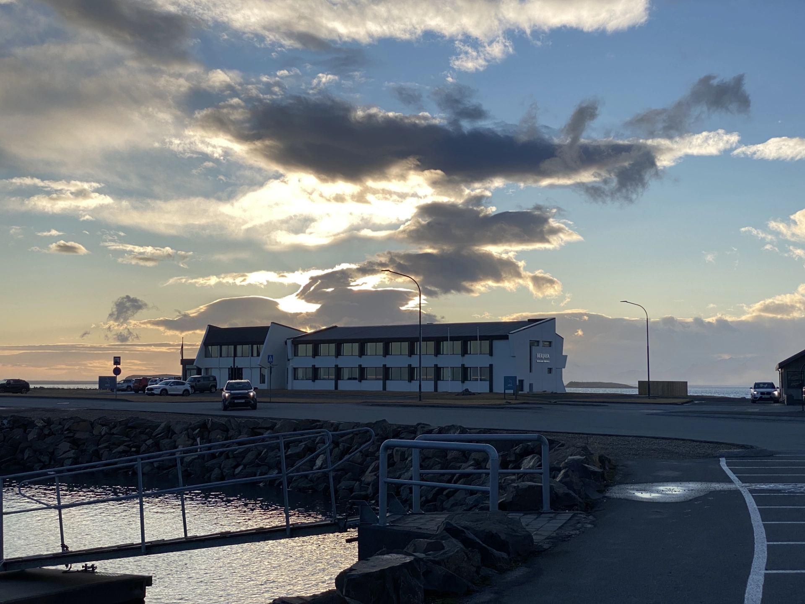
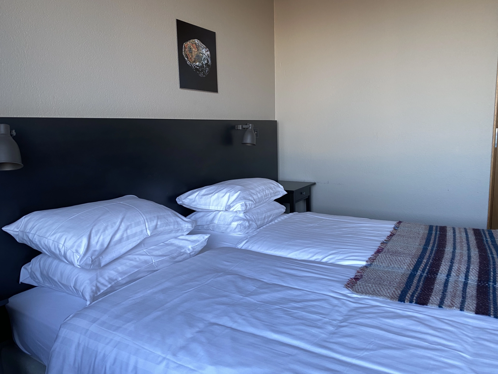
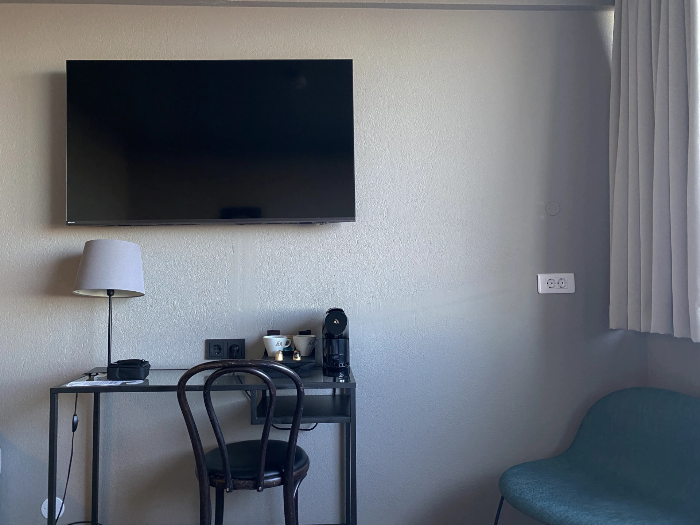
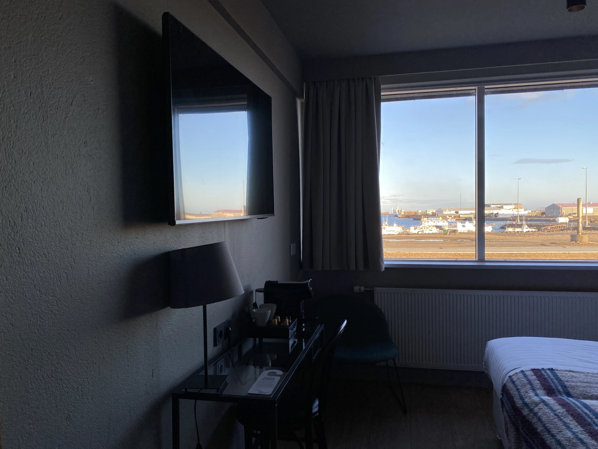
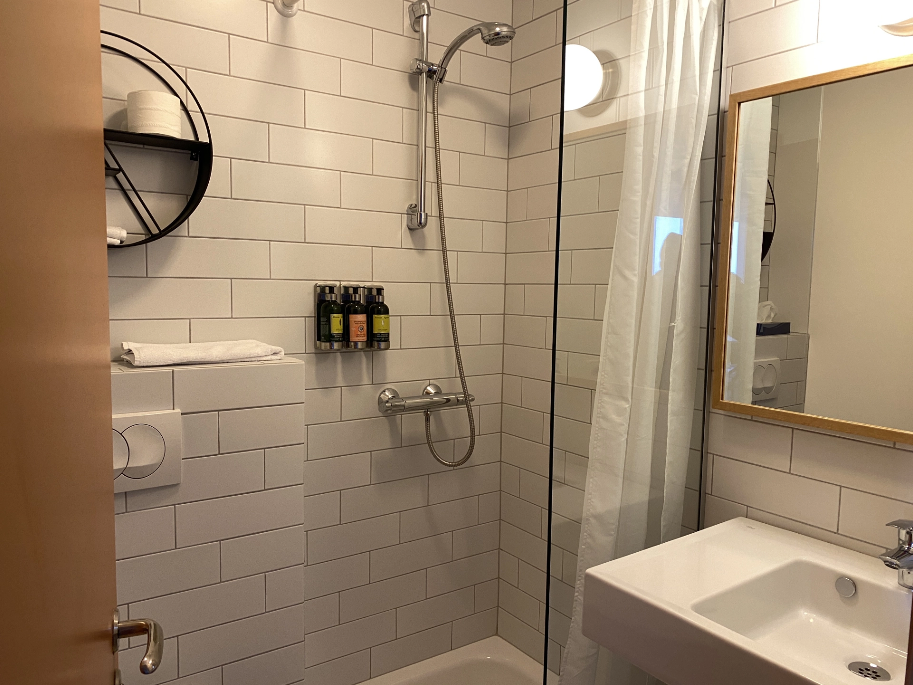
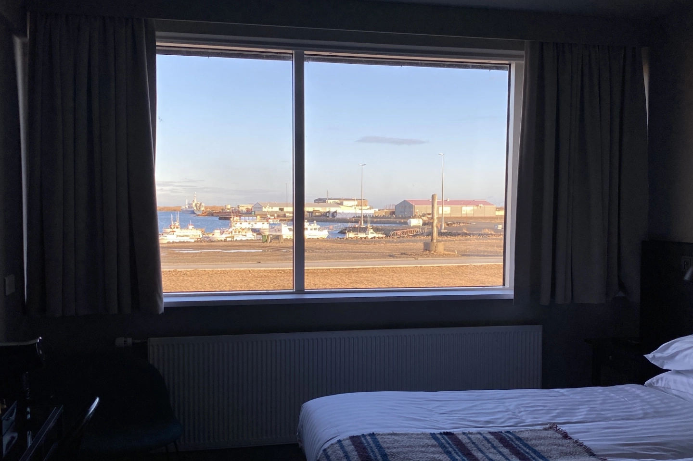

位在俗稱龍蝦鎮的霍芬（或赫本，Höfn）鎮，[**Berjaya Iceland Hotels**](https://www.booking.com/hotel/is/hotel-edda-hofn.xt.html?aid=7956794) 就座落在港口旁邊，運氣好的話，晚上就能直接看到極光！

另外，Berjaya Iceland Hotels 距離霍芬 / 赫本鎮最有名的餐廳 Pakkhús Restaurant 走路只要三分鐘，推薦給即將來到霍芬鎮的旅客。

## Berjaya Iceland Hotels 霍芬 / 赫本鎮住宿基本資訊

- 地址：Ránarslóð 3, 780 Höfn í Hornafirði（[Google Maps](https://maps.app.goo.gl/ztaDWBYJf4MDd5Zr6)）
- 是否含早餐：可加購
- 平均每晚價格：台幣 7,000 ~ 10,000 元（根據房型和季節）
- 查看即時房價：[**點我查看**](https://www.booking.com/hotel/is/hotel-edda-hofn.xt.html?aid=7956794)

## 實際入住 Berjaya Iceland Hotels

### 入住 check-in

Berjaya Iceland Hotels 是傳統定義上的飯店。有專人服務的接待櫃檯，服務很好，櫃檯人員親切。如果有需要，還可以告訴櫃檯人員半夜有極光的話可以叫醒旅客。不過因為 Berjaya Iceland Hotels 的客房內是沒有電話的，所以叫醒你看極光的 room service 會是有人來敲門，不要被嚇到囉。

### 房間

Berjaya Iceland Hotels 的房間就是一般的飯店會有的佈置和設備。電視、小沙發、桌椅、還有膠囊咖啡機。

不過飯店的設備再怎麼好，都比不過窗外那片美景吧！

### 廁浴

Berjaya Iceland Hotels 的廁所浴室空間較小，不過還是有做簡單的乾濕分離，整體也清潔的相當乾淨。

## Berjaya Iceland Hotels 整體評價

這次來到冰島自駕遊，入住霍芬鎮的 Berjaya Iceland Hotels，分享體驗後的優缺點和評分。

### 優點

不論是地點、服務人員、和景色，Berjaya Iceland Hotels 的提供了一流的住宿體驗，推薦給即將來到霍芬鎮的自駕旅客！

### 缺點

老實說，Berjaya Iceland Hotels 除了廁所衛浴的空間小了一點之外，實在沒什麼可以挑惕的地方。

### Berjaya Iceland Hotels 住宿評價

在滿分十分中，[**Berjaya Iceland Hotels**](https://www.booking.com/hotel/is/hotel-edda-hofn.xt.html?aid=7956794) 值得 9 分的高分！雖然這次只有短短的入住一晚，但可以感受到 Berjaya Iceland Hotels 是一個很適合[冰島自駕遊旅客](/posts/冰島自駕遊行前準備)來放鬆做休息的中繼站。

> **推薦閱讀：**
>
> 冰島雷克雅維克住宿推薦：[Sif Apartments｜極簡奢華的公寓式飯店](/posts/%E5%86%B0%E5%B3%B6%E4%BD%8F%E5%AE%BF-sif-apartments/)
>
> 冰島賞極光最強飯店：[呂福恩斯自然公園度假屋 Hrifunes Nature Park](/posts/%E5%86%B0%E5%B3%B6%E4%BD%8F%E5%AE%BF-hrifunes-nature-park/)