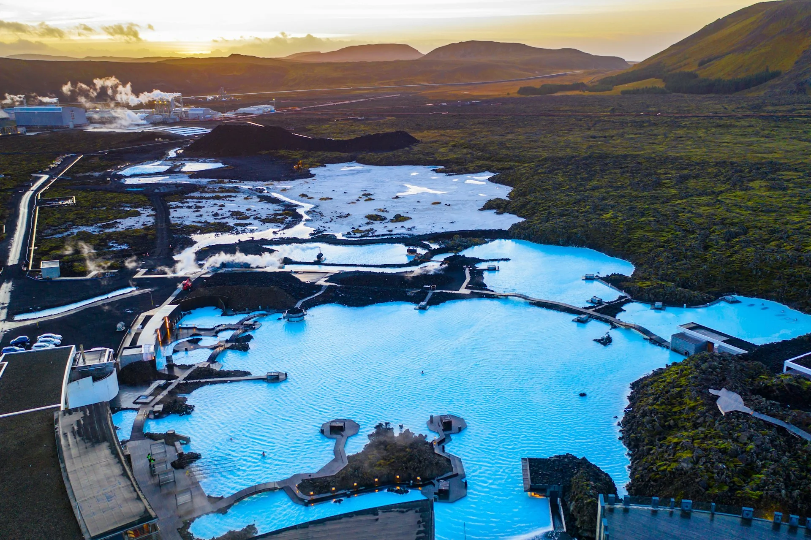
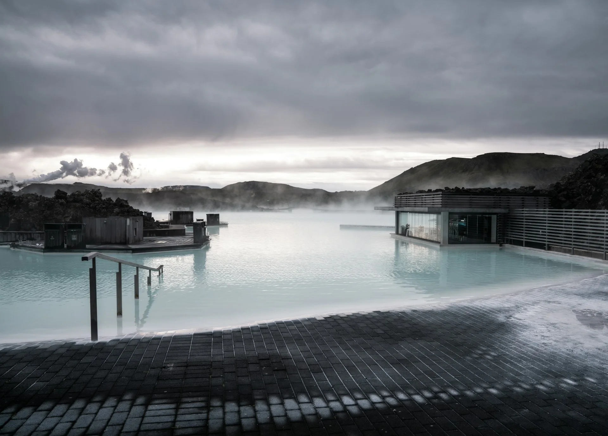
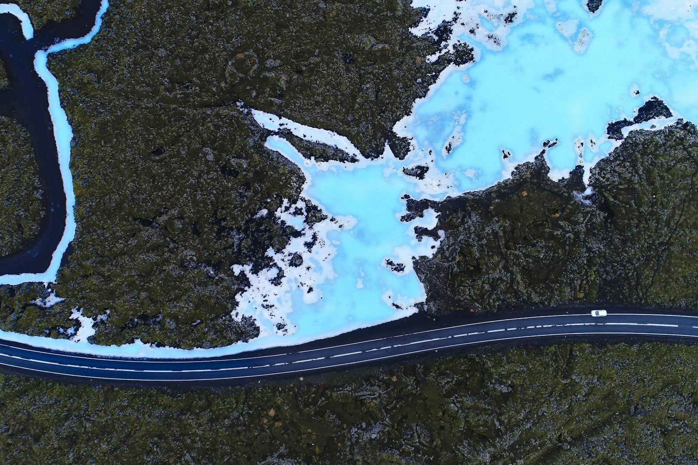
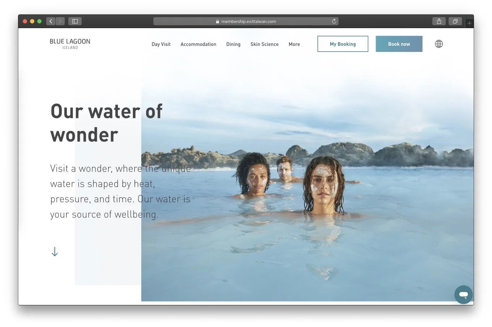


🔥 實用工具：[出國自由行行李清單，行前不再手忙腳亂（免費下載）](https://exittaiwan.gumroad.com/l/packing-list)


冰島的藍湖溫泉（英文：Blue Lagoon；冰島語：Bláa lónið）可以說是冰島最知名的景點之一了。那一片被黑色熔岩包圍的乳白藍色水面、騰騰升起的白霧，幾乎是大多數人對冰島最標誌性的印象。不管你是衝著極光、冰川還是電影《白日夢冒險王（The Secret Life of Walter Mitty）》的場景而來，藍湖溫泉幾乎都是行程裡難以跳過的一站。

就像出發冰島[自駕之前要做一些行前準備](/posts/冰島自駕遊行前準備/)，去藍湖溫泉之前，最好也先搞清楚票要買哪個方案、交通怎麼處理，以及有什麼要特別注意的地方。這篇文章幫你一次都整理好了。

---

## 冰島藍湖溫泉基本資訊

- 地址：Norðurljósavegur 9, 240 Grindavík, Iceland
- 營業時間：
    - 夏季（6/20 ~ 8/20）：07:00 ~ 23:00
    - 秋冬（8/21 ~ 1/31）：08:00 ~ 22:00
    - 冬末春初（2/1 ~ 6/19）：08:00 ~ 20:00
    - 請注意：關閉前 30 分鐘，所有人需離開水中
- 票價：（動態定價，以下為起始價格）
    - Comfort 方案：ISK 11,990 起（約台幣 3,300 元）
    - Premium 方案：ISK 14,990 起
    - Signature 方案：ISK 18,490 起
    - 兒童（2 ~ 11 歲）約台幣 550 元起
- 購票連結：[官網購票](https://www.bluelagoon.com/day-visit/the-blue-lagoon)
- 注意：兩歲以下兒童無法進入



1 冰島克朗（ISK）約等於 0.2596 新台幣（NTD）



---

## 藍湖溫泉有什麼特色？

### 乳藍色的地熱溫泉水

藍湖的水是海水與地下水的混合，全年水溫維持在 37 ~ 40°C 左右，水中富含矽土和硫磺等礦物質，這也是水看起來呈現不透明乳藍色的原因。當然，站在水裡你也會聞到一些硫磺味，其實不久後就會習慣了。

### 白矽泥面膜吧

在溫泉中間的面膜吧是藍湖的招牌體驗之一。溫泉旁設有面膜站，可以免費取用白矽泥塗在臉上，讓礦物質滋養肌膚。進階方案（Premium 以上）還有藻類面膜和熔岩面膜可以選擇。很多人泡著溫泉、臉上敷著面膜，然後再直接用溫泉水洗掉，是藍湖獨有的奇特景象。

### 水中飲料吧

泡在溫泉裡，旁邊就有個水中吧台。每個票種都附至少一杯無酒精飲料，可以直接換取。想要多點飲料的話，也可以用入場的電子手環結帳，不需要帶錢包下水，出場後就會自動計算要多付的費用。

### 蒸氣室、桑拿

藍湖溫泉的設施包含桑拿、蒸氣室、蒸氣洞穴、面膜吧、按摩瀑布等。在水裡泡夠了之後就可以上岸去蒸一下，再回到溫泉繼續泡，無限循環。在冬天時，「從冷空氣中衝進熱水裡」的感覺特別刺激啊！

---

## 怎麼去藍湖溫泉？

藍湖距離幾乎所有航班都會飛的凱夫拉維克（冰島語：Keflavík）國際機場約 20 分鐘車程，距離首都雷克雅維克則約一小時。很多旅客會選擇一落地機場後就先去泡，大型行李可以寄放（但是寄放一個大型行李要 ISK 1,000 元），或是直接放在租車的後車廂。泡完溫泉後再前往雷克雅未克市區的飯店 check-in，這樣的旅行動線很順暢。

### 搭接駁巴士

如果沒有租車，可以從雷克雅維克或機場搭藍湖溫泉合作的接駁巴士。官方的交通合作夥伴是 Destination Blue Lagoon，可以在這裡預訂：[destinationbluelagoon.is/transport](https://destinationbluelagoon.is/transport/)。票價單程是  ISK 4,395（約台幣 1,200 元），來回 ISK 8,790，沒有優惠價。

### 自駕

自駕的話，從雷克雅維克沿 41 號公路往機場方向開，接著轉入43 號公路（冰島語：Grindavíkurvegur），按指標即可抵達，停車場免費。

不過需要特別注意：藍湖位於活火山附近，周邊道路偶爾會因火山活動而封路或需要繞行，甚至短暫關閉。出發前建議[查看最新路況 App](/posts/冰島自駕遊行前準備/)，確認 43 號公路是否暢通。

---

## 藍湖溫泉怎麼買票？

要去藍湖溫泉一定要提前線上購票，因為每天各個時段的入場名額有限制。最划算的購票管道是藍湖溫泉的官方網站：[https://www.bluelagoon.com/](https://www.bluelagoon.com/)

### 買哪個方案？

進入購票頁面後，先選擇人數，然後你就會看到藍湖溫泉有三個入場方案：Comfort、Premium、Signature。我們建議選最基本的 Comfort 就好。因為更高階的方案只是增加了：

- 更多飲料：泡溫泉其實喝不了那麼多無酒精飲料。
- 浴袍：除非是冬天非常冷的時候，在蒸氣室和戶外之間頻繁來回，否則幾乎用不上。
- 更多面膜：其實用一個體驗就很好玩了。要洗掉也不是非常容易。一般人在泡溫泉的時間裡很難把三種面膜都用上。

而 Comfort 方案已包含：

- 入場、蒸氣室和桑拿無限使用、白矽泥面膜一次、大浴巾、洗髮乳和潤絲精、私人儲物櫃，以及水中吧一杯非酒精飲料。

對一般旅客來說，這些已經完全夠用了。最後再選擇入場的時段就可以囉。票價會根據入場時間而有所變動。但不管怎麼變，還是比第三方購票網站[便宜的多](/posts/歐洲自由行花費省錢攻略/)。

---

## 藍湖溫泉注意事項

去藍湖溫泉之前有幾件事先準備好，到了現場會方便很多：

1. 帶泳裝：當然啦，你也可以在現場買貴貴的泳裝，或是用 ISK 1,000 租借。
2. 帶拖鞋：岸邊走動需要，也可現場用手環購買或租借。
3. 頭部不建議下水：溫泉水對頭髮不太友好，富含礦物質的水可能造成頭髮乾燥受損，建議使用護髮素，或全程不讓頭部入水。
4. 水深注意：對於身高 170 公分左又的人，水深大約在肩膀左右，身高較矮的人（特別是兒童）在某些區域可能踩不到底，請特別留意。
5. 下水前必須淋浴：這是冰島公共泳池的標準規定，藍湖也不例外。

藍湖溫泉是冰島最知名的觀光景點之一，所以也確實不便宜。但那片乳藍色的溫泉水和黑色熔岩地景的組合，依然是其他地方非常難以複製的體驗。