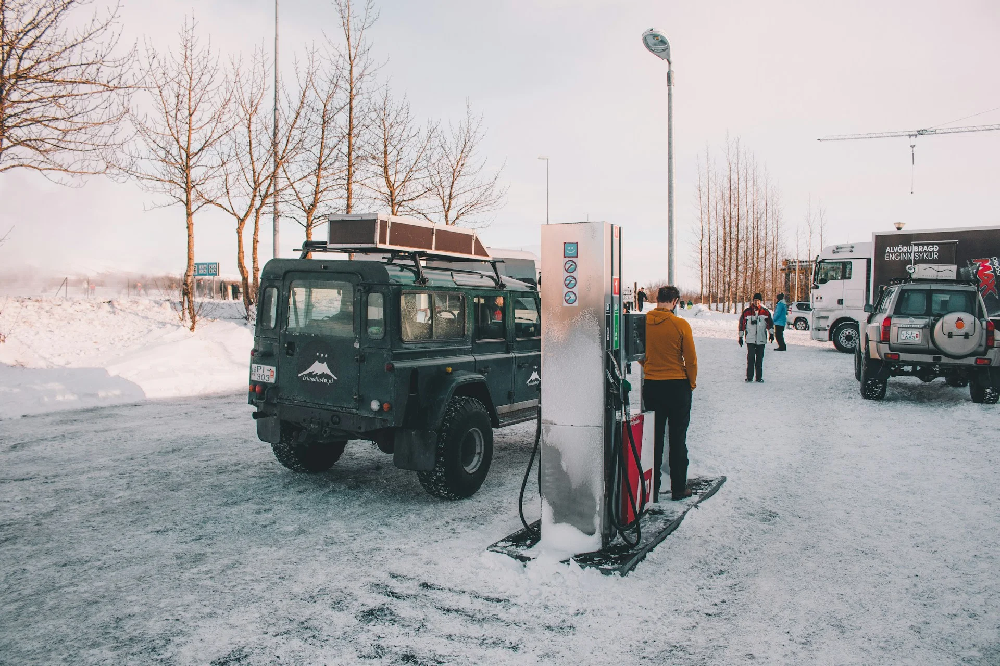
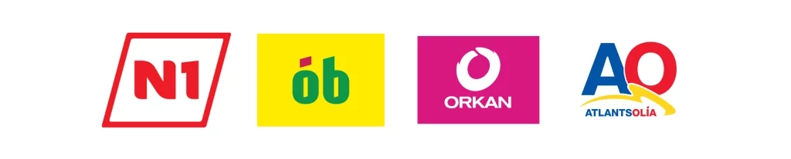
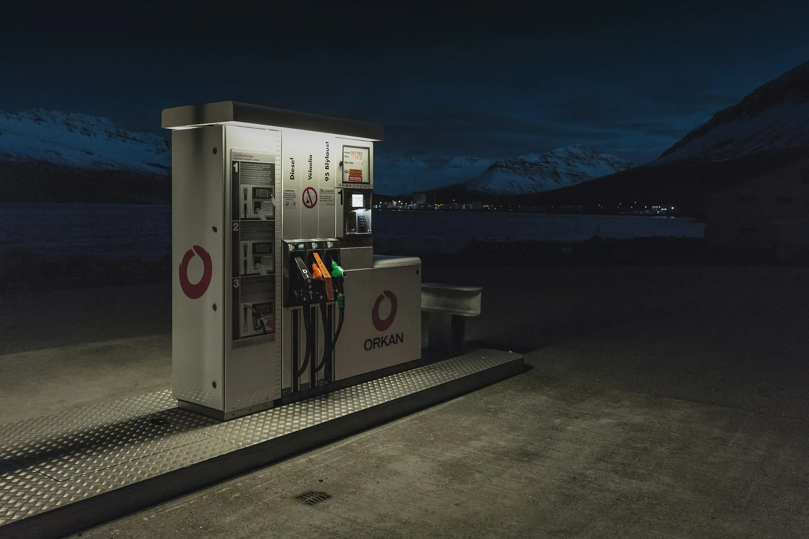
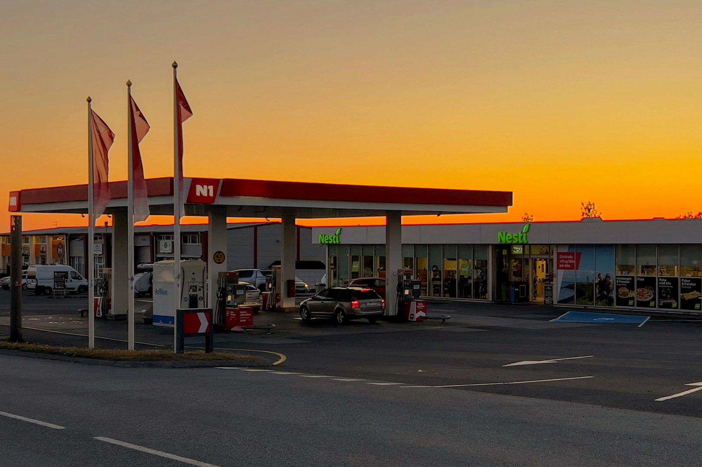


🔥 實用工具：[出國自由行行李清單，行前不再手忙腳亂（免費下載）](https://exittaiwan.gumroad.com/l/packing-list)


「冰島自助加油教學」，大概是最多人到冰島自駕遊的時候查詢的資訊了。冰島幾乎全是自助加油站，加上介面是冰島語或英文、付款方式和台灣不同，第一次面對加油機難免心慌。這篇文章會從出發前的準備一路說到加油的每個步驟，讓你在冰島加油不再手忙腳亂。

---

## 在台灣出發前先準備好這些

到冰島自駕，[出發前](/posts/冰島自駕遊行前準備/)有兩件事一定要先在台灣處理好。

第一是申請國際駕照，並記得同時攜帶台灣駕照，因為兩者需要一起出示。

第二是信用卡的設定。冰島的加油站幾乎不接受現金，所以出發前務必確認你的信用卡可以在海外正常使用。另外要特別注意的是，盡量不要帶美國運通（AMEX）卡作為主要信用卡，因為很多冰島加油站不接受，容易在需要加油的時候碰壁。

有些加油站慢慢在更新機台中，接受信用卡綁定手機支付或是信用卡直接感應付款的比例越來越高，但是還是有非常多傳統機台只收有晶片的實體信用卡喔。

---

## 冰島自駕加油注意事項

### 不要等快沒油才找加油站

冰島部分區域的加油站彼此相距甚遠，主要幹道大約每隔 50 到 100 公里才有一間，尤其南岸和高地區域更稀疏。建議養成習慣，只要油箱的油剩下一半左右，經過加油站就順手補油，不要等到油表快見底才開始找。

### 一定要選對油種

柴油和汽油絕對不能混用，一旦加錯輕則引擎受損，重則整趟旅程直接報銷。租車時，租車公司通常會清楚標注車輛使用的油種，加油口附近也常常有貼紙提醒。簡單整理如下：

- 汽油又叫 Petrol、Gasoline 或 Benzin，有時標示 95，綠色油槍。
- 柴油則是 Diesel，對應的是黑色油槍。

### 幾個省油的小習慣

在冰島開車，油費是一筆不小的開銷，養成幾個習慣可以減少消耗。像是在平坦的路段上使用定速巡航，讓車速保持穩定，可以有效避免油耗浪費。此外，盡量減少長時間怠速暖車，並保持輪胎氣壓正常。另外，夏天駕駛的油耗通常會比冬天低。

---

## 冰島哪間加油站最便宜？

冰島的加油站有幾個主要連鎖品牌，價格和服務各有不同。

**Costco 好市多**：全冰島最便宜的選擇，但需要持有好市多會員卡才能使用。而且全冰島唯一的好市多位在雷克雅維克以南的城市加爾扎拜爾（Garðabær），所以大概只有取還車或在首都圈附近活動時會用到。

**N1（紅色加油站）**：冰島最大的加油站連鎖，覆蓋範圍最廣，偏遠地區最容易找到 N1，但相對也是最貴的，且不接受手機感應支付。

**ÓB（亮黃色或綠色加油站）**：第二便宜的選擇，部分加油站接受手機感應支付。

**Orkan（粉紅色加油站）**：除了 Costco 以外是最便宜的選擇，24 小時全自動營運，在首都圈分布密集，但在圈外就比較稀疏。

<!-- 若有意省油費，可以申請 [Orkan 折扣卡](https://www.orkan.is/english/apply-for-orkan-discount-card/)，每公升可以享有折扣。 -->

**Atlantsolía（淺藍色加油站）**：同樣屬於價格較實惠的品牌，在冰島西峽灣和東部等較偏遠地區較常見。

---

## 冰島自助加油步驟

在雷克雅維克附近，有些加油站會附設超市。遇到這種情況，加完油後直接進超市，跟店員說你用的是幾號加油機，在櫃檯付款即可，不需要在機器上操作付款。

其他一般的全自動加油站，操作流程如下：

1. 選擇語言（選 English 或點選英國國旗）。
2. （如有租車公司給的加油折扣卡）感應折扣卡。
3. 選擇付款方式：信用卡插卡授權扣款，或是手機／信用卡直接感應授權扣款。
4. （若選擇插卡付款）將信用卡插入機器。
5. （若選擇插卡付款）輸入四碼 PIN 碼。
6. 選擇最大加油金額，例如 ISK 5,000 / 10,000，或選 FYLLA（冰島語，意思是「加滿」）。機器會預先授權這筆金額，但最終只會收取實際加的油量費用，多扣的部分會在幾分鐘到幾天內自動退還，不用擔心。
7. 抬頭看一下自己在幾號加油機，螢幕選擇加油機號碼。
8. 取回信用卡。
9. 拿起油槍開始加油，務必確認你拿的是正確油種的油槍。油槍嘴在油加滿時會自動停止，不用擔心油會溢出來。
10. 加油完成後，系統會依照實際油量結帳，多的預授權金額會自動退還。

如要領取收據：

1. **N1**：需要再次插入信用卡，機器會吐出收據與卡片。
2. **ÓB**：尚無資料，歡迎你[告訴我們](/contact/)。
3. **Orkan**：加油完成後畫面直接詢問是否需要收據，選擇即可，不需插卡。
4. **Atlantsolía**：尚無資料，歡迎你[告訴我們](/contact/)。

---

## 為什麼冰島加油這麼貴？

冰島本身不生產燃油，所有油品都需要進口，加上重稅政策，價格就居高不下了。燃油售價中超過一半來自各種稅費，包括增值稅（VAT）、碳稅與消費稅。另外，冰島地廣人稀，偏遠地區的配送成本很高，市場規模小也意味著品牌間的價格競爭有限。所以就算國際油價下跌，冰島當地的油價也不一定會跟著明顯下降。

出發前把這些資訊看熟，也建議把此文章加入到手機的書籤，這樣到了冰島面對加油機就能從容應對，好好享受冰島自駕旅行的樂趣！