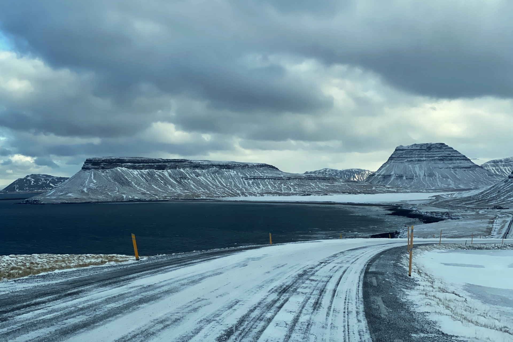
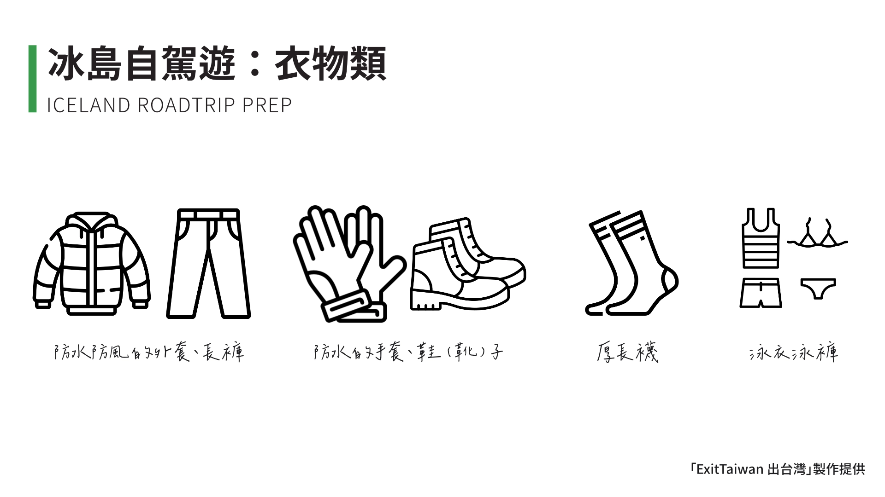
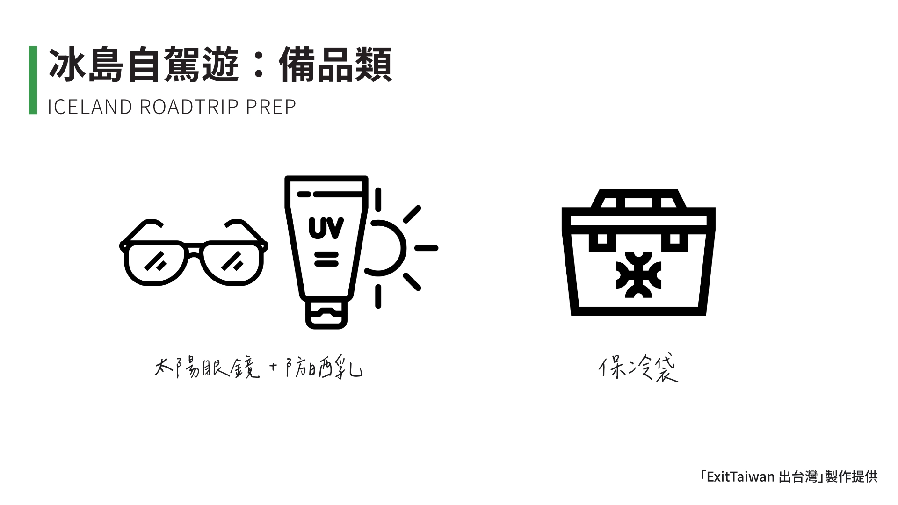
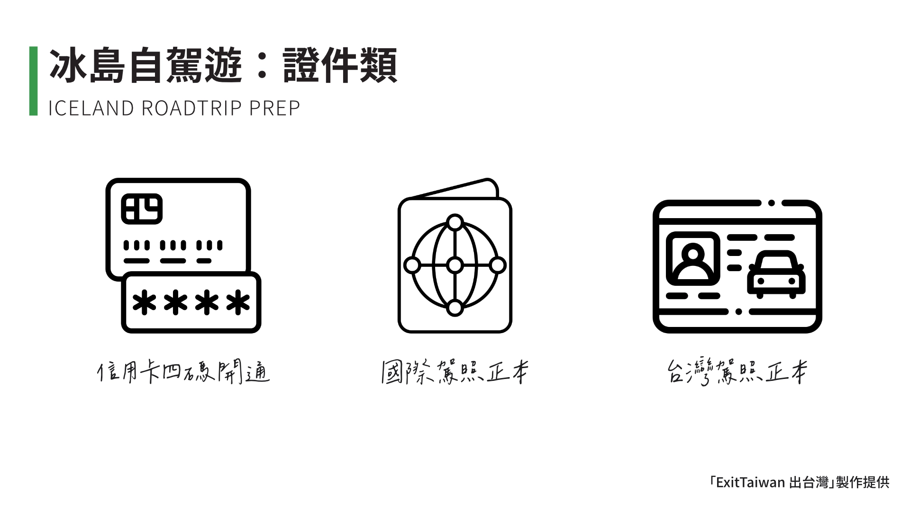
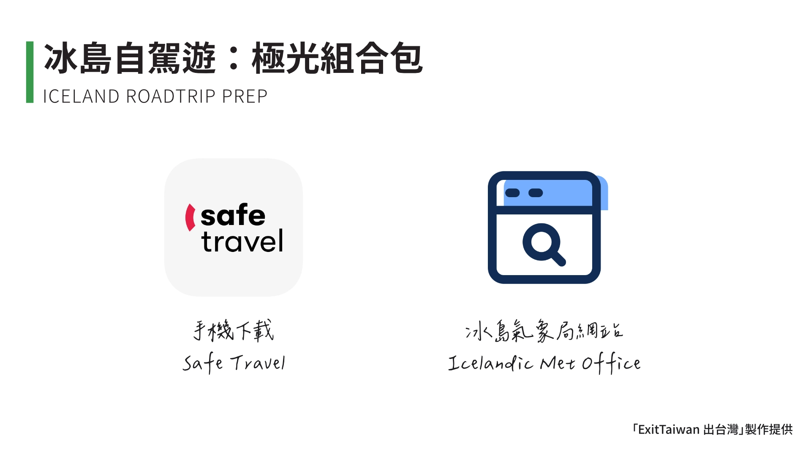
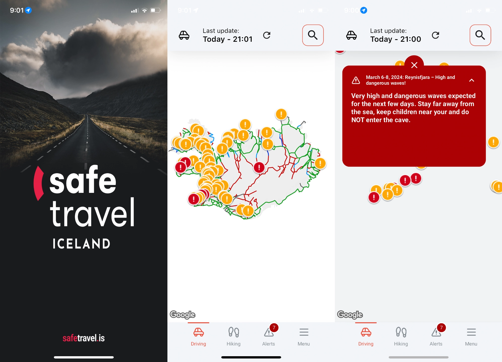
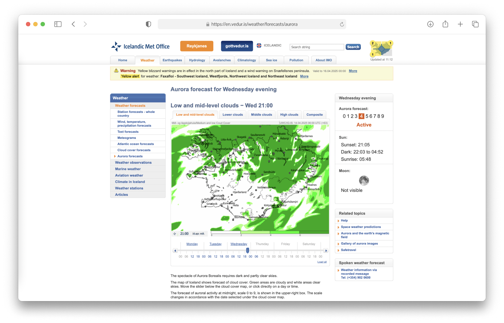

<!---->

要準備出發到冰島旅遊的人，尤其是自由行、甚至是自駕遊，八九成都是相當有經驗的旅人了。正當你照著[行李清單](https://exittaiwan.gumroad.com/l/packing-list)，很有自信的像上次出國自由行那樣打包著行李時，我們必須要來潑你一下冷水了！

到冰島旅遊和去其他國家旅遊事前要準備的東西可不太一樣，在這篇文章我們分成了「衣物類」、「備品類」、「證件類」、以及最重要、可能會提高你遇到極光機率的「極光組合包」。

## 冰島自駕遊｜行前準備：衣物類

由於冰島距離台灣遙遠，所以很多台灣旅客對冰島的印象就是純粹的「很冷」、「很遠」。其實這樣想也沒有錯，問題在於，冰島的強風會讓人感覺隨時都行走在颱風的暴風圈，所以冷度也超過一般人的想像。

你曾經看到別人分享的冰島美照，天氣看起來都很好，天空晴朗、豔陽高照、不然就是白雪靄靄、心曠神怡。當然啊！因為冰島天氣差的時候，根本沒有人會想要拍照！要嘛是風大到手機或相機根本拿不穩、或是快被吹走、要嘛是氣溫冷到手套都不想脫、甚至不想離開室內⋯⋯。

冰島的天氣變化非常快速又劇烈，這是所有沒到過冰島的人沒有辦法想像的，因為這個緣故，建議來冰島的旅客一定要有以下衣物的準備：

- 防水防風的外套、長褲
- 防水的手套、鞋（靴）子
- 厚長襪
- 泳衣泳褲

要是你很確定你來冰島完全沒有要去其中一個溫泉，那麼泳衣泳褲可以免了，不過我們的讀者都很聰明，應該沒有人會來到冰島還不去泡個溫泉。

你可能在想可不可以帶雨傘就好？答案是不行！原因很簡單：**冰島的強風會讓你的雨傘瞬間沒用。**

此外，防水防風的全身配備除了讓你在狂風暴雨中存活下來，也是讓你[參加冰川健行的時候](https://affiliate.klook.com/redirect?aid=41451&aff_adid=1007721&k_site=https%3A%2F%2Fwww.klook.com%2Factivity%2F117124-blue-ice-cave-and-glacier-hiking-tour-from-skaftafell%2F%3Fspm%3DSearchResult.SearchSuggest_LIST%26clickId%3D9b0fa81895)，或是去瀑布遊玩，想要體驗步行穿過瀑布的時候可以乾的出來。

## 冰島自駕遊｜行前準備：備品類

雪地的紅外線常常被我們忽略。就算看起來太陽不是照的很烈，因為雪地純白的反射面，還是很容易對我們的眼睛和肌膚造成傷害。因此，太陽眼鏡和防曬乳的組合是百分之百在冰島會派得上用場的。

另一項可能會令你感到意外的備品是「**保冷袋**」。

只要出了首都雷克雅維克，不說在半路上遇到超市的機會、連要找到一間餐廳都不容易。這也是為什麼大部分來到冰島自駕的遊客都是離開雷克雅維克之前就先在超市採買好許多生鮮食物，至少夠所有人吃上兩到三天。基於這個原因，建議大家一定要帶可以摺疊的、容量又夠大的保冷袋來裝需要保冰的食材。

## 冰島自駕遊｜行前準備：證件類

也許你曾經看過別人的分享，建議你出國前要到銀行開通信用卡刷卡時的「交易四碼」。你聽了聽沒有當一回事，而你出國了好幾次也沒有遇上刷不了卡的窘境⋯⋯。

如果你抱持著同樣的心態來到冰島自駕遊，那你會碰上很大的麻煩。因為冰島的加油站都是自助式加油，完全不會有員工在場。在冰島自助式加油要刷卡時，都會需要輸入你的信用卡交易四碼。所以，千千萬萬一定要在出發前到銀行開通至少一張信用卡的「交易四碼」，除非你想在冰島體驗人生第一次的推車。

都已經來自駕了，你的「[國際駕照](https://docs.exittaiwan.com/%E5%A5%BD%E7%94%A8%E8%B3%87%E6%BA%90/%E5%B8%B8%E7%94%A8%E6%96%87%E4%BB%B6%E8%AD%89%E4%BB%B6%E7%94%B3%E8%AB%8B%E6%95%99%E5%AD%B8/%E7%94%B3%E8%AB%8B%E5%9C%8B%E9%9A%9B%E9%A7%95%E7%85%A7)」當然一定要帶著。也別忘了，台灣的「駕照正本」也要帶著一同使用喔！

## 冰島自駕遊｜行前準備：極光組合包

來到冰島自駕遊，其中一個目標肯定是追極光吧！

追極光之前，先確定上路駕駛的安全。因為冰島天氣變化又大又快，獲取即時路況是在冰島自駕非常重要的一環。最推薦的工具除了有冰島交通部網站  [The Traffic](https://umferdin.is/en) 之外，手機[下載 Safe Travel 的應用程式](https://safetravel.is/safetravel-app/)也可以更方便隨時查詢。

在行車安全的前提下，就可以找一天天氣晴朗、極光指數高的日子賞極光囉！

我們最推薦的網站是冰島氣象局網站 Icelandic Met Office 的[極光預測頁面](https://en.vedur.is/weather/forecasts/aurora)。

根據上圖，你可以這樣增加觀賞極光的機率：

- 綠色的區域代表有雲，白色的區域代表天空晴朗，所以要往白色的區域去！
- 右側數值由 0 到 9 的極光指數，數字越高，極光出現的機率越高！
- 滑動下方時間滑標，看看哪一天的哪個時間、在哪個地點最容易看到極光！

以上就是我們根據自身經驗，特別針對冰島自駕遊所撰寫的冰島自駕遊行前準備清單。要是你還沒預訂冰島遊的住宿的話，我們推薦給你口袋名單：
- [冰島賞極光最強飯店｜呂福恩斯自然公園度假屋 Hrifunes Nature Park](/posts/冰島住宿-hrifunes-nature-park/)
- [Sif Apartments｜評價極高、冰島雷克雅維克極簡奢華的公寓式飯店](/posts/冰島住宿-sif-apartments/)