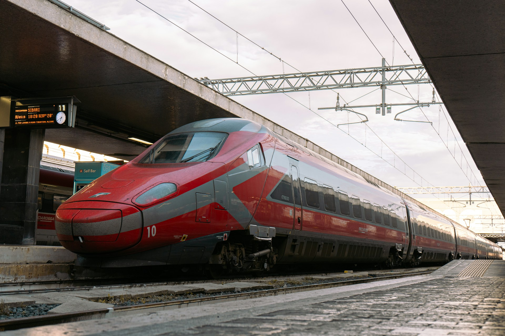
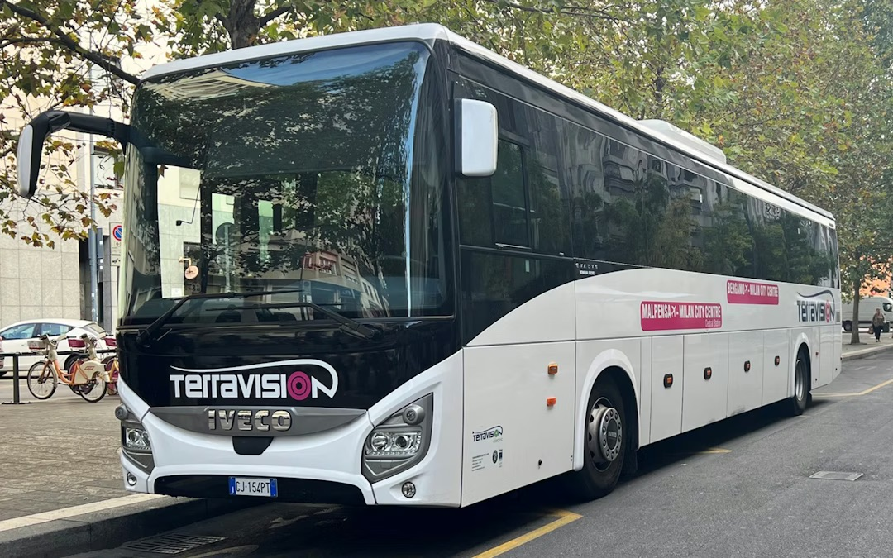

羅馬有兩個國際機場：[菲烏米奇諾李奧納多達文西機場](https://www.adr.it/web/aeroporti-di-roma-en/)（義大利文：Aeroporto di
Roma Fiumicino，機場代號 FCO）和[錢皮諾機場](https://www.adr.it/web/aeroporti-di-roma-en/pax-cia-ciampino)（義大利文：Aeroporto di Roma - Ciampino，機場代號 CIA）。

錢皮諾機場是羅馬的第二機場，主要提供給少數供廉價航空航班使用，像是 Ryanair 和 Wizz Air，以歐洲境內航線為主。 如果你是從亞洲出發、或搭乘一般的航空公司（如長榮、國泰、阿聯酋、漢莎等）、甚至是 Ryanair 大部分的歐洲航線飛羅馬，幾乎可以確定降落的是 FCO；CIA 主要是在歐洲境內轉機、或特定幾座歐洲城市出發的航班才會用到，所以這篇文章就以 FCO 為主囉。

## 羅馬機場（FCO）到羅馬市區交通方式比較表格

| 交通方式                  | 價格   | 車程                            | 班次           | 優點            | 缺點                                        | 英文購票連結                                       | 中文購票連結                                                                                                                                                                                                        |
| --------------------- | ---- | ----------------------------- | ------------ | ------------- | ----------------------------------------- | -------------------------------------------- | ------------------------------------------------------------------------------------------------------------------------------------------------------------------------------------------------------------- |
| Leonardo Express 火車快線 | €15  | 32 分鐘                         | 每 15–20 分鐘一班 | 不須轉乘、最快、準時不塞車 | 票價偏高、旺季可能需排隊買票                            | [點我前往](https://www.trenitalia.com/en.html)   | [點我前往](https://affiliate.klook.com/redirect?aid=41451&aff_adid=1250205&k_site=https%3A%2F%2Fwww.klook.com%2Fzh-TW%2Factivity%2F138399-leonardo-express-direct-train-from-city-center-to-fiumicino-airport%2F) |
| 火車區間車            | €8   | 27–31 分鐘（轉乘至 Termini 共約 1 小時） | 每 15–20 分鐘一班 | 票價實惠、不塞車      | 不直達 Termini，住 Trastevere / Ostiense 附近才適合 | [點我前往](https://www.trenitalia.com/en.html)   | -                                                                                                                                                                                                             |
| 直達巴士                  | €4–7 | 45 分鐘起（塞車機率高）                 | 每 15–40 分鐘一班 | 最便宜、不須轉乘      | 容易塞車、搭車時間長                                | [點我前往](https://book.terravision.eu/book-now) | [點我前往](https://affiliate.klook.com/redirect?aid=41451&aff_adid=1250205&k_site=https%3A%2F%2Fwww.klook.com%2Fzh-TW%2Factivity%2F17022-shared-fiumicino-airport-transfers-rome%2F)                              |

## Leonardo Express 火車機場快線



Leonardo Express 是 Trenitalia 義大利國鐵旗下的機場直達快線，專為往返 FCO 機場與羅馬市區的旅客設計。全程不停靠任何中間站，從機場直達羅馬最重要的交通樞紐 Termini 中央車站，下車後可以立刻轉乘地鐵 A 線或 B 線前往各個住宿地點。

車票可以在 Termini 車站月台旁的自動售票機購買、在機場入境大廳的售票櫃台購買，或事先在 [Trenitalia 官網（英文）](https://www.trenitalia.com/en.html)或是 [Klook（中文）](https://affiliate.klook.com/redirect?aid=41451&aff_adid=1250205&k_site=https%3A%2F%2Fwww.klook.com%2Fzh-TW%2Factivity%2F138399-leonardo-express-direct-train-from-city-center-to-fiumicino-airport%2F)線上購票。上車後行李放置在上方行李架或車廂兩端的行李區都可以。

- 價格：€15
- 車程：32 分鐘
- 班次：約每 15 ~ 20 分鐘一班
- 優點：不須轉乘、速度最快、準時不塞車
- 缺點：旺季時可能需排隊買票、票價偏高

||從羅馬 Termini 中央車站發車|從羅馬 FCO 機場發車|
|---|---|---|
|第一班車|05:20|06:08|
|早上發車時間|05:35, 05:50, 06:05, 06:20, 06:35, 06:50, 07:05, 07:35, 07:50, 08:05, 08:20, 08:35, 08:50, 09:05, 09:20, 09:35, 10:20, 10:35, 10:50, 11:05, 11:20, 11:35|06:23, 06:38, 06:53, 07:08, 07:23, 07:38, 07:53, 08:23, 08:38, 08:53, 09:08, 09:23, 09:38, 09:53, 10:08, 10:23, 10:38, 11:08, 11:23, 11:38, 11:53|
|下午發車時間|12:05, 12:20, 12:35, 12:50, 13:05, 13:20, 13:50, 14:05, 14:20, 14:35, 14:50, 15:05, 15:20, 15:35, 15:50, 16:05, 16:20, 16:35, 16:50, 17:05, 17:20, 17:35, 17:50|12:08, 12:23, 12:38, 12:53, 13:08, 13:23, 13:38, 14:08, 14:23, 14:38, 14:53, 15:08, 15:23, 15:38, 15:53, 16:08, 16:23, 16:38, 16:53, 17:08, 17:23, 17:38, 17:53|
|晚上發車時間|18:05, 18:20, 18:35, 18:50, 19:05, 19:20, 19:35, 19:50, 20:05, 20:20, 20:35, 20:50, 21:05, 21:20, 21:35, 21:50, 22:05, 22:20|18:08, 18:23, 18:38, 18:53, 19:08, 19:23, 19:38, 20:08, 20:23, 20:38, 20:53, 21:08, 21:23, 21:38, 21:53, 22:08, 22:23, 22:38, 22:53, 23:08|
|末班車|22:35|23:23|

從羅馬 Termini 中央車站到羅馬 FCO 機場，第一班車為 5:35 分發車，最後一班 22:35 發車。
從羅馬 FCO 機場到羅馬 Termini 中央車站，第一班車為 6:23，最後一班 23:23 發車。

## 火車區間車

FL1 是義大利國鐵的通勤區間列車，是 Leonardo Express 之外另一個從機場搭火車進城的選擇，票價相對便宜，但終點站不是 Termini 中央車站，而是停靠羅馬市區南部的 Trastevere（音譯：特拉斯提弗列）和 Ostiense（音譯：奧斯蒂恩塞）兩個站。

如果你的住宿就在這兩個區域附近，FL1 是 CP 值最高的選擇：省錢、不塞車、不用轉乘。但如果需要前往 Termini，就得在 Trastevere 或 Ostiense 轉乘其他列車，整體時間約一小時。

- 價格：€8
- 車程：27 分鐘｜31 分鐘（到羅馬 Termini 中央車站需轉乘，共一小時）
- 班次：約每 15 ~ 20 分鐘一班，可[在義大利國鐵官網查詢](https://www.trenitalia.com/en.html)，輸入起迄站機場：Fiumicino Aeroporto；市區的站分別為 Roma Trastevere 和 Roma Ostiense。
- 優點：不須轉乘、不塞車
- 缺點：最適合住在 Trastevere（附近）或 Ostiense（附近）區域的旅客，如果要到 Termini 中央車站，就要轉車

## 直達羅馬火車站機場巴士

直達巴士是三種交通方式裡票價最低的選項，有多家業者在 FCO 機場第三航廈（T3）出境層外面設有站牌，主要業者包括 SIT Bus Shuttle（[官網英文購票](https://www.sitbusshuttle.com/en/)｜[Klook 中文購票](https://affiliate.klook.com/redirect?aid=41451&aff_adid=1250207&k_site=https%3A%2F%2Fwww.klook.com%2Fzh-TW%2Factivity%2F16086-shared-fiumicino-airport-transfers-rome%2F)）、Terravision（[官網英文購票](https://book.terravision.eu/book-now)｜[Klook 中文購票](https://affiliate.klook.com/redirect?aid=41451&aff_adid=1250205&k_site=https%3A%2F%2Fwww.klook.com%2Fzh-TW%2Factivity%2F17022-shared-fiumicino-airport-transfers-rome%2F)）等，都直達 Termini 中央車站；其中 SIT Bus Shuttle 還有加停[梵蒂岡](/country/梵蒂岡/)附近，如果住在梵蒂岡一帶可以特別留意。

票可以在各業者的官網事先購買，也可以在機場候車時向穿橘色背心的工作人員現場購票。由於各家業者的票互不通用，抵達後建議先確認自己是哪一家的站牌再排隊，不然現場可能會有點混亂。需要注意的是，巴士行駛在一般公路上，若遇上羅馬市區的交通壅塞，實際車程可能比預期的 45 分鐘還長。

- 價格：最低 €4，最高 €7
- 車程：45 分鐘（塞車機率高）
- 班次：每 15 ~ 40 分鐘一班
- 優點：最便宜、不須轉乘、不塞車
- 缺點：容易塞車、搭車時間長

> **推薦文章：**
>
> ✔️ [出國要帶什麼？出國自由行行李清單](/posts/出國行李打包/)
>
> ✔️ [歐洲行前準備｜歐洲自由行前你必須知道的事](/posts/歐洲自由行前準備/)
>
> ✔️ [保證省下 300 歐｜歐洲食衣住行樂全方位教學，馬上壓低歐洲自由行花費！](/posts/歐洲自由行花費省錢攻略/)
>
> ✔️ [梵蒂岡博物館購票攻略｜去梵蒂岡博物館，沒提前買票？那你可能白跑一趟](/posts/梵蒂岡博物館購票攻略/)
]