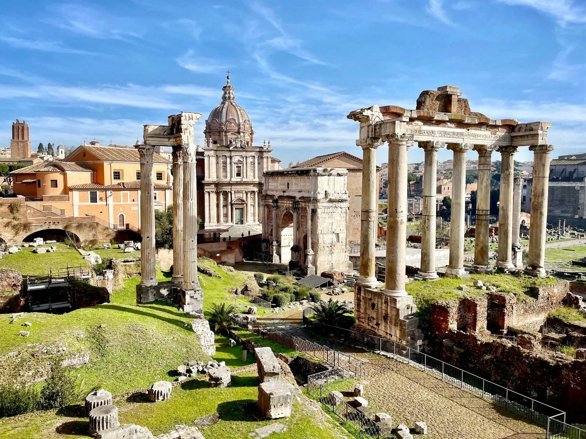
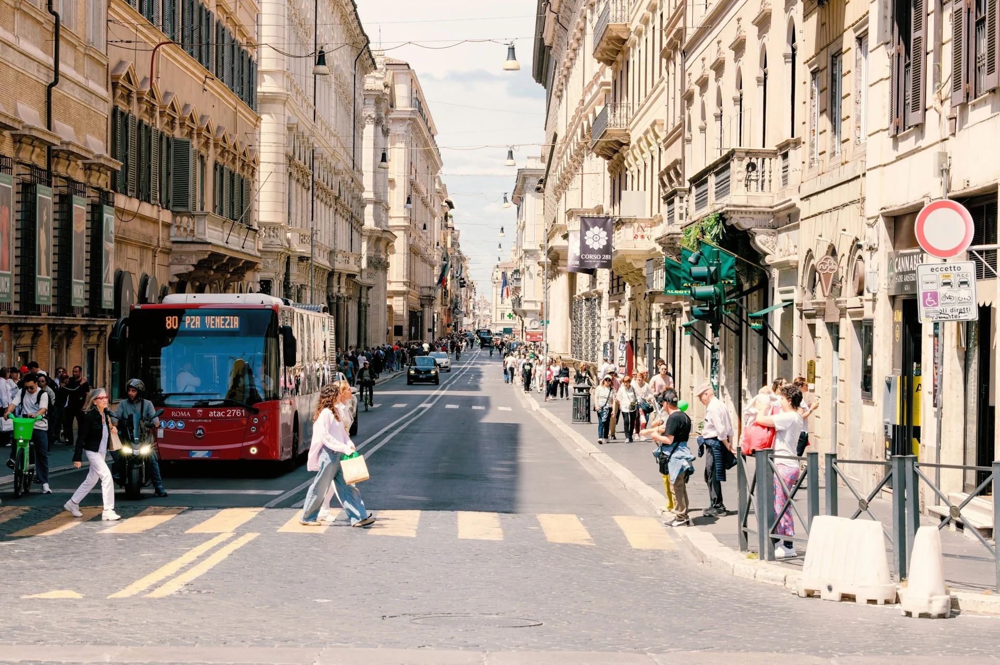
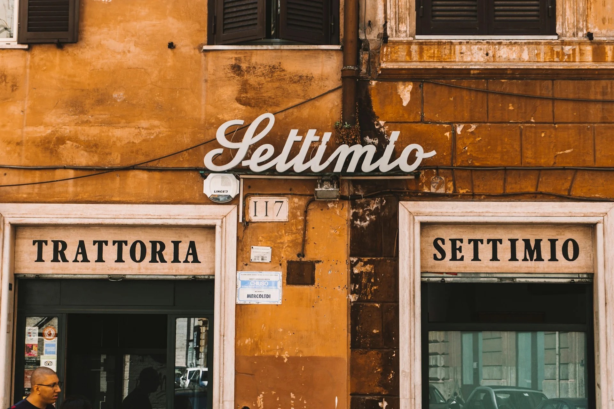

[羅馬](/city/羅馬/)作為義大利的首都，擁有豐富的歷史資源和遺跡，是許多旅客來到歐洲自由行必遊城市之一。不過因為大量的觀光客湧入，羅馬早就已經被擠得水泄不通，所以來到羅馬前最好先做好各種[心理和行前準備](/posts/歐洲自由行前準備/)，確保你在羅馬的每一天都玩的暢快。



我是一個假裝身在羅馬的警告牌。 
慎防扒手，注意隨身貴重物品。



## 提前，提前，再提前

### 住在哪，決定了你的整趟旅遊體驗
如果你是喜歡很隨性安排旅遊的旅人，抱歉了。這趟羅馬自由行將會讓你的錢包大失血！來羅馬要便宜一點玩，一定要提前做安排。羅馬的住宿非常熱門，方便旅遊的地區的住宿地點，出門前幾天才訂的話價格會飆很高，尤其是在旅遊旺季期間（大約 4 月到 10 月）。而住在羅馬的哪一區，很大的決定了你在羅馬的旅遊體驗。如果住的地點離景點太遠，每天光是在交通上就會耗掉大量時間和體力。建議在看機票的時候，住宿就要同步開始安排。

<!-- （link to 羅馬住宿地區介紹）（Termini 是中央車站、） -->

### 求你了，景點提前訂票

羅馬競技場、[梵蒂岡博物館（包含西斯汀禮拜堂）](/posts/梵蒂岡博物館購票攻略/)等等⋯⋯這些熱門景點的現場票，在旺季幾乎就是「要嘛賣完、要嘛排兩到四小時」的兩種結局。

提前在官網購票，不只是省去排隊的時間，更是確保你當天真的進得去。大部分熱門景點都有指定入場時段，記得在預約時段前多留一些交通緩衝時間，否則遲到了就算有票也可能被拒於門外。

---

## 行動靠 11 號公車（雙腿）

羅馬的交通不怎麼可靠。公車、街道車不可靠，幾乎隨時隨地都在大塞車，都不會準點、甚至有時不來。主要靠地鐵（但是地鐵沒有電梯，很多出口連手扶梯都沒有，只能走樓梯）。羅馬的路很多都崎嶇不平、也有很多大家刻板印象中的歐洲石子路，拖行李箱非常不方便。

不過還是要買交通票搭地鐵。如果在羅馬待三天以上，七天以下的話，可以在車站的售票機購買實體的週票（週票只能現場購票）。

羅馬的地鐵站不多，而且很多景點和景點之間的距離，意外地比地圖上看起來還要遠。下了地鐵之後，基本上還是靠步行移動。旅遊旺季一天走個一到兩萬步是正常的事，行前就要做好心理和體力準備，行李也要打包得越輕越好。

當天若有需要在特定時間入場的景點，記得多留至少 20 到 30 分鐘的交通緩衝。



我是一個假裝身在羅馬的警告牌。 
慎防扒手，注意隨身貴重物品。



---

## 吃飯皇帝大

### 咖啡廳的兩種價格

在義大利，很多咖啡廳有「站著喝」和「坐著喝」兩種定價，有時差距高達一倍以上。如果只是喝杯咖啡、吃個甜點，站在吧台旁跟著當地人一起喝，在[歐洲旅遊也能省錢](/posts/歐洲自由行花費省錢攻略/)又道地。

### 熱門餐廳，開門就去

羅馬的熱門餐廳一到用餐時段很快就坐滿，有時排隊等一個多小時也不誇張。如果有特別想去的餐廳，**開門第一時間抵達**，通常就可以省去大半等待時間。

### 善用 TheFork 訂位，省時又省錢

[TheFork](/posts/thefork/) 是歐洲非常主流的餐廳訂位 App，羅馬許多餐廳提供 TheFork 專屬折扣，優惠時段最高可達五折。別忘了在首次預約時，在「Promo code」輸入 ExitTaiwan 出台灣獨家優惠碼：**85322C4C**，獲得 1000 Yums（等同 20 歐元，三天後入 TheFork 帳號）！

使用方式很簡單：[下載 TheFork App](https://tfk.io/1li3cl75)、搜尋羅馬的餐廳、選擇有折扣的時段訂位，不需要事先付款，取消也免費。如果你有幾間特別想吃的餐廳，出發前先查一下它們有沒有在 TheFork 上面，有的話就先訂好，這樣不用排隊，還有機會比現場便宜很多。



我是一個假裝身在羅馬的警告牌。 
慎防扒手，注意隨身貴重物品。



> **推薦文章：**
>
> ✔️ [出國要帶什麼？出國自由行行李清單](/posts/出國行李打包/)
>
> ✔️ [歐洲行前準備｜歐洲自由行前你必須知道的事](/posts/歐洲自由行前準備/)
>
> ✔️ [羅馬機場到市區交通全攻略｜三種從羅馬機場到市中心的方法](/posts/羅馬機場到市區交通全攻略/)
>
> ✔️ [保證省下 300 歐｜歐洲食衣住行樂全方位教學，馬上壓低歐洲自由行花費！](/posts/歐洲自由行花費省錢攻略/)
>
> ✔️ [梵蒂岡博物館購票攻略｜去梵蒂岡博物館，沒提前買票？那你可能白跑一趟](/posts/梵蒂岡博物館購票攻略/)
]