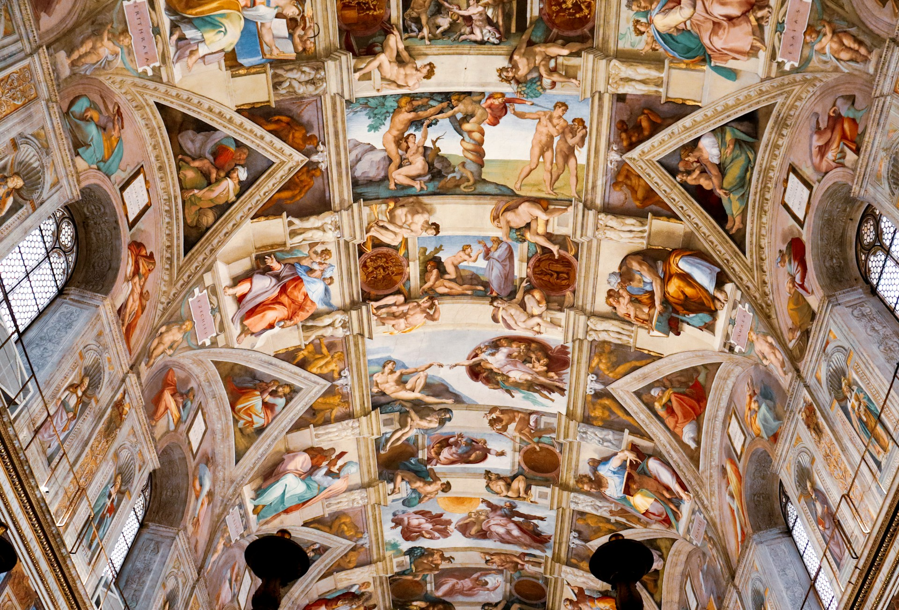
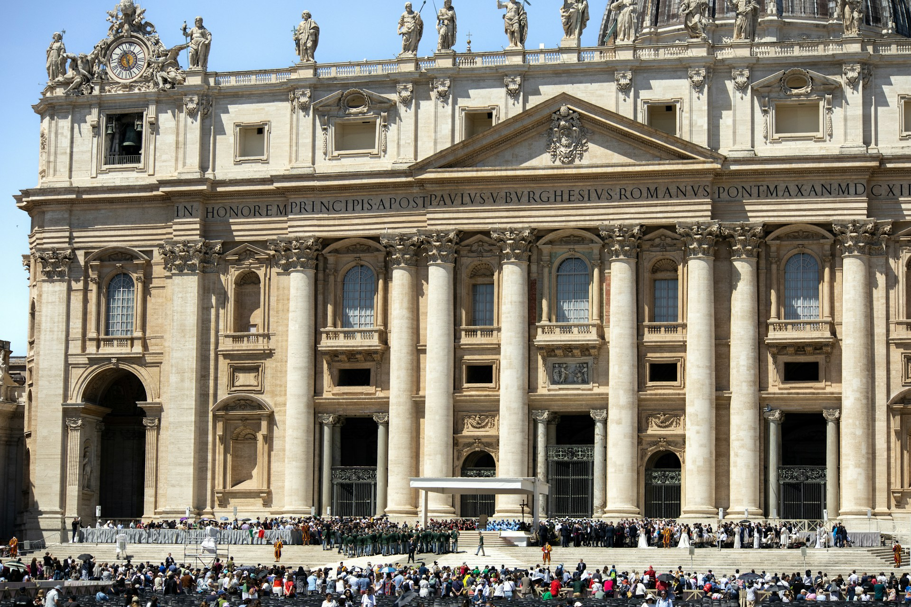
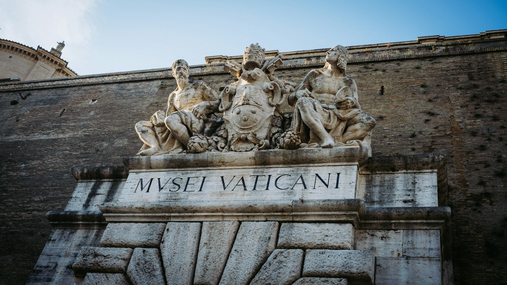
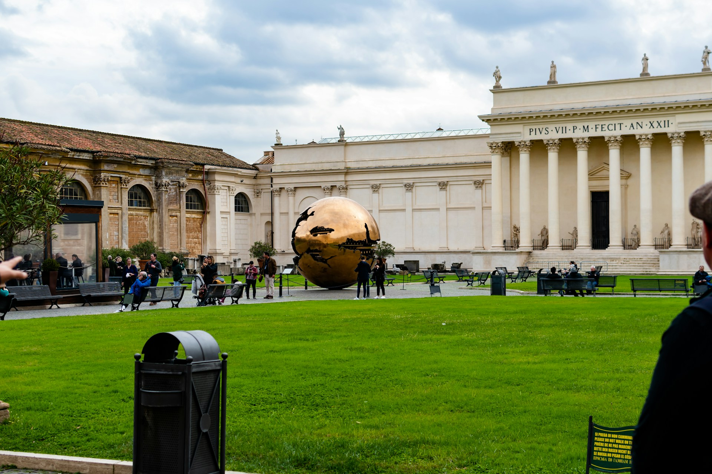
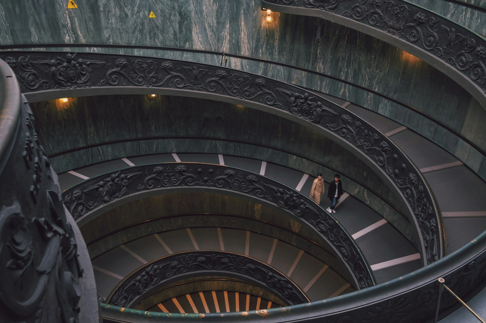

早上九點剛從飯店出發，你步行穿過羅馬的石板路，滿心期待終於要親眼看到西斯汀禮拜堂（Sistine Chapel）天花板，有[《創世紀》](https://zh.wikipedia.org/zh-tw/%E5%88%9B%E4%B8%96%E7%BA%AA_(%E5%A3%81%E7%94%BB))（義大利語：Volta della Cappella Sistina）的天頂畫。

走到博物館附近，你看到了一條隊伍。

這條隊伍從大門一路延伸到轉角、完全看不到盡頭、讓你下意識掏出手機想確認自己是不是走錯地方的隊伍。

你沒走錯地方，這是每天在梵蒂岡博物館門口上演的日常。

## 排隊有多慘，很少人跟你說清楚

梵蒂岡博物館是全球參觀人數最多的博物館之一，每年超過 600 萬人次。數字冷冰冰的，但當你站在購票隊伍裡的時候，你感受到的就是**時間在流失，腳在發痠，羅馬七月的太陽在頭頂烤。**我是誰？我在哪？我到底在幹嘛？

幾個來到梵蒂岡自由行旅客需要知道的現實：

- **等待時間：** 旺季（3 月中到 10 月）現場排隊，平均等候 2 到 4 小時。遇到假日或特殊活動，可能更長。
- **沒有遮蔽：** 博物館外牆是一條幾乎沒有樹蔭的石牆街道。七、八月的羅馬氣溫常超過 35°C，整段排隊過程幾乎在大太陽下進行。
- **排進去體力已耗半：** 博物館內的參觀路線長達約 7 公里，館藏超過 7 萬件。在外面曬了兩個小時的太陽才進門，你還有多少餘力細細看畫？
- **最殘忍的狀況：** 有時候你排了兩個小時，才被告知當天的現場票已售完。轉身離開，什麼都沒看到。

這不是在嚇你，而是羅馬旅遊的日常，還是提早買好票吧！

## 提前買票，花不了你十分鐘

和排隊的痛苦相比，線上購票簡直是微不足道的小事。

**官方購票網站：** [https://www.museivaticani.va](https://www.museivaticani.va)

購買流程：選日期 → 選票種 → 填資料 → 付款 → 收到確認信。全程約 10 分鐘。

2026 年官方基本入場票的價格為 20 歐元（孩童及學生票為 10 歐元）。

持有預約票券的旅客，可以走「快速通道」直接入場，完全繞過現場排隊的人龍。你看著那條長龍，大步走進去，優越感都上來了。

**幾個購票提醒：**

- **提前多久買？** 旺季至少提前 2 到 4 週，熱門日期（週末、四月初復活節前後）可能更早售罄。淡季（11 月到 3 月）相對寬鬆，但提前至少 1 週仍是保險作法。
- **票種選擇**：基本入場票（含導覽手冊）、語音導覽加購、或小團體導覽票（約 2 小時，有專人帶領）。如果是第一次來、對文藝復興藝術不熟悉，導覽票會讓你有種從「看熱鬧」變成「看門道」的感覺。
- **可以的話，只買官網票**：盡量避免第三方平台的額外手續費，也避免買到非正式的票券。

## 梵蒂岡博物館其他購票管道

如果真的買不到[官網票](https://www.museivaticani.va)，那最熱門也安全的選項大概就是 Klook 和 Get Your Guide 平台了。不過從下面的比較表可以看出來，這兩個平台的價格都是原價的翻倍。所以能訂到官網票還是最理想的。

| 購票管道           | 票種         | 價格       | 購票連結                                                                                                                                                                                |
| -------------- | ---------- | -------- | ----------------------------------------------------------------------------------------------------------------------------------------------------------------------------------- |
| 官網             | 基本（不含語音導覽） | 20 歐元    | [點我前往](https://www.museivaticani.va)                                                                                                                                                |
| Klook          | 基本（不含語音導覽） | 1500 台幣起 | [點我前往](https://affiliate.klook.com/redirect?aid=41451&aff_adid=1248850&k_site=https%3A%2F%2Fwww.klook.com%2Fzh-TW%2Factivity%2F19636-vatican-museums-sistine-chapel-ticket-rome%2F) |
| Get Your Guide | 基本（不含語音導覽） | 33 歐元起   | [點我前往](https://www.getyourguide.com/zh-tw/rome-l33/skip-the-line-vatican-museums-sistine-chapel-ticket-t62214/?ranking_uuid=79f397a3-ccab-43bd-8ece-c28aab3f528d)                   |

## 沒買到票的人，排隊隊伍又很長，就老實放棄吧

如果你是屬於旅行安排比較隨性的人，想要去梵蒂岡博物館看看，但是沒有提前買到票，到了現場也發現排隊排很長，那這次就老實的放棄，當作留個遺憾下次再來一次吧！

注意，千萬不要和來路不行的人購票！在梵蒂岡博物館外圍，排隊的尾端，常常會有掛著名牌、甚至別著徽章的人假裝自己是官方的售票人員，告訴你這個隊伍還要排好幾個小時，他們的購票辦公室就在路口轉角斜對面，跟著他們去買票吧。

千萬，千萬，千萬不要耳根子軟就跟過去囉！除了一定買的更貴的票之外，其實是根本不確定到底是不是可以入場的正式票券，甚至還有其他安全上的疑慮。

## 忠言逆耳

在歐洲大部分的熱門景點都一樣，如果[需要門票入場，最好就是提前買好](/posts/歐洲自由行前準備/)，不然要馬花好幾個小時排隊，要馬就是根本進不去。

歐洲假期的時間太寶貴了。別讓一件可以提前十分鐘處理好的事，毀掉你大半天的行程。

官方購票連結：[https://www.museivaticani.va](https://www.museivaticani.va)

> **推薦文章：**
>
> ✔️ [出國要帶什麼？出國自由行行李清單](/posts/出國行李打包/)
>
> ✔️ [歐洲行前準備｜歐洲自由行前你必須知道的事](/posts/歐洲自由行前準備/)
>
> ✔️ [保證省下 300 歐｜歐洲食衣住行樂全方位教學，馬上壓低歐洲自由行花費！](/posts/歐洲自由行花費省錢攻略/)