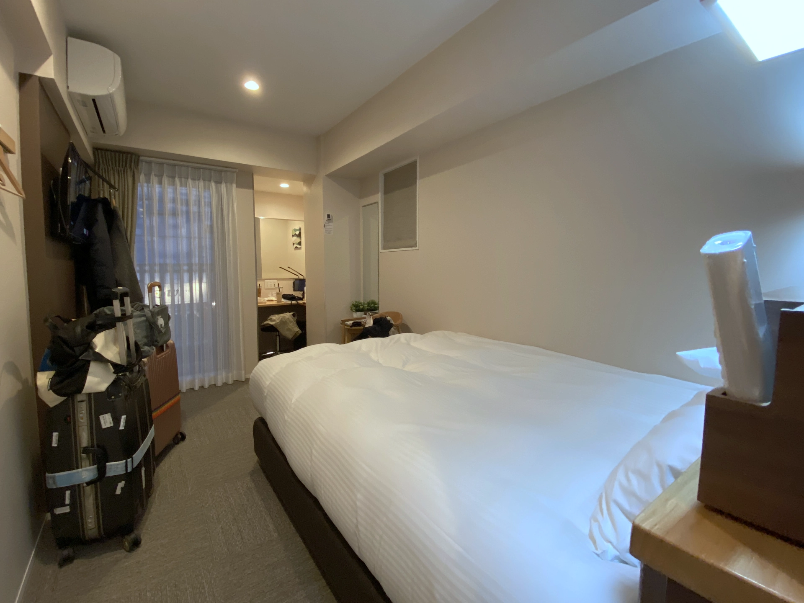

**TokyoNEST Nippori** 位在東京北方的日暮里， JR 山手線上的日暮里車站附近，從[**成田機場到 Skyliner 日暮里站**](https://affiliate.klook.com/redirect?aid=41451&aff_adid=1037290&k_site=https%3A%2F%2Fwww.klook.com%2Fzh-TW%2Factivity%2F1410-skyliner-tokyo%2F%3Fspm%3DActivity.TopNavigation.SelectLanguage%26clickId%3D53551aeb94)只要半個多小時。日暮里車站旁邊有吃的有逛的，要搭乘山手線到東京都也非常方便，到淺草寺和晴天塔也只要搭公車，非常適合台灣旅客來到東京自由行時入住！

## TokyoNEST Nippori 基本資訊

- 地址：6 Chome-55-10 Higashinippori, Arakawa City, Tokyo 116-0014 日本（[Google Maps](https://maps.app.goo.gl/5W2VCXGKrw8Ef4sH7)）
- 交通：地鐵 JR 日暮里站步行三分鐘
- 是否含早餐：無
- 平均雙人房每晚價格：3,000 ~ 5,000（根據季節、房型等變動）
<!--- 查看即時房價：[**點我前往**](https://www.booking.com/hotel/jp/tokyonest-nippori.xt.html?aid=7956794)-->

## 實際入住 TokyoNEST Nippori 體驗

### 入住 Check-in

TokyoNEST Nippori 的地點位置很好找，在日暮里車站的巷子中，鬧中取靜。有不少櫃檯人員會講中文，入住 check-in 時如果拿出台灣護照就會自動切換成中文溝通，很親切。

### 房間 

TokyoNEST Nippori 的房間坪數並不大，但是還是住的蠻舒服的。這次入住的標準雙人房（Standard Double Room），除了雙人床和廁浴之外，有一個小小的化妝台，電視有 Netflix 可以登入帳號觀看。

### 衛浴

一如日本人的衛浴標配，TokyoNEST Nippori 的廁所使用免治馬桶，清潔衛生上也做得非常到位，沒什麼可以挑惕的地方。

## TokyoNEST Nippori 整體評價

### 優點

入住 TokyoNEST Nippori 給人一種安心的感覺。每天走完一整天的行程回房間都是直接睡去，房間可以讓自由行的旅客住的很舒服。服務人員的親切態度、打掃清潔的高標準、便利的地理位置和市區 / 機場交通，都是 TokyoNEST Nippori 加分的地方。

### 缺點

除了前面提到的房間稍微小了一點之外，可能也有人會覺得日暮里距離東京市區還是遠了一點。不過因爲就在 JR 環狀山手線上，又因為 [**Skyliner 機場快線**](https://affiliate.klook.com/redirect?aid=41451&aff_adid=1037290&k_site=https%3A%2F%2Fwww.klook.com%2Fzh-TW%2Factivity%2F1410-skyliner-tokyo%2F%3Fspm%3DActivity.TopNavigation.SelectLanguage%26clickId%3D53551aeb94)所以前往機場很方便，TokyoNEST Nippori 應該是最適合降落後和起飛前的前兩天入住的日本東京住宿了。

### TokyoNEST Nippori 住宿評價

整體來說，**TokyoNEST Nippori** 十分內一定至少有九分！非常推薦給所有即將前往東京自由行的台灣旅客！

