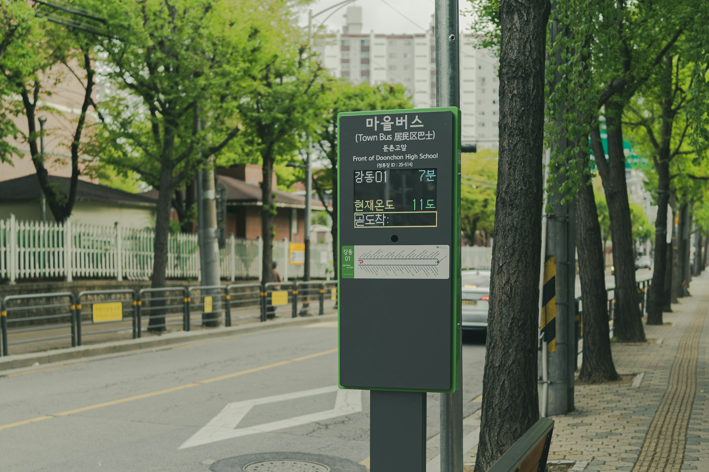
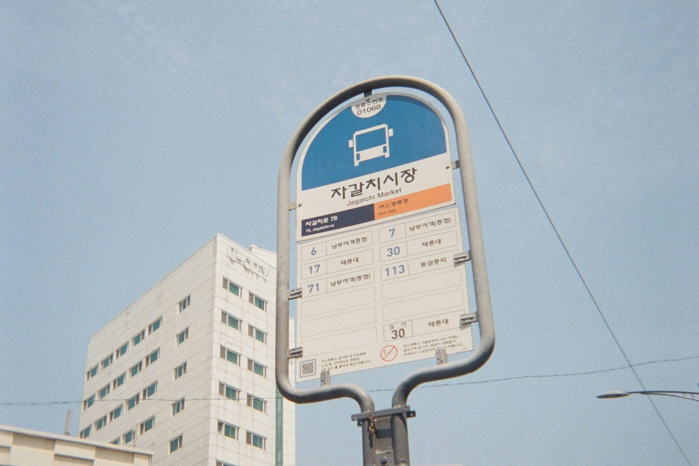


🔥 實用工具：[出國自由行行李清單，行前不再手忙腳亂（免費下載）](https://exittaiwan.gumroad.com/l/packing-list)


韓國的景點非常多，大部分都可以透過大眾交通工具抵達。尤其是在首爾，地鐵四通八達，想去哪裡，就算不會韓文，只有找[有中英韓文對照的首爾地鐵圖](/posts/首爾地鐵圖繁體中文高解析檔下載/)就可以輕鬆找到出發站和目的地站。但是有些比較郊區的點、或是要去機場時一定要搭公車、巴士的時候，要找到正確上車的公車巴士站牌，就不是那麼容易的事情了。

---

##  在韓國找到正確公車站牌的重重關卡

對於不會韓文的台灣人來說，韓國的公車站牌完全沒有中文是旅行、生活時最大的痛點。英文能力好一點的人，可能會直接看站牌的英文名，但是就算這樣做也有幾個問題，可能會導致找不到正確的站牌。

在某些熱鬧的大站，像是弘大、江南、明洞商圈，很多站牌的英文名字是一模一樣的。而就算透過英文名字找到了站牌，你也不太確定到底方向對不對，是不是應該要搭反方向的車才對。

所以，現在我們的解決辦法幾乎就是看站牌上公車、巴士路線的號碼、或是看手機一個個對照站牌上的韓文字，再對照地圖導航上的方向，祈求自己搭上對的車、前往對的方向。

究竟，還有什麼其他不這麼燒腦的辦法，可以確定我們在正確的公車站牌？

---

## 韓國每個站牌的五碼「身分證字號」

很多人不知道的是，在全韓國，每個城市所有的公車站牌都有自己獨特的五碼「身分證字號」。因為他們通常在站牌裡，會有比較小的字體，非常不顯眼，所以大多數人不會注意到。這些字母看起來會像：25-514、02-142，而在地圖應用程式裡可能會省略中間的連字號，變成 25514、02142。

只要你是在同一個城市裡面，不同的站牌五碼幾乎不會重複，就算有重複，也會在數字串的最後面再加上一個英文字母，來幫助乘客辨別。

知道了這個韓國公車站牌的五碼「身分證字號」，找不到站牌的問題就完全解決了，也完全不需要韓文能力。就算在之前提到的，大站的各個站牌有一樣的英文名字的問題，透過這五個號碼來辨別，也不會搞混。又或是在同一站不同方向的站牌，五碼也不會一樣。

---

## 手把手教學：實際在韓國旅行時怎麼做？

所以下次到了韓國，不論是你要搭乘公車在市區間移動，或是最後一天準備從市區搭乘機場巴士前往機場，你只要照著以下步驟，就能輕鬆確定你所在的站牌是正確的站牌，不用提心吊膽地等車了！

1. 打開自己習慣的、[韓國可以用的地圖應用程式](/posts/為什麼-google-maps-在韓國不行用有什麼替代方案/)，確認起迄站位置。
2. 在起站牌的地圖資訊欄中，找到站牌五碼「身分證字號」。小心不要看成公車路線的號碼了！
3. 前往實體站牌，尋找該站牌五碼，安心搭車！