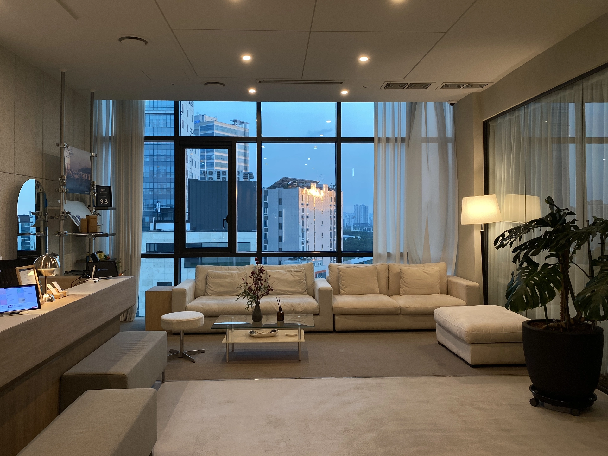
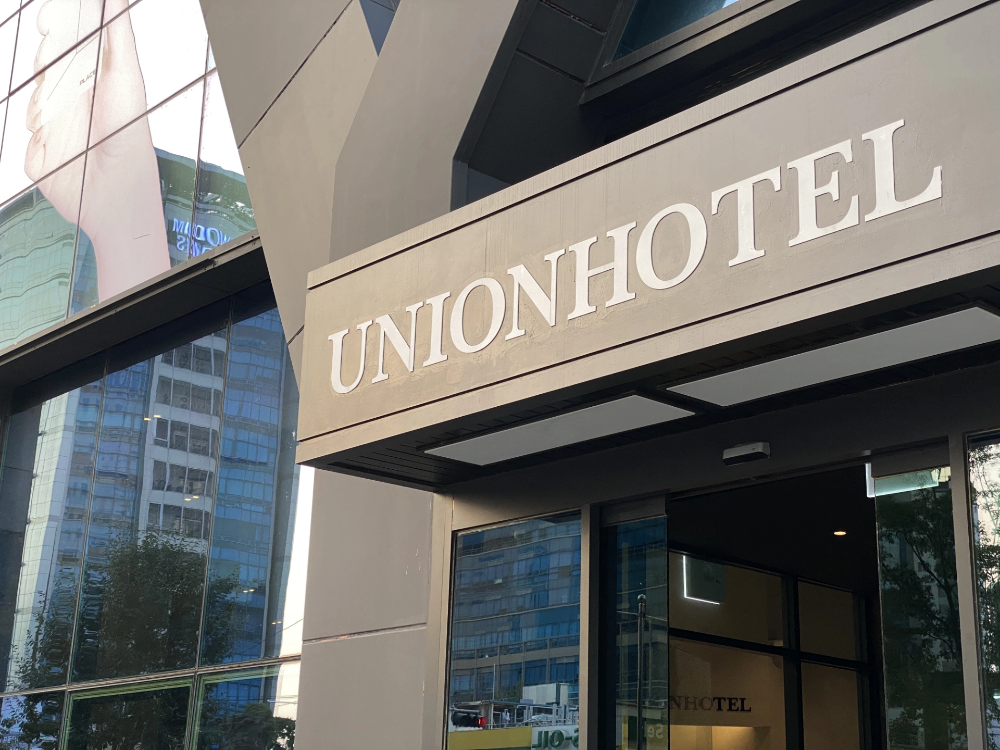
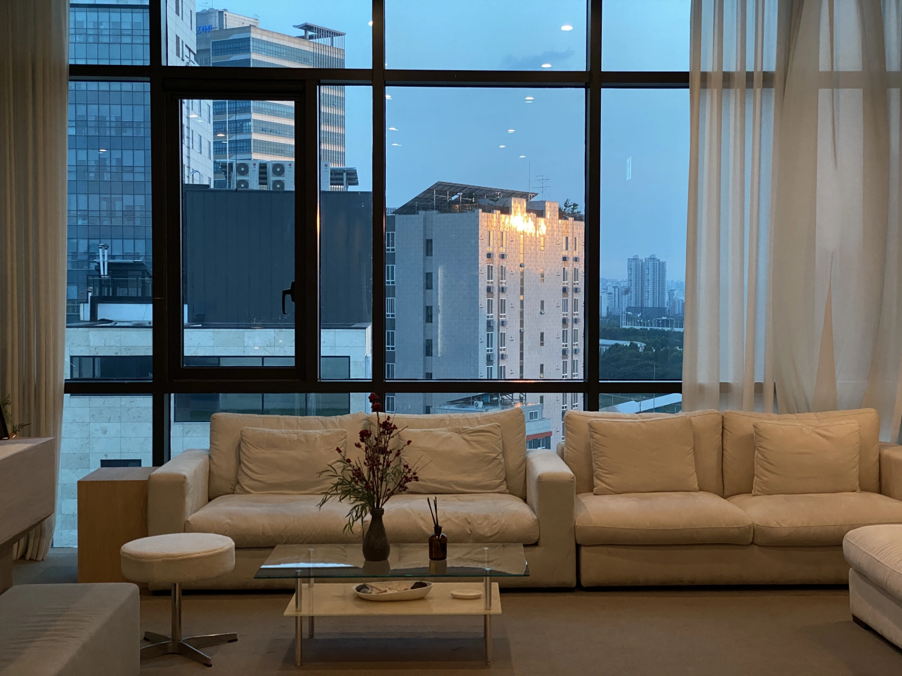
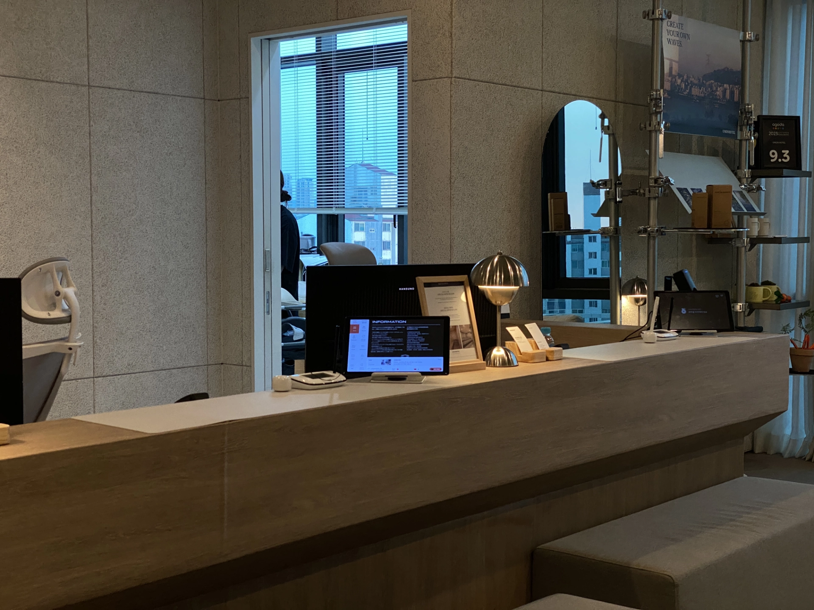
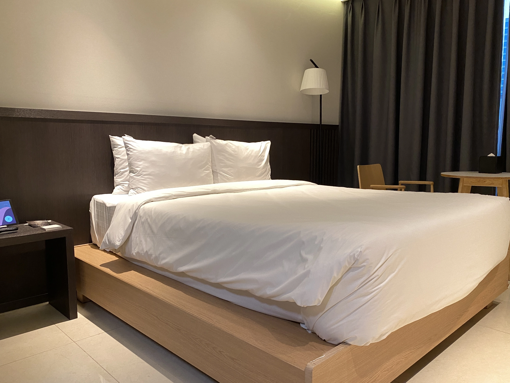
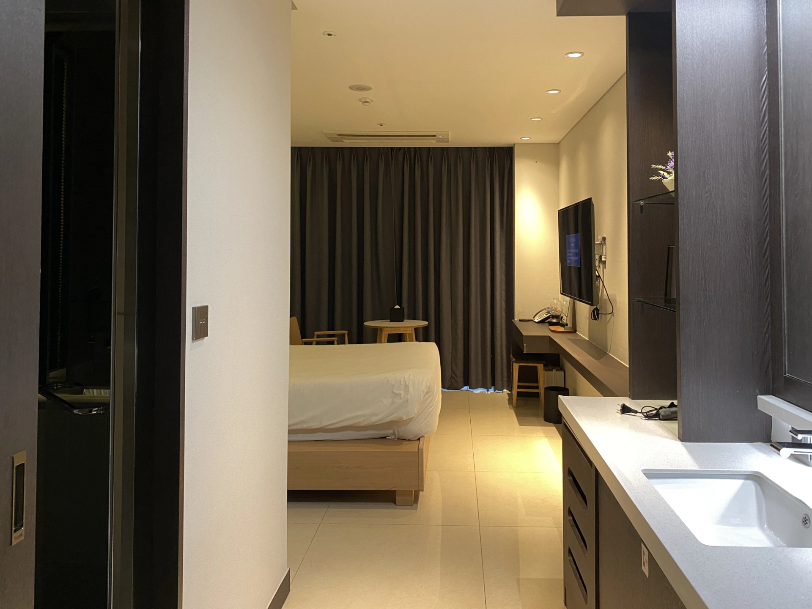
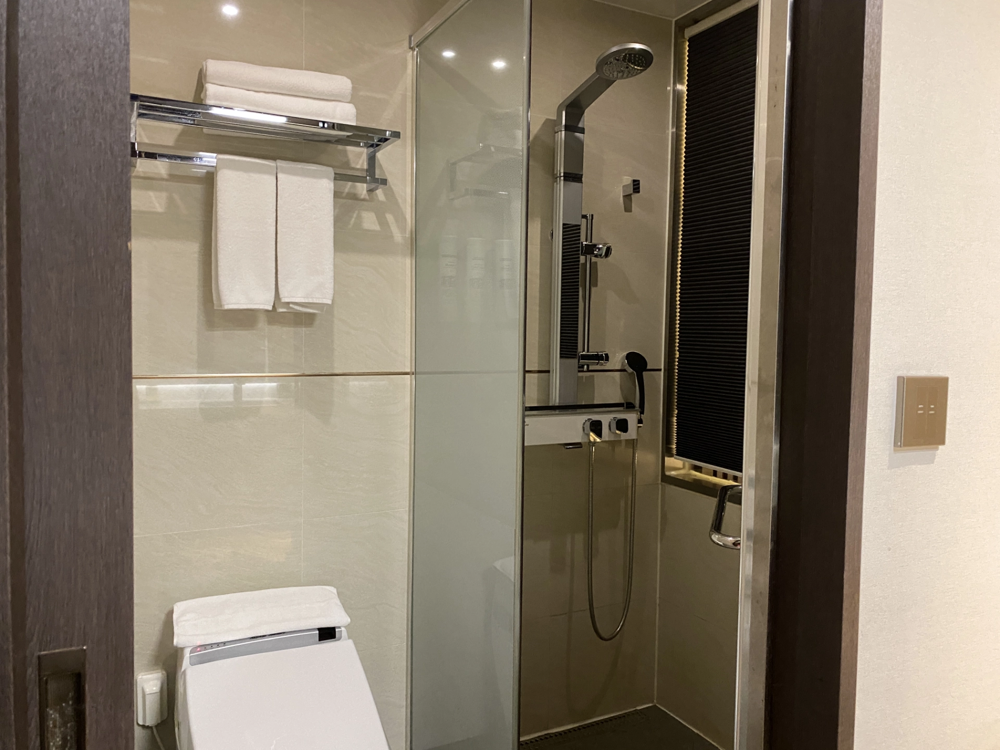
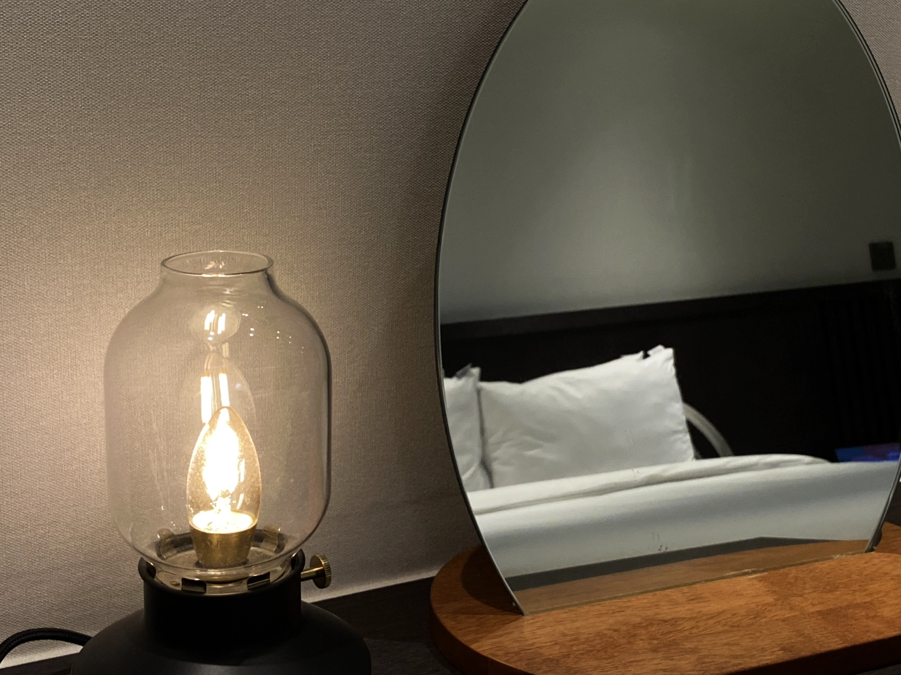
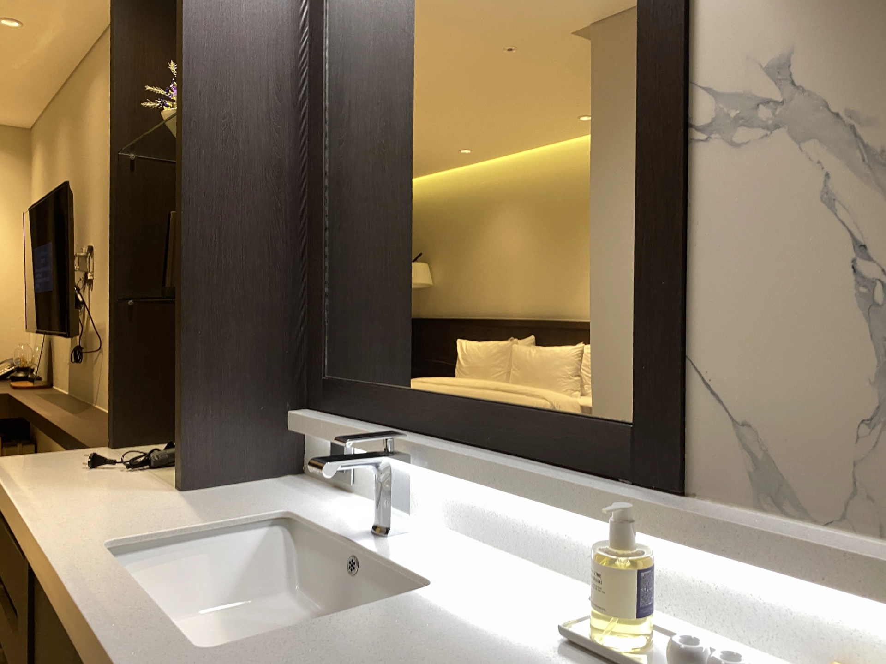
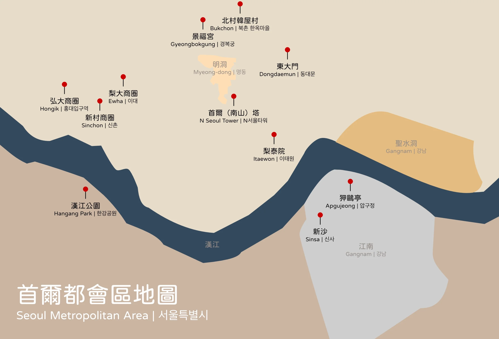

[**Union Hotel**](https://www.booking.com/hotel/kr/union-yeongdeungpo-gu.xt.html?aid=7956794) 是一間位在首爾永登浦區，仙游島公園附近的平價星級飯店。交通方便、環境整潔、服務人員態度親切，都讓這間飯店成為一個台灣人到[首爾自由行的絕佳住宿選擇](/posts/%E5%BC%98%E5%A4%A7%E5%95%86%E5%9C%88%E6%A2%A8%E5%A4%A7%E5%95%86%E5%9C%88%E6%96%B0%E6%9D%91%E5%95%86%E5%9C%88%E9%A3%AF%E5%BA%97%E4%BD%8F%E5%AE%BF%E6%8E%A8%E8%96%A6/)。

## Union Hotel 基本資訊

- 地址：서울 영등포구 양평로 136 유니언호텔（[Naver Map](https://map.naver.com/p/search/Union%20Hotel/place/1604806467?c=17.29,0,0,0,dh&placePath=%3Fentry%253Dbmp)）
- 交通：地鐵 9 號線仙游島公園（Seonyudo，韓文：선유도）一號出口步行三分鐘或公車 [6008 機場巴士直達](https://naver.me/G4WYxb5W)
- 是否含早餐：無
- 平均每晚價格：台幣 2,000 ~ 4,000 元（雙人房）
- 查看即時房價：[**點我前往**](https://www.booking.com/hotel/kr/union-yeongdeungpo-gu.xt.html?aid=7956794)

## Union Hotel 實際入住體驗

### 接待大廳

Union Hotel 的接待大廳位於大樓的 14 樓，服務人員會說英文、日文、韓文、中文，態度親切，check-in 入住效率迅速流程順暢，環境也相當清幽令人舒服，給旅客非常好的第一印象。

另外，大樓的一樓入口有一間質感很好的咖啡廳 [베이커리 손유](https://naver.me/xX7unwlu)（英文：Bakery Sonyu），早上出門都會聞到一陣陣的麵包和咖啡香，有閒情逸致的人也可以在咖啡廳吃了早餐再出門。

### 房間

Union Hotel 房間的設計走典雅極簡的風格，黃色的暖色系燈光不僅讓房間多了溫馨感覺，喜歡拍帥照美照的人根本可以直接把這裡當攝影棚！

### 廁浴

和房間的風格一致，廁浴也是走一個簡潔的風格，非常衛生乾淨，沒有異味，唯一可以吹毛求疵的可能是沒有提供浴缸。

## Union Hotel 整體評價

整體而言，[**Union Hotel**](https://www.booking.com/hotel/kr/union-yeongdeungpo-gu.xt.html?aid=7956794) 可以說是首爾都會區附近平價飯店最好的選擇之一，只要價格不要因為旺季而高於預算太多，這可以是一間每次去首爾自由行都下榻的首爾住宿選擇。

這次入住 Union Hotel 的雙人房兩個晚上，用親身經驗分享一些優缺點。

### Union Hotel 優點

除了已經提過的優點，像是服務接待人員親切，飯店整體設計風格典雅、環境乾淨整潔，Union Hotel 甚至還有提供設備相當齊全的免費健身房給旅客做使用。

另外，Union Hotel 的交通方便也非常方便，鄰近地鐵 9 號線的仙游島公園站，還有就位在飯店門口的公車站，連機場巴士都直接抵達。

### Union Hotel 缺點

排除吹毛求疵的浴室沒有浴缸這個缺點之外，Union Hotel 最「大」的兩個缺點是飯店本身沒有供餐和距離市中心的位置。

入住 Union Hotel 都是不包含早餐的，但是，旅客可以到一樓的 Bakery Sonyou 填飽肚子，每天從早上 11 點營業至 21 點（最後點餐時間為 20 點），而且 16 點到 17 點間還有下午茶喔！

至於距離市中心較遠的這點，附近食物比起熱鬧商圈的確相對少了一些，但是坐一趟公車就可以到有比較多餐廳的鬧區，搭地鐵或公車 15 ~ 20 分鐘也可以到[弘大商圈](/posts/%E5%BC%98%E5%A4%A7%E5%95%86%E5%9C%88%E6%A2%A8%E5%A4%A7%E5%95%86%E5%9C%88%E6%96%B0%E6%9D%91%E5%95%86%E5%9C%88%E9%A3%AF%E5%BA%97%E4%BD%8F%E5%AE%BF%E6%8E%A8%E8%96%A6/)，其實也不算太遠啦。如果真的要住在離弘大商圈附近的話，可以考慮看看 [**Wegoinn Hostel**](/posts/首爾自由行住宿-wegoinn-hostel)，也是我們入住過後覺得值得推薦的首爾自由行住宿選擇。

### Union Hotel 評價

滿分十分的話，[**Union Hotel**](https://www.booking.com/hotel/kr/union-yeongdeungpo-gu.xt.html?aid=7956794) 大概可以得到 9 分的高分吧！

就像自身的體驗一樣，幾乎所有入住過 Union Hotel 的旅客，在各個公開的網路平台都留下了非常好的評價。

唯一小扣分的地方就是離市區和商圈稍微遠了一點，但飯店提供的性價比完全蓋過了這個小缺點，Union Hotel 是個幾乎完美的首爾住宿選擇。

