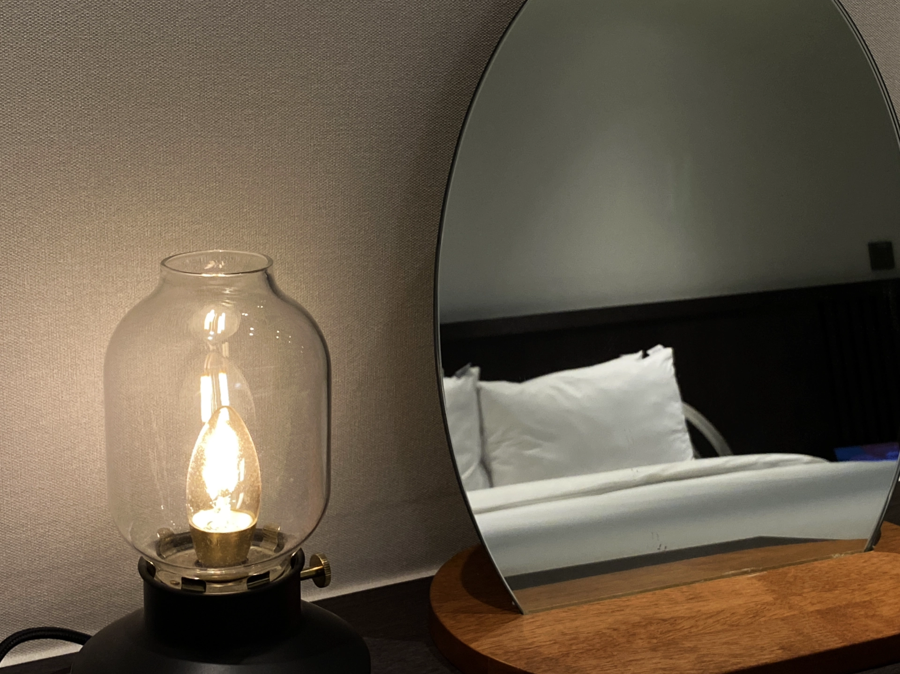
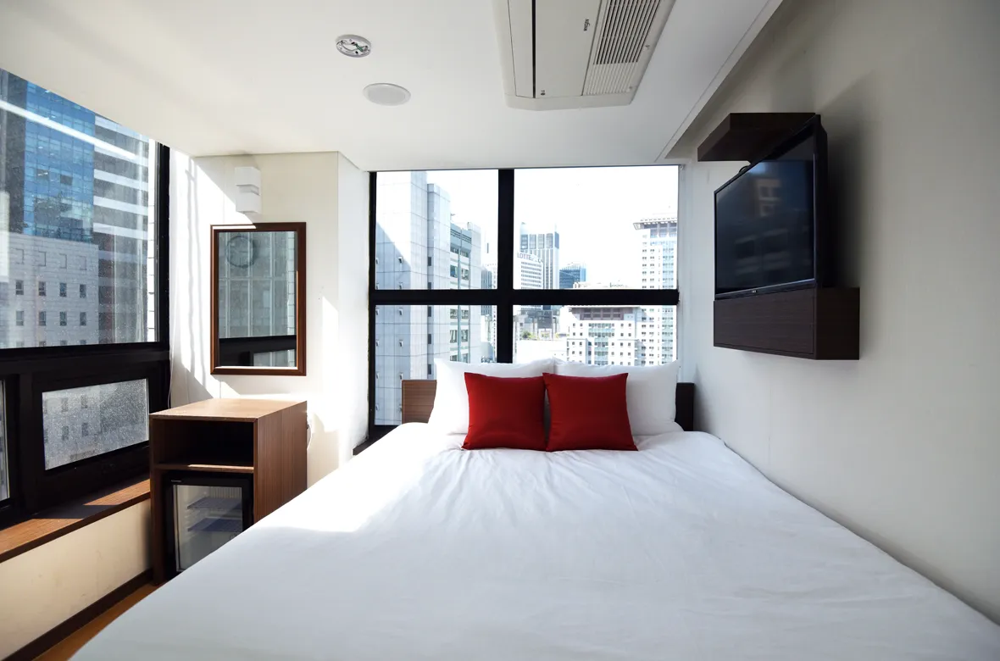

## 首爾住宿區域

想找**首爾住宿**推薦嗎？不論你是首次到韓國自由行，還是常跑首爾的資深旅人，這篇文章都為你整理了 2025 最新、交通方便、CP 值超高的首爾飯店清單！從熱門的明洞、弘大，到在地人推薦的永登浦、東大門，本篇精選多家評價優質的住宿選擇，讓你不踩雷、不超支，玩得安心住得舒心。快收藏起來，為你的首爾自由行挑間完美的落腳處！

首爾的住宿區域主要分布在以下四個區域：
- 弘大、新村、梨大商圈
- 明洞商圈
- 東大門商圈
- 江南商圈

在這篇文章，我們還額外提供了在這四大區域以外的住宿選擇，這些比較冷門的地點對於有經驗的自由行旅客來說，可說是首爾住宿秘境！

現在就來看看首爾最推薦的住宿清單吧！

## 首爾住宿推薦

### 台灣自由行旅客的第一選擇｜Union Hotel

[**Union Hotel**](https://www.booking.com/hotel/kr/union-yeongdeungpo-gu.xt.html?aid=7956794) 是一間位在首爾永登浦區，仙游島公園附近的平價星級飯店。交通方便、環境整潔、服務人員態度親切，都讓這間飯店成為一個台灣人到首爾自由行的絕佳住宿選擇。

雖然距離主要商圈稍遠一點，但是 Union Hotel 的交通方便也非常方便，鄰近地鐵 9 號線的仙游島公園站，還有就位在飯店門口的公車站，連機場巴士都直接抵達。

- 地址：서울 영등포구 양평로 136 유니언호텔（[Naver Map](https://naver.me/IMyGA57c)）
- 地鐵 9 號線仙游島公園（Seonyudo，韓文：선유도）一號出口步行三分鐘或公車 [6008 機場巴士直達](https://naver.me/G4WYxb5W)
- 是否含早餐：無
- 平均每晚價格：約台幣 2,000 ~ 4,000（雙人房）
- 查看即時房價：[**點我前往**](https://www.booking.com/hotel/kr/union-yeongdeungpo-gu.xt.html?aid=7956794)

看詳細 Union Hotel 入住開箱圖文：[性價比極高的星級飯店 Union Hotel](/posts/首爾自由行住宿-union-hotel/)

### 明洞地鐵站出口三分鐘｜明洞托馬斯酒店

[明洞托馬斯酒店](https://www.booking.com/hotel/kr/thomas-myeongdong.xt.html?aid=7956794&no_rooms=1&group_adults=2)以其出色的服務和優越的地理位置而聞名。櫃台人員總是以非常親切和有禮貌的態度迎接，每天都會詢問是否需要清房。

飯店的地理位置更是無可挑剔，鄰近市廳站能夠輕鬆前往城市各處，無論是購物、美食還是觀光都非常方便。

- 地址：26 Sejong-daero 16-gil, Jung-gu, Seoul｜韓文：서울특별시 중구 세종대로16길 26（북창동）（[Naver Map](https://naver.me/GmFzoetT)｜[Kakao Map](https://kko.to/FXzfctHDRc)）
- 地鐵：地鐵市廳站 7、8 號出口步行約 3 分鐘
- 平均每晚雙人房價格：約台幣 3,100 元 ($$)
- 是否含早餐：無
- 查看即時房價：[**點我前往**](https://www.booking.com/hotel/kr/thomas-myeongdong.xt.html?aid=7956794&no_rooms=1&group_adults=2)

### 一次玩東大門和明洞商圈｜喜普樂吉酒店

[喜普樂吉酒店](https://www.booking.com/hotel/kr/ky-heritage-dongdaemun.zh-tw.html?aid=7956794&no_rooms=1&group_adults=2)是一間評價超高、地點超優的飯店，步行即可抵達東大門商圈，離地鐵站也只需要走一分鐘、搭地鐵至明洞商圈逛逛也只有 10 分鐘的車程，房間乾淨明亮，服務人員除了韓文和英文外，也會說簡單的中文，對於稍微有點預算的台灣旅客來說，是非常適合情侶、家庭到首爾旅遊的下榻好選擇。

- 地址：226, Jangchungdan-ro, Jung-gu, Seoul｜韓文：서울특별시 중구 장충단로 226（광희동 2 가）（[Naver Map](https://naver.me/5HSiZC3F)｜[Kakao Map](https://kko.to/R9xMRFa_02)）
- 地鐵：東大門歷史文化公園站 9 號出口步行 1 分鐘
- 平均每晚雙人房價格：約台幣 5,000 元 ($$$)
- 是否含早餐：有
- 查看即時房價：[**點我前往**](https://www.booking.com/hotel/kr/ky-heritage-dongdaemun.zh-tw.html?aid=7956794&no_rooms=1&group_adults=2)

### 麻雀雖小五臟俱全｜明洞 57 號旅館

[明洞57號旅館](https://www.booking.com/hotel/kr/philstay-myeongdong-station-seoul1.xt.html?aid=7956794&no_rooms=1&group_adults=2)坐落在明洞的中心地帶，在最熱鬧的區域。

櫃檯人員流利地講中文，溝通和服務都一級棒。旅館的房間和廁所都保持著極高的乾淨度和整潔度，而且提供每住兩天就能打掃一次房間的服務。

儘管房間相對較小，但其格局設計非常巧妙，並提供充足的插頭，是個相對舒適的環境。此外，明洞 57 號旅館的早餐非常豐盛，每天都提供不同的菜色。無論你是商務出差還是觀光旅遊，都非常適合！

- 地址：57 Myeongdong 2-gil, Jung-gu, Seoul｜韓文：서울특별시 중구 명동2길 57（충무로 1 가）（[Naver Map](https://naver.me/x50mvme9)｜[Kakao Map](https://kko.to/gKgWrNEcWV)）
- 地鐵：地鐵明洞站 5 號出口步行約 1 分鐘
- 平均每晚雙人房價格：約台幣 2,300 元 ($$)
- 是否含早餐：有
- 查看即時房價：[**點我前往**](https://www.booking.com/hotel/kr/philstay-myeongdong-station-seoul1.xt.html?aid=7956794&no_rooms=1&group_adults=2)

### 家庭旅遊、情侶渡假都沒問題｜東大門 Hotel DM

[Hotel DM 東大門飯店](https://www.booking.com/hotel/kr/dm-seoul.zh-tw.html?aid=7956794&no_rooms=1&group_adults=2)是一家距離東大門商圈一公里左右的 2 星級平價飯店，雖然定位並非高檔酒店，但是房間的空間、設施、人員服務等都相當不錯，甚至有提供免費機場接送服務（請事先和飯店聯繫預約），非常推薦給年輕朋友、情侶、有預算的家庭到首爾旅遊的住宿選擇！

- 地址：73 Nangye-ro 29-gil, Jongno-gu, Seoul｜韓文：서울특별시 종로구 난계로 29 길 73（숭인동）（[Naver Map](https://naver.me/G0f05W8l)｜[Kakao Map](https://kko.to/LYse_1xLKl)）
- 地鐵：地鐵東廟站三號出口步行約 3 分鐘
- 平均每晚雙人房價格：約台幣 2000 元（$$）
- 是否含早餐：有
- 查看即時房價：[**點我前往**](https://www.booking.com/hotel/kr/dm-seoul.zh-tw.html?aid=7956794&no_rooms=1&group_adults=2)

### 弘大商圈的年輕旅店｜Wegoinn Hostel

[**Wegoinn Hostel**](https://www.booking.com/hotel/kr/wegoinn-hostel.xt.html?aid=7956794) 是一間價格平價，位在[弘大商圈](https://exittaiwan.com/posts/弘大商圈梨大商圈新村商圈飯店住宿推薦/)走路十分鐘的地方，價格平易近人卻提供品質相當不錯的住宿體驗，非常適合年輕旅客、喜歡逛街購物、或是來韓國追星的粉絲們入住！

Wegoinn Hostel 的接待人員親切，房間整體乾淨整潔，地點又離弘大商圈蠻近的，要吃宵夜要逛街都算蠻方便的，樓下也有兩間超商開到很晚。

- 地址：서울 서대문구 신촌로 141 위고인호스텔빌딩 6~8층, RECEPTION 1F ([Naver Map](https://map.naver.com/p/entry/place/1242893814?placePath=%2Fhome))
- 交通：
  - 地鐵 2 號線梨花女字大學（이대）站 1 號出口往斜坡下走，或是
  - 地鐵 2 號線新村（신촌，Sinchon）站 4 號出口往斜坡上走
- 是否含早餐：無
- 平均每晚價格：約台幣 3,000 ~ 8,000（依房型和旅行季節決定，雙人房）
- 查看即時房價：[**點我查價**](https://www.booking.com/hotel/kr/wegoinn-hostel.xt.html?aid=7956794)

看詳細 Wegoinn Hostel 入住開箱圖文：[Wegoinn Hostel 平價又有品質的旅館](/posts/首爾自由行住宿-wegoinn-hostel/)

### 住高樓坐擁明洞美景｜索拉利亞西鐵酒店

[索拉利亞西鐵酒店](https://www.booking.com/hotel/kr/solaria-nishitetsu-seoul.xt.html?aid=7956794&no_rooms=1&group_adults=2)是一間位於熱鬧的明洞商圈中 3 星級住宿。飯店的房間空間相當寬敞，並擁有高檔免治馬桶以及乾溼分離的浴室。

房間均位於高樓層，擁有開闊的視野，可以欣賞首爾城市的美麗景色。飯店人員以親切和良好的服務聞名，住宿體驗無懈可擊。

除此之外，索拉利亞西鐵酒店也提供現代化的設施，讓你在旅途中享受便利與奢華。無論你是前來購物、品味美食，還是探索首爾的文化，這個飯店都是理想的住宿選擇。

- 地址：27 Myeongdong 8-gil, Jung-gu, Seoul｜韓文：서울특별시 중구 명동8길 27（명동2가）（[Naver Map](https://naver.me/57wVlxLD)｜[Kakao Map](https://kko.to/Hws1lFgdB3)）
- 地鐵：地鐵明洞站三 8 號出口步行約 2 分鐘
- 平均每晚雙人房價格：約台幣 6,000 元（$$$）
- 是否含早餐：有
- 查看即時房價：[**點我前往**](https://www.booking.com/hotel/kr/solaria-nishitetsu-seoul.xt.html?aid=7956794&no_rooms=1&group_adults=2)

> **推薦閱讀：**
>
> [【首爾住宿】首爾明洞飯店住宿推薦](/posts/首爾明洞飯店住宿推薦/)
>
> [【首爾住宿】首爾東大門飯店住宿推薦](/posts/首爾東大門飯店住宿推薦/)
>
> [【首爾住宿】首爾弘大、梨大、新村飯店住宿推薦](/posts/弘大商圈梨大商圈新村商圈飯店住宿推薦/)
>
> [【首爾交通】首爾地鐵圖繁體中文 PDF 高解析檔](/posts/首爾地鐵圖繁體中文高解析檔下載/)