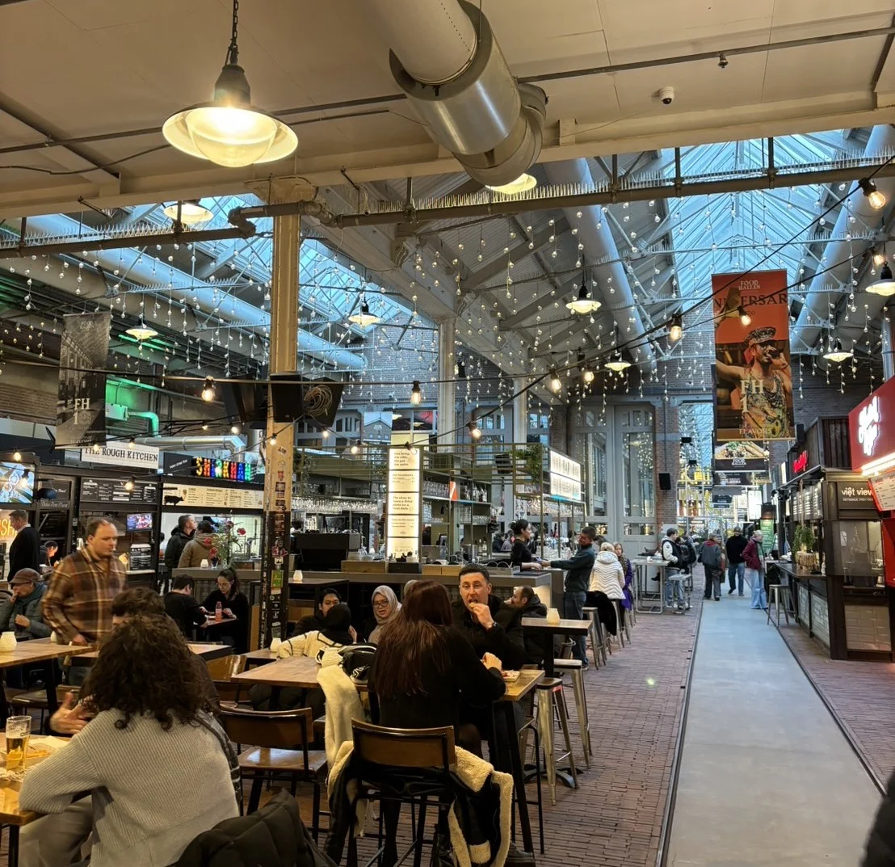

到[阿姆斯特丹](/city/%E9%98%BF%E5%A7%86%E6%96%AF%E7%89%B9%E4%B8%B9/)自由行，想要探索當地的藝文展覽嗎？De Hallen Amsterdam 不只有電影院，整個場地就是一個藝文中心無誤！要是有天住在阿姆斯特丹的話，應該可以常常在這邊待一整天，有吃有喝有得看，完全是文青的天堂。

## De Hallen Amsterdam 基本資訊

* 開放（營業時間）：周一至周五 07:00-01:00  
* 地址：Hannie Dankbaarpassage 47 1053 RT Amsterdam
* 交通：可搭乘電車 7 號及 17 號至 Bilderdijkstraat 站下車，或是搭乘 3 號電車至 Kinkerstraat 站下車。若是自駕的話有地下停車場可供停車，或是用最荷蘭的方式騎腳踏車前往。

## De Hallen Amsterdam 特色

建於 1901 年，當時阿姆斯特丹的主要交通工具為馬車（horse tram），連接水壩廣場（Dam Square）及萊登廣場（Leidsebosje）。為了存放、維護及發展電車技術，因此建造了現在我們看到的 De Hallen。隨著城市逐漸成長，電車網路日趨發達，De Hallen 附近開始繁榮起來，電車車庫越蓋越多。

1996 年阿姆斯特丹的電車公司 GVB 將車庫從這搬離。2010 年電車車庫被一群年輕人及藝術家佔領，他們希望利用這片空間進行小規模的文化和社會計畫。例如，他們在裡面開闢花園種植蔬菜，向公眾開放空間，舉辦戲劇表演和其他文化活動，甚至建造了一個游泳池。2013 年De Hallen 經過重新整修後於 2015 年重新開放成為我們現在看到的樣子。目前則是一個結合商業、藝術、咖啡廳、酒吧等等複合式的藝文中心。

### De Hallen Amsterdam—Filmhallen

來到 Filmhallen 之前，有人說這裡就像是台北華山。如果你以為是專門放藝術片或獨立製片電影的電影院，那你就錯了。一來到這後你立刻就會懂了，整個場域有展覽有電影院有美食，真的就是華山！

### De Hallen Amsterdam—Foodhallen

美食廣場 Foodhallen 在 2014 年成立於阿姆斯特丹，現在在鹿特丹以及海牙也有據點。裡面有各種攤位美食，集合了來自世界各地的風味料理，還有酒吧可以三五好友一起來吃飯喝酒等等，偶爾也會舉辦一些大大小小的活動，營造出輕鬆舒適的用餐氛圍，是一個聚會的好選擇。  
