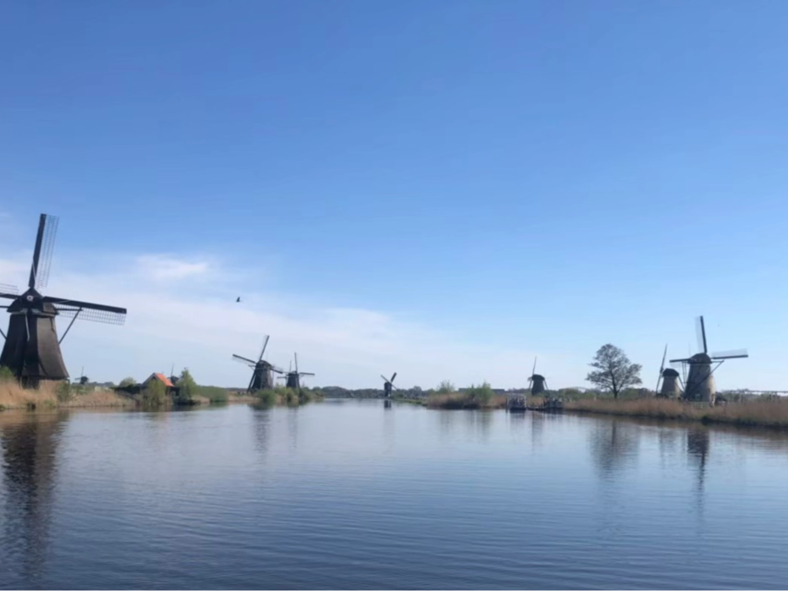
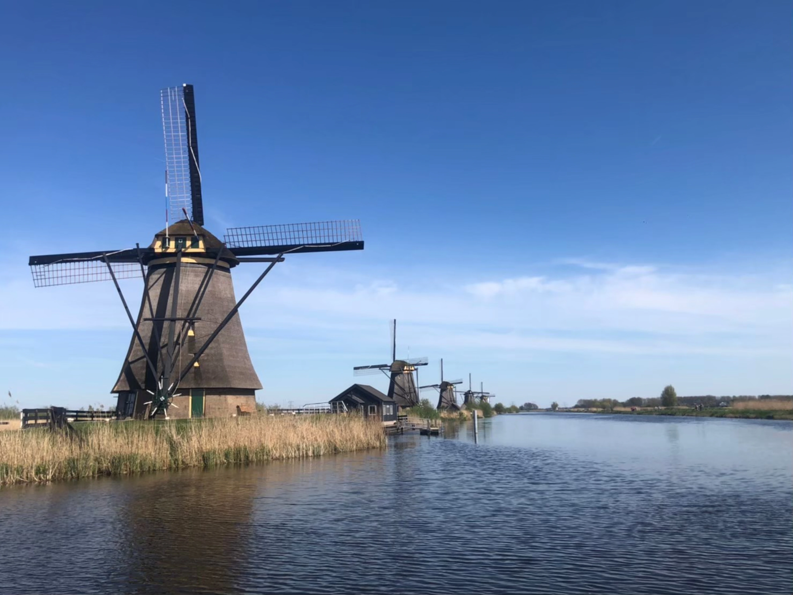
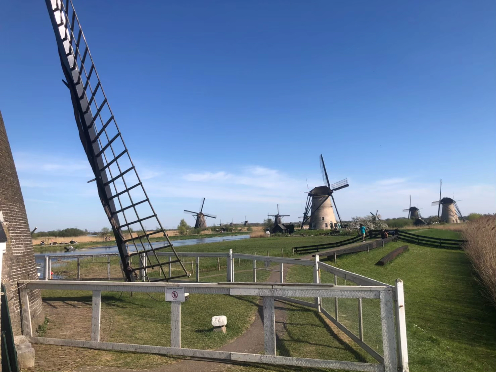
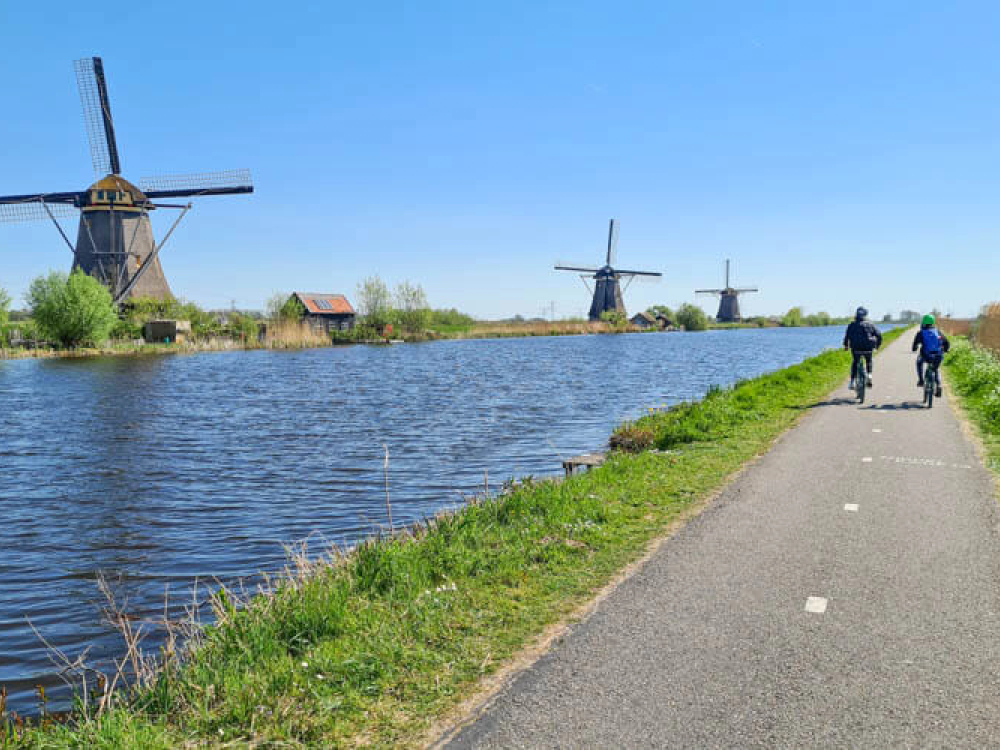
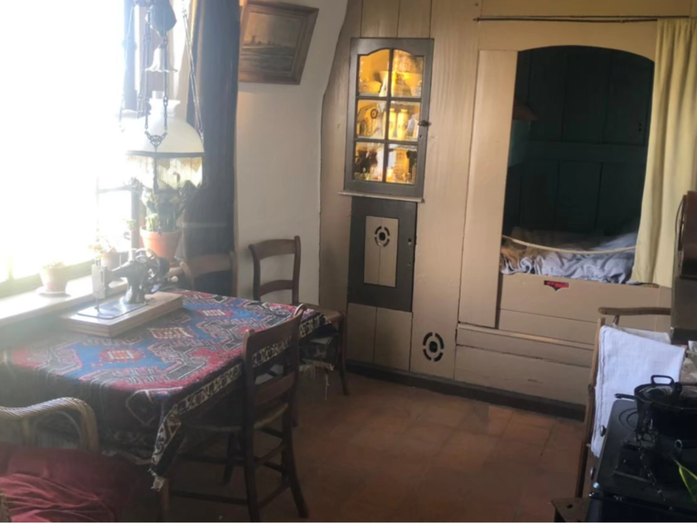
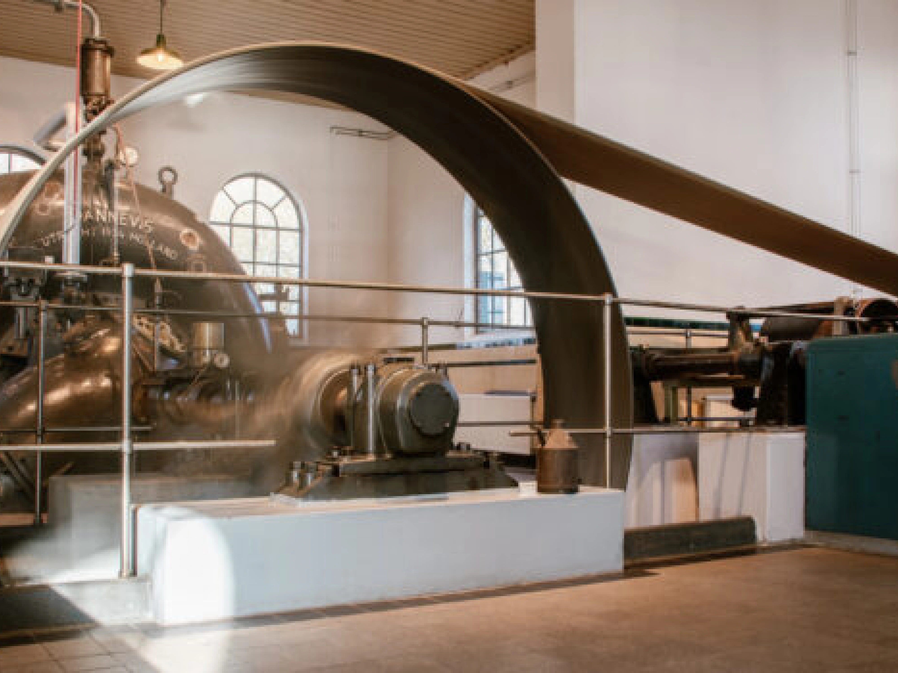

小孩堤防（Kinderdijk）是荷蘭最大的風車群，共有 19 座風車，已有超過700年的歷史，並被聯合國教科文組織列為世界文化遺產。

荷蘭不僅以自行車著名，風車更是這片土地的象徵，因此又被稱作「風車之國」。早期風車的主要功能是排水，幫助荷蘭人「與海爭地」，將沼澤地轉化為農田與居民區。隨著技術發展，風車逐漸被應用於風力發電和農業生產，如磨米與磨粉，展現了荷蘭人的創新精神。

## 小孩堤防基本資訊

- 2025年開放時間：
  * 1月1日：12:00 - 16:00
  * 1月2日 - 5日：10:30 - 16:00
  * 1月6日 - 16日：關閉
  * 1月17日 - 2月28日：週五至週日 10:30 - 16:00
  * 3月 - 11月2日：每天 09:00 - 17:30
  * 11月3日 - 12月：10:30 - 16:00（聖誕節關閉）
- 地址：Nederwaard 1b, 2961 AS Kinderdijk, Nederland
- 交通方式：
  1. 公車路線：從地鐵站 Kralingse Zoom 下車，轉搭 Bus 489 到 Kinderdijk Molenkade 下車，全程約需 1 小時。
  2. 從鹿特丹伊拉斯謨橋（Erasmusburg）碼頭站搭乘 21線水上巴士，約 40 ~ 45 分鐘直達 Kinderdijk Molenkade。想了解更多，可點擊[水上巴士官網](https://www.waterbus.nl)查詢最新資訊。
- 票價：
  - 成人：€19.50

> 越早訂越便宜：[**現在查詢鹿特丹房價**](https://www.booking.com/city/nl/rotterdam.xt.html?aid=7956794&no_rooms=1&group_adults=2)

## 小孩堤防（Kinderdijk）的特色與魅力

### 小孩堤防（Kinderdijk）名稱的由來

「小孩堤防」這個名字背後有多種說法，其中最廣為人知的是在一次洪水過後，人們在退去的洪水中發現了一個竹籃，裡面竟然有一個嬰兒，於是得名。此外，還有一種說法認為，這片堤防是由孩童建造完成的。另一個說法則是該地區曾住著一位名叫 Jan 的婦女，因為她有許多孩子，當地人便將這裡命名為小孩堤防。你最喜歡哪個故事呢？

### 風車村的遊覽方式

在小孩堤防（Kinderdijk），您可以選擇**騎腳踏車**或**步行**的方式遊覽，彷彿置身於一座自然與歷史交融的河濱公園。

當地有兩座風車對外開放參觀，展示了曾經居住在風車內的人的生活環境。具體開放時間以[官方網站](https://kinderdijk.nl)或現場公告為準。

### 遊船行程

票價包含了遊船行程，搭乘遊船可以欣賞整個小孩堤防的風景，並由導覽員詳細介紹風車的歷史與知識。需要注意的是，遊船無法提前預約，須現場排隊。

### 抽水站參觀

票價中還包括參觀 **Wisboom 抽水站**，這裡展示了小孩堤防的排水與研磨技術，從早期到現代的演進歷史。這些技術至今仍在使用，是荷蘭「與海爭地」的鮮明例證。

## 小孩堤防（Kinderdijk）實用資訊與建議

### 最佳參觀時間

建議選擇春季（3月到5月）或秋季（9月到11月），氣候宜人且遊客相對較少。傍晚時分，夕陽映照下的風車群別具一番風味。

### 穿著建議

小孩堤防區域風力較強，建議穿著保暖的衣物，特別是秋冬季節參觀時。

### 附加行程建議

若時間充裕，可搭配鹿特丹市區自由行，參觀伊拉斯謨橋（Erasmus Bridge）及標誌性的[立體方塊屋（Cube Houses）](https://exittaiwan.com/posts/%E9%B9%BF%E7%89%B9%E4%B8%B9%E6%99%AF%E9%BB%9E-%E6%96%B9%E5%A1%8A%E5%B1%8B-%E6%8B%B1%E5%BB%8A%E5%B8%82%E5%A0%B4/)。

## 結語

小孩堤防（Kinderdijk）是荷蘭著名的世界文化遺產，亦是風車國度的代表性景點。這裡不僅讓您感受荷蘭獨特的自然景觀，更能了解荷蘭人為了與海爭地所展現的智慧與努力。

> 越早訂越便宜：[**現在查詢鹿特丹房價**](https://www.booking.com/city/nl/rotterdam.xt.html?aid=7956794&no_rooms=1&group_adults=2)