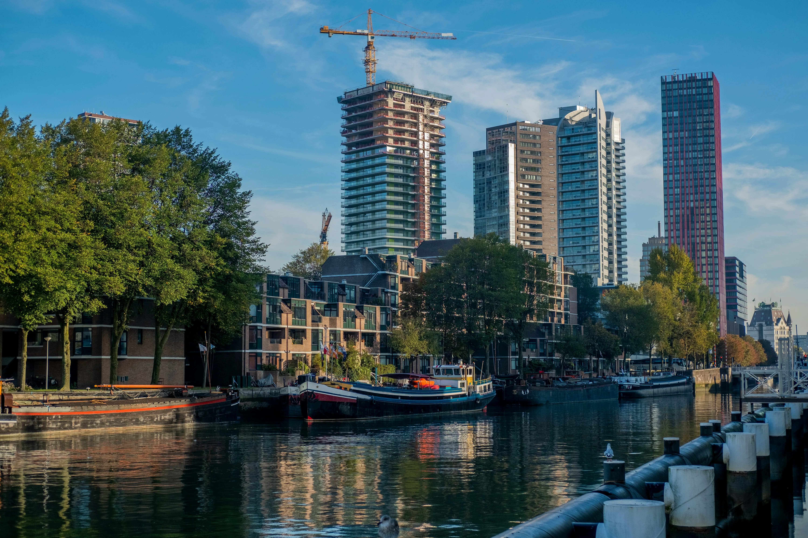
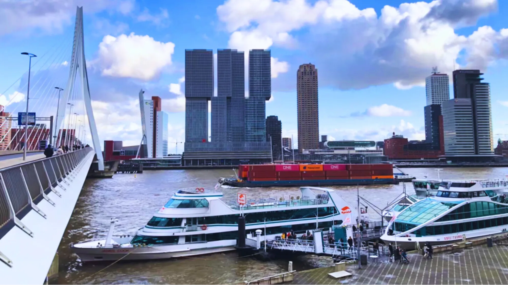
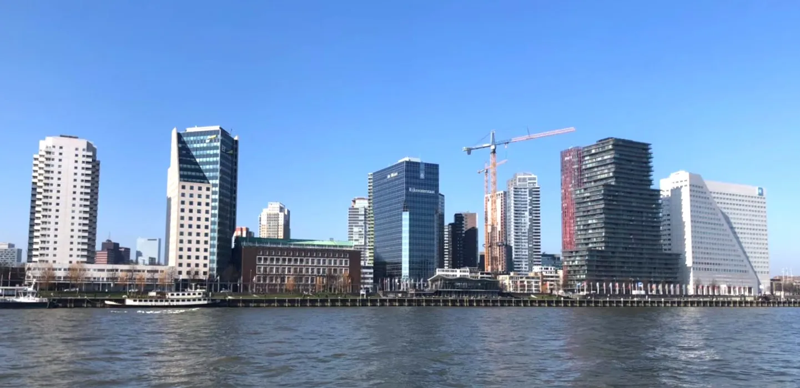
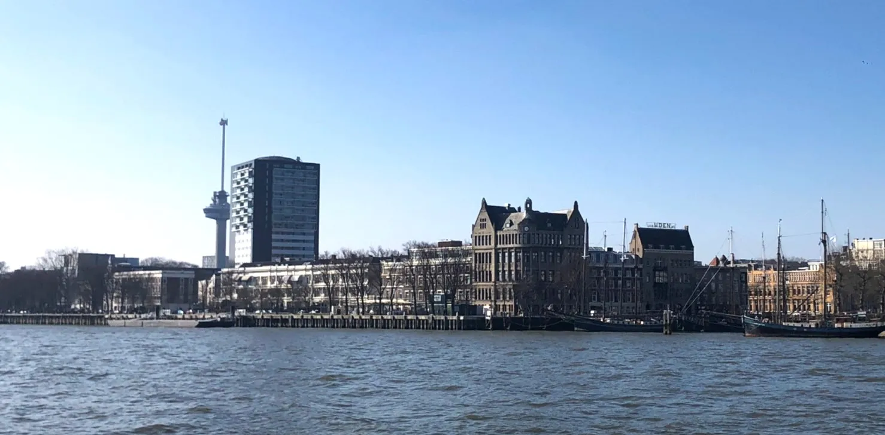
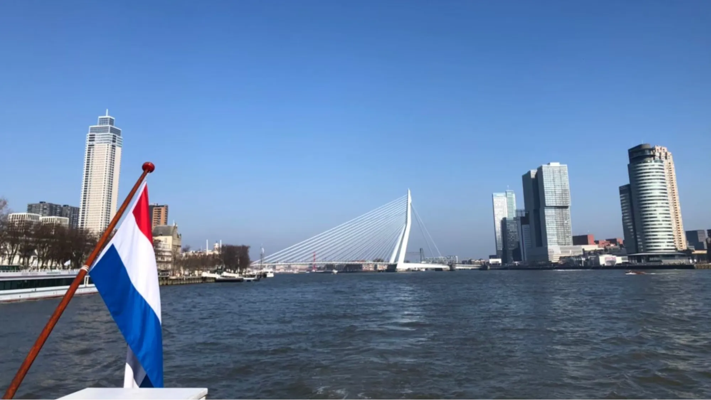
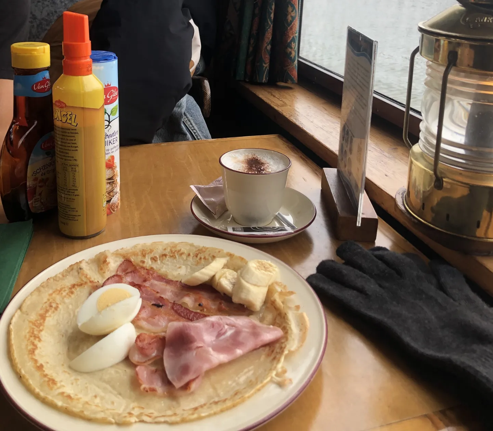

作為運河大國的荷蘭，每個城市都有遊船之旅，搭船倘佯在運河上欣賞城市風光是一個相當舒服的體驗。而鹿特丹的遊船之旅之所以特別，就是除了歐式建築外，還有現代建築以及貨櫃海港風光，讓你一趟遊船之旅一窺鹿特丹的不同風景。

> 越早訂越便宜：[**現在查詢鹿特丹房價**](https://www.booking.com/city/nl/rotterdam.xt.html?aid=7956794&no_rooms=1&group_adults=2)

## 鹿特丹景點：新馬斯河（Nieuwe Maas）港口巡遊基本資訊

* 開放時間：需先上網預約日期及時段
* 地址：Havenrondvaart Spido, 3016 DR Rotterdam, 荷蘭
* 交通：搭乘路面電車 7 線至 Willemsplein 或地鐵 D、E 線至 Leuvehaven
* 價格：[NT$598 起](https://www.klook.com/zh-TW/activity/88929-spido-harbor-cruise-rotterdam/?aid=41451&aff_adid=966751&aff_pid=&aff_sid=&utm_medium=affiliate-alwayson&utm_source=long&utm_campaign=41451&utm_term=&utm_content=&aff_klick_id=85883486443-41451-966751-a227e7b)

### 鹿特丹城市特色：新穎多元的建築

除了歐洲最大港口的美名外，鹿特丹也被譽為歐洲最年輕的城市。其中一個原因是因為二戰時這個地區遭到德軍的瘋狂轟炸，市容變得殘破不堪。

然而，當地政府決定不照舊有的樣貌進行修復，轉以前瞻現代的方式重建，不過也有種整個砍掉重練的意味。由建築師科恩拉德范特霍夫（Cornelis van Traa）操刀整個重建工作，讓這座城市脫胎換骨。

除了遊船外，也可以用步行的方式沿著新馬斯河欣賞這個港口，港邊景點： 除了遊船外，也可以用步行的方式沿著新馬斯河欣賞這個港口。其中沿線的歐洲之桅（Euromast）也相當推薦，可以到塔頂欣賞整個新馬斯河的城市風光。

新馬斯河（Nieuwe Maas）港口巡遊行程全程 75 分鐘，船上還有吧檯，先到吧台點一杯咖啡後到甲板坐下，如果天氣好的話，迎面而來的風非常舒服，整個港區的風景非常漂亮！沿著新馬斯河遊覽鹿特丹這個現代化城市的多元風格建築，建築迷及喜歡遊船的人絕對可以透過這個行程得到大大的滿足。

### 鹿特丹港口巡遊：多樣化的海上體驗

鹿特丹的港口巡遊是探索這座現代化城市絕佳的方式。除了經典的港口觀光，Spido 遊船公司還提供多樣化的主題遊船，滿足不同遊客的需求。

想感受浪漫氛圍的旅客可以選擇夜間遊船，在璀璨燈光的映照下，欣賞伊拉斯謨大橋的迷人夜景，以及港口貨櫃船的繁忙景象。喜歡熱鬧氣氛的遊客可以參加主題派對遊船，在船上與其他旅客一同歡慶，享受音樂和美食。

船上的設施更是令人驚艷。除了提供舒適的室內座位區和戶外觀景台，許多遊船還設有酒吧，您可以一邊品嚐當地的啤酒或咖啡，一邊欣賞沿途風光。部分遊船上還設有紀念品商店，販售各式各樣的鹿特丹紀念品，如明信片、鑰匙圈等，讓您將這趟旅程的美好回憶帶回家。

為了讓遊客能更深入地了解鹿特丹的港口歷史和文化，Spido 遊船公司特別安排了專業的導覽員。

導覽員會用流利的英語、荷蘭語和德語，為遊客詳細介紹沿途的景點和建築。例如，旅客會了解到鹿特丹港口是如何從一個小漁村發展成為世界最大的港口之一，以及港口在二戰後的重建過程中所發揮的重要作用。

### 鹿特丹周邊景點：探索更多荷蘭風情

除了鹿特丹市區的現代化建築與港口風光，周邊地區也蘊藏著許多迷人的景點，值得一遊。其中最著名的莫過於[小孩堤防（Kinderdijk）](https://exittaiwan.com/posts/%E9%B9%BF%E7%89%B9%E4%B8%B9%E8%87%AA%E7%94%B1%E8%A1%8C-%E5%B0%8F%E5%AD%A9%E5%A0%A4%E9%98%B2/)。這裡是聯合國教科文組織的世界文化遺產，擁有 19 座傳統的風車，是荷蘭風車的經典代表。搭乘小船穿梭於風車之間，彷彿走進了童話世界。

若您對藝術感興趣，不妨前往海牙（The Hague）。作為荷蘭的政治中心和國際城市，海牙擁有豐富的藝術氛圍。[毛里茨之家（Mauritshuis）是必訪的美術館](https://exittaiwan.com/posts/%E8%8D%B7%E8%98%AD%E6%B5%B7%E7%89%99%E8%87%AA%E7%94%B1%E8%A1%8C-%E8%8E%AB%E7%91%9E%E6%B3%B0%E6%96%AF%E7%9A%87%E5%AE%B6%E7%BE%8E%E8%A1%93%E9%A4%A8/)，這裡收藏了許多荷蘭黃金時代的繪畫作品，其中最著名的當屬維米爾的《戴珍珠耳環的少女》。

### 鹿特丹必吃美食：鬆餅吃到飽

* 開放（營業時間）：需先上網預約日期及時段
* 上傳地址：Parkhaven
* 交通：搭乘路面電車 8 線至 Euromast 或地鐵 A、B、C 線至 Coolhaven
* 價格：[NT$837 起](https://www.klook.com/zh-TW/activity/87546-pancake-boat-tour-rotterdam/?aid=41451&aff_adid=966749&aff_pid=&aff_sid=&utm_medium=affiliate-alwayson&utm_source=long&utm_campaign=41451&utm_term=&utm_content=&aff_klick_id=85883481907-41451-966749-30ef401)
* 除了鹿特丹外，阿姆斯特丹也有煎餅船的行程可以參加。

除了一般的遊船之外，還有另一種適合大小朋友的煎餅船吃到飽的遊船之旅！喜歡甜食的人遷外不要錯過喔！

在這趟行程中，不僅能欣賞河畔美景，還可以大快朵頤地道的荷蘭煎餅。這些煎餅搭配上各種糖漿、巧克力醬、或水果，讓人一口接一口停不下來。此外船上還設有球池，讓小朋友可以在船上盡情玩樂。

**其他美食：**

* Markthal 市場美食之旅：[Markthal 市場](https://exittaiwan.com/posts/%E9%B9%BF%E7%89%B9%E4%B8%B9%E6%99%AF%E9%BB%9E-%E6%96%B9%E5%A1%8A%E5%B1%8B-%E6%8B%B1%E5%BB%8A%E5%B8%82%E5%A0%B4/)不僅是建築上的奇蹟，更是美食的天堂。這裡匯集了來自世界各地的美食，您可以品嚐到新鮮的海鮮、各式各樣的起司、香腸、以及當地特色的甜品。
* 生鯡魚（Haring）：這道荷蘭傳統美食絕對不容錯過。生鯡魚肉質鮮嫩，搭配洋蔥和酸黃瓜一起吃，味道獨特。建議您在專賣店購買現做的生鯡魚，感受最原始的風味。
* 荷蘭煎餅（Stroopwafel）：這是一種薄薄的華夫餅，中間夾著焦糖，外酥內軟，香甜可口。您可以邊走邊吃，感受鹿特丹的城市風情。
* 荷蘭小鬆餅（Poffertjes）：小小圓圓的荷蘭小鬆餅，口感鬆軟，帶有淡淡的甜味，通常會搭配奶油和糖粉一起享用。
* 炸肉丸（Bitterballen）：這是一種深受當地人喜愛的炸物小吃，外酥內軟，內餡通常是肉末和奶油醬。
* 可樂餅（Kroket）：可樂餅的形狀和炸肉丸相似，但內餡通常是肉末和蔬菜。

文字的描述總是有限的，唯有親身來到鹿特丹，才能真正感受到這座城市的魅力。

漫步在 Markthal 市場，品嚐新鮮的海鮮；登上歐洲之桅，俯瞰整個城市；或是在老港口區尋找一間咖啡館，悠閒地度過一個午後。

> 越早訂越便宜：[**現在查詢鹿特丹房價**](https://www.booking.com/city/nl/rotterdam.xt.html?aid=7956794&no_rooms=1&group_adults=2)