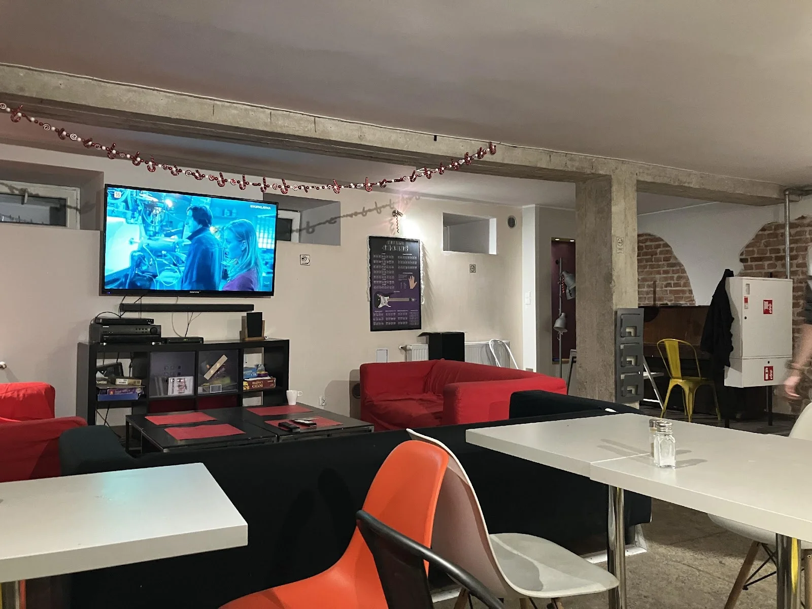
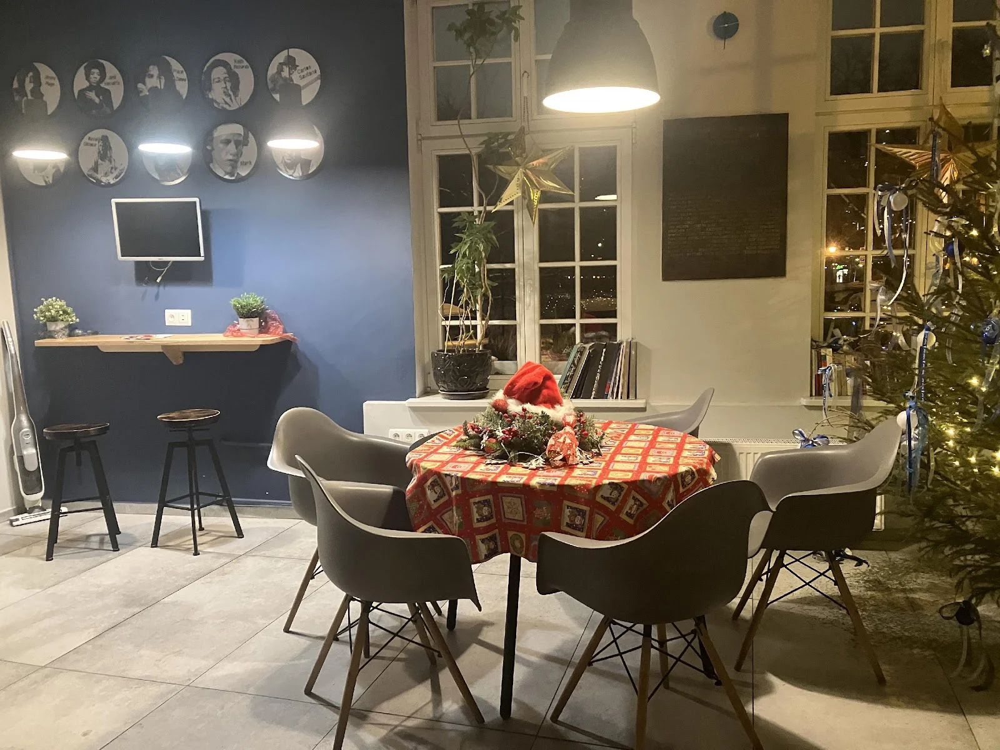
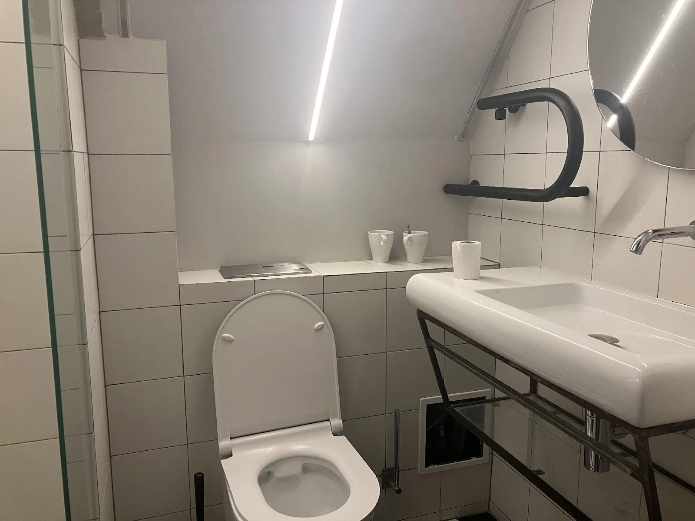
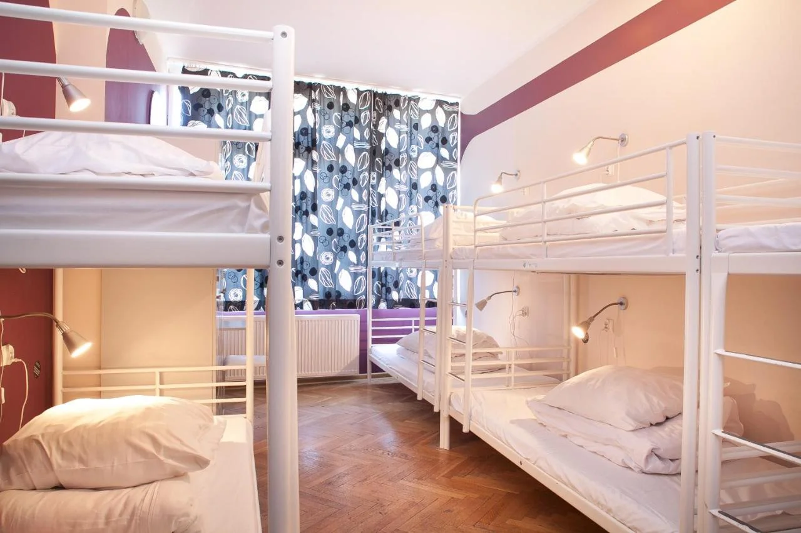

格但斯克（波蘭文：Gdańsk）是[波蘭](/country/波蘭/)北部的旅遊勝地，以琥珀和海邊小鎮著名。格但斯克在凡爾賽條約（英文： Treaty of Versailles）後被定為自由市（德文：Freie Stadt Danzig），歸屬國際聯盟管理，但因地緣關係，有大量德國人和波蘭人居住此地。 1939 年德軍以「波蘭人襲擊德國廣播站」為理由襲擊格但斯克，二戰因此爆發。戰後由蘇聯紅軍佔領。

格但斯克在波蘭從共產過渡到民主的歷史中佔了相當重要的地位。 1980 年工人因經濟困境發動罷工，在領袖列赫·瓦文薩（Lech Wałęsa）的帶領下，成功促成政府簽署《格但斯克協議》（波蘭文：Porozumienia Gdańskie），允許成立獨立工會，建立東歐第一個獨立工會——團結工會運動（Solidarność）。

在波蘭內陸待了兩個月，終於決定在聖誕假期旅遊，一路從南玩到北，抵達臨波羅的海的格但斯克。身為海島國家長大的孩子，想到能看見一望無際的大海，心情就開闊起來。

今天推薦大家一間價格實惠，距離主廣場、火車站和博物館都很近的青旅——La Guitarra。

## La Guitarra 青年旅館基本資料

* 地址：ul. Grodzka 12, 80-841 Gdańsk, Poland  
* 價格（新台幣）：
  * 雙人房  1100-1300 / 晚
  * 單人房 1600 / 晚
  * 四人房 2400 / 晚
  * 背包客（混宿、四六八床）500-600 / 晚
  * [**點我查價**](https://www.booking.com/hotel/pl/la-guitarra-hostel-gdansk.xt.html?aid=7956794)
* 周邊景點：
  * 格但斯克二戰博物館（波蘭語：Muzeum II Wojny Światowej w Gdańsku）步行3分
  * 格但斯克國家海事博物館（波蘭語：Narodowe Muzeum Morskie w Gdańsku ）步行10分
  * 琥珀博物館（波蘭語：Muzeum Bursztynu）步行10分
  * 格但斯克火車站 步行15分
  * 長街道（波蘭語：Długa）步行15分
  * 長廣場（波蘭語：Długi Targ）步行15分

|  |  |  |  |
| :---: | :---- | :---- | :---- |
| 交通 | 電車站 | 步行15分 | V |
|  | 公車站 | 步行15分 | V |
|  | 地鐵 |  |  |
| 設施 | 客廳 |  | V |
|  | 交誼廳 |  | V |
|  | 廚房 |  | V |
|  | 電梯 |  |  |
|  | 網路 |  | V |
|  | 置物櫃 | 無鑰匙，需自備鎖頭 | V |
| 備品 | 浴巾 |  |  |
|  | 牙刷 |  |  |
|  | 吹風機 | 和櫃檯借，免費 | V |
|  | 沐浴乳 |  | V |
| 服務 | 早餐 |  |  |
|  | 24小時櫃檯 |  | v |

## La Guitarra 實際入住體驗（公區）

### 交誼廳

青旅入口處有桌椅和雜誌，地下一樓的空間為廚房和交誼廳合併，有一套沙發、多張桌椅，筆者停留的兩天，交誼廳都有播放電影。旁邊有吉他和鋼琴可以彈。氣氛輕鬆，空間寬敞乾淨。

### 廚房

廚房空間寬敞，大冰箱有人固定清潔，鍋碗瓢盆都很齊全，流理台空間大，不太會有煮飯時衝突的問題。青旅有提供茶包和咖啡粉。

### 浴室

浴室乾濕分離，每天都有人打掃，挺乾淨的，只是對高的人來說，可能空間有點狹小。青旅提供沐浴乳，吹風機需要至櫃檯借。這間青旅的優點是，每層樓都有很多間廁所，所以不用怕跟別人擠。

## La Guitarra 實際入住體驗（私區）  

### 房間 

筆者入住的是八人房背包客房，唯一比較困擾的是上下鋪結構容易發出噪音，剛好下舖的人在睡覺時，就要注意音量。房間備有置物櫃，但需自備鎖頭。雖然房間要容納八個人小了點，但距離廁所、櫃檯等都很近，很方便，還有兩扇窗戶可以通風以及床頭櫃。

## La Guitarra 整體評價

整體下來，會給 [La Guitarra 青年旅館](https://www.booking.com/hotel/pl/la-guitarra-hostel-gdansk.xt.html?aid=7956794) 7 / 10 分的評分，推薦給預算有限的背包客入住！

### 優點

- 公區空間大
- 環境整潔、溫馨
- Check-out 後還能寄放行李

### 缺點

- 房間空間偏小
- 床比較容易發出聲音

