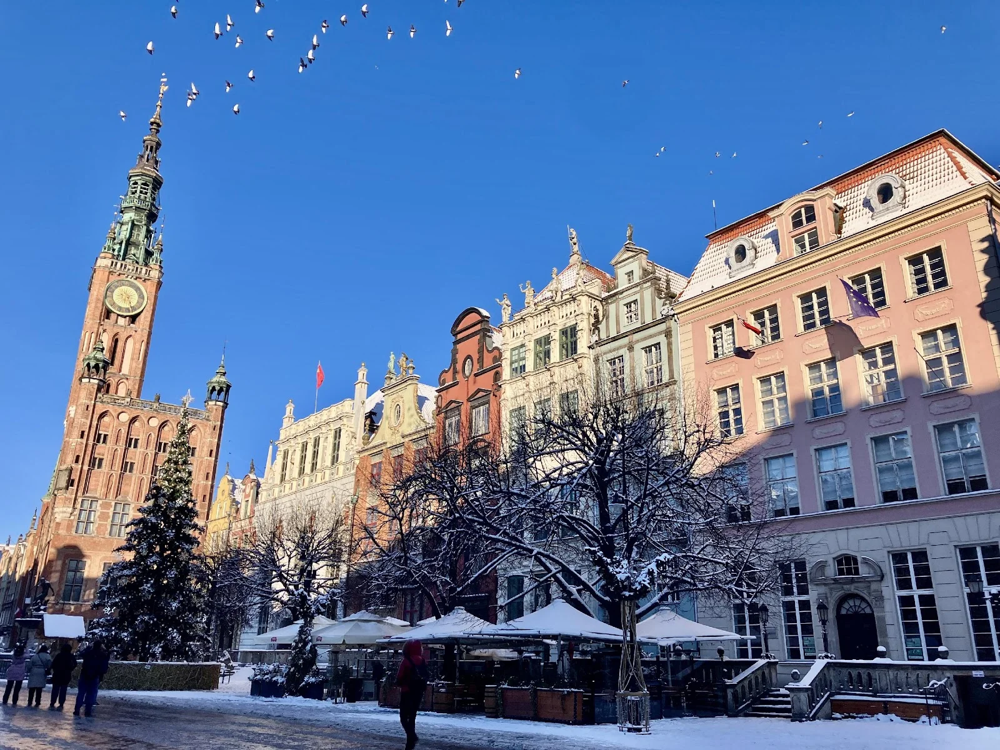
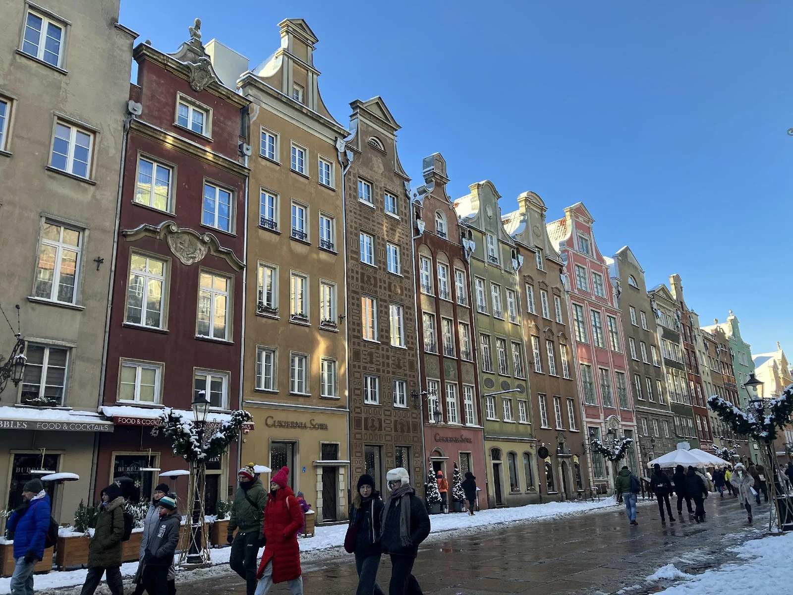
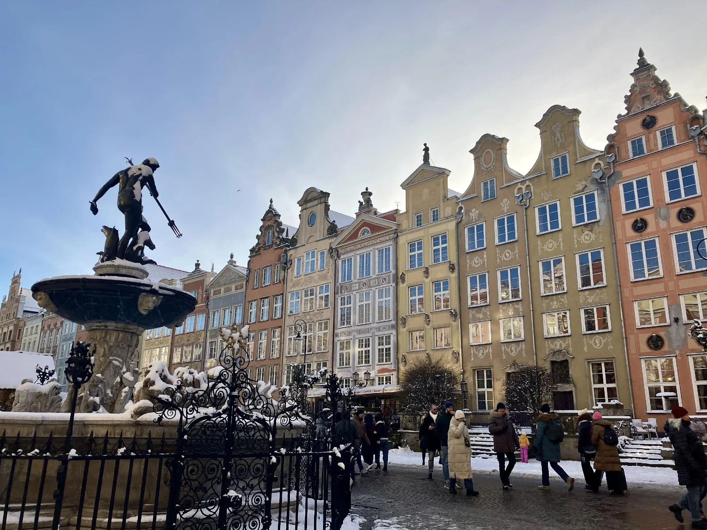
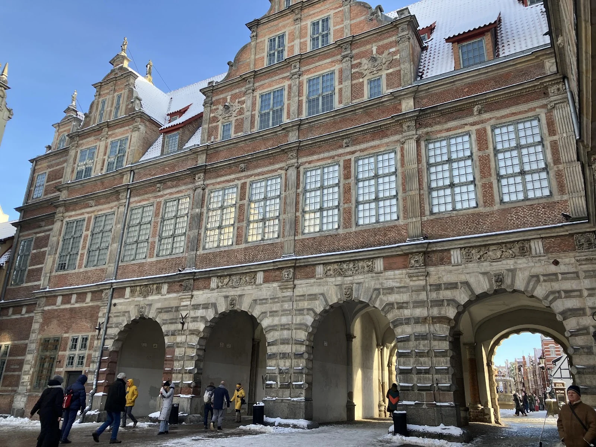
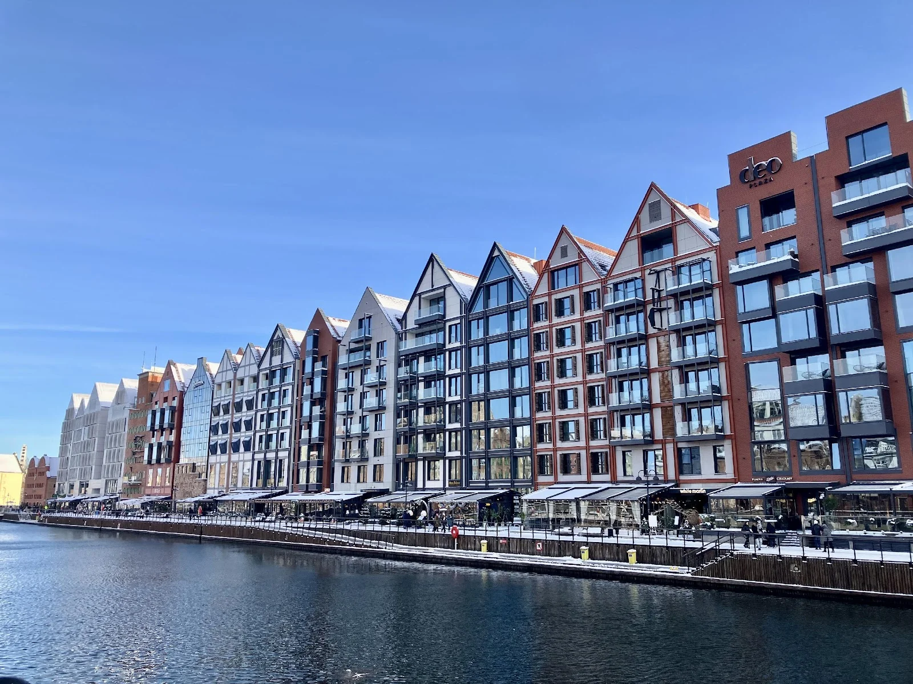
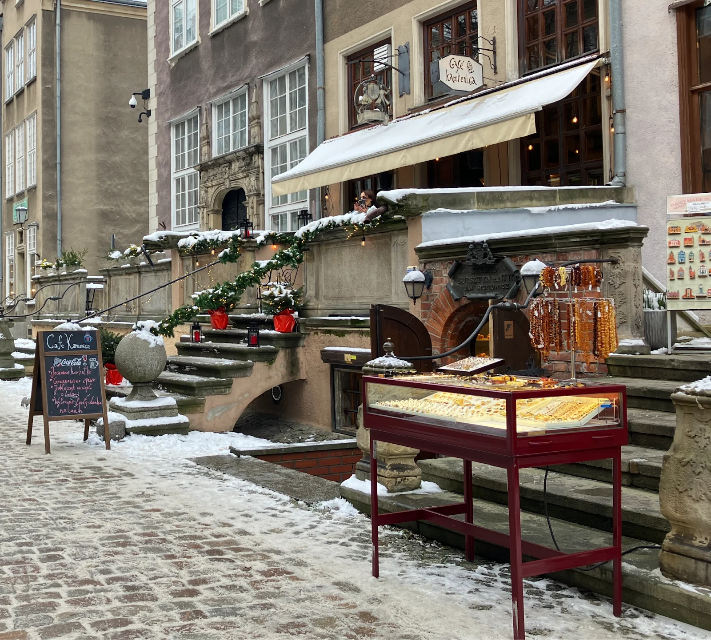
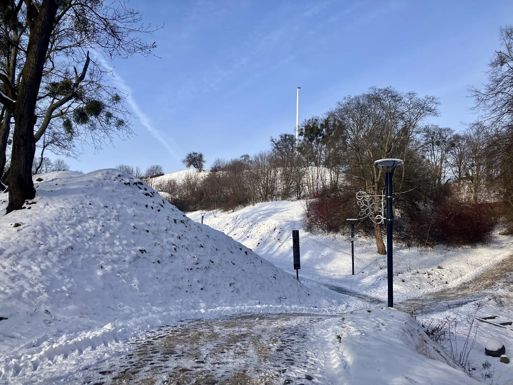
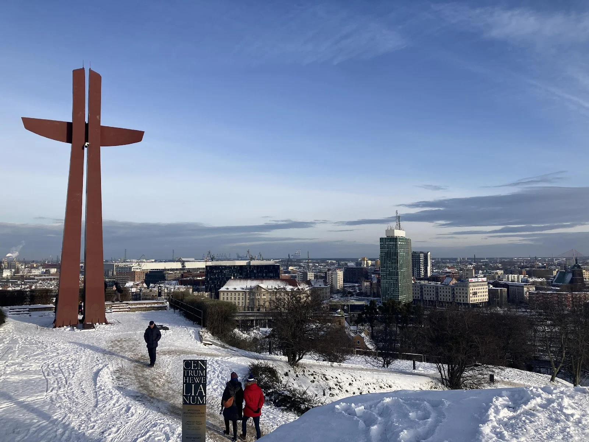

二戰開打後，格但斯克（波蘭文：Gdańsk）飽受戰火摧殘，老城區有九成都是重建的，但跟大多數的波蘭城市一樣，格但斯克也有一個主廣場，作為居民生活、休閒的重心。著名的長廣場（Długi Targ）上，沒有一棟建築物是重複的顏色，各自漆著和諧的色調，整體又為冬天的街道增添了白與灰以外的色彩。仔細看，建築物牆面上刻畫著人物，講著生動的神話和歷史故事。

格但斯克作為二戰後波蘭為大的港口，其實自中世紀以來，因漢薩同盟（英文：Hansa）的關係，便是波羅的海上連接北海和波羅的海的樞紐，出口穀物、木材、琥珀的原物料，進口奢侈品和工業品。而格但斯克造船廠（波蘭文：Stocznia Gdańsk），不僅是波蘭重要的造船基地，更是團結工會運動（波蘭文：Solidarność）的誕生地，促進東歐共產制度的瓦解。

## 格但斯克景點推薦｜長廣場（波蘭文：Długi Targ）

那天出去溜搭的時候天色還早，路上積雪溼滑，兩旁的店家還沒開門，聖誕假期的大家都和家人們團聚，旅遊介紹上的熱鬧廣場，在湛藍的天空下安靜下來。

放大圖片看，會發現左邊酒紅色的牆上雕刻著人物，而中間的咖啡色的樓房上，也彩繪著特別的幾何圖形。同時整排的建築物，也融合歌德、巴洛克以及文藝復興的元素。

長廣場上的亞特拉斯噴泉（波蘭文：Fontanna Neptuna），雕塑展示了海神波塞頓（英文：Neptune）騎著海馬，手持三叉戟，象徵格但斯克作為波羅的海貿易中心的海洋力量與繁榮。

綠門（波蘭文：Zielona Brama）曾經是波蘭王國的象徵，一邊通往長廣場，一邊通往摩特拉瓦河畔（波蘭文：Motława），象徵海港開放和作為商業、文化橋樑的精神。綠門上的四隻動物，分別代表著四種美德。獅子象徵力量與勇氣，鷹象徵自由與高貴，獺象徵勤勞與聰明，犀牛象徵堅韌與穩定。

經過綠門，摩特拉瓦河岸的房子呈現摩登現代風格。沿街餐廳在寒冷的一月點上鵝黃色的燈火，當夜晚降臨時，用餐別有一番風味。

## 格但斯克景點推薦｜琥珀街

格但斯克位於波羅的海沿岸，是世界上最著名的琥珀貿易中心之一，這裡的琥珀以其高品質著稱。格但斯克的琥珀貿易可以追溯到中世紀，當時它是漢薩同盟貿易路線的一部分，將琥珀從波羅的海地區運往歐洲各地。琥珀在古代被視為珍貴的裝飾品和治療物，甚至有信仰認為琥珀擁有神奇的力量，能夠保護人們免受邪惡的侵害。

琥珀街一角，賣家在十一點左右，才慢慢地將寶石擺出來，有的店家位於一樓，有的則需要踩著小小的階梯，進到地下二樓的小空間。琥珀被做成項鍊、耳環、戒指等飾品，部分商品有時候可以在不同家看見，如果想買大顆一點、造型特殊的琥珀或是原礦，都可以向店家詢問。 

筆者也是走了一圈後，才發現除了一般認識的金黃色琥珀，還有象牙白以及檀黑兩個品種，一位店家將看似全黑的串珠用燈光一照，竟然黑裡透黃來，有種低調的華麗。

## 格但斯克景點推薦｜秘密小山丘（波蘭文：Góra Gradowa in Gdańsk）

筆者將此地稱為秘密小山丘，不是因為它是秘境景點，只是因為離火車站需步行半小時左右，秘密小山丘這裡的觀光客不多，需要從火車站步行半小時左右才會抵達，並且再爬上一小段山坡，之後便可以俯瞰格但斯克。逛膩了都是觀光客和商業氣息的地方，可以安排一兩個小時到小山丘走走。

一月積雪，通往小山丘的路上沒什麼人，路不會很難走。

爬過小山丘後，磚頭建築是科學館（波蘭文：Havelianum），這次沒有前往，不過網路上不少人推薦適合帶小孩子去。

山丘不高，但能看到商辦大樓和遠方的造船廠。

此次聖誕旅程的終點是格但斯克，雖然中間遇上暴風雪警告，但在溫暖的青旅睡飽後，造訪白雪覆蓋的山丘，漫步富陳舊歷史感的街道，再喝一碗波蘭傳統羅素湯（波蘭文：Rosół），這幾天就在愜意地走走逛逛中度過。希望來到格但斯克的朋友們，也可以感受到這個城市的魅力。