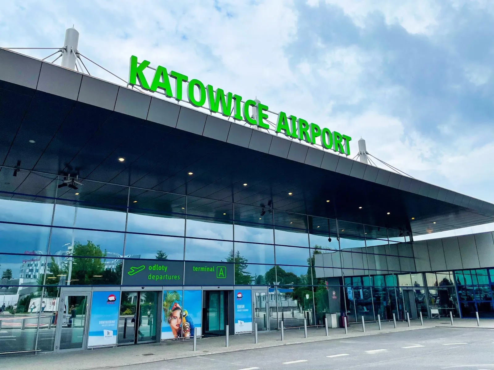
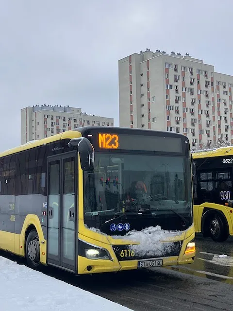
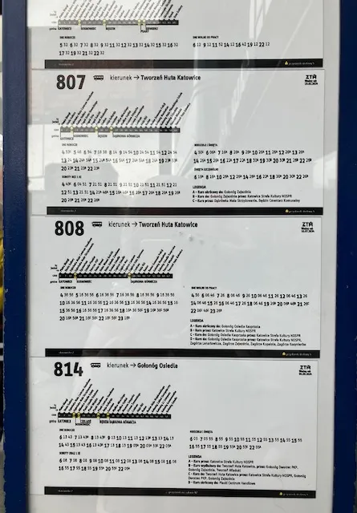

本篇介紹從卡托維治國際機場（波蘭語：Międzynarodowy Port Lotniczy Katowice）到市區的交通方式。

雖然叫做國際機場，但實際規模跟安檢都讓筆者相當驚訝。

這一趟來波蘭，中途是在德國法蘭克福機場轉機，當時就通過了非常嚴格的安檢，安檢人員觸碰旅客身體。

落地卡托維治後，馬上就到了行李轉盤，本來以為還要過一個安檢，結果領個大行李拖著拖著，咦？就來到了機場外的停車場。

可能是因為波蘭也是歐盟國之一，既然在德國安檢過了，當地就不再重複流程。

機場規模小歸小，在這個年代，只要一機在手，沒有哪裡到不了！

一出機場，馬上就是公車亭，站牌上寫得清清楚楚公車路線，旁邊也停了三、四台計程車及Uber了。

身為小資女孩，筆者選擇了搭公車到宿舍，本來很擔心語言不通，會不會出什麼岔子，但卻比想像中更快抵達。
接著，就來介紹從機場到市區的主要兩種交通方式吧！

## 交通方式一：公車

機場接駁的公車是 AP，但也能搭乘 M19 後再轉車，在 Google 地圖上都能查到轉車資訊，每個公車站也都會有清楚的站牌。

搭乘 AP 直達市中心大約一小時，聽不懂波蘭文到站廣播的話，看到窗外的風景逐漸變成商辦大樓和百貨公司，就差不多可以下車了。

搭乘 M19 的話，要在 Pogoń Akademiki 轉車，轉 807 、805、40、M23 都可以到達市中心。

波蘭的公車站牌都長這樣。

會很清楚的標示平日、週六及假日、週日及特別假期的時刻。路線圖左邊第一個就是當下所在的站點！

想體驗搭公車的旅客，要比較注意的是，車上到站廣播比起台灣的公車小聲很多，也只有波蘭文版本，建議可以坐到公車前面的位置看螢幕，或是先拍下路線圖，才不會坐過站。

### 公車購票方式

公車票可於公車站的機器購買，或上車後向司機購買。也可以先下載 Jakdojade ，直接於 app 內購票，上車後掃 Qrcode 即可。

更多公車買票小知識，可以參考[卡托維治市區交通攻略](https://exittaiwan.com/posts/卡托維治市區交通攻略/)。

## 交通方式二：計程車

建議有較多行李的人可以選擇叫車。叫車軟體可使用 Uber 和 Bolt。根據叫車時段、當下使用人數、目的地地點等等因素，一趟大概是台幣 500 元。

## 卡托維治機場往返市區交通方式比較表

|     | 單程行車時間 | 起迄站                                                  | 單程價格              | 優點              | 缺點                                      |
| --- | ------ | ---------------------------------------------------- | ----------------- | --------------- | --------------------------------------- |
| 公車  | 一小時    | Pyzrowice, Katowice Airport - Katowice Piotra Skargi | 6.6 PLN (台幣 50 元) | 價格低公車的路線沿途可以看風景 | 時間長不會講波蘭語的人可能聽不懂車上的到站廣播有大型行李不方便         |
| 計程車 | 四十分鐘   | Pyzrowice, Katowice Airport - Katowice Piotra Skargi | 60 PLN (台幣 500 元) | 舒適不用擔心坐過站       | 有些司機看到亞洲人面孔，會刻意取消 app 訂單，想直接議價，有可能有議價糾紛 |
