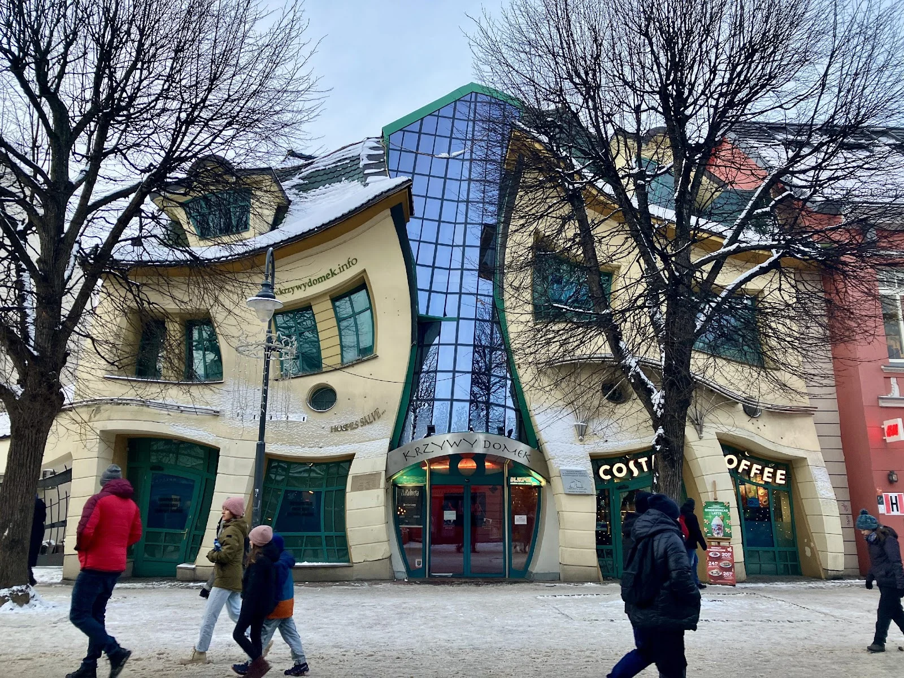
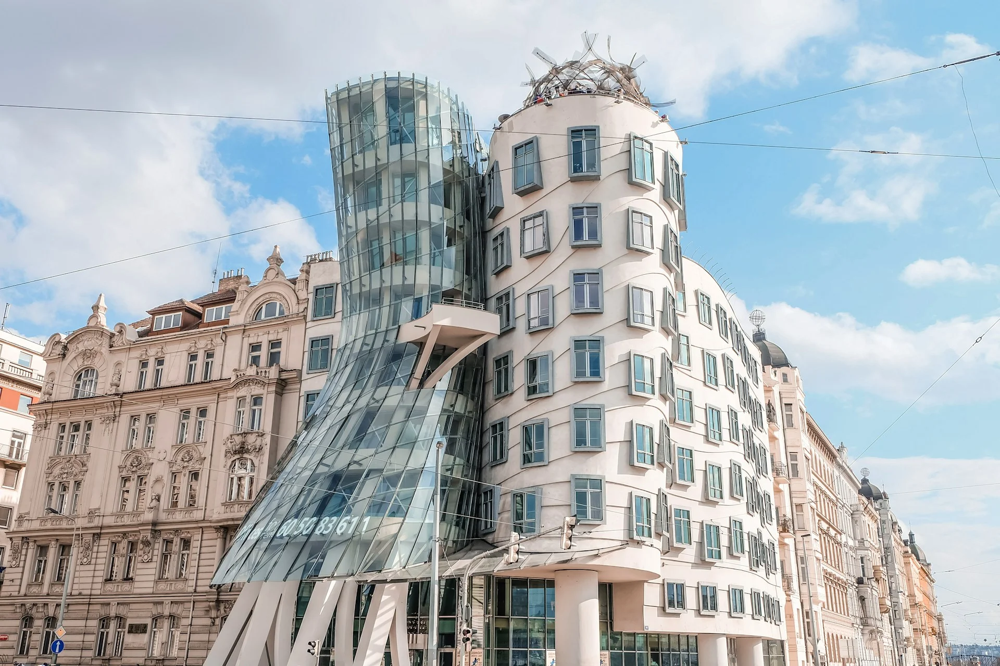
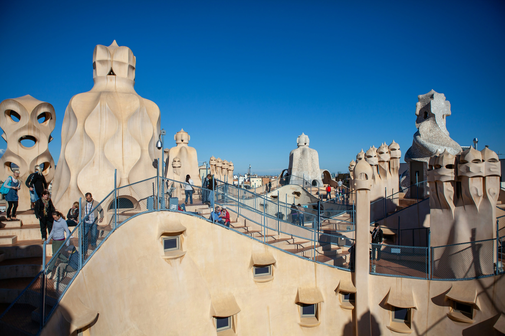
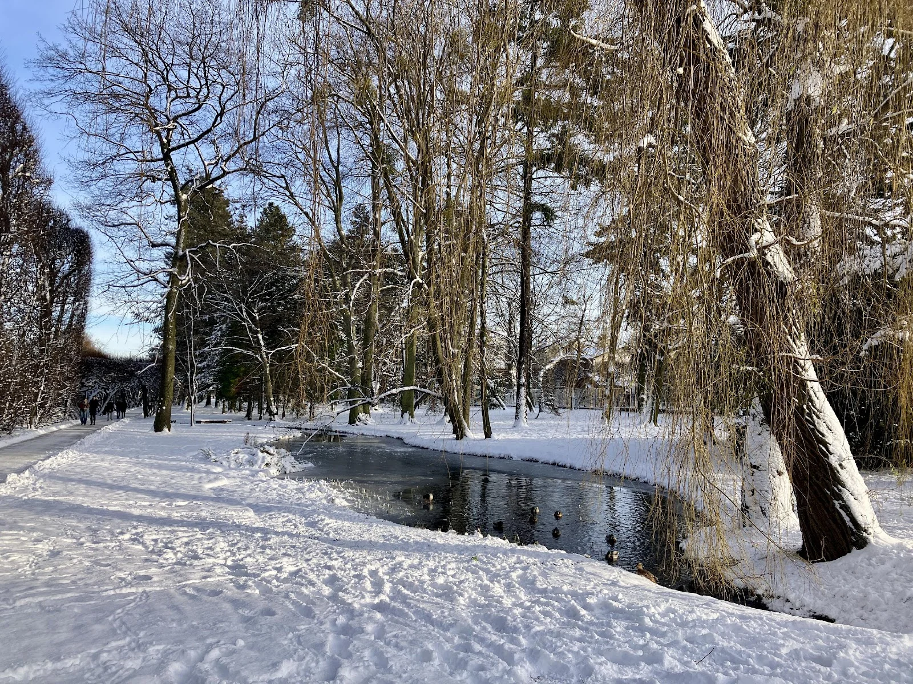
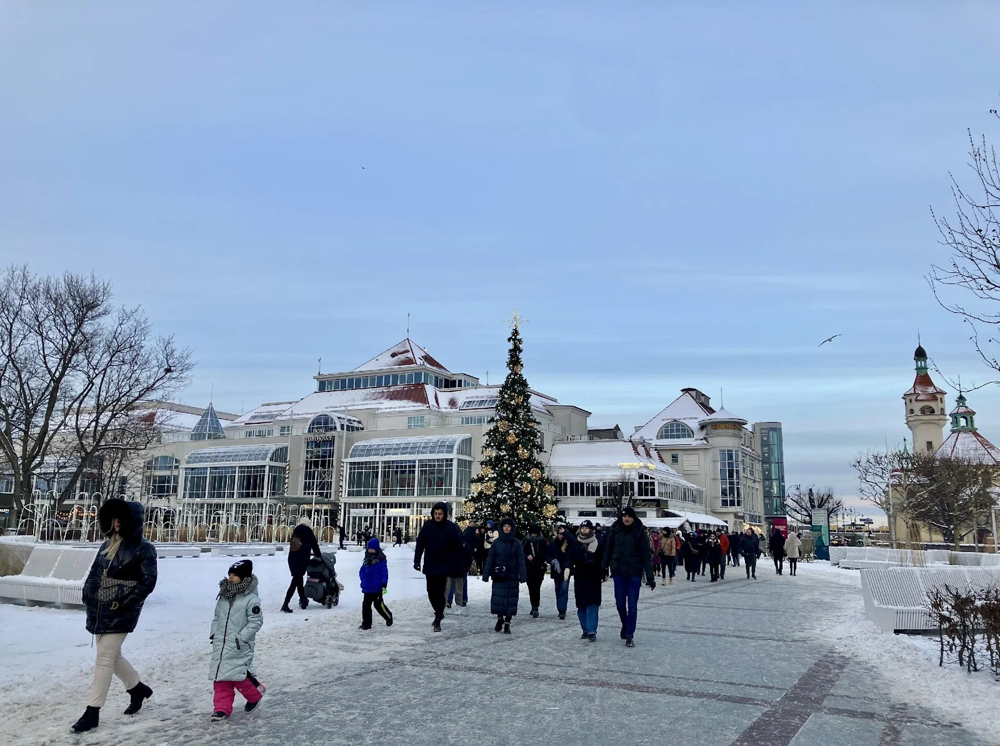

索伯特（波蘭語：Sopot）是個位於[波蘭](/country/波蘭/)北部的濱海城市，與[格但斯克（波蘭語：Gdańsk）](/city/格但斯克/)、格丁尼亞（波蘭語：Gdynia）組成三聯市都會區（波蘭語：Trójmiasto），許多旅人會這三個地方一起玩。

一戰後凡爾賽條約（英文：Treaty of Versailles）將索伯特納入格但斯克自由市（波蘭語：Wolne Miasto Gdańsk）。1920 年，索伯特開了第一間賭場，七年後索菲特酒店（英語：Sofitel Grand Hotel）正式營運，並於 1990 年開始經營賭場生意，成為波蘭暨華沙和克拉克夫後的第三座賭場。

二戰後的索伯特一直到 1989 年都沒有太大的改建，後來卻是波蘭國內最先被納入市容振興計畫的城市之一。融合當地富含礦物質鉀和鎂，號稱對肌肉放鬆及可改善呼吸道症狀的溫泉體驗，以及主要街道蒙特卡西諾（波蘭語：Ulica Bohaterów Monte Cassino）上琳瑯滿目的小店、畫廊、咖啡廳等，讓人一想到索伯特，就想到美好假期。



從格但斯克搭火車，半小時抵達索伯特，步行七分鐘便抵達著名的蒙特卡西諾大街了。 

火車站月台都有售票亭或售票機器，公車則是上車後掃碼買票。



### 索伯特自由行景點｜索伯特海邊木棧道（英文：Molo Pier ）

儘管在冬天前往索伯特海邊，並沒有陽光沙灘比基尼的夏日美景，天空甚至不滿一層灰白雲朵，一月空氣冷冽，每個人都裹緊大衣，然而放眼望去遼闊的海平面、低空飛翔的海鷗，以及向盡頭延伸的方正木棧道，使波蘭的冬天更顯冷冽清新。

這條歐洲最長的海邊木棧道，帶領遊客直直走向淺藍色的波羅的海，不只是今日波蘭北邊的旅遊勝地，過去也是貴族們興建夏日度假小屋的熱門地點。

### 索伯特自由行景點｜歪樓（波蘭語：Krzywy Domek）

這棟看起來被特效扭曲的房子，是一個座落在蒙特卡西諾的建築物，在所有方正整齊的房屋中，顯得特別引人注目。

「歪樓」是 2001 年由波蘭建築師 Szotynscy Zaleski 設計，於 2004 年正式營運。曾多次獲得三聯市地區的獎項。創作靈感來自波蘭插畫家 Jan Marcin Szancer 的童話故事，以及瑞典藝術家 Per Dahlberg 的超現實作品。與位於捷克的跳舞的房子（英文：Dancing House）和加泰隆尼亞建築師安東尼・高第（西班牙文：Antoni Gaudí）的作品有異曲同工之妙。


捷克布拉格跳舞的房子（捷克語：Tančící dům），由克羅埃西亞裔捷克建築師 Vlado Milunić 設計，並與加拿大建築師 Frank O. Gehry 聯手打造。



加泰隆尼亞建築師安東尼・高第的作品——米拉之家（西班牙文：Casa Mila）。


### 索伯特自由行景點｜索伯特公園（波蘭語：Park Oliwski）

索伯特公園（Park Oliwski）位於波蘭格但斯克的奧利瓦區，是一座歷史悠久的公園。公園最初屬於當地的修道院，後來改建為法式與英式風格結合的園林。園內有優雅的林蔭大道、修剪整齊的綠籬迷宮、溫室植物園，以及著名的奧利瓦大教堂。索伯特公園是當地居民與遊客散步、休憩的熱門景點，四季皆有不同的景色。

冬季的時候造訪此地，隔著羽絨衣還是瑟瑟發抖，但一片皎潔的雪景和路邊像童話故事一樣的一棟棟民房，和建築物密集的大城市相比，有另一種小鎮風情。

在溫帶地區的國家，孩子們從小就對雪不陌生。下雪有下雪的娛樂，像是這群在公園裡恣意奔跑的孩子，爭先從小坡上方滑小雪橇下來。路上也可見到爸爸媽媽「拉」著坐在小雪橇裡的孩子散步。讓人看著看著都想買一個自己來玩玩。

### 索伯特自由行景點｜海邊的現代藝廊

這間藝廊在木棧道與蒙特卡西諾大街中間，隱藏在一棟結合餐館的建築物二樓。筆者特別喜歡逛這種旅行中不經意發現的藝廊，而這次的主題和女性有關，在被外頭的寒風吹了一天後，筆者毫不猶豫，就跑進去了溫暖的室內，旅程也從一片冰雪世界轉為知性的藝術饗宴。

圖為連接木棧道和步行街的廣場，左邊的建築物即是藝廊所在位置。除了有不定期展覽，一樓也有海鮮餐廳和傳統料理。除了暖和的市內餐廳，周邊也有熱食攤販，販賣如冬季必喝的熱紅酒（英語：Mulled wine）、燻腸、濃湯等等。

遊客們來到索伯特，除了可以到海邊走走、大街逛逛，還能繼續搭公車前往格丁尼亞玩喔！