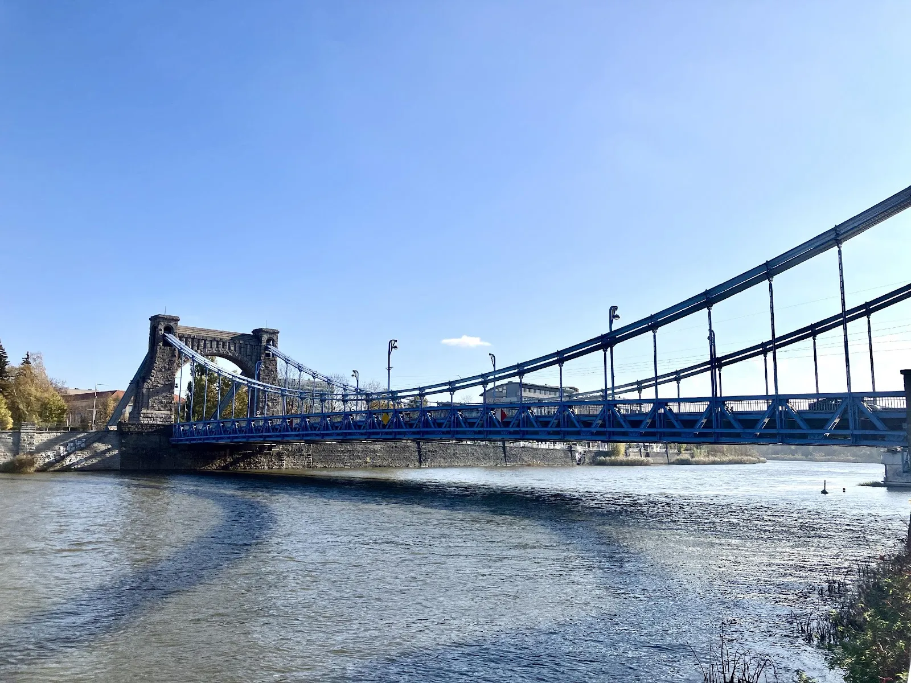
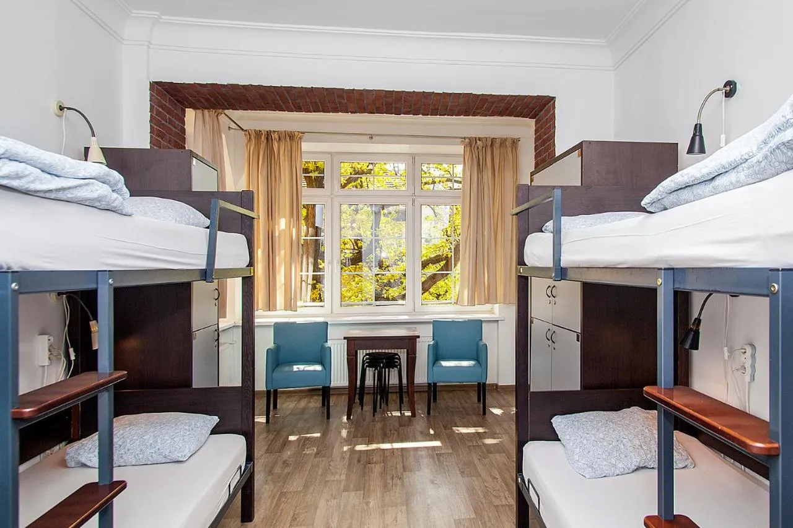
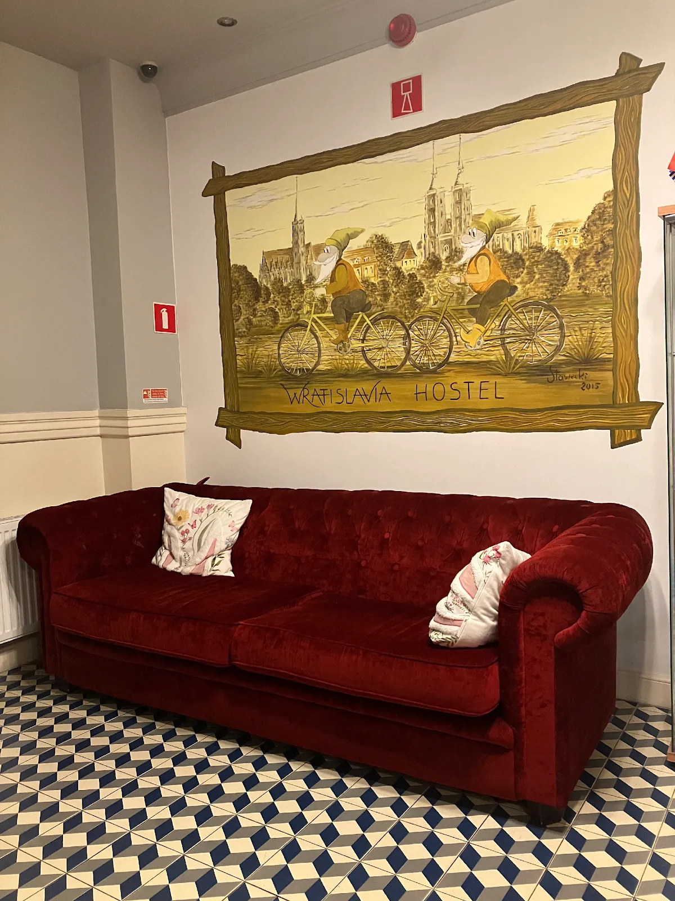
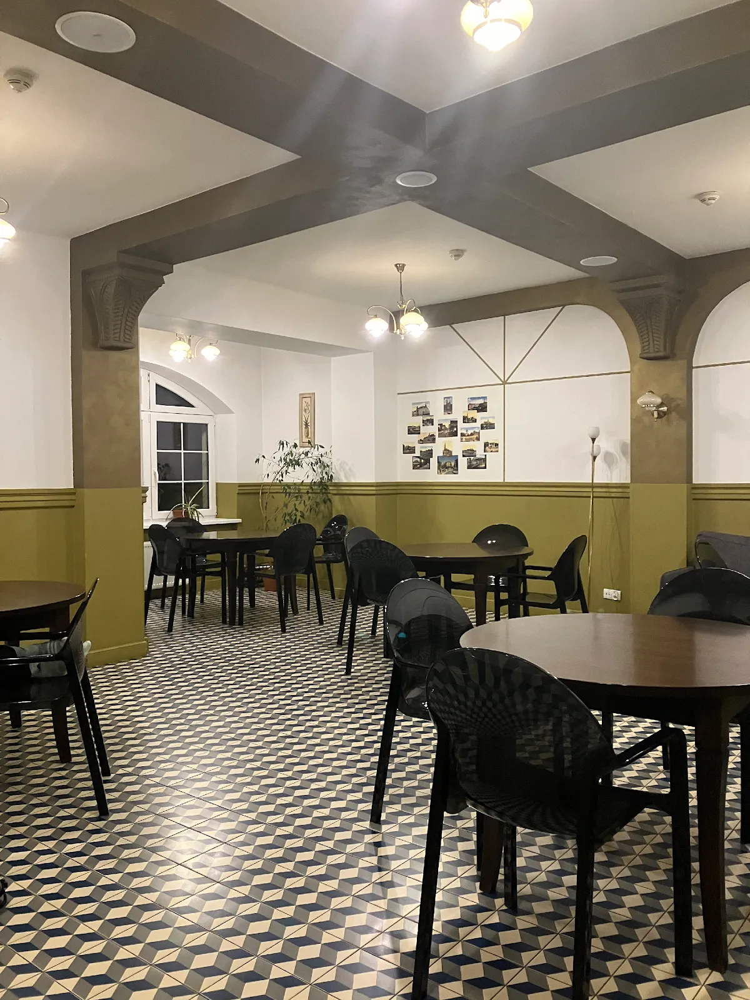
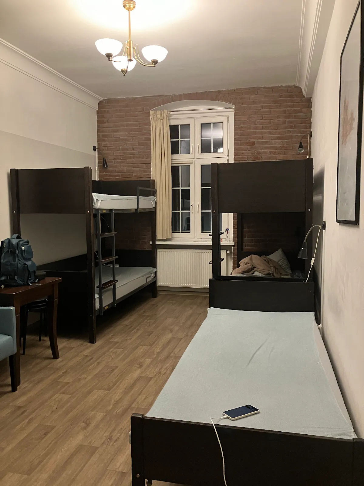
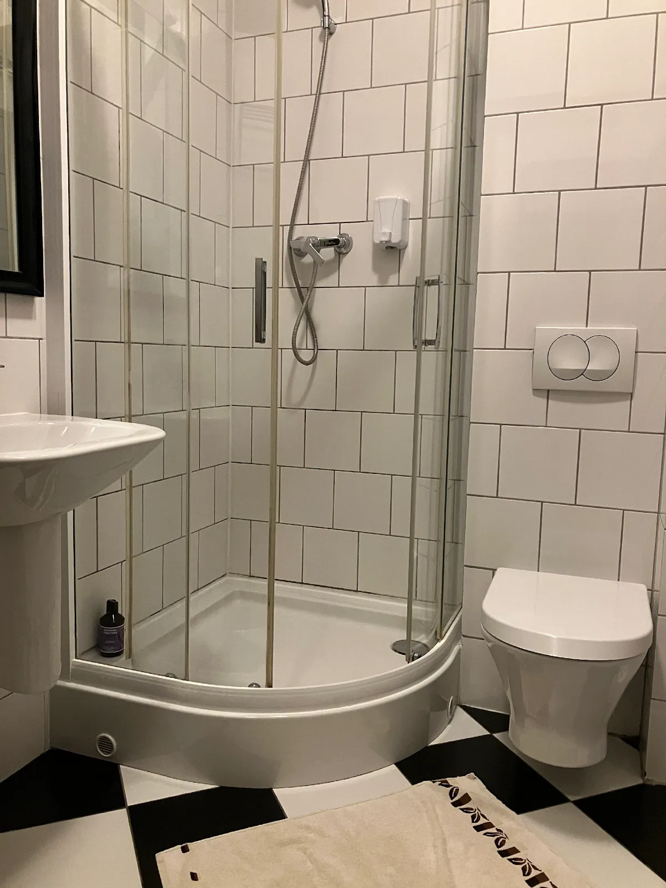

來到[波蘭](https://exittaiwan.com/tags/%E6%B3%A2%E8%98%AD/)後，終於迎來第一個連假：[諸靈節](https://culture.pl/zht/article/%E8%AB%B8%E9%9D%88%E7%AF%80-%E6%B3%A2%E8%98%AD%E7%9A%84%E6%B8%85%E6%98%8E%E7%AF%80%E6%9C%89%E5%93%AA%E4%BA%9B%E5%82%B3%E7%B5%B1)（波蘭語：Wszystkich Świętych）！自從得知消息後，筆者立馬手刀訂了位在卡托維治的隔壁、弗羅茲瓦弗（Wrocław）的車票和住宿，準備一個人好好的玩波蘭第三大城。

身為學生，用最經濟實惠的方式旅行是最適合不過了，而歐洲的青年旅館果然沒有讓人失望！打開 **[Booking.com](https://www.booking.com/?aid=7956794)**，馬上就看到當地推薦的**瓦特拉旅館 [Hotel Wratislavia](https://www.booking.com/hotel/pl/hostel-wratislavia-wroclaw.xt.html?aid=7956794&no_rooms=1&group_adults=2)**，就算日期接近，房間還是有打折，因此一個人住下來，一晚五百塊台幣有找。

瓦特拉旅館的地理位置相當便利，走路十五分鐘即抵達火車站，便利商店、超市、餐館都在步行可達的距離。

但筆者最喜歡的，還是瓦特拉旅館的公共區域。雖然是獨旅，但旅途中的相遇總是有驚喜，瓦特拉旅館設有交誼廳、廚房、讀書間等公共空間，秋冬的波蘭天暗的快，早早回到旅館後並不是一天的結束，在佈置溫暖的客廳和不同年齡、來自各地的旅人們交流，才是意外卻美好的小插曲。

## 瓦特拉旅館 Hostel Wratislavia 基本資料

* 名稱：瓦特拉旅館 Hostel Wratislavia
* 地址：Komuny Paryskiej 19, 50-451 Wrocław（[Google Maps](https://maps.app.goo.gl/fhiThkmZZZjEsmiD7)）
* 價格：雙人房 1600 / 晚；單人房 1300 / 晚；背包客（混宿、四五六床）500 / 晚
* [**前往 Booking.com 查價**](https://www.booking.com/hotel/pl/hostel-wratislavia-wroclaw.xt.html?aid=7956794&no_rooms=1&group_adults=2)

#### 給台灣自由行旅客：

  * 有 24 小時櫃檯
  * 有提供置物櫃 / 鑰匙
  * 部分備品須租借：浴巾、吹風機
  * 建議自備沫浴乳和洗髮乳
  * 使用廚房約 40 台幣 / 天
  * 早餐加購約 150 台幣

#### 瓦特拉旅館 Hostel Wratislavia 周邊景點：

  * 民族博物館（波蘭語：Muzeum Etnograficzne）步行15分
  * 哥白尼公園（Nicolaus Copernicus Park）步行15分
  * 中央集市廣場（波蘭語：Rynek）步行20分
  * 弗羅茲瓦夫國家博物館（波蘭語：Muzeum Narodowe we Wrocławiu） 公車13分
  * 弗羅茲瓦夫主教座堂（波蘭語：św. Jana Chrzciciela）公車13分

## 瓦特拉旅館 Hostel Wratislavia 實際入住體驗（公共區域）

### 客廳

瓦特拉旅館雖然沒有一個正式的客廳，但有類似接待廳的空間。設有一套沙發、一套桌椅和一台電視。筆者傍晚回到旅館時，看見許多遊客帶著啤酒會在這聊天。如果想要安靜一點的空間，旁邊也有刻意設計類似凹進去的地方，面著牆設有多高腳椅及檯燈，想閱讀或寫作的人可以好好利用。

### 廚房

廚房為台幣 40 元使用一整天。桌上已有茶包、糖、鹽等物品，有微波爐、電磁爐、熱水瓶、大冰箱以及餐具。如果是三五好友一起旅遊的話，可以一起下廚，但記得要將剩食清理乾淨。

筆者當天進去廚房加熱晚餐時，發現爐子上還有煮到一半的甜菜根，以及剩下來的義大利麵，只能說是旅客公德心的問題。

### 交誼廳

交誼廳的空間反而比客廳大，寬敞安靜。大概有七、八張桌子。免費使用。

## 瓦特拉旅館 Hostel Wratislavia 實際入住體驗（客房和廁浴）

### 房間

筆者訂的是五人混宿背包客房，設有置物櫃。

可能因為旅遊的時候算是淡季，第一天只有兩人入住，第二天才有四個人。旅館備有床包，需自己套。床邊有插座和床頭燈。整體空間寬敞，廁所明亮乾淨，熱水很給力，設有暖氣，浴巾掛在暖氣附近，隔天就乾了。

可惜房間內除了廁所並無垃圾桶，如果將食物丟在廁所垃圾桶，可能會有味道。

### 廁浴

在入夜後剩下不到五度的波蘭，能好好沖個熱水澡是件幸福的事。旅館內的熱水很強，浴室內也有暖氣，乾濕分離的門拉開後，不必擔心冷空氣瞬間撲上來的問題。

較特別的是浴室地板是黑白格子相間的簡約風，就算是洗澡時間，也可以感受到旅館設計的用心。

## 瓦特拉旅館 Hostel Wratislavia 整體評價

### 優點

- 附近有公車站和電車站
- 整潔度佳
- 地點入夜後安靜

### 缺點

- 沒有顯眼招牌，旅客不容易找到
- 廚房、吹風機需收費
- 從老城區步行回到旅館，有一段路比較暗

筆者認為廚房應該要包含在服務內，畢竟青年旅館的意義，某部分也是希望不同地區的人能夠互相交流，廚房作為吃飯聊天的好地方，更應該供人免費使用才對。

整體而言，筆者對於本次住宿非常滿意，可能因為是旅遊淡季，旅客不多，也很幸遇的都是遇到有禮貌的旅客們。整趟旅途中的驚喜，大概就是意外結識的哥倫比亞人，在第二天逛教堂時偶遇，變成了二、三天的走路好夥伴。
