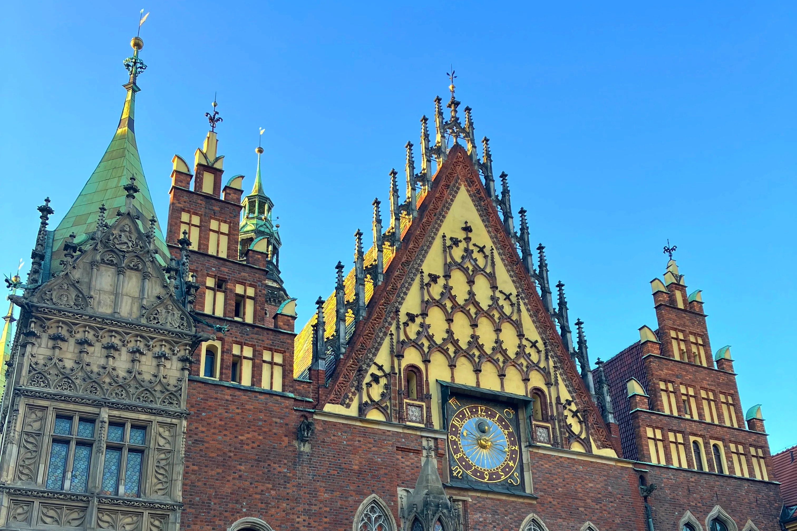
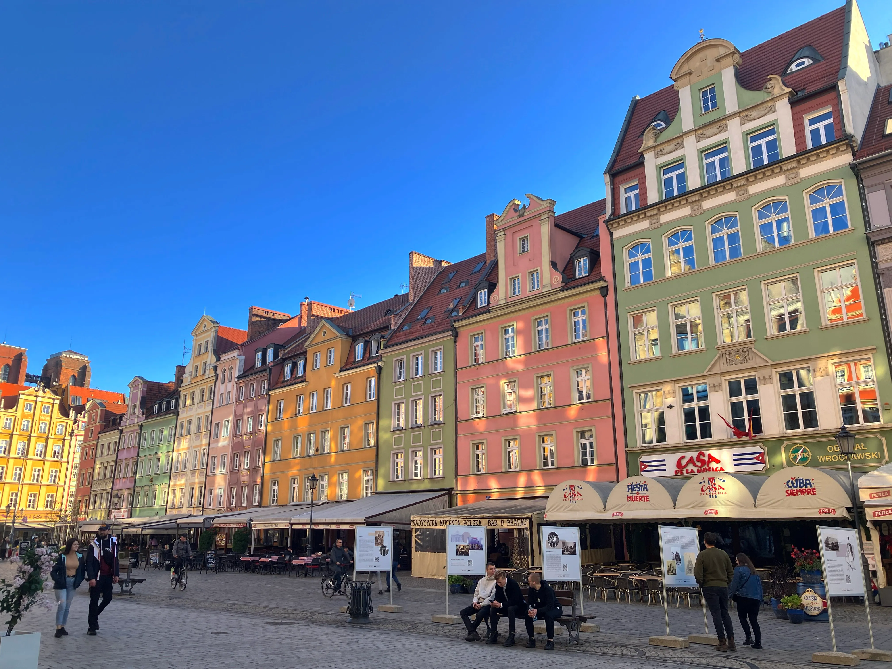
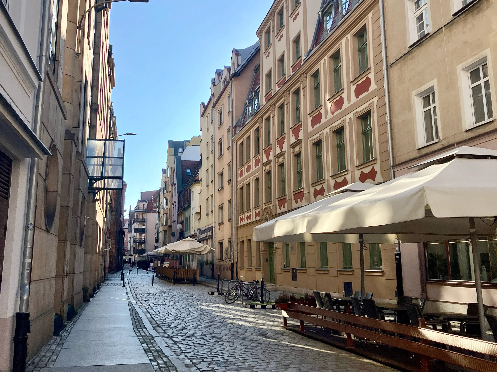
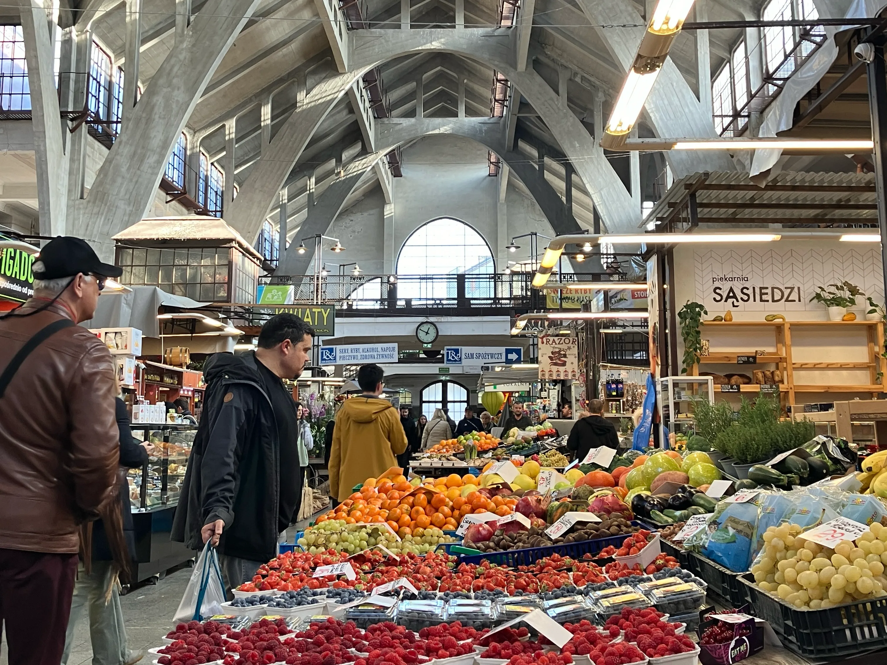
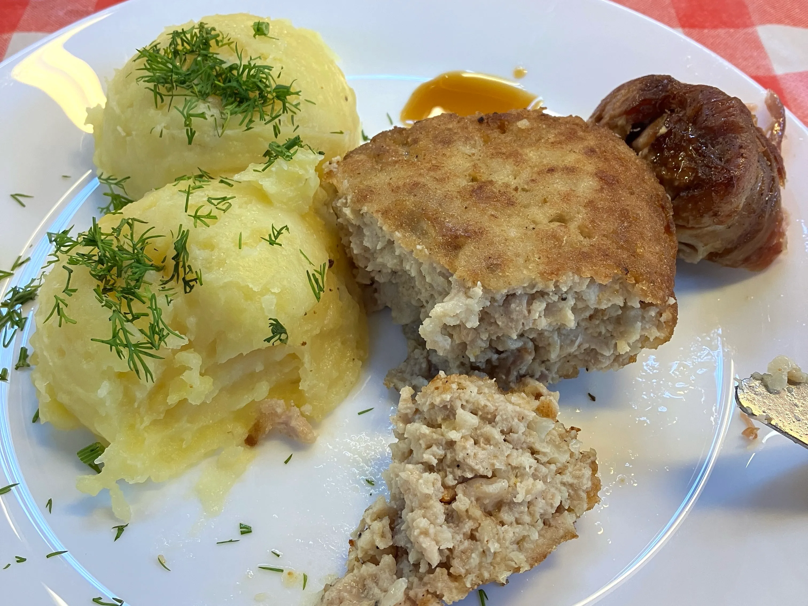
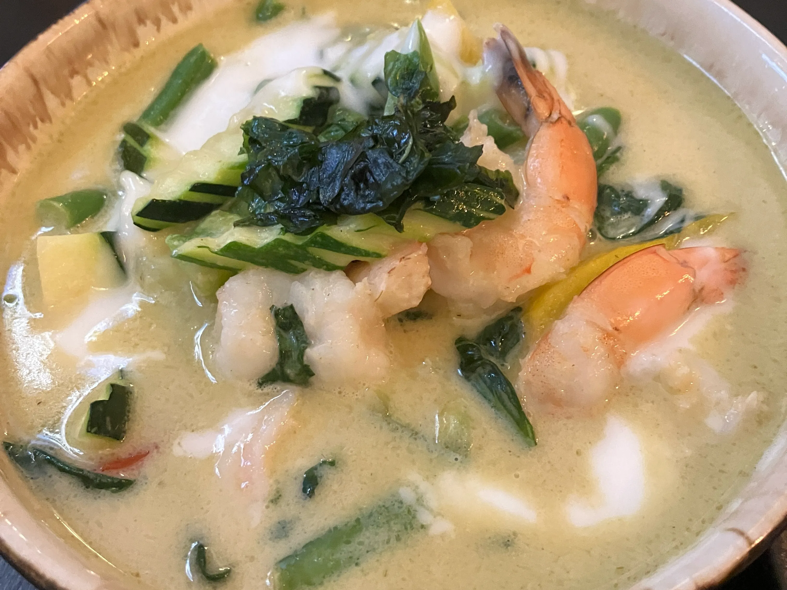

## 波蘭旅遊：弗羅茲瓦弗老城廣場簡介

弗羅茲瓦弗（波蘭語：Wrocław）的老城廣場，早期是作為居民交易（麵包、肉類、織布、陶器）等的地方。鞋匠和裁縫師及其他特殊手工藝的師父，也在廣場擁有自己的小店。

雖然經歷多多次整修，但大廣場上大部分的建築仍保持原樣，而它也是**[波蘭](http://exittaiwan.com/tags/%E6%B3%A2%E8%98%AD/)**第二大廣場，僅次於克拉克夫（波蘭語：Kraków）。現今共有三個廣場構成整個老城區，分別為新集市廣場、舊集市廣場和鹽巴廣場。

## 波蘭弗羅茲瓦弗景點：鹽巴廣場 Plac Solny

除了繽紛的色彩，鹽巴廣場的命名來自中世紀時重要的民生物質——鹽巴。

當時的鹽巴價格高昂，大多在該廣場交易。現在的鹽巴廣場，主要是販賣花卉的地方，也是弗羅茲瓦弗內唯一一個任何時間都可以買到花的地方。

小知識：在鹽巴廣場底下，也就是所有旅客們的腳下，有一座二戰時德軍建造的防空洞。

老城內的巷弄，旅客不像克拉克夫那麼多，漫步起來很舒服，還可以觀察歐洲人佈置餐廳的巧思。

## 弗羅茲瓦弗景點：小矮人

現今的廣場上除了有教堂、餐廳、花店、街頭藝人等，還有隨處可見，藏在建築物間的小矮人。

弗羅茲瓦弗最著名的就是隱藏在各個角落、橋上、建築物窗台等的小矮人，代表了當初在「橙色運動」（波蘭語：Pomarańczowa Alternatywa）中起義對抗蘇聯軍隊的人們，該場社會運動結束了1980年代，在波蘭的言論管制和共產政權。

每個小矮人們都坐著不同的事，有從甜點店偷巧克力的、有救火員、有安靜讀書的，每個都被刻畫得很生動，旅客甚至可以到遊客中心拿小矮人收集卡，挑戰找出所有的小矮人。

## 波蘭景點：集市大廳

弗羅茲瓦弗有各式各樣的農夫市集，包括小農市集、食物廣場、特殊市集（紅酒、古著等）

當天筆者造訪的是 Wrocławski Bazar Smakoszy （暫譯：弗羅茲瓦弗美食市集），就在輕軌站的旁邊。

內有傳統波蘭菜餐館（比外面的正式餐廳便宜一點，類似台灣的便當店，在當地被稱為牛奶吧）、小農農產品、土耳其糖果店、起司專賣店、肉舖、義大利薄餅店、花店、咖啡廳等，佔地不算大，但環境乾淨通風，值得造訪。

集市廣場裡牛奶吧的餐點。Kotlet mielony（暫譯：豬肉排）。是一種用豬絞肉做成的煎肉餅，通常會搭配馬鈴薯泥。

## 弗羅茲瓦弗餐廳推薦：Pha Tha Thai 泰式餐廳

開充斥著旅客的主廣場後，筆者跟前一天才結識的朋友在附近巷弄閒晃，誤打誤撞發現了一間泰式餐廳。

其實泰式、越式餐廳在波蘭蠻常見的，亞洲學生吃膩了歐洲食物，想來一碗河粉其實不難，只是價錢大概是台灣越南河粉店的三倍左右。但身為旅客，就決定偶爾放縱自己一下，結果一吃就驚為天人，一秒回到亞洲！

圖中是筆者點的綠咖哩，除了吃到當地偏貴的蝦子（非常大隻且有彈性），香料和椰奶的味道直接讓人忘記無聊的歐洲食物，再來是久違吃到的米飯，真的是只有留學生才懂的小確幸！

但如果覺得遠到了歐洲，當然是要吃歐洲食物呀！那在同一條街上，還有許多氣氛很不錯的餐廳，有印度風、義大利風等等，在富有歷史的建築物的陪伴下用餐，也是難忘的回憶。

餐廳均價：

* 主餐約 350～450台幣
* 飲料約 150~250台幣

（分室內、室外座位）

## 結語

弗羅茲瓦弗，這個波蘭西南部的小城，以其獨特的魅力，在眾多歐洲城市中脫穎而出。無論是歷史悠久的建築，還是充滿活力的市集，都讓人流連忘返。相信隨著時間的推移，弗羅茲瓦弗會吸引更多的遊客來此探索。
