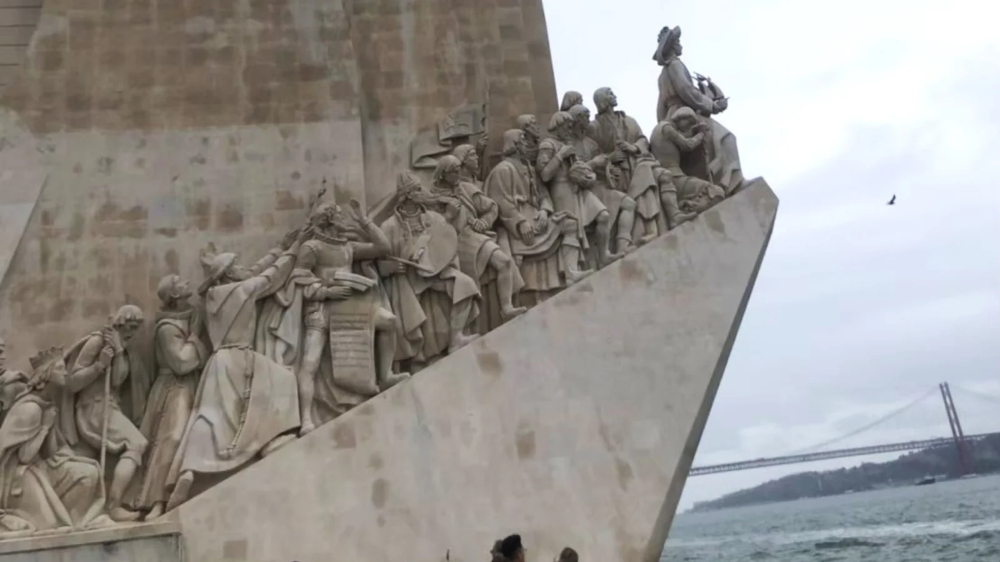
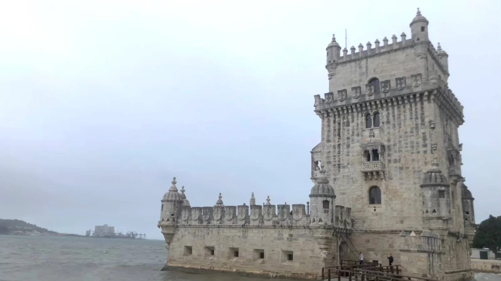
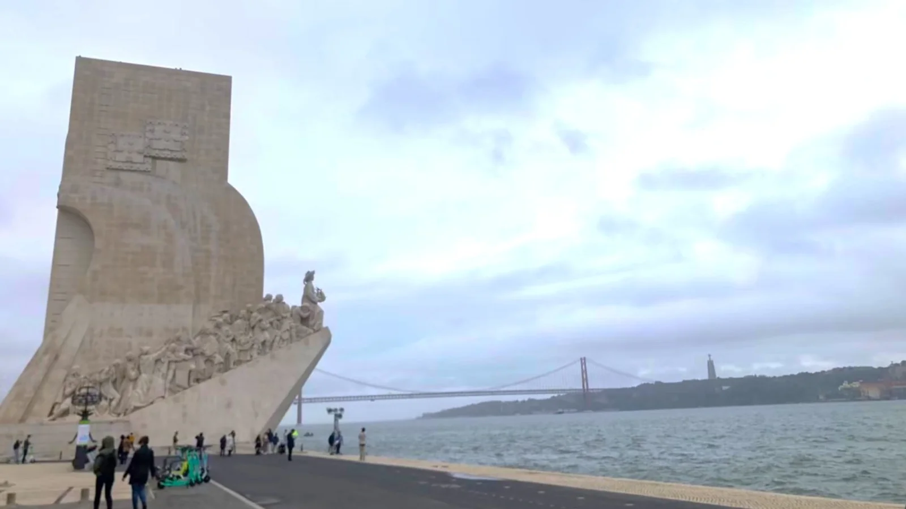
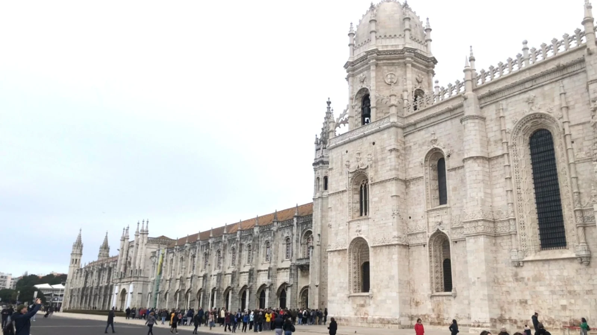

貝倫區（Belém）是里斯本最具歷史氛圍的區域，讓人看見葡萄牙15-16世紀時大航海時代的海上霸權輝煌時代。擁有壯觀的地標，如貝倫塔（Torre de Belém）、熱羅尼莫斯修道院（Mosteiro dos Jerónimos）和發現者紀念碑（Padrão dos Descobrimentos），這些都是世界遺產，吸引來自世界各地的遊客。

## 貝倫區景點 - 貝倫塔（Torre de Belém） 

* 開放（營業時間）：09:30-17:30，每周一公休  
* 地址：Av. Brasília, 1400-038 Lisboa, 葡萄牙  
* 價格：一位成人 15 歐元，透過 [Klook 購票](https://affiliate.klook.com/redirect?aid=41451&aff_adid=1034349&k_site=https%3A%2F%2Fwww.klook.com%2Fzh-TW%2Factivity%2F136998-belem-tower-ticket-in-lisbon%2F%3FclickId%3Db56235f9e3%26spm%3DSearchResult.SearchResult_LIST%26utm_medium%3Daffiliate-alwayson%26utm_source%3Dnetwork%26utm_campaign%3D13694%26utm_term%3D537641%26utm_content%3D)
  ※持有 Lisboa Card 可免費入場

建於1514-1520年，是為了保護里斯本港口。當時葡萄牙正值大航海時代，這座塔曾經是迎接或送別探險家的重要地標！雖然現在看起來很小巧，但以前是里斯本的重要軍事據點。沿著河畔散步，感受歷史氛圍外，還可以看到 4 月 25 日大橋（Ponte 25 de Abril），建於 1966 年，連接里斯本和對岸的阿爾馬達（Almada），遠看很像舊金山的金門大橋！它不只是公路橋，下面還有鐵路。站在貝倫區的河邊就能遠遠看到這座壯觀的大橋。

## 貝倫區景點 - 發現者紀念碑（Padrão dos Descobrimentos）

* 開放（營業時間）：目前**發現者紀念碑因整修而關閉，須等官方公布重新開放時間**。 
* 地址：Av. Brasília, 1400-038 Lisboa, 葡萄牙  

建於 1960 年，為了紀念葡萄牙大航海時代的推手–王子恩里克航海王子（Infante Dom Henrique）逝世 500 週年。紀念碑上有 33 位航海時代的重要人物，包括達伽馬和麥哲倫等等。設計像是一艘船，大家都站在船頭，準備航向未知的世界非常有氣勢！

## 貝倫區景點 - 熱羅尼莫斯修道院（Mosteiro dos Jerónimos）

* 開放（營業時間）：09:30-17:30，每周一公休  
* 地址：Praça do Império 1400-206 Lisboa, 葡萄牙  
* 價格（如有）：一位成人 18 歐元，透過 [Klook 購票](https://affiliate.klook.com/redirect?aid=41451&aff_adid=1034352&k_site=https%3A%2F%2Fwww.klook.com%2Fzh-TW%2Factivity%2F89422-jeronimos-monastery-admission-lisbon%2F%3FclickId%3D95acff4893%26spm%3DSearchResult.SearchResult_LIST%26utm_medium%3Daffiliate-alwayson%26utm_source%3Dnetwork%26utm_campaign%3D13694%26utm_term%3D537641%26utm_content%3D) 
  ※持有 Lisboa Card 可免費入場

這座修道院是 1502 年開始建造的，當時是為了紀念葡萄牙航海家瓦斯科・達伽馬（Vasco da Gama）成功發現印度航線而興建的。修道院的資金來自香料貿易的稅收，整個建築的雕刻相當精美！

## 如何抵達貝倫區

搭乘地鐵綠線到 Cais do Sodré 後轉成 728 號公車至 Mosteiro Jerónimos 下車即可抵達貝倫區，而貝倫區的景點都相當集中，步行都可以抵達。
