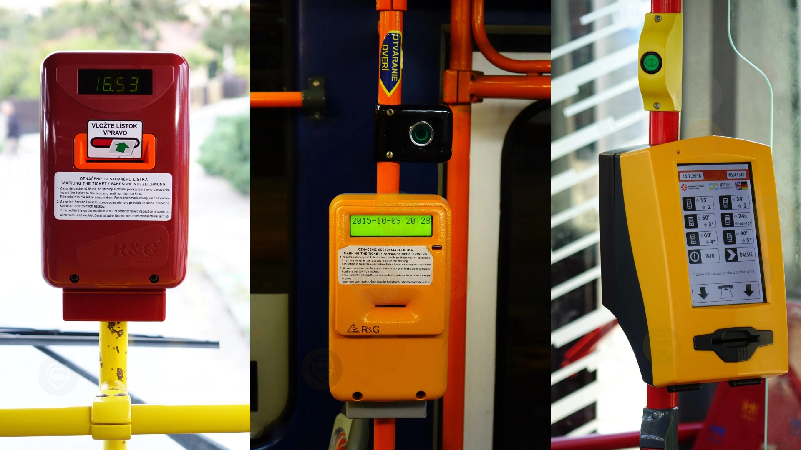

>  **使用說明書**\
這篇文章分成了三大章節，從對布拉提斯拉瓦的基本了解、交通、到旅遊景點都幫你整理好了！文章比較長，建議配合目錄更快速找到資訊。\
\
喜歡隨興安排旅遊的人，只需要看**行前須知**來確保出發前對布拉提斯拉瓦有最基本的了解讓你的旅程順遂！\
\
喜歡把一切都規劃好的旅客，也可以先把文章加入書籤列，旅途中隨時回來查看需要的資訊。

對於很多旅行者來說，旅行過的國家數量就像是在搜集徽章一樣，數量越多在某種程度上也代表了旅行資歷豐富度。斯洛伐克的首度布拉提斯拉瓦，就是一個很適合在一天內踩踩點，表示到過斯洛伐克一遊的城市。

文章目錄：
- [布拉提斯拉瓦自由行 — 行前須知](#布拉提斯拉瓦自由行--行前須知)
- [布拉提斯拉瓦交通攻略](#布拉提斯拉瓦交通攻略)
- [布拉提斯拉瓦推薦景點](#布拉提斯拉瓦景點推薦)

## 布拉提斯拉瓦自由行 — 行前須知

### 關於布拉提斯拉瓦的迷思
**是首都沒錯**
雖然布拉提斯拉瓦的市中心老城區規模不是很大，景點也不像隔壁的維也納這麼有名，還有些地方看起來年久失修，不過它就是斯洛伐克的首都沒錯，不用懷疑。

**斯洛伐克和斯洛維尼亞**
就像奧地利和澳洲、台灣和泰國的道理一樣，千萬別把斯洛伐克（英文：Slovakia）和斯洛維尼亞（英文：Slovenia）搞混了！

### 布拉提斯拉瓦氣候

布拉提斯拉瓦的氣候和維也納差不多，相比之下甚至比維也納好一點，因為風不會像維也納吹的這麼狂。

### 布拉提斯拉瓦基本資訊

- 布拉提斯拉瓦是斯洛伐克的首都
- 斯洛伐克官方語言：斯洛伐克語
- 斯洛伐克屬於歐盟申根區，台灣人只需要有效護照就可以入境
- 斯洛伐克電壓 / 插頭：230V / 50Hz，歐規雙圓孔插座
- 斯洛伐克生水：可直接飲用
- 斯洛伐克小費文化：非必要，可適當給予 10 ~ 20%

## 布拉提斯拉瓦交通攻略

> 想要把圖片存下來嗎？[**免費下載布拉提斯拉瓦高清交通路線圖**](https://exittaiwan.gumroad.com/l/bratislava)

### 布拉提斯拉瓦機場交通

布拉提斯拉瓦有一座國際機場，但是起降的班機數量非常少，絕大部分的外國旅客都是[飛到維也納國際機場](https://exittaiwan.com/posts/%E7%B6%AD%E4%B9%9F%E7%B4%8D%E6%A9%9F%E5%A0%B4%E5%88%B0%E5%B8%82%E5%8D%80%E4%BA%A4%E9%80%9A%E5%85%A8%E6%94%BB%E7%95%A5/)，再從維也納出發前往布拉提斯拉瓦

維也納和布拉提斯拉瓦之間來回主要有火車和巴士兩種交通方式，想要體驗不同樂趣的人，也可以搭船遊多瑙河到布拉提斯拉瓦。

### 布拉提斯拉瓦市區交通：票價和種類

如果你只打算在老城區和其周圍做半日～一日的市區觀光，那麼布拉提斯拉瓦的市區交通就非常簡單易懂。

雖然布拉提斯拉瓦的交通是用區域劃分、再依照車票有效的時間（30 分鐘、1 小時、1.5 小時等等）來區分票種，但是**在老城區和其周圍，交通區域上都屬於核心區 100 和 101**。所以對於大多數來自台灣、並且是在布拉提斯拉瓦半日遊或一日遊的旅客來說，你只需要做一個簡單的決定：**你會不會在一天內搭超過四趟車（不包含轉乘）？**

如果會的話，那就直接買 24 小時票比較划算；如果不會的話，那就每次要搭車買單程票比較划算。

#### 購票方式一：上車時手機感應、信用卡付款（僅限單程票）

上車時手機感應、信用卡付款是最推薦的方式。只要把手機或信用卡靠在售票機螢幕下方的感應處並等待幾秒鐘（不需要觸碰螢幕選擇票卷），螢幕就會顯示是否購票成功（綠色文字就是購買成功）。

如果是上車時在車上的售票機用手機感應、信用卡購票，那麼要記住幾點：

- 每次上車都要感應一次（轉乘也是）
- 你只能幫自己買票，就算感應兩次也是在幫自己買票
- 幾乎所有大眾交通工具車上都有可以用手機感應、信用卡購票的售票機，但是有少數老舊的車型沒有，所以如果看到來了一台很老舊的車，可以考慮等下一班或是用實體或 App 電子票卷。
- **地域性（長距離）的巴士和火車上無法使用此種購票方式。**

除了方便，這種購票方式一天最多只會扣款到一日票的價格，所以搭了超過四趟車就等於自動變成一日票（但每次上車都還是要感應，只是不會扣款）。

#### 購票方式二：實體票卷（單程票 / 全日票）

實體票卷的唯一好處大概是票卷的有效期。

對於買單程票的人來說，可能會擔心塞車問題，但以紙本實體票來說，只要表定行程時間是小於等於三十分鐘，就算遇到塞車所以超過三十分鐘也不會被罰款，而這項規則只適用於實體票卷，不適用於電子票卷。

使用實體票卷，上車時別忘了要打票！

#### 購票方式三：電子票卷（單程票 / 全日票）

想要買電子票卷的人，就可以先下載布拉提斯拉瓦交通的 App：IDS BK 了！買電子票卷的好處是相對實體票卷來說打 9 折。

要是你待在布拉提斯拉瓦好幾天、或是你來一日遊但是不是待在市中心、可能會出 100 和 101 交通區域的話，建議直接下載 IDS BK 的 App，可以直接輸入起始站和終點站名，App 就會告訴你應該買哪種票囉。

另外，**在週末（六日）和其他國定假日，24 小時的日票也可以當作家庭票使用**。一張票就可以給最多兩個大人和三個小孩使用（至少一個大人和一個小孩須在現場）。

以上資訊是統整自[布拉提斯拉瓦官方交通網站](https://imhd.sk/ba/public-transport)，各項資訊請以官方網站為主。

## 布拉提斯拉瓦景點推薦

布拉提斯拉瓦以首都來說景點不算非常多、也不是非常有名，但反而給旅客一種不一樣的、處處有驚喜的旅遊體驗。以下介紹幾個稍微知名一點的景點，還有更多小景點等你自己去發掘！

### 布拉提斯拉瓦城堡

布拉提斯拉瓦的城堡區是你進城後就會馬上看到的指標性景點。城堡的外觀雖然相對簡單純樸，但城堡周圍有不少綠蔭，還有一個城堡花園，春夏季陽光普照時是一個很適合走一走、眺望布拉提斯拉瓦市景的地方。

- 地址：Hrad, 811 06 Bratislava（[Google Maps](https://maps.app.goo.gl/A1wW8to2AD6xdhp4A)）
- 營業時間：每天 8:00 ~ 22:00
- 門票：大部分免門票，不定期展出的特定展覽另外售票

### 斯洛伐克民族起義大橋 MOST SNP (UFO Tower)

新橋（斯洛伐克民族起義大橋，Most Slovenského národného povstania）是布拉提斯拉瓦跨越多瑙河的重要橋樑，全長 430.8 公尺，寬 21 公尺，連接舊城區與南岸。橋上設有一座外型酷似幽浮的觀景台，因此新橋也常被稱為「幽浮大橋」。橋梁採雙層結構，上層為車道，下層則供行人通行。

幽浮觀景台高 95 公尺，設有電梯直達，並兼作餐廳使用。遊客可在此一邊享受美食，一邊俯瞰布拉提斯拉瓦的壯麗天際線，體驗獨特的高空視野。

- 地址：Most SNP, 851 01 Bratislava（[Google Maps](Most SNP, 851 01 Bratislava, Slovakia)）
- 營業時間：每天 10:00 ~ 23:00
- 門票：€6.9 ~ €12（根據時段和年齡）

### 聖馬丁主教座堂 St. Martin's Cathedral

聖馬丁主教座堂（St. Martin’s Cathedral)外觀樸素低調，卻是布拉提斯拉瓦規模最大、最重要的教堂，曾作為匈牙利王國的加冕教堂。內部採用簡潔的石造設計，沒有過多金銀雕飾，展現出古老穩重而不失莊嚴的氛圍。

最令人驚艷的是教堂內精美細緻的彩繪玻璃，與外觀的質樸形成強烈對比，增添一抹意想不到的藝術魅力。如果計劃前往布拉提斯拉瓦城堡，可以先來這裡參觀，感受教堂獨特的歷史與美感。

另外，聖馬丁主教座堂旁邊的咖啡廳 Martineum café 小巧可愛，很適合旅遊走累了之後到這邊坐著休息，順便看看歷史悠久的建築遺跡。

- 地址：Rudnayovo námestie 1, 811 01 Bratislava（[Google Maps](https://maps.app.goo.gl/Mj5Hq22x5oEVm8oi6)）
- 營業時間：每天 7:30 ~ 18:00
- 門票：免費

### 藍色教堂 / 聖伊麗莎白教堂 Church of St. Elizabeth

聖伊麗莎白教堂（Church of St. Elizabeth），建於1909至1913年，位於布拉提斯拉瓦東部。因其外觀、馬賽克、陶器與屋頂皆為藍色，被稱為「藍色教堂」。

透過玻璃望向內部，裝飾與座椅也呈現活潑的淡藍色，若從巴士站步行至舊城區，不妨順路前往一探。

- 地址：Bezručova 2, 811 09 Bratislava（[Google Maps](https://maps.app.goo.gl/wfmAsJNuzccqUWw6A)）
- 營業時間：每天早上 6:00 ~ 7:30、傍晚 17:30 ~ 19:00，週日上午 7:30 ~ 12:00
- 門票：無

### 布拉提斯拉瓦有趣的雕像

**Schöne Náci**

Schöne Náci 是少數以真實人物為原型的雕像。20 世紀初，他以風趣紳士的舉止聞名，經常在布拉提斯拉瓦城市中與女性搭話，並親吻對方的手以表敬意，成為當時的知名人物。1967 年，他因肺結核去世，市民為了紀念他而設立這座雕像，使其成為布拉提斯拉瓦最著名的地標之一。

地址：Rybárska brána 217/1, 811 01 Staré Mesto（[Google Maps](https://maps.app.goo.gl/YaiSrTPzo2VEawP89)）

**拿破崙的士兵**

在布拉提斯拉瓦的主廣場，靠近舊市政廳，有一座斜倚長椅的士兵雕像，遊客可以坐在旁邊合影留念。這座雕像與拿破崙的歷史有關，象徵著法國軍隊曾於 1805 年駐紮於此。

相傳，這名士兵在途經布拉提斯拉瓦時愛上了一位當地女子，決定留下來，最終成為氣泡酒釀造商。他的名字是 Hubert，也恰好是斯洛伐克最知名氣泡酒品牌的名稱，至今仍廣受歡迎。

地址：Hlavné námestie 358/7, 811 01 Staré Mesto（[Google Maps](https://maps.app.goo.gl/PFkRLcSYRa4jytru6)）

**Čumil 工作中的男人**

Čumil，字面意為「觀察者」，又稱「工作中的男人」，是布拉提斯拉瓦最知名的景點之一。這尊雕像從下水道探出頭來，雖然外觀低調，但只要看到人們圍觀地面，便可知道他就在那裡。

剛設立時，Čumil 常被行經的車輛壓到，如今已設立警示牌保護。來到布城，其他景點或許可略過，但這位「工作中的男人」絕對值得幾張相片。

地址：Panská 251/1, 811 01 Bratislava（[Google Maps](https://maps.app.goo.gl/rxLkVXh86QFZLRgJ9)）

## 布拉提斯拉瓦旅遊行程建議

布拉提斯拉瓦雖然整體景點不多，逛起來也感覺不太像是一個國家的首都，但它的優勢在於相對較不密集的人口、更便宜的餐廳和咖啡廳，在老城區到處走走逛逛，可以發現這座城市許多有趣的一面。

不過布拉提斯拉瓦的住宿跟維也納相比沒有更便宜，所以要來布拉提斯拉瓦的話，建議你住在[維也納](https://exittaiwan.com/posts/%E7%B6%AD%E4%B9%9F%E7%B4%8D%E8%87%AA%E7%94%B1%E8%A1%8C%E6%97%85%E9%81%8A%E5%85%A8%E6%94%BB%E7%95%A5/)，然後**挑一天天氣好的時候去半日遊或是一日遊**，在這裡吃一兩頓飯也比起在維也納吃飯省下不少旅費！