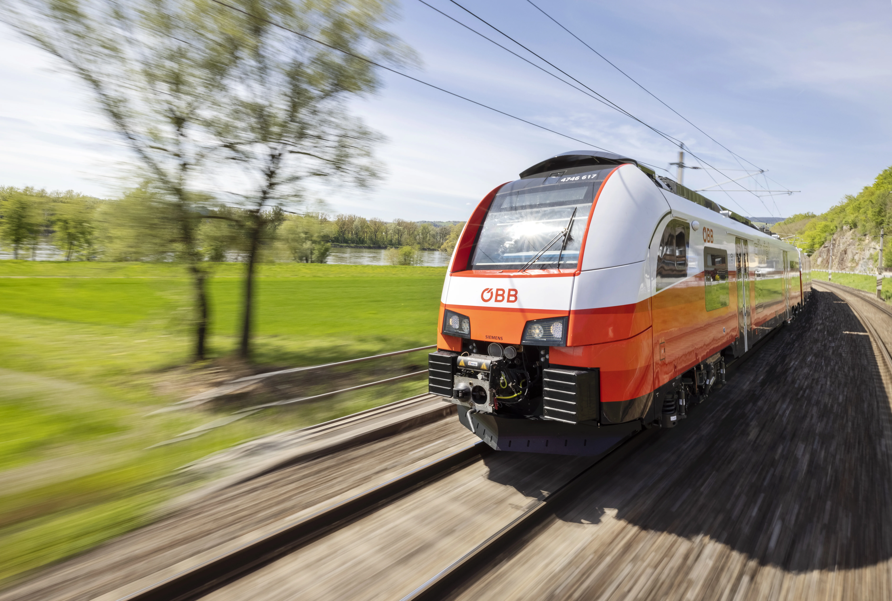
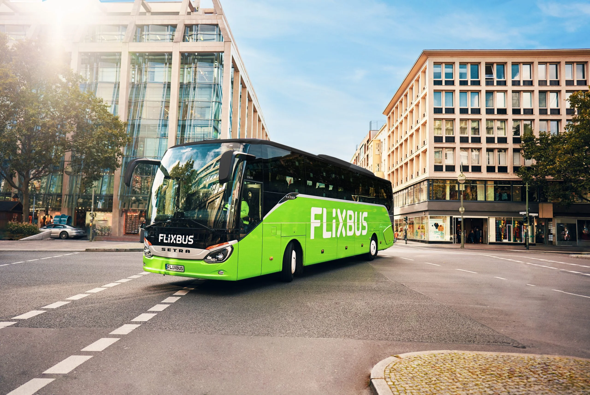
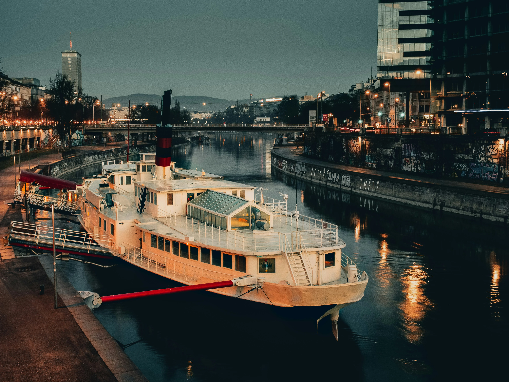
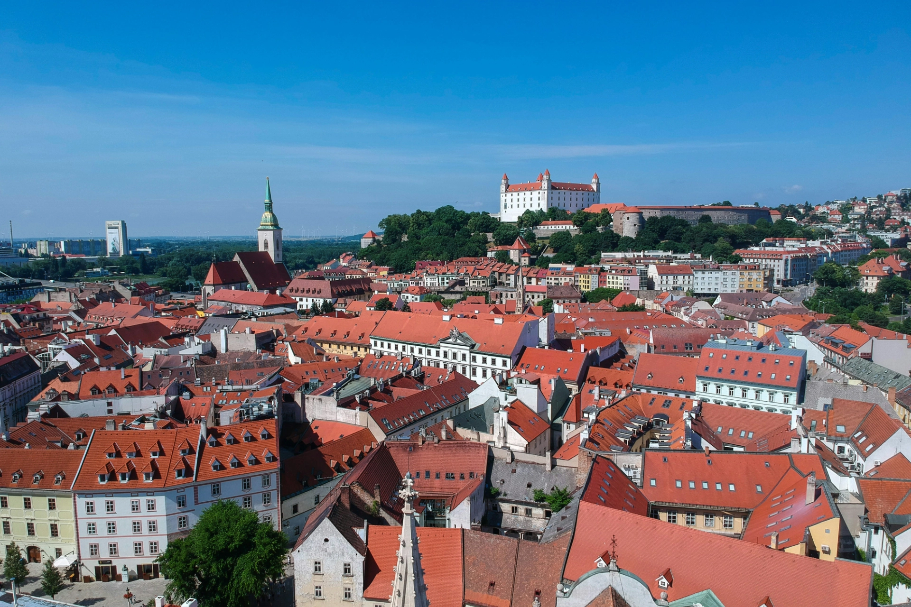

布拉提斯拉瓦（英文：Bratislava）是斯洛伐克（英文：Slovakia）的首都，位在[奧地利維也納](/posts/維也納自由行/)的東邊車程大概一小時的位置。

要是你預計在維也納待比較多天，那麽天氣好的時候，很適合花個半天到一天的時間，從維也納出發到布拉提斯拉瓦走一走看一看。

有一件一定要特別注意的事情是，雖然從維也納到布拉提斯拉瓦只有一個小時的路程，但是**從維也納過去就是出了奧地利的國界**，所以一般的台灣旅客**一定要帶護照！一定要帶護照！一定要帶護照！**

長居在歐洲有歐盟居留證的人一定要帶居留證！一定要帶居留證！一定要帶居留證！

很重要所以說很多次！

除了自駕以外，維也納和布拉提斯拉瓦之間有三種交通方式：**搭火車、巴士、或是搭船**。

## 搭火車往返維也納和布拉提斯拉瓦

奧地利國鐵（德文：ÖBB）的火車每個小時都會從維也納主火車站（英文：Vienna Central Station，德文：Wien Hbf）有一班火車前往布拉提斯拉瓦，行程時間約為一個小時。

> 推薦閱讀：[維也納主火車站 Wien Hbf在哪裡？｜維也納市區交通攻略](/posts/維也納市區交通攻略/)

到布拉提斯拉瓦的火車站 Železničná stanica Bratislava-Petržalka（暫譯：佩特爾日爾卡火車站），到了車站後直接出大門搭乘 80 號公車，或是走過地下道搭 93 號公車，約車程十分鐘就可以到達布拉提斯拉瓦市中心。

搭火車是從維也納前往布拉提斯拉瓦最划算的方式！因為奧地利國鐵 ÖBB 有提供優惠的「[**布拉提斯拉瓦火車一日交通通票**](https://www.oebb.at/en/regionale-angebote/ueberregionale-angebote/bratislava-ticket)」，只要 18 歐元包含單日的來回車票，並包含布拉提斯拉瓦市區交通的單日票。

如果是當天來回，千萬不要傻傻的分開購買兩張單程票來回維也納和布拉提斯拉瓦！

- 價格：來回 €18，6 ~ 14 歲孩童 €9（單日，含布拉提斯拉瓦單日交通票）
- 搭乘地點：
  - 維也納：維也納主火車站（Wien Hbf）
  - 布拉提斯拉瓦：布拉提斯拉瓦主火車站或 *Železničná stanica Bratislava-Petržalka（暫譯：佩特爾日爾卡火車站）
- 行程時間：約一小時

*目前幾乎所有班次都是到布拉提斯拉瓦 Železničná stanica Bratislava-Petržalka（暫譯：佩特爾日爾卡火車站）

## 搭巴士往返維也納和布拉提斯拉瓦

另一種往返維也納和布拉提斯拉瓦的交通方式是搭巴士。這段不到一個半小時的路程目前主要由三間公司營運，包括德國公司 [Flixbus](https://www.flixbus.com/)、斯洛伐克公司 [Slovakia Lines](https://www.slovaklines.sk/en/)、和捷克公司 [RegioJet](https://regiojet.com/)。

在沒有塞車的情況下，搭巴士往返維也納和布拉提斯拉瓦是最方便、最省時間、也最舒適的交通方式。

除了市區間的站點，Flixbus 有些班次會中途停靠維也納國際機場，Slovakia Lines 則是少許班次會停靠布拉提斯拉瓦機場和維也納國際機場，RegioJet 沒有停靠機場。

- 價格：單程約 €10 - €25｜來回 €20 - €50
- 搭乘地點：
  - 維也納：維也納國際巴士站（VIB）或維也納主火車站（Wien Hbf）
  - 布拉提斯拉瓦：***Most SNP** 或 **Mlynské Nivy 巴士站或 Einsteinova 或布拉提斯拉瓦主火車站
- 行程時間：約 75 分鐘

*下車時建議選擇 Most SNP

**上車時建議選擇 Most SNP 或 Mlynské Nivy 巴士站

> 推薦閱讀：[Most SNP 是哪裡？布拉提斯拉瓦景點懶人包](/posts/布拉提斯拉瓦自由行旅遊全攻略/)

## 搭船往返維也納和布拉提斯拉瓦

覺得搭火車或是搭巴士都太無趣嗎？不如沿著多瑙河，順著河流搭船前往布拉提斯拉瓦吧！

這段維也納和布拉提斯拉瓦之間的航程，由私人公司 [Twin City](https://twincityliner.com/en) 營運，行程時間約為一個半小時。

- 價格：單程 €25 - €50｜來回 €50 - €100
- 搭乘地點：
  - 維也納：維也納 Schwedenplatz
  - 布拉提斯拉瓦：Most SNP
- 行程時間：約 90 分鐘，**出發前 30 分鐘上船**

## 往返維也納和布拉提斯拉瓦交通比較表

| 交通方式 | 價格              | 行程時間   | 起迄站（維也納）                                    | 起迄站（布拉提斯拉瓦）                                       |
| -------- | ----------------- | ---------- | --------------------------------------------------- | ------------------------------------------------------------ |
| 火車     | €18（單日來回）   | 約一小時   | 維也納主火車站（Wien Hbf）                          | 佩特爾日爾卡火車站                                           |
| 巴士     | €10 - €25（單程） | 約 75 分鐘 | 維也納國際巴士站（VIB）或維也納主火車站（Wien Hbf） | ***Most SNP** 或 **Mlynské Nivy 巴士站或 Einsteinova 或布拉提斯拉瓦主火車站 |
| 船       | €25 - €50（單程） | 約 90 分鐘 | 維也納 Schwedenplatz                                | Most SNP                                                     |

*下車時建議選擇 Most SNP

**上車時建議選擇 Most SNP 或 Mlynské Nivy 巴士站

## 布拉提斯拉瓦行程建議

考量大部分自由行旅客時間也許不是非常充裕，建議如果要到布拉提斯拉瓦旅遊的話可以安排一日遊、甚至半日遊就足夠，回到維也納的當天繼續住在維也納。下榻維也納的住宿飯店的選擇可以看看我們精心挑選的[**維也納住宿推薦**](/posts/維也納住宿/)。
