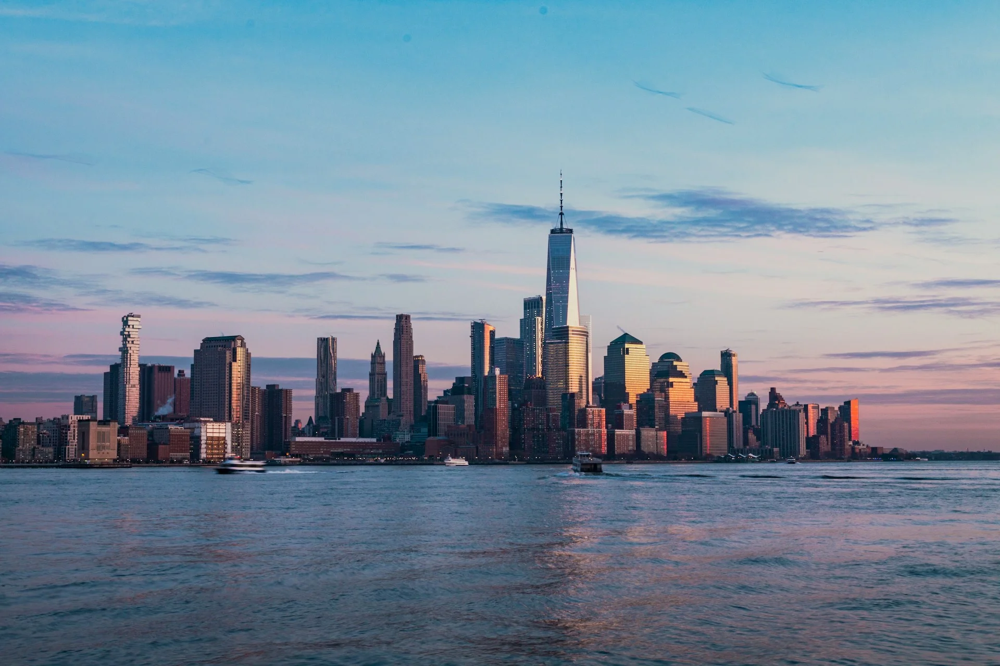
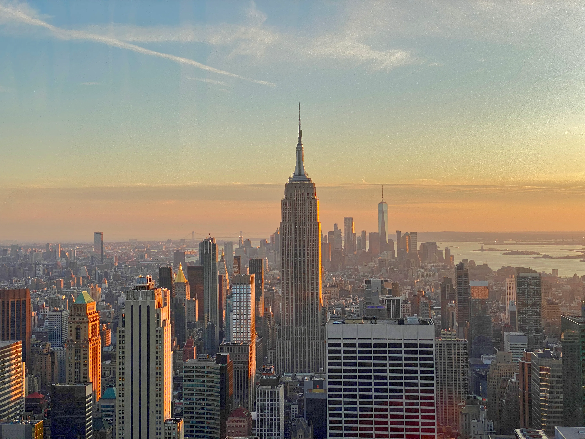
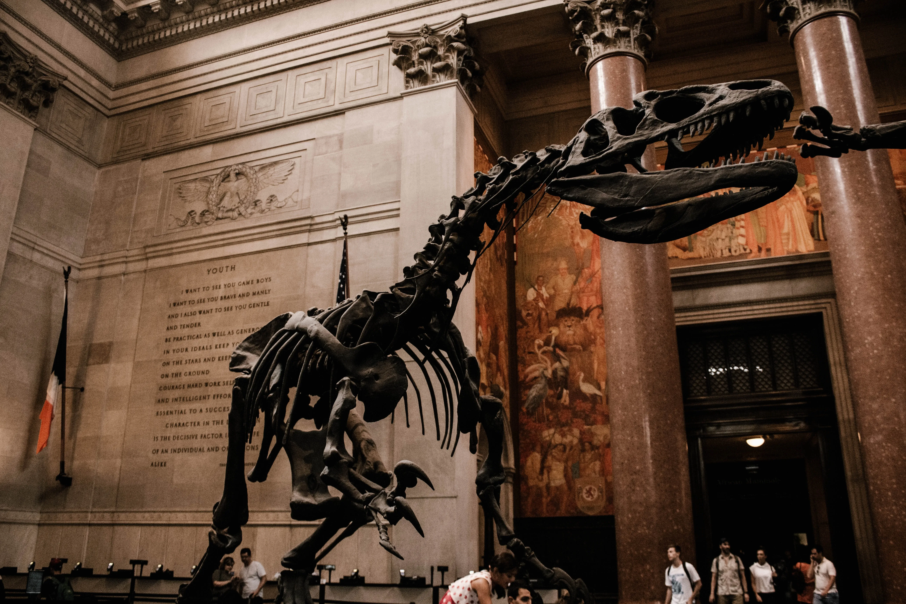
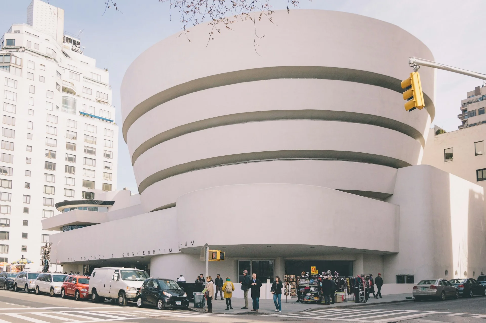
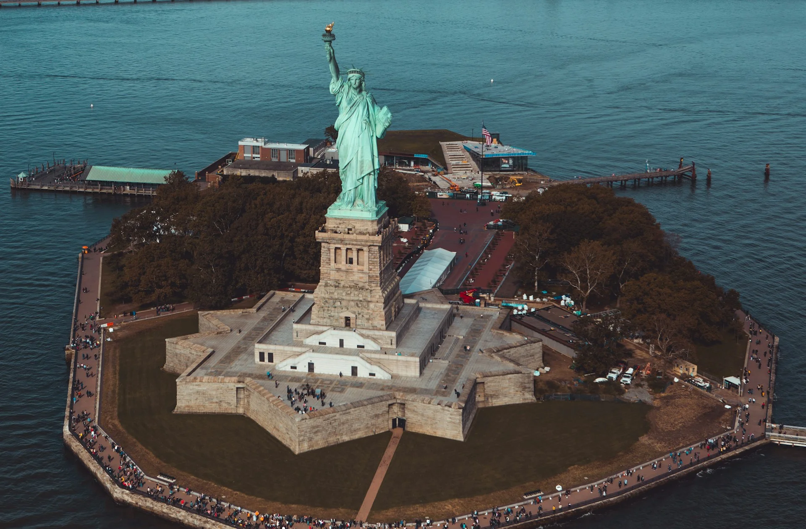
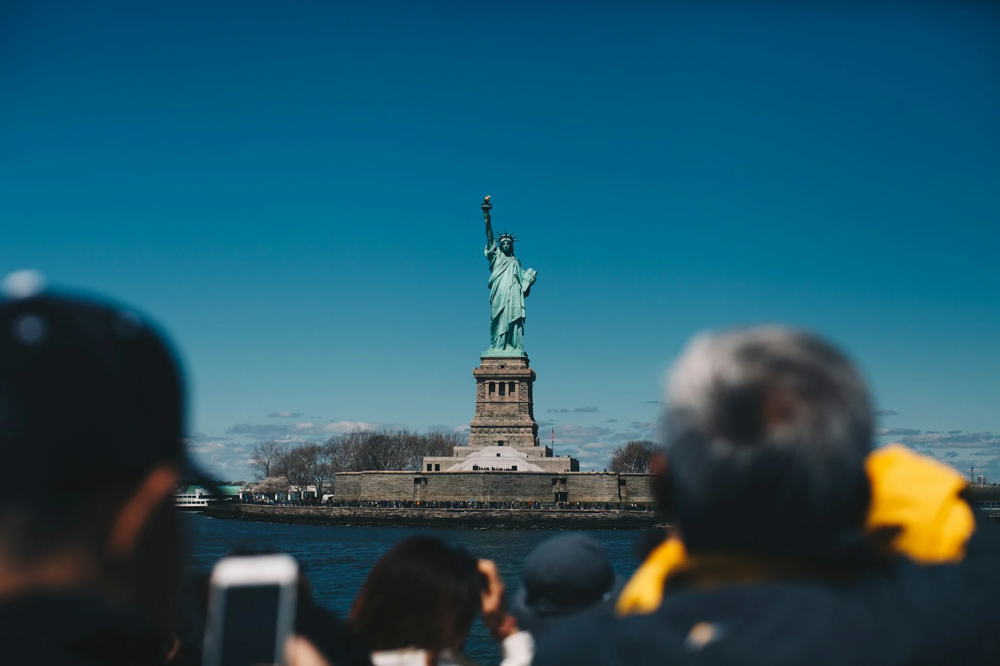
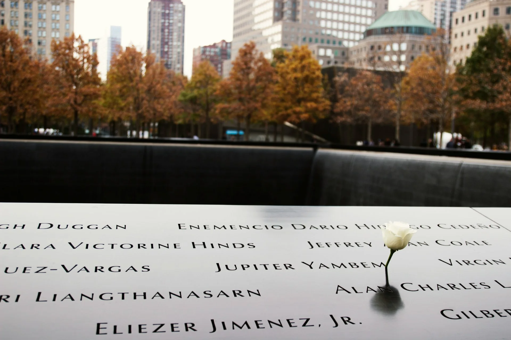
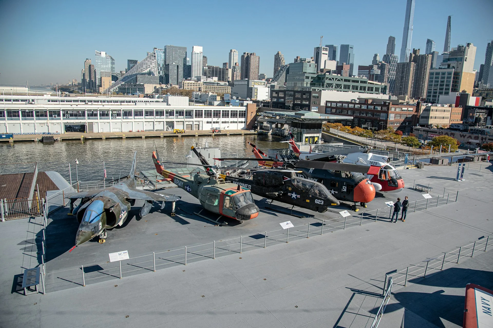
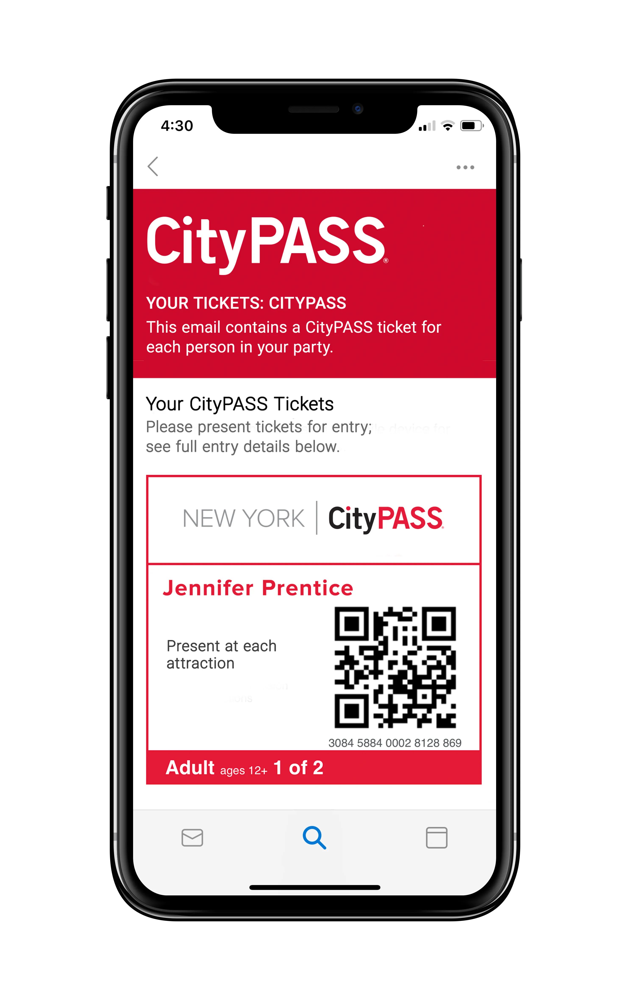


🔥 實用工具：[出國自由行行李清單，行前不再手忙腳亂（免費下載）](https://exittaiwan.gumroad.com/l/packing-list)


第一次來紐約，面對琳瑯滿目的景點和門票，很多人都會看到 New York CityPASS 這個選項，然後陷入選擇困難，想說到底值不值得買？

簡單來說，CityPASS 是一張套票，讓你用折扣價格參觀紐約五大熱門景點，包括帝國大廈、美國自然歷史博物館、自由女神像等，比起各自購票最多可以省下約 40%。如果你來紐約打算在幾天內密集觀光，這張套票很可能是你行程裡最划算的一筆消費。這篇文章會帶你看清楚 CityPASS 包含哪些景點、以及如何使用 CityPASS！

---

## New York CityPASS 是什麼？

[紐約旅遊套票（New York CityPASS）](https://affiliate.klook.com/redirect?aid=41451&aff_adid=838394&k_site=https%3A%2F%2Fwww.klook.com%2Fzh-TW%2Factivity%2F11167-new-york-city-pass-attractions-new-york%2F)包含了紐約五大景點的門票，售價和個別購買景點入場票卷的價格相比，大約是六折優惠，相當適合來到[紐約自由行](/posts/紐約自由行旅遊/)的旅客。

價格：166 美金｜孩童（17歲以下）138 美金。

> **用六折價格暢玩紐約**
> 購買連結：[**紐約旅遊套票**]([https://affiliate.klook.com/redirect?aid=41451&aff_adid=838394&k_site=https%3A%2F%2Fwww.klook.com%2Fen-US%2Factivity%2F11167-new-york-city-pass-attractions-new-york%2F](https://affiliate.klook.com/redirect?aid=41451&aff_adid=838394&k_site=https%3A%2F%2Fwww.klook.com%2Fzh-TW%2Factivity%2F11167-new-york-city-pass-attractions-new-york%2F))。

---

## New York CityPASS 包含什麼景點？

New York CityPASS 包含了紐約最知名、最熱門的觀光景點，包括：
- 帝國大廈
- 美國自然歷史博物館

以及以下景點任選三個：
- 峭石之巔觀景台（Top of the Rock）
- 古根海姆博物館
- 自由女神像和埃利斯島
- 紐約環線觀光遊輪
- 911 紀念館和博物館
- 「無畏」號海洋航空航天博物館

也就是說，使用 New York CityPASS 可以參觀五個紐約最有名的景點。

### 帝國大廈（必含）

帝國大廈是紐約最具代表性的地標之一，樓高 443 公尺（含天線），落成於 1931 年，曾長達 40 年蟬聯世界最高建築的寶座。大樓設有第 86 層與第 102 層兩個觀景台，天氣晴朗時可以將曼哈頓天際線、自由女神像，是來紐約絕對不能錯過的體驗。

### 美國自然歷史博物館（必含）

美國自然歷史博物館（英文：American Museum of Natural History）是電影《博物館驚魂》（Night at the Museum）夜的取景地，位在中央公園的西邊，是大人小孩的適合的景點！

### 峭石之巔觀景台（六選三）



峭石之巔（英文：Top of the Rock Observation Deck）位於洛克菲勒中心（英文：Rockefeller Center）頂端，是欣賞紐約全景的絕佳地點。與帝國大廈最大的不同在於，從 Top of the Rock 可以把帝國大廈也納入鏡頭（就跟上了巴黎鐵塔拍不到巴黎鐵塔是一樣的概念），構成紐約最經典的天際線畫面！觀景台分為室內與戶外區域，無論晴天還是夜晚都各有風情，是攝影愛好者的夢幻打卡點。

### 古根海姆博物館（六選三）

如果你對藝術更感興趣，古根海姆博物館（英文：Solomon R. Guggenheim Museum
）會是個很棒的替代選擇。古根海姆博物館也在中央公園旁邊，位在前面介紹過的美國歷史博物館的另一側（公園東邊）。這座由建築大師法蘭克·洛伊·萊特設計的白色螺旋形建築，本身就是一件藝術品，建築外觀甚至比館內的藏品更常被拍照。館內收藏了畢卡索、康定斯基、夏卡爾等現代藝術大師的作品，坐落在第五大道旁，逛完還可以順遊中央公園。

### 自由女神像和埃利斯島（六選三）

來到紐約，怎麼可能不去看一眼自由女神像（英文：Statue of Liberty and Ellis Island）？自由女神像是全世界最知名的地標之一，由法國贈送給美國，於 1886 年正式揭幕，象徵自由與民主精神。參觀方式是搭渡輪前往自由島，登上基座甚至女神像皇冠俯瞰紐約港。同一張票也包含埃利斯島，這裡曾是 19 至 20 世紀數百萬移民進入美國的入境口岸，島上的移民博物館還原了那段歷史，對於歷史有興趣的人也可以參觀一陣子。

### 環線觀光遊輪（六選三）

如果你不想登島，也可以搭環欣賞紐約。遊輪沿哈德遜河與東河行駛，途中可以從海上觀賞曼哈頓天際線、自由女神像和布魯克林大橋等標誌性景觀，是一段輕鬆又浪漫的水上城市之旅。

### 911 紀念館和博物館（六選三）

911 紀念館（英文：9/11 Memorial & Museum）坐落於 2001 年恐怖攻擊事件的原址，以兩座巨大的下沉式水池紀念近三千名罹難者。地下的博物館透過文物、影像與親歷者的口述，完整記錄了那段改變世界的歷史。這裡不僅是旅遊景點，更是一座承載著集體記憶與哀思的紀念地，值得靜下心來細細參觀。

### 「無畏」號海洋航空航天博物館（六選三）

不喜歡太過悲傷氛圍的旅客，可以到「無畏」號海洋航空航天博物館（英文：Intrepid Museum）。「無畏」號是一艘曾服役於二戰的航空母艦，如今停泊在曼哈頓西岸，改建為博物館對外開放。館內展示了數十架歷史戰機、協和號超音速客機，以及真實的太空梭「企業號」，是軍事迷和航太愛好者的天堂，也非常適合帶小孩一起來大開眼界。

---

## New York CityPASS 怎麼用？

1. 透過[**紐約旅遊套票**]([https://affiliate.klook.com/redirect?aid=41451&aff_adid=838394&k_site=https%3A%2F%2Fwww.klook.com%2Fen-US%2Factivity%2F11167-new-york-city-pass-attractions-new-york%2F](https://affiliate.klook.com/redirect?aid=41451&aff_adid=838394&k_site=https%3A%2F%2Fwww.klook.com%2Fzh-TW%2Factivity%2F11167-new-york-city-pass-attractions-new-york%2F))連結購買後，票卷會寄到訂購時提供的電子郵件信箱。
2. 截圖 QR Code 或下載票卷至手機。
3. 於景點出示 QR Code 即可兌換門票。

> **購買紐約旅遊套票**
> 購買連結：[**紐約旅遊套票**](https://affiliate.klook.com/redirect?aid=41451&aff_adid=838394&k_site=https%3A%2F%2Fwww.klook.com%2Fen-US%2Factivity%2F11167-new-york-city-pass-attractions-new-york%2F)。

---

## New York CityPASS 使用注意事項

- 須於**購買後一年內開始使用**
- **開始使用後，須於九天內使用完畢**
- 大部分景點建議預約入場時段，以減少等候時間

> 推薦閱讀：
>
> ✔️ [**紐約機場怎麼到曼哈頓？甘迺迪機場到市區交通全攻略**](/posts/new-york-airports-to-city-center-transportation/)
>
> ✔️ [**紐約自由行市區交通全攻略｜五種紐約交通方式一次看懂**](/posts/new-york-city-public-transportation/)
> 
> ✔️ [**紐約自由行旅遊全攻略｜紐約旅遊景點、交通、住宿懶人包**](/posts/new-york-city-travel-guide/)

