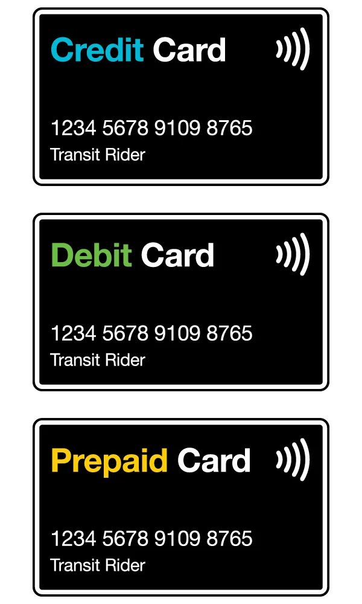
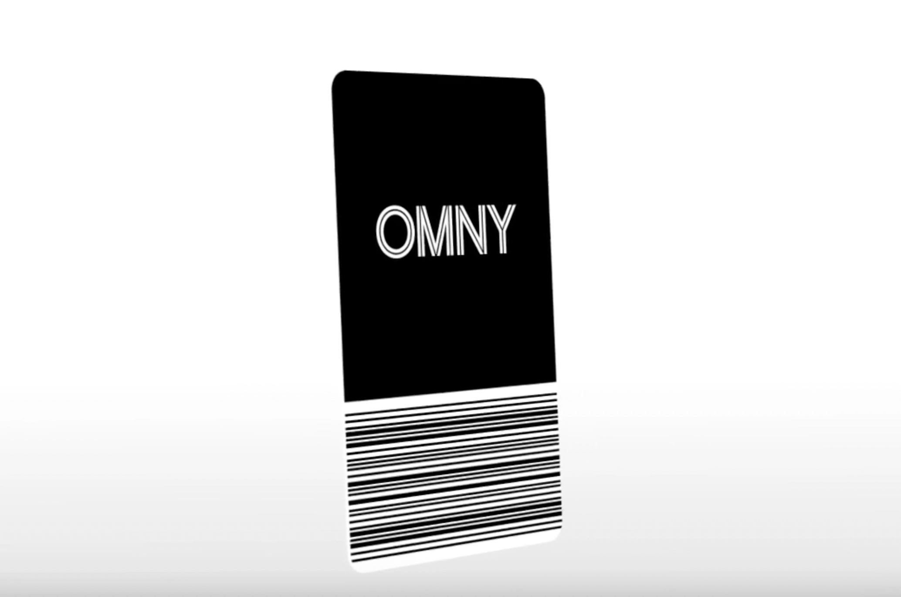
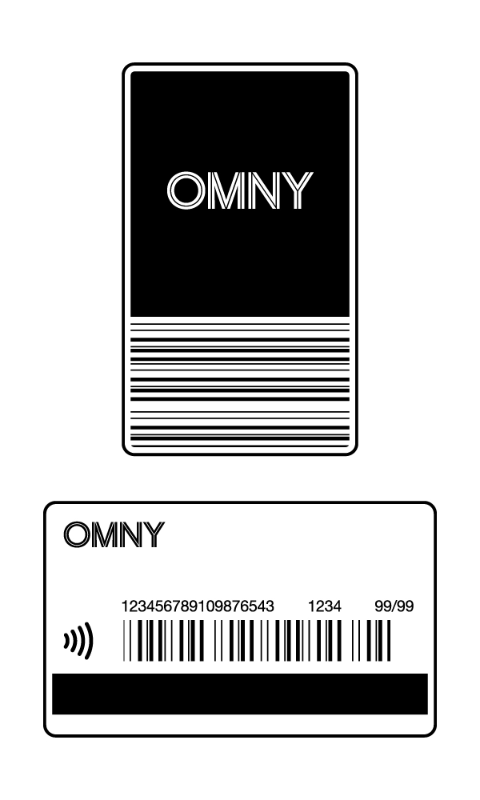
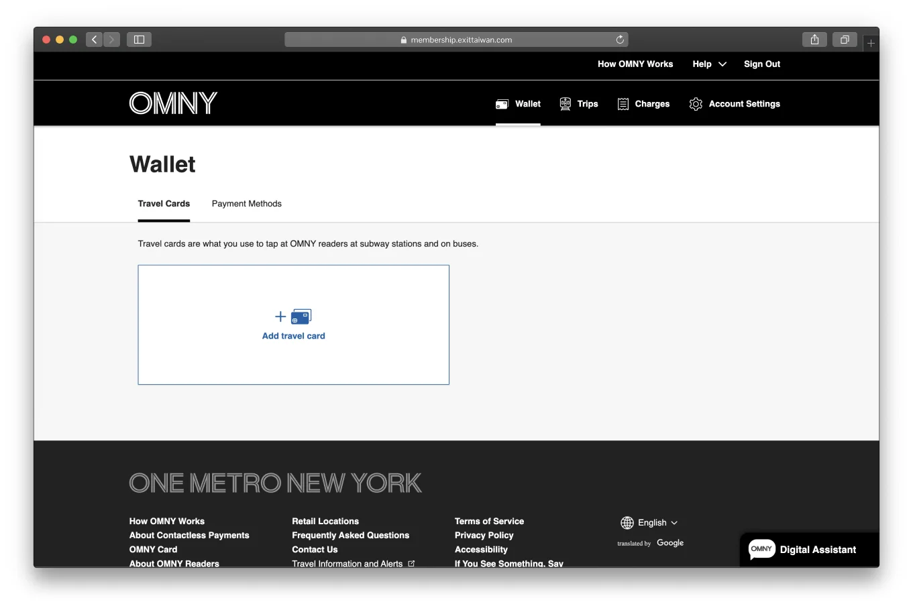

## OMNY Card 是什麼？

OMNY（One Metro New York）是[紐約市區大眾交通](/posts/紐約市區交通全攻略/)的非接觸式付費系統，用來取代大家熟悉的 MetroCard。

MTA 已於 2025 年 12 月 31 日停止販售 MetroCard，也已經不能夠儲值了。

---

## OMNY Card 怎麼用？

使用方式非常簡單，只要把你的感應裝置靠近 OMNY 讀卡機就能搭乘：

- 晶片感應式信用卡或簽帳卡
- 智慧型手機（Apple Pay、Google Pay 等）
- 智慧手錶或穿戴裝置
- 實體 OMNY Card

支援的交通系統包括 MTA 地鐵、公車、Staten Island Railway、Roosevelt Island Tram、Hudson Rail Link，以及 AirTrain JFK。同一張卡在兩小時內可以免費轉乘。

---

## OMNY Card 怎麼買？

### 方式一：購買實體 OMNY Card

你可以在紐約市各地鐵站或指定零售通路購買實體 OMNY Card，卡片費用為 1 美元。

購買時需先支付 5 美元，其中 4 美元會以交通儲值的形式自動回到卡片內，等於你拿到卡的時候就已經有 4 美元可以用了。你可以登入 OMNY 帳號，在行程與扣款記錄中查看這筆儲值。

此外也有單程票（Single-Ride OMNY ticket）可選，售價 3.50 美元，購買後兩小時內有效，含公車轉公車一次免費轉乘，但無法在地鐵與公車之間互轉，較不推薦購買。

### 方式二：直接使用信用卡或簽帳卡感應

不想另外買實體卡的話，直接用你手上的卡片感應就行了。也就是說，你的信用卡就是你的 OMNY 卡。OMNY 支援以下卡別：

信用卡方面，Visa、Mastercard、American Express、Discover、UnionPay、JCB 均可使用。

簽帳卡方面，Visa、Mastercard、American Express、Discover、JCB 可用，但需要輸入 PIN 碼的簽帳卡目前不支援。

### 方式三：使用電子錢包或穿戴裝置

Apple Pay、Google Pay 等電子錢包，以及智慧手錶、穿戴裝置都可以直接感應使用。

如果你的實體卡片有晶片但沒有非接觸功能，可以試著將它加入手機的電子錢包，看可不可以透過電子錢包搭乘。

---

## OMNY 怎麼算票價？

一趟票價為 3 美元。

OMNY 有一個週費上限制度：同一張卡片或裝置，在任意連續七天內，最多只收 12 次票價（共 35 美元），超過後剩餘的搭乘全部免費。

有幾點要注意：

- 一定要用**同一張卡或同一個裝置**，才會累積在一起計算。如果你有時刷卡、有時用手機，那兩邊是分開算的。
- 七天的計算是滾動式的，不是每週一重置。從你第一次感應的時間點開始計算，滿七天後再次搭乘才重新起算。
- 快速公車（Express Bus）、團體票、轉乘不算在累積次數內。

---

## 建議申請 OMNY 網路帳號

OMNY 網路帳號是選用的，但如果你想追蹤搭乘記錄，或確認週費上限的累積進度，[申請一個帳號](https://omny.info/register)會很方便。

帳號裡你會看到兩個區塊：Travel Cards 和 Payment Methods。

- Travel Cards 是你拿去感應搭車的卡，把卡片加進來就能在系統裡追蹤使用記錄。
- Payment Methods 是你在網站上為 OMNY Card 加值時所用的付款方式。

所以如果你是直接用信用卡或手機感應搭車，Payment Methods 那個欄位你不需要設定，因為感應時就是從那張卡直接扣款。Payment Methods 主要是給有購買實體 OMNY Card、要綁定信用卡來加值的人用的。