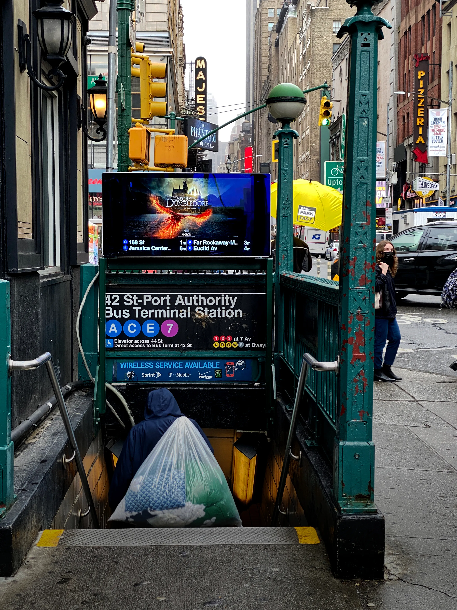

即將到[**紐約市區自由行旅遊**](https://exittaiwan.com/posts/%E7%B4%90%E7%B4%84%E8%87%AA%E7%94%B1%E8%A1%8C%E6%97%85%E9%81%8A/)嗎？除了要知道[**如何從紐約機場到市區的交通**](https://exittaiwan.com/posts/%E7%B4%90%E7%B4%84%E6%A9%9F%E5%A0%B4%E5%88%B0%E5%B8%82%E5%8D%80%E4%BA%A4%E9%80%9A%E5%85%A8%E6%94%BB%E7%95%A5/)，到了市區之後，當然還需要知道市區內的交通方式！

在紐約走跳，不能不先了解這裡的各種交通方式。根據自身的行程，結合運用各種交通工具，不但省下更多時間來玩樂，荷包的負擔也能減輕！

> ✔️ 免費下載[**紐約地圖＋地鐵路線圖高清 PDF 版**](https://exittaiwan.gumroad.com/l/nyc?layout=profile)

在紐約市區內，總共有五種交通方式：

1. **地鐵**
2. **公車**
3. **Citibike**
4. **Lyft / Uber / 計程車**
5. **雙腿**

以下會介紹各種交通方式的價格、購票方式，以及各自的優缺點讓你斟酌考量，繼續看下去吧！

## 紐約市區交通方式一：地鐵

只要是比較長距離的移動，紐約地鐵通常都是旅客的第一選擇。

路線範圍涵蓋超過整個曼哈頓區，不管距離長短、轉乘多少次，進了站搭一趟就是 $2.9 美元（約台幣 90 元），在紐約算是便宜又方便的交通方式。

話雖如此，地鐵應該是紐約最惡名昭彰的特色之一了吧？事實證明，所有關於紐約地鐵的傳聞都是真的。

地鐵站昏暗髒亂、參雜點尿騷味、處處可見流浪漢和精神病患、[被人推下鐵軌](https://www.insider.com/family-of-michelle-alyssa-go-speaks-out-after-deadly-attack-2022-1)、[在地鐵站被隨機攻擊](https://abc7ny.com/hammer-attack-subway-brutal-robbery-woman-new-york/11598857/)、想不開的人跳軌，你能想到和無法想像的事情，都有可能在這裡發生。

雖然風險存在，但紐約地鐵卻是每個來到紐約旅遊的人幾乎不可能不使用的交通工具，所以在靠近地鐵站和搭乘地鐵時，請記住**離遊民和精神病患遠一點**、**少滑手機，隨時注意四周環境**、**行走時腳步迅速移動**。

- 價格：單趟（單次進出車站） $2.9 美元（最新價格可以[到官網確認](https://new.mta.info/fares)）
- 優點：便宜、方便、快速
- 缺點：昏暗髒亂、會有街友和流浪漢出沒

### 搭乘紐約地鐵：購票方式

**地鐵卡 MetroCard**： 一張薄到不行的紙。可以在售票機購買，首次購卡要多花 $1 美元，儲值可以用美金現金和**美國當地的銀行卡**支付。售票機有時候會吃錢、台灣的信用卡刷不過，所以我**不推薦**你使用地鐵卡搭乘紐約的地鐵。

**行動支付 / 刷卡**： 只要有支援無線付款功能，可以直接用手機或信用卡感應進站，我推薦這個方法。

<!-- 紐約交通週票：綁定 OMNY <https://new.mta.info/fares/reduced-fare/omny> -->

- **請搭對方向**：在地鐵站的出入口你會看到這個站有哪幾條路線、以及往哪個方向。有些站往 Uptown 和 Downtown 的出入口是沒有連通的，進了站發現弄錯方向就只能出來，到對向再付一次錢往正確的方向。
- **請任命搬吧**：紐約地鐵大部分的站都只有樓梯，在 2022 年初前往旅遊的時候有發現有些站開始有電梯、或是正在加裝電梯了，不過不要期望太高，大部分時間還是靠你的雙腿吧！
- **請當好小孩**：在進站刷卡的時候，你可能會看到很多地鐵跳跳人。沒錯，他們正在逃票，就算在警察面前他們也照樣這樣做。身為旅客請認命花錢，我希望你能平安快樂回家。

## 紐約市區交通方式二：公車

如果要前往離地鐵站有點距離的地方，可以選擇搭紐約市的公車。價格和地鐵一樣，購票方式也和地鐵一樣。

- 價格：單趟 $2.9 美元
- 優點：便宜、方便、可到地鐵沒到的地方
- 缺點：常會塞車

### 搭乘紐約公車：購票方式

搭乘紐約市區公車就和搭乘地鐵一樣，可以用**地鐵卡 MetroCard** 或是直接用手機綁定信用卡、又或是使用實體信用卡感應上車。

## 紐約市區交通方式三：Citibike

[Citibike](https://citibikenyc.com/) 是紐約的自行車租借服務，路上隨便找都會看到租借站點。要租借前，需要先[下載應用程式](https://citibikenyc.com/how-it-works/app)、註冊會員，才有辦法順利使用。

- 價格：每次 $4.49 美元，30 分鐘後，每分鐘 $0.23 美元。
- 優點：方便、彈性高
- 缺點：價格不便宜

除了單趟收費的方式，Citibike 也有提供 $19 美金的一日券，可以無限次租借腳踏車（每次 30 分鐘內）。

## 紐約市區交通方式四：Lyft / Uber / 計程車

出租車和計程車服務我就當作一樣的交通方式囉！基本上 Lyft、Uber、計程車這三種交通方式的價格都不會差太多，可以在叫車當下交叉比對上下車地點，看看哪一個價格最划算。

- 價格：根據出發及目的地計算，可以到 Lyft 或 Uber 上試算價格
- 優點：舒適、安全
- 缺點：貴、常會塞車

## 紐約市區交通方式五：雙腿

在[**紐約旅遊**](https://exittaiwan.com/posts/紐約自由行旅遊/)，雙腿是荷包的好朋友。

紐約的街道上無時無刻都有奇怪的事情在發生，走在路上才能用視覺、聽覺、和嗅覺來完整的體驗這個城市。只要當天行程安排的好，景點之間的距離並不會太遠，通常路過幾個街區就能抵達。

在紐約會讓你有一種「真的在逛街」的感覺。

- 價格：免費！
- 優點：免費、體驗紐約曼哈頓最完整的方式、彈性高
- 缺點：腿痠

## 紐約自由行市區內交通方式比較表

| 交通方式 | 單趟價格 | 優點 | 缺點 | 
|---|---|---|---|
| 地鐵 | $2.9 美元，換算台幣約 90 元 | 便宜、方便、快速 | 昏暗髒亂、會有街友和流浪漢出沒 | 
| 公車 | $2.9 美元，換算台幣約 90 元 | 便宜、方便、可到地鐵沒到的地方 | 常會塞車 | 
| Citibike | $4.49 美元，換算台幣約 140 元 | 方便、彈性高 | 價格不便宜 | 
| Lyft / Uber / 計程車 | 根據出發及目的地計算 | 舒適、安全 | 貴、常會塞車 | 
| 雙腿 | 免費 | 免費、體驗紐約曼哈頓最完整的方式、彈性高 | 腿痠 | 