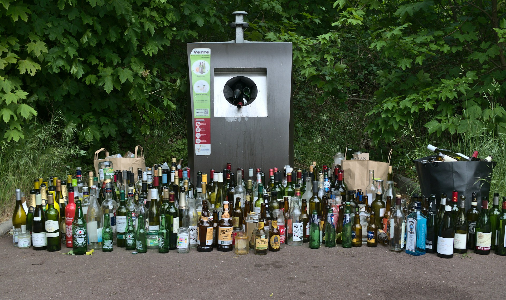
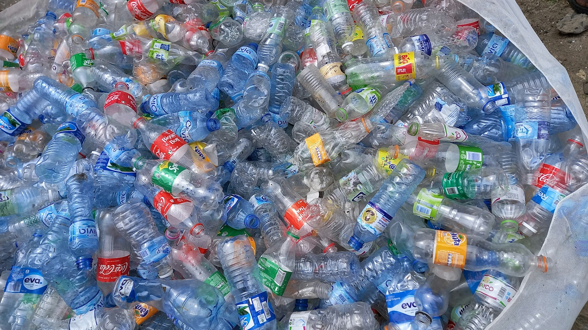
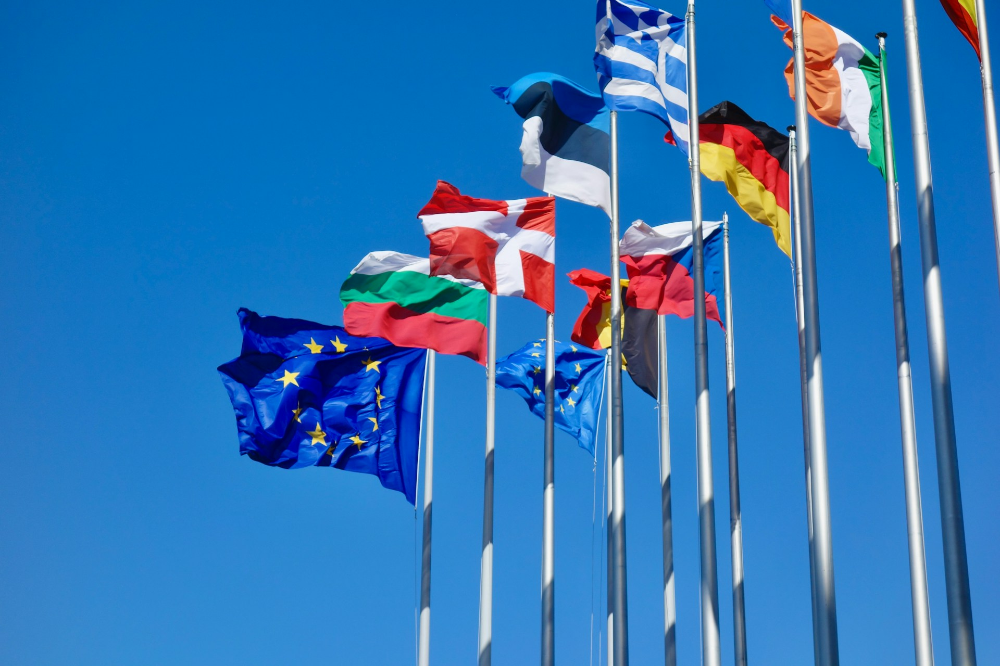
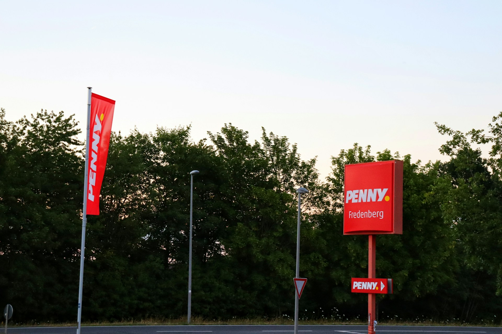


🔥 實用工具：[出國自由行行李清單，行前不再手忙腳亂（免費下載）](https://exittaiwan.gumroad.com/l/packing-list)


第一次在德國超市買一瓶礦泉水，結帳時赫然發現，標價明明是 €0.39，收據上卻顯示 €0.64。多出來的 €0.25 是什麼？收銀員沒有特別解釋，旁邊的當地人也一臉習以為常。這個讓初次造訪的旅客一頭霧水的差價，其實就是全球已經有多國採行的環保押金。

如果你計劃前往歐洲、北美或澳洲旅行，或是正在考慮長期旅居，這篇文章會告訴你環保押金制度是什麼、在哪些國家適用、結帳時會怎麼呈現，以及最重要的，怎麼把錢拿回來。

---
## 什麼是環保押金回收制度？

環保押金回收制度（[Deposit Return Scheme，簡稱 DRS](https://edrsa.eu/)）的運作邏輯很簡單：你買飲料時多付一筆押金，把空瓶或空罐交回指定地點後，就能拿回這筆錢。

這個制度的核心目的是提高飲料容器的回收率、減少隨手丟棄造成的環境污染。和一般資源回收桶不同，押金制度用金錢的誘因來改變我們消費者的行為，所以回收的效果相當顯著。像在德國，環保押金制度讓飲料容器回收率超過 98%。

押金通常固定金額，跟飲料本身的售價無關，容器材質也不影響押金金額（各國規定可能不同）。

---

## 結帳時押金長什麼樣子？

這是旅客最容易困惑的地方。在實施押金制度的國家購買飲料時，押金會直接加在商品售價上，**不會另外詢問你要不要支付**，是強制性的。

以德國和奧地利為例，收據上會出現「**Pfand**」這個字（即德文「押金」），金額通常是 €0.25（塑膠瓶與鋁罐）。愛爾蘭的押金則依容量分為 €0.15（150ml 至 500ml）與 €0.25（500ml 以上）兩種。

所以當你買一瓶水標價 €0.40，結帳時付 €0.65，其中 €0.25 是押金。買四瓶水，押金就是四倍。超市的價格標籤常常只顯示飲料本身的售價，不含押金。

有些飲料不在押金範圍內。根據各國規定略有不同，但常見的排除品項包括：純牛奶與乳製品、果汁（部分國家）、酒類（部分國家）。購買前可以看一下瓶身或包裝是否有押金標記，德國的押金容器通常印有「Einwegpfand」字樣。

---

## 怎麼把押金退回來？



就算是短期旅客，也值得把瓶罐留著，最後到超市退押金。

在德國旅行一週，光是每天買水買飲料，押金累積起來可能就有 €3–5，足以買一杯咖啡。離開前記得把空瓶集中退掉，不然這筆錢就是白白送給超市了。

回收機的位置通常在超市入口、停車場旁，就是在超市最後面角落的地方。大型連鎖超市（如德國的 REWE、Edeka、Lidl；愛爾蘭的 Tesco、Lidl）幾乎都配有回收機，部分小店則提供人工退押。

你可能覺得帶一袋子的空瓶出門很奇怪。不過在這些國家，提著一袋空瓶去超市完全是當地人日常，大家早就習慣了。旅居久了你也會自然地把空瓶放在一個角落，累積一定數量後再一起去退。

### 方法一：自動回收機（Reverse Vending Machine）

這是最主流的方式，在德國、北歐、愛爾蘭、澳洲等地的超市幾乎都能看到。機器通常擺在超市入口或停車場附近，外觀像一台大型投幣機，開口可以放入空瓶或空罐。

自動回收機操作步驟：

1. 看不懂當地語言，可以先選擇「英文（英國國旗）」
2. 把空瓶或空罐放入開口（通常可以直接放，機器會自動讀取條碼）
3. 全部放完後按下「列印」鍵
4. 機器吐出一張收據（折價券），上面印有押金總額
5. 拿去收銀台，可以直接抵扣當次購物金額，或要求退現金

---

### 方法二：人工退押

部分規模較小的商店或特定地區，可以直接把空瓶交給店員辦理退押，不需要機器。愛爾蘭在制度推行初期即提供此選項，讓消費者有多一個管道。

---

### 環保押金注意事項

- 瓶身要完整無破損，嚴重壓扁或標籤脫落的容器可能無法被機器讀取
- 條碼必須清晰可掃，若被撕掉或磨損，機器可能拒收
- 退押不需要原始收據，只要是有押金標記的容器都可以退，不限定在購買的同一家超市
- 部分機器只收特定材質（如只收塑膠，不收玻璃），請留意機器上的標示

---

## 哪些國家有押金制度？

### 歐洲

#### 北歐五國

北歐五國是押金制度最成熟的地區，制度運行數十年，回收率普遍超過 90%。

| 國家  | 押金金額                                                                                | 備註說明          |
| --- | ----------------------------------------------------------------------------------- | ------------- |
| 挪威  | NOK 2~3                                                                             | 押金金額會直接印在外包裝上 |
| 瑞典  | SEK 2~3                                                                             | 依容量區分         |
| 芬蘭  | €0.10                                                                               | -             |
| 丹麥  | [DKK 1~3](https://danskretursystem.dk/en/about-deposits/deposit-marks-and-amounts/) | 依容器材質與容量區分    |
| 冰島  | [ISK 23](https://endurvinnslan.is/english/)                                         | -             |

---

#### 德語區/西歐/中歐

| 國家    | 押金金額                                                            | 備註    |
| ----- | --------------------------------------------------------------- | ----- |
| 荷蘭    | €0.15~€0.25                                                     | 依容量區分 |
| 愛爾蘭   | €0.15~€0.25                                                     | 依容量區分 |
| 馬爾他   | €0.10                                                           | -     |
| 克羅埃西亞 | €0.10                                                           | -     |
| 德國    | €0.25（塑膠、鋁罐）/ €0.08（玻璃）                                         | -     |
| 匈牙利   | HUF 50（約 €0.13）                                                 | -     |
| 奧地利   | [€0.25（塑膠、鋁罐）](https://www.recycling-pfand.at/ueber-pfand.html) | -     |

----

#### 波羅的海與東歐

| 國家   | 押金金額        | 備註    |
| ---- | ----------- | ----- |
| 愛沙尼亞 | €0.10~€0.40 | 依容量區分 |
| 立陶宛  | €0.10       | -     |
| 拉脫維亞 | €0.10       | -     |
| 斯洛伐克 | €0.15       | -     |
| 羅馬尼亞 | 0.50 RON    | -     |

即將實施：葡萄牙（2026）、比利時（2026）、西班牙（2026）、英格蘭與威爾斯（預計2027）開始。

目前法國、義大利等大型歐洲國家尚未全面實施，但面臨歐盟法規壓力，須在 2029 年前達到90%回收率目標。

---

### 北美

**美國**目前有 10 個州實施押金制度，包含加州、紐約、麻薩諸塞、奧勒岡、密西根等。押金金額通常為 $0.05 至 $0.10 美元，密西根州以 $0.10 最高。其餘州則無強制押金制度，飲料容器直接丟一般回收桶即可。

**加拿大**幾乎所有省份均有押金制度，不列顛哥倫比亞省早在 1970 年便率先立法，是全球第一個強制押金回收系統的地方。詳細個省份的制度可以[參考此文章](https://www.tomra.com/reverse-vending/deposit-return-schemes-faq/which-countries-have-deposit-return-scheme)。

---

### 澳洲

澳洲全境所有州均已實施，押金統一為 AU$0.10，適用的容器涵蓋塑膠、鋁罐、玻璃及紙盒裝飲料，範圍相當廣泛。

---

### 其他地區

| 國家／地區 | 押金金額         | 備註      |
| ----- | ------------ | ------- |
| 以色列   | 0.3 ILS      | -       |
| 塞席爾   | 0.5-2 SCR    | 依容器材質區分 |
| 巴貝多   | US$0.05-0.15 | 依容器材質區分 |

押金制度對習慣直接丟進回收桶的旅客來說，剛開始確實會有些陌生，但邏輯其實非常簡單：多付的錢，拿回空瓶就能拿回來，為環保回收盡一份心力。出發旅行前可以先確認目的地是否有押金制度，旅途中留意收據上的押金項目，離開前記得統一退押，不只為環境盡一份力，也可以[省下不少旅費](/posts/europe-travel-on-budget-tutorial/)！