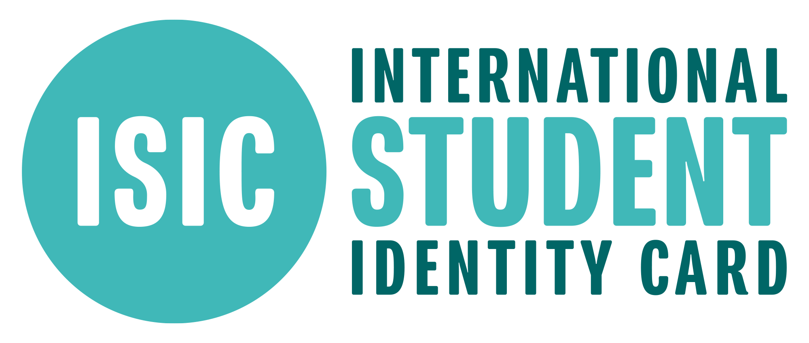


🔥 實用工具：[出國自由行行李清單，行前不再手忙腳亂（免費下載）](https://exittaiwan.gumroad.com/l/packing-list)


## 什麼是 ISIC 國際學生證？

ISIC，全名 International Student Identity Card，中文又叫國際學生證，是一張全球認可的學生證明文件。很多學生會想：「我已經有自己學校的學生證了，為什麼還有這個 ISIC 國際學生證得存在？」答案其實很簡單，大多數學校的學生證只在該國內有效，而且各個學校的學生證設計排版、證件上的資訊、使用的語言等等差別很大，甚至在該國家內的不同城市、不同消費狀況使用都會遇到問題。因此，ISIC 國際學生證有了全球多國的認可與效力，就很大程度地解決了這個問題。

最一開始，國際學生證為了學生出國旅行時享有學生折扣而誕生，並在 1968 年獲得聯合國教科文組織（UNCESCO）的認可，發展到今日，包含航空公司、私人企業運營的鐵路和巴士公司、國立公立美術館、博物館、各種休閒娛樂場館、甚至餐廳和咖啡廳等等的學生優惠，幾乎全世界各國都認可。

所以，ISIC 國際學生證就是一張全球通用的、提供你學生優惠的國際學生證。

---

## 誰可以申請 ISIC 國際學生證？

不論是台灣教育部認可、或是國外當地被政府組織認可的教育機構，只要是在學且滿 12 歲的學生，都可以申請 ISIC 國際學生證，享有全世界和 ISIC 合作商家的學生優惠。

如果你已經不再是學生，在滿 31 歲以前，也可以[申請 IYTC（International Youth Travel Card，國際青年證）](https://www.isic.com.tw/ch/cards-iytc.html)，適用部分 ISIC 的優惠，但不是全部、優惠內容可能也不如 ISIC 卡持有者。要是你剛好是教師的話，你可以[申請 ITIC（International Teacher Identity Card，國際教師證）](https://www.isic.com.tw/ch/cards-itic.html)，同樣在國內外可以享有部分優惠喔。

---

## ISIC 國際學生證怎麼申請？

ISIC 國際學生證有分兩種卡：一種是單獨作為學生證明用途的一般卡，而另外一種則是 ISIC 和各個銀行合作的聯名銀行簽帳卡。兩種卡的申請方式有些不一樣，以下會分開說明。

要特別注意，ISIC 在各國有各自獨立的代理商，所以各國的 ISIC 網站網址也不同，你可以自行決定要在台灣的網站申請，或是等到外國後，再參考該國的 ISIC 網站，並向該國 ISIC 代理商申請。

---

### 申請國際學生證一般卡



申請 ISIC 一般卡的步驟非常簡單明瞭，只要準備學生證明文件（如在學證明、學生簽證、學費繳費證明等）、以及照片、和身分證明文件（如身分證、護照、駕照等），並且至各國的 ISIC 代理商網站申請頁面上傳申辦。

以[台灣的 ISIC](https://www.isic.com.tw/ch/cards-isic.html) 為例，申辦費用為台幣 400 元，如無法自台北代理商親自取件，需加收郵寄費 80 元。

---

### 申請銀行聯名學生信用卡



ISIC 在幾乎在各國都有和該國特定的銀行合作，推出聯名的銀行簽帳卡。如果到一個新國家要開銀行戶頭，又想要同時拿到 ISIC 學生證的簽帳卡片，可以注意看看哪間銀行有提供這張卡。開戶後，該卡就具有該銀行帳戶的簽帳提領現金功能，又能證明你的學生身份。

以台灣為例，台灣的永豐銀行就有和 ISIC 合作推出金融卡，卡片正面會壓上 ISIC 的效期，有效期是卡片核准日期起一年，如果要延長，需要自己聯絡台灣的 ISIC 單位。

部分國家的 ISIC 銀行金融卡上面不會壓 ISIC 的效期，而是只有印上該金融卡的到期日，通常就會是數年以上。有時候就算已經畢業了，也還是可以使用這張卡來享受學生優惠（風險自負！）。但是如果店家要求其他文件證明學生身份，可能就沒辦法了。

---

> **推薦文章：**
>
> ✔️ [保證省下 300 歐｜歐洲食衣住行樂全方位教學，馬上壓低歐洲自由行花費！](/posts/europe-travel-on-budget-tutorial/)